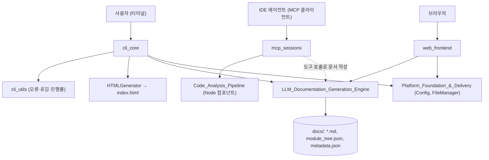
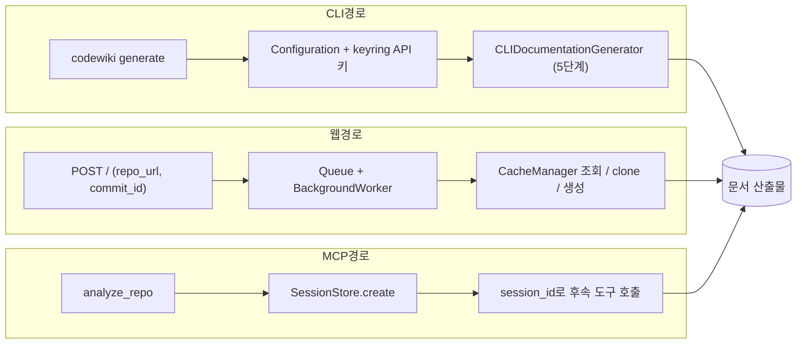

# User_Interfaces_&_Access_Layer 모듈 개요

`User_Interfaces_&_Access_Layer`는 사용자와 외부 도구가 CodeWiki 문서 생성 엔진을 사용하는 진입점을 모아 둔 계층이다. 접근 경로는 세 가지다.

- **CLI**: `codewiki` 명령
- **웹 UI**: FastAPI 기반
- **MCP 서버**: IDE 에이전트용

이 계층은 입력을 받고 설정을 구성한 뒤 백엔드(`DocumentationGenerator`)를 호출한다. 진행 상태와 오류를 사용자에게 보여 주고 결과물을 노출하는 일도 맡는다. 코드 분석과 LLM 문서 생성은 이 계층에서 하지 않는다.

## 하위 모듈

| 모듈 | 경로 | 역할 |
|---|---|---|
| [cli_core](cli_core.md) | `codewiki/cli` | 설정 저장(`ConfigManager`), Git 작업(`GitManager`), 백엔드 어댑터(`CLIDocumentationGenerator`), 정적 뷰어 생성(`HTMLGenerator`), 작업 모델(`DocumentationJob`) |
| [cli_utils](cli_utils.md) | `codewiki/cli/utils` | 종료 코드가 있는 오류 계층, LLM API 오류 변환(`wrap_api_call`), 로깅(`CLILogger`), 진행률·ETA(`ProgressTracker`) |
| [web_frontend](web_frontend.md) | `codewiki/src/fe` | GitHub URL 제출 → 큐 → clone → 생성 → 캐시 → Markdown 렌더링을 처리하는 웹 UI |
| [mcp_sessions](mcp_sessions.md) | `codewiki/mcp` | `analyze_repo` 결과를 재사용하기 위한 세션 상태(`SessionStore`)와 디스크 작업 공간(`SessionWorkspace`) |

## 아키텍처

`mcp_sessions`가 세션 상태를 저장하는 방식은 코드로 확인했다. MCP 도구 핸들러에서 엔진을 호출하는 경로는 이 계층 문서에서 확인하지 못했다(미확인).

## 접근 경로별 특징

- **CLI** (`cli_core`, `cli_utils`)
  - 저장된 설정과 런타임 지침(`AgentInstructions`)을 병합해 백엔드 `Config`를 만든다.
  - 5단계 진행률을 표시하고, 증분 업데이트를 지원하며, 선택적으로 HTML 뷰어를 생성한다.
  - 오류는 종료 코드 1~5로 구분한다.
  - API 키는 keyring에 저장하고, 실패하면 `credentials.json`으로 폴백한다.
- **웹** (`web_frontend`)
  - 작업 스레드가 하나라서 job을 직렬로 처리한다.
  - 캐시 키는 저장소 URL만 기준으로 한다. 그래서 commit ID가 달라도 기존 캐시가 재사용될 수 있다.
  - 인증·접근 제어 코드는 없다. 외부에 노출하려면 별도 보호가 필요하다(추론).
- **MCP** (`mcp_sessions`)
  - 큰 분석 결과는 stdio로 보내지 않고 `.codewiki/sessions/{session_id}/`에 기록한다. 에이전트가 이 파일을 직접 읽는다.
  - 세션은 최대 10개, TTL은 2시간이다. 만료는 `get()`/`create()` 호출 시에만 정리된다.

## 검증 수준과 참고

- 하위 문서 기준으로 대부분 **코드 확인**이다.
- 다음 항목은 **미확인**이다.
  - CLI 명령 정의
  - 웹 앱 조립부(`templates.py`, `visualise_docs.py`)
  - MCP 도구 핸들러
- 연관 모듈
  - 백엔드 엔진: [documentation_generation](documentation_generation.md), [incremental_updater](incremental_updater.md)
  - 분석 계층: [dependency_analysis_core](dependency_analysis_core.md)
  - 공용 설정: [shared_config_utils](shared_config_utils.md)
  - 패키징·배포: [build_ci_deployment](build_ci_deployment.md)