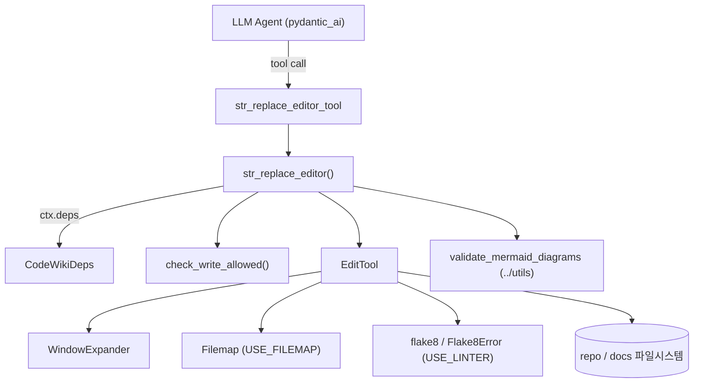
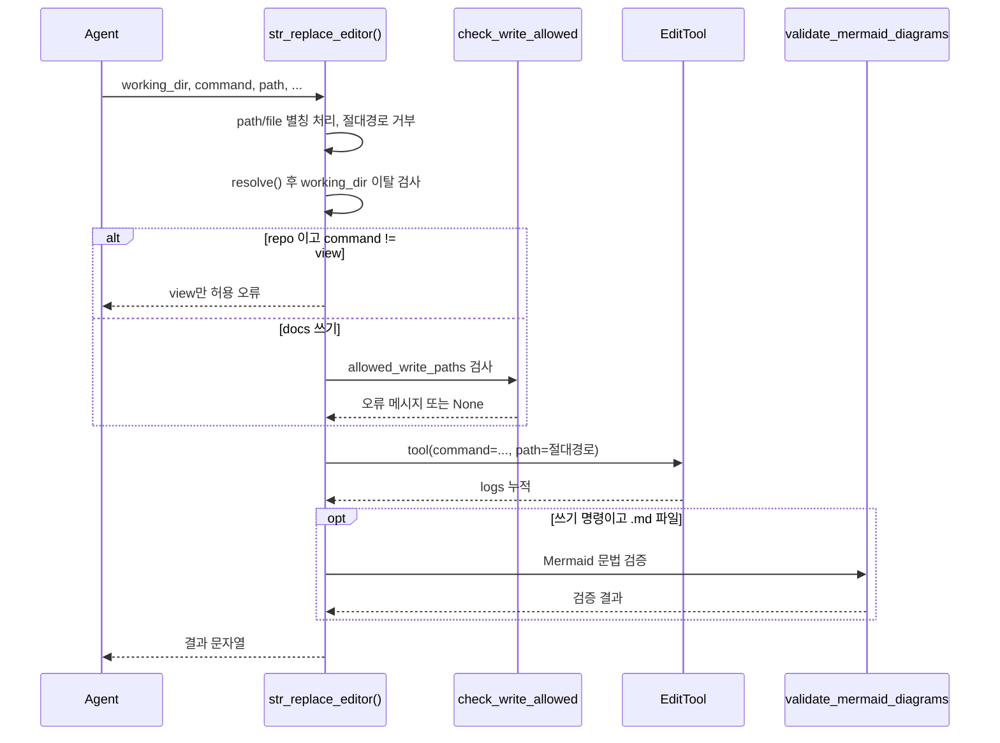
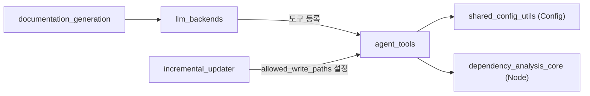

# agent_tools 모듈

`agent_tools`는 문서 생성 LLM 에이전트가 사용하는 **파일 편집 도구**와 그 **실행 컨텍스트(의존성)** 를 제공하는 모듈이다. 에이전트는 `repo`(소스 저장소)를 읽기 전용으로 탐색하고, `docs`(생성 문서 디렉터리)에 마크다운 문서를 만들고 수정한다.

구성 파일은 두 개다.

- `codewiki/src/be/agent_tools/deps.py` — `CodeWikiDeps` (에이전트 실행 컨텍스트)
- `codewiki/src/be/agent_tools/str_replace_editor.py` — `str_replace_editor` 도구와 `EditTool`, `Filemap`, `Flake8Error`, `WindowExpander`

> 원본은 SWE-agent의 `str_replace_editor`(Anthropic 편집 도구 규격)이다. 도구 파라미터는 Anthropic 규격을 따른다.

상위 모듈: [LLM_Documentation_Generation_Engine](LLM_Documentation_Generation_Engine.md). 도구를 호출하는 쪽은 [llm_backends](llm_backends.md)와 [documentation_generation](documentation_generation.md), 쓰기 제한을 설정하는 쪽은 [incremental_updater](incremental_updater.md)이다.

---

## 1. 아키텍처

### 컴포넌트 역할

| 컴포넌트 | 역할 |
|---|---|
| `CodeWikiDeps` | `@dataclass`. 에이전트 실행 시 `RunContext`로 전달되는 의존성 묶음 |
| `str_replace_editor` | pydantic_ai 도구 함수. 경로 검증·권한 검사·`EditTool` 호출·Mermaid 검증 수행 |
| `str_replace_editor_tool` | 위 함수를 `Tool(takes_ctx=True)`로 감싼 등록용 객체 |
| `EditTool` | `view / create / str_replace / insert / undo_edit` 실제 구현. 결과 메시지를 `self.logs`에 누적 |
| `WindowExpander` | 뷰포트를 함수/클래스 경계까지 확장하는 휴리스틱 (`max_added_lines`) |
| `Filemap` | tree-sitter로 긴 Python 함수 본문(5줄 이상)을 생략한 요약 보기 생성 |
| `Flake8Error` | flake8 출력 한 줄의 파싱/비교 객체. 편집 전후 오류 차집합 계산에 사용 |
| `check_write_allowed` | `allowed_write_paths` 기반 쓰기 허용 검사 |

### CodeWikiDeps 필드

| 필드 | 설명 |
|---|---|
| `absolute_docs_path` / `absolute_repo_path` | `docs` / `repo` 작업 디렉터리의 절대 경로 |
| `registry` | 도구 간 공유 상태 dict. `EditTool`이 `file_history`(JSON)를 여기에 저장 |
| `components`, `module_tree` | 분석된 컴포넌트(`Node`)와 모듈 트리 |
| `path_to_current_module`, `current_module_name` | 현재 처리 중인 모듈 위치 |
| `max_depth`, `current_depth` | 서브모듈 재귀 깊이 제어 |
| `config` | `Config` (LLM 설정). [shared_config_utils](shared_config_utils.md) 참고 |
| `custom_instructions` | 사용자 추가 지침 |
| `allowed_write_paths` | 증분 업데이트용 쓰기 허용 집합. `None`이면 제한 없음 |

---

## 2. 요청 처리 흐름

### 안전장치 (코드 확인)

1. **상대 경로 강제**: 절대 경로는 `Path(base)/"/abs"`가 base를 벗어나므로 거부한다.
2. **디렉터리 이탈 방지**: `resolve().relative_to(base.resolve())` 실패 시 오류(심볼릭 링크/`..` 차단).
3. **`repo`는 읽기 전용**: `view` 외 명령은 거부.
4. **쓰기 허용 집합**: `allowed_write_paths`가 설정되면 해석된 절대 경로가 집합에 없는 쓰기를 거부하고, 수정 가능한 페이지 목록을 오류 메시지로 알려준다. 증분 업데이트에서 리프 에이전트가 자기 페이지만 고치도록 하는 데 쓰인다 ([incremental_updater](incremental_updater.md)).
5. **`create`는 덮어쓰기 금지**: 기존 파일이 있으면 실패하고 부모 디렉터리도 미리 있어야 한다.
6. **`str_replace`는 유일 매칭 필수**: 0회 또는 2회 이상 나타나면 실패(중복 시 줄 번호 안내).

### 명령별 동작

| 명령 | 동작 |
|---|---|
| `view` | 파일은 `cat -n` 형식 출력, `view_range` 지원(`-1`은 끝까지). 디렉터리는 `find -maxdepth 2`로 숨김 항목 제외(`.github`만 포함) |
| `create` | 새 파일 생성, 히스토리에 기록 |
| `str_replace` | 탭을 `expandtabs()`로 정규화 후 치환, 주변 `SNIPPET_LINES=4`줄 스니펫 반환 |
| `insert` | `insert_line`(0~줄 수) 뒤에 삽입 |
| `undo_edit` | `registry["file_history"]`의 마지막 내용으로 복원 |

출력은 `MAX_RESPONSE_LEN=16000`자를 넘으면 `TRUNCATED_MESSAGE`와 함께 잘린다. 파일 읽기는 인코딩을 `None → utf-8 → latin-1 → utf-8(replace)` 순으로 시도한다.

---

## 3. 부가 기능과 기본값

모듈 상단 상수로 제어되며 **기본은 모두 비활성**이다.

| 상수 | 기본값 | 효과 |
|---|---|---|
| `MAX_WINDOW_EXPANSION_VIEW` | `0` | `view_range` 확장 없음 |
| `MAX_WINDOW_EXPANSION_EDIT_CONFIRM` | `0` | 편집 확인 스니펫 확장 없음 |
| `USE_FILEMAP` | `False` | 큰 `.py` 파일 요약 보기 |
| `USE_LINTER` | `False` | 편집 전후 `flake8` 실행 후 새 오류만 경고 |

Linter가 켜지면 `flake8 --isolated --select=F821,F822,F831,E111,E112,E113,E999,E902`를 실행하고, `_update_previous_errors`/`format_flake8_output`이 편집 창 기준으로 줄 번호를 보정해 **편집으로 생긴 오류만** `LINT_WARNING_TEMPLATE`으로 보고한다. Linter 실패는 편집을 막지 않는다.

### 로컬 모델 호환

- `ViewRange`, `InsertLine`은 `BeforeValidator(_coerce_json_string)`로 `"[1, 50]"` 같은 JSON 문자열 인자를 파싱한다(LiteLLM/vLLM/Ollama 등 대응).
- `file`은 `path`의 별칭이다.
- stdout이 UTF-8이 아니면 모듈 import 시 `TextIOWrapper`로 재설정한다.

### Mermaid 검증

`.md` 파일에 대한 쓰기 명령 뒤에 `validate_mermaid_diagrams`(`codewiki/src/be/utils`)를 실행해 결과를 응답 끝에 `---------- Mermaid validation ----------` 구분자와 함께 붙인다. 에이전트가 잘못된 다이어그램을 스스로 고치게 하려는 장치다.

---

## 4. 시스템 내 위치

- `CodeWikiDeps.components`는 [dependency_analysis_core](dependency_analysis_core.md)의 `Node`를 사용한다.
- 설정 객체 `Config`는 [shared_config_utils](shared_config_utils.md)에서 온다.
- `CawBackend`/`CawToolKit`([llm_backends](llm_backends.md))도 비슷한 경로 규칙을 따른다(코드 주석: "like the caw path does").

## 5. 유의 사항

- `EditTool._file_history`는 `registry`에 JSON으로 저장되는데, 키가 `Path`이므로 `json.dumps` 직렬화 시 문제 가능성이 있다 (추론, 미확인 — 실행 검증 필요).
- `EditTool`은 호출마다 새로 생성되므로 상태 지속은 전적으로 `registry`에 의존한다.
- `flake8` 호출은 `shell=True`에 경로를 포맷해 넣으므로 `USE_LINTER`를 켤 때 경로 인용에 주의해야 한다.
