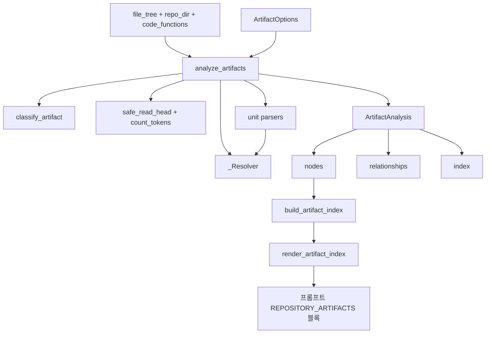
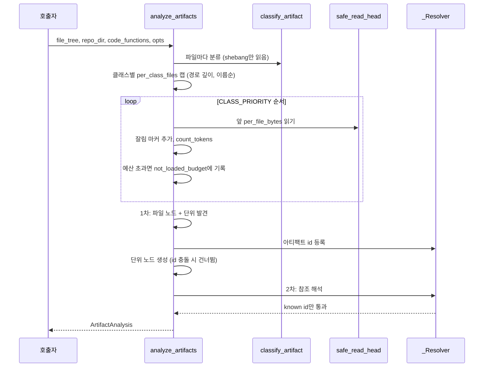

# artifact_analysis 모듈

`codewiki/src/be/dependency_analyzer/analyzers/artifact.py` 하나로 구성된 모듈이다. 언어 분석기가 보지 못하는 **빌드·CI·컨테이너·패키징·매니페스트·설정·스키마·스크립트 파일**을 의존성 그래프의 1급 노드(`component_type="artifact"`)로 만든다. 이 파일들은 확장자가 `CODE_EXTENSIONS`에 없어서 지금까지 `Node`가 되지 못했고 문서화도 되지 않았다.

상위 그룹은 [language_analyzers](language_analyzers.md)이고, 그 위는 [Code_Analysis_Pipeline](Code_Analysis_Pipeline.md)이다. 형제 모듈은 [c_family_analyzers](c_family_analyzers.md), [jvm_and_managed_analyzers](jvm_and_managed_analyzers.md), [js_ts_analyzers](js_ts_analyzers.md), [dynamic_language_analyzers](dynamic_language_analyzers.md)이다.

이 모듈은 **언어 분석기가 끝난 뒤** 같은 파일 트리를 다시 훑는다. 그리고 다음을 만든다.

- 아티팩트 파일마다 `Node` 1개. id는 `<relative_path>::<file_name>`이고 `source_code`는 앞부분만 자른 내용이다.
- 파싱할 수 있는 단위마다 자식 `Node` 1개. id는 `<relative_path>::<unit>`이다. 단위는 CI job, Dockerfile stage, compose service, Makefile target, `package.json` script, `pyproject.toml`/`setup.cfg` entry point 중 하나다.
- 아티팩트에서 코드 컴포넌트나 다른 아티팩트로 가는 `CallRelationship` 엣지. **완전히 해석된 id만** 내보낸다. `ast_parser`가 해석되지 않은 callee를 이름으로 매칭하기 때문이다.

이 모듈은 config나 prompt 코드를 import하지 않는다. `prompt_template`이 순환 import 없이 이 모듈을 가져올 수 있게 하기 위해서다. 의존하는 곳은 다음과 같다.

- `models.core`의 `Node`, `CallRelationship`
- `utils.patterns`의 `ARTIFACT_LOCKFILES`
- `utils.security`의 `safe_read_head`
- `be.utils`의 `count_tokens`

## 아키텍처

## 핵심 컴포넌트

### `ArtifactOptions`
`analyze_artifacts`의 설정 dataclass다.

| 필드 | 기본값 | 의미 |
|---|---|---|
| `enabled` | `True` | 사용 여부 플래그 |
| `token_budget` | `200_000` | 로드할 전체 토큰 예산 |
| `with_prose` | `False` | README, CONTRIBUTING, `docs/` 문서 포함 여부 |
| `exclude_patterns` | `[]` | fnmatch 또는 경로 접두사 제외 패턴 |
| `per_file_bytes` | `16_384` | 파일당 읽을 앞부분 바이트 |
| `per_class_files` | `40` | 클래스당 최대 파일 수 |
| `per_file_units` | `25` | 파일당 최대 단위 수 |

`enabled` 플래그는 이 파일 안에서 참조되지 않는다. 호출하는 쪽에서 확인한다고 보이지만 이 파일만으로는 **미확인**이다.

### `ArtifactAnalysis`
결과 컨테이너다. `nodes`, `relationships`, 그리고 `index`(토큰 사용량, 캡, 클래스별 파일·생략 목록 등을 담은 dict)를 가진다.

### `_Resolver`
텍스트 참조를 알려진 노드 id로 바꾼다.

- `code_ids`: 언어 분석기가 만든 함수 id 집합.
- `by_path`: 상대 경로에서 최상위 정의 id 목록으로 가는 매핑. `class_name`이 있는 항목은 제외한다.
- `artifact_ids`, `artifact_files`: 로드된 아티팩트를 등록해 아티팩트끼리도 해석되게 한다.
- `resolve_path(ref, base_dir)`:
  - 글롭·변수·URL·절대 경로·`..`가 들어 있으면 버린다.
  - 디렉터리는 버린다.
  - 코드 파일이면 최대 10개 id를 돌려준다.
  - 아티팩트 파일이면 파일 노드 id를 돌려준다.
  - 못 찾으면 마지막 두 세그먼트가 유일하게 일치하는 소스를 찾는다. `dist/lib.js`에서 `lib.ts`로 가는 폴백이다.
- `resolve_module(module, func)`: `pkg.mod:func`를 `pkg/mod.py`, `__init__.py`, `src/…`, `__main__.py` 후보에서 찾는다.

## 처리 흐름

1. **분류**: `classify_artifact`가 규칙 순서대로 검사한다. 규칙은 `manifest`, `build`, `container`, `ci`, `packaging`, `test_infra`, `schema`, `config`, `script`, `prose` 클래스로 나뉜다.
2. **클래스별 캡**: 경로 깊이와 이름 순으로 정렬해 앞의 `per_class_files`개만 남긴다. 넘친 파일은 `omitted_by_class_cap`에 최대 50개까지 기록한다.
3. **읽기와 예산**: `CLASS_PRIORITY` 순으로 읽는다. 앞 클래스가 예산을 먼저 쓰고, 바이너리나 빈 파일은 건너뛴다. 잘린 파일에는 `TRUNCATION_MARKER`를 붙인다.
4. **1차 패스**: 파일 노드를 만들고 단위를 찾는다. `_prioritise_units`는 단위가 캡을 넘으면 `PRIORITY_UNITS`(build, test, lint 등)를 앞에 둔다.
5. **2차 패스**: 엣지를 만든다. 파일 노드에서 자기 단위 노드로 가는 엣지는 항상 만든다. 나머지는 `_add_edges`가 `resolver.known(callee)`이고 자기 자신이 아닐 때만 통과시킨다. 결과는 정렬해서 `is_resolved=True`로 내보낸다.

## 분류 규칙 요약 (`classify_artifact`)

- **제외**:
  - 크기 0인 파일, 락파일(`ARTIFACT_LOCKFILES`).
  - `docs`, `node_modules`, `vendor`, `dist`, `.git`, fixtures 등의 세그먼트. 단 `with_prose`이면 `docs/`는 예외다.
  - `exclude_patterns`, ISSUE_TEMPLATE, PR 템플릿, `CODEOWNERS`, `FUNDING.yml`.
- **순서**: prose, ci, container, manifest, (소스 확장자 가드), packaging, build, test_infra, schema, config, script.
- **소스 확장자 가드**: `.py`, `.js` 등 소스 파일은 `conftest.py`, `noxfile.py`, `webpack.config.js` 같은 이름 규칙에 걸릴 때만 아티팩트가 된다. 그 외는 `None`을 돌려주어 언어 분석기 몫으로 남긴다.
- manifest가 packaging보다 먼저다. `packages/*/package.json`이 manifest로 잡히게 하기 위해서다.
- 확장자 없는 파일은 `bin/`이나 `scripts/` 아래에서 shebang(`#!`)이 있을 때만 script로 본다.

## 단위 파서

정규식 기반이다. YAML 라이브러리는 쓰지 않는다.

| 대상 | 함수 | 단위 |
|---|---|---|
| GitHub workflow | `_yaml_children(text, "jobs")` | job |
| docker-compose | `_yaml_children(text, "services")` | service |
| Dockerfile | `_dockerfile_units` | 멀티 stage의 `FROM … AS`. 단일 stage이고 alias가 없으면 단위 없음 |
| Makefile, `*.mk` | `_makefile_units` | 명시적 target. 패턴 규칙, 변수, `.PHONY`, 대입은 제외 |
| `package.json` | `_package_json_units` | `scripts` 항목 |
| `pyproject.toml`, `setup.cfg` | `_entry_point_units` | console script. `tomllib`이 없거나 실패하면 정규식으로 폴백 |

## 엣지 추출 규칙

`_refs_from_shell_text`는 셸 유사 텍스트(CI `run:`, Docker `RUN`, Makefile 레시피, npm script 값)에서 다음을 찾는다.

- 경로 토큰(`PATH_TOKEN_RE`)
- `python -m module`
- `make target`, 같은 디렉터리의 Makefile 단위로 해석
- `npm|pnpm|yarn|bun run script`, 예약어는 제외(`_NPM_RESERVED`)
- `docker build -f file`

파일 종류별 추가 규칙은 다음과 같다.

- **CI 워크플로**: `uses: ./…`(로컬 액션의 `action.yml`)와 `working-directory`를 반영한다.
- **compose**: `build.context`와 `dockerfile`을 Dockerfile 경로로 해석한다.
- **Dockerfile**: `COPY/ADD` 소스, `--from=stage`, `ENTRYPOINT/CMD/RUN`을 본다.
- **Makefile**: `include`와 target 선행 조건을 본다.
- **`package.json`**: `main`, `module`, `types`, `browser`, `bin`, `exports`(재귀)를 본다.
- **`pyproject.toml`, `setup.cfg`**: entry point를 `resolve_module(module, func)`로 코드 함수에 연결한다.
- **script, ci, packaging, test_infra 파일**: 셸 텍스트 규칙만 적용한다.

## 인덱스 렌더링

`build_artifact_index(components)`는 컴포넌트 dict에서 아티팩트 파일 노드를 클래스별로 묶고 단위 이름을 붙인다. `render_artifact_index`는 이를 `<REPOSITORY_ARTIFACTS>` 텍스트 블록으로 렌더링한다. 클래스당 `max_files_per_class`(기본 40)개까지, 파일당 단위 8개까지 보여준다. 프롬프트가 JSON을 다시 읽지 않고 `Node`에서 바로 만들도록 한 구조다.

## 이 저장소 자체에 적용한 예

이 저장소의 아티팩트 인덱스는 다음과 같다(`<REPOSITORY_ARTIFACTS>` 출력 기준).

- manifest: `pyproject.toml`(entry point `codewiki`), `requirements.txt`
- container: `docker/Dockerfile`, `docker/docker-compose.yml`(service `codewiki`)
- ci: `.github/workflows/ci.yml`(job `lint`, `test`)

관련 문서는 [build_ci_deployment](build_ci_deployment.md)이다. `pyproject.toml::codewiki` 노드는 CLI 엔트리 함수로 엣지를 만든다. 이 파일의 내용은 이 문서를 쓰는 데 직접 열어 보지 않았으므로 엣지 대상은 **추론**이다.

## 설계상 주의점

- 토큰 예산은 `CLASS_PRIORITY` 순서로 소진된다. 큰 저장소에서는 뒤쪽 클래스(`config`, `script`, `prose`)가 먼저 잘려 나간다.
- 단위 id가 파일 노드 id와 같으면(예: `Makefile::Makefile`) 단위는 건너뛰고 파일 노드를 유지한다.
- 정규식 파서는 단순하다. 복잡한 YAML(앵커, 플로우 스타일)이나 Makefile 매크로는 단위가 빠질 수 있다. 이는 코드 구조에서 읽은 **추론**이며 실행으로 확인하지 않았다.
- 엣지는 해석된 id만 남기므로 누락은 있어도 잘못된 이름 매칭은 없다.
