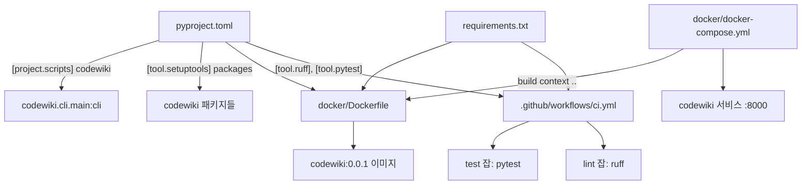
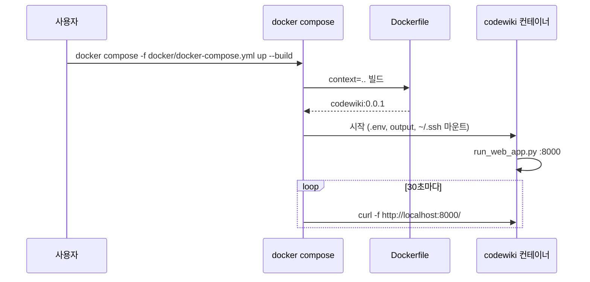
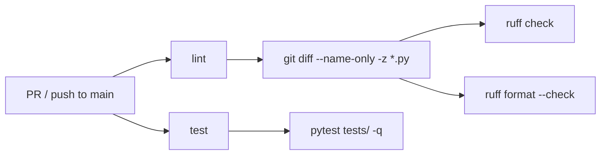

# build_ci_deployment 모듈

`build_ci_deployment`는 CodeWiki를 **패키징(pyproject.toml) → 의존성 고정(requirements.txt) → 컨테이너화(docker/) → 지속적 통합(.github/workflows/ci.yml)** 하는 빌드·배포 계층이다. 애플리케이션 로직은 없고, 다른 모듈의 코드를 설치·검증·실행하는 방법만 정의한다. 상위 모듈은 `Platform_Foundation_&_Delivery`이며 형제 모듈은 [shared_config_utils](shared_config_utils.md)이다.

## 1. 구성 요소

| 파일 | 역할 |
|---|---|
| `pyproject.toml` | setuptools 빌드 설정, 프로젝트 메타데이터, 의존성, CLI 진입점, ruff/pytest/black/mypy 설정 |
| `requirements.txt` | 전체 의존성을 `==`로 고정한 목록 (CI와 Docker 설치용) |
| `docker/Dockerfile` | Python 3.12-slim 기반 웹앱 이미지 |
| `docker/docker-compose.yml` | `codewiki` 서비스 실행 정의 (포트, 볼륨, 헬스체크, 네트워크) |
| `.github/workflows/ci.yml` | `test`, `lint` 두 잡으로 구성된 GitHub Actions 워크플로 |

## 2. 전체 구조



## 3. 패키징 — `pyproject.toml`

- **빌드 백엔드**: `setuptools>=68.0.0` + `wheel`. 프로젝트명 `codewiki`, 버전 `2.0.0`, `requires-python >=3.12`, MIT 라이선스.
- **진입점**: `codewiki = "codewiki.cli.main:cli"` → 설치 시 `codewiki` 명령이 생성된다. CLI 자체는 [User_Interfaces_&_Access_Layer](User_Interfaces_&_Access_Layer.md) 참고.
- **패키지 목록은 명시적 나열**(`[tool.setuptools] packages`): `codewiki.cli.*`, `codewiki.src.be.*`(`agent_tools`, `dependency_analyzer.*`, `updater`), `codewiki.src.fe`, `codewiki.mcp`, `codewiki.mcp.tools`. **새 서브패키지를 추가하면 이 목록에도 넣어야** 배포물에 포함된다. 패키지 데이터는 `templates/**/*`, `py.typed`.
- **의존성 군**:
  - 분석: `tree-sitter*`(언어별 파서), `networkx`, `pathspec` → [Code_Analysis_Pipeline](Code_Analysis_Pipeline.md)
  - LLM: `openai`, `litellm`, `pydantic-ai`, `logfire`, `coding-agent-wrapper`(git 브랜치 `fix/codex-exec-robustness`에서 직접 설치) → [LLM_Documentation_Generation_Engine](LLM_Documentation_Generation_Engine.md)
  - 웹/MCP: `fastapi`, `uvicorn`, `python-multipart`, `mcp`
  - CLI: `click`, `keyring`, `rich`, `GitPython`, `Jinja2`
- **`[external] build-requires`**: Node.js ≥14. `mermaid-parser-py`가 끌어오는 PythonMonkey의 `pminit`이 설치 시 npm을 호출하기 때문이다(파일 주석 기준). 이것이 Dockerfile에서 `nodejs`, `npm`을 설치하는 이유다.
- **dev extras**: `pytest`, `pytest-cov`, `pytest-asyncio`, `black`, `mypy`, `ruff`.
- **도구 설정**:
  - `ruff`: line-length 100, py312, lint 규칙 `E4, E7, E9, F`만 선택 (ruff 0.16의 기본 규칙 확대로 인한 CI 불안정 방지 목적이라고 주석에 명시).
  - `pytest`: `testpaths=["tests"]`, `addopts = "-v --cov=codewiki --cov-report=term-missing"`.

> 주의: `pyproject.toml`의 `dependencies`는 하한(`>=`) 위주이고 `requirements.txt`는 `==` 고정이다. 두 파일이 독립적으로 관리되므로 버전이 어긋날 수 있다(예: `tree-sitter-scala`는 pyproject `<0.24.0`, requirements `0.23.4`). 또한 `requirements.txt`에는 `coding-agent-wrapper`가 없어 CI는 `pip install -e . --no-deps`로 설치할 때 이 패키지가 빠진다 (`requirements.txt` 내용 확인 기준).

## 4. 컨테이너 — `docker/`

### Dockerfile
1. `python:3.12-slim` 기반, 작업 디렉터리 `/app`.
2. `apt-get`으로 `git`(레포 클론), `curl`(헬스체크), `nodejs`/`npm`(PythonMonkey) 설치.
3. `requirements.txt`를 먼저 복사해 `pip install` → 레이어 캐시 최적화.
4. `codewiki/`, `img/`, `pyproject.toml`, `README.md` 복사. 패키지 자체는 `pip install`하지 않고 `PYTHONPATH=/app`로 임포트한다.
5. `output/{cache,temp,docs,dependency_graphs}` 생성, 포트 8000 노출.
6. `HEALTHCHECK`: `curl -f http://localhost:8000/` (30s 간격).
7. 기본 명령: `python codewiki/run_web_app.py --host 0.0.0.0 --port 8000` — 웹 프론트엔드(`web_frontend`)를 기동한다.

### docker-compose.yml
- 서비스 `codewiki`, 이미지 `codewiki:0.0.1`, 빌드 컨텍스트 `..`(저장소 루트), Dockerfile은 `docker/Dockerfile`.
- 포트: `${APP_PORT:-8000}:8000`.
- `env_file: ../.env` — LLM API 키 등 비밀 설정 주입 (`.env`가 없으면 기동 실패).
- 볼륨: `../output:/app/output`(캐시·산출물 영속화), `~/.ssh:/root/.ssh:ro`(프라이빗 레포 접근). `.gitconfig` 마운트는 주석 처리.
- `restart: unless-stopped`, 헬스체크 `start_period: 20s`.
- 네트워크: **외부 네트워크** `codewiki-network` (`external: true`) — 사전에 `docker network create codewiki-network`가 필요하다.



## 5. CI — `.github/workflows/ci.yml`

- **트리거**: `main` 대상 `pull_request` 및 `main`으로의 `push`. 권한은 `contents: read`.
- **test 잡** (ubuntu-latest, 20분 제한): Python 3.12(pip 캐시) → `pip install -r requirements.txt` + `pytest pytest-asyncio pytest-cov ruff` → `pip install -e . --no-deps` → `pytest -p no:cacheprovider -o addopts="" tests/ -q`. `addopts=""`로 pyproject의 커버리지 옵션을 CI에서는 끈다.
- **lint 잡** (10분 제한): `fetch-depth: 0`으로 전체 히스토리를 받고, PR이면 `base...head`, push이면 `before..GITHUB_SHA` 범위에서 **변경된(ACMR) `*.py` 파일만** 수집(NUL 구분자)해 `ruff check --output-format=github`와 `ruff format --check`를 실행한다. 기존 코드 전체를 정리하지 않고 변경분만 강제하는 방식이다.



## 6. 로컬 사용 요약

```bash
pip install -e .                      # codewiki CLI 설치
pytest tests/                         # 테스트 (pyproject의 cov 옵션 적용)
ruff check . && ruff format --check . # 로컬 린트
docker network create codewiki-network
docker compose -f docker/docker-compose.yml up --build
```

## 7. 다른 모듈과의 관계

- 설치 대상 코드는 [User_Interfaces_&_Access_Layer](User_Interfaces_&_Access_Layer.md), [Code_Analysis_Pipeline](Code_Analysis_Pipeline.md), [LLM_Documentation_Generation_Engine](LLM_Documentation_Generation_Engine.md) 전체이며, 이 모듈은 그것들을 패키지 목록과 의존성으로 묶는다.
- 런타임 설정과 파일 유틸은 [shared_config_utils](shared_config_utils.md)(`Config`, `FileManager`)가 담당한다.
