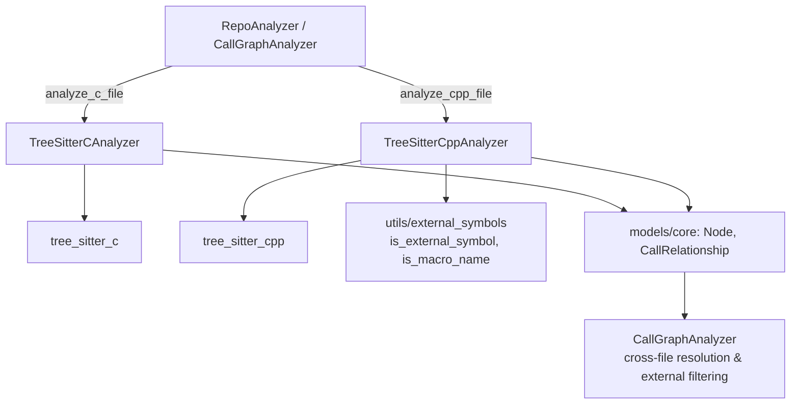
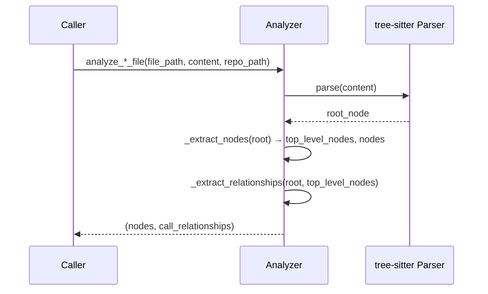
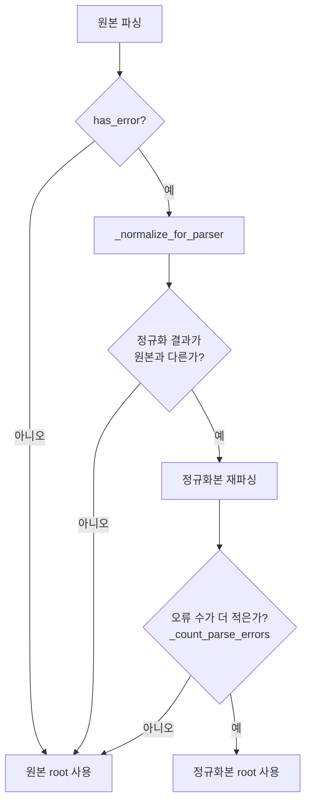
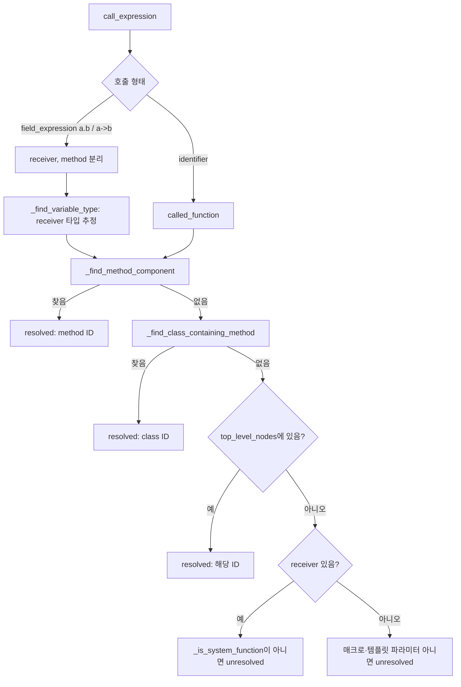

# c_family_analyzers 모듈

## 1. 개요

`c_family_analyzers`는 C 및 C++ 소스 파일을 tree-sitter로 파싱하여 **컴포넌트(Node)** 와 **호출/참조 관계(CallRelationship)** 를 추출하는 언어별 분석기 모음입니다. 상위 모듈 [language_analyzers](language_analyzers.md)의 하위 모듈이며, 결과는 [dependency_analysis_core](dependency_analysis_core.md)의 `CallGraphAnalyzer`, `DependencyGraphBuilder`가 받아 전체 의존성 그래프로 합칩니다.

| 파일 | 클래스 | 진입 함수 | 대상 확장자 |
|---|---|---|---|
| `codewiki/src/be/dependency_analyzer/analyzers/c.py` | `TreeSitterCAnalyzer` | `analyze_c_file` | `.c`, `.h` |
| `codewiki/src/be/dependency_analyzer/analyzers/cpp.py` | `TreeSitterCppAnalyzer` | `analyze_cpp_file` | `.cpp`, `.cc`, `.cxx`, `.c++`, `.hpp`, `.hxx`, `.h++`, `.h` |

두 분석기는 공통 구조를 가집니다. 생성자에서 곧바로 `_analyze()`를 실행하고, 결과를 `self.nodes`, `self.call_relationships`에 저장합니다. 모델은 `models/core.py`의 `Node`, `CallRelationship`을 사용합니다 (자세한 내용은 [dependency_analysis_core](dependency_analysis_core.md) 참고).

## 2. 아키텍처

## 3. 공통 처리 흐름

1. **파싱**: 언어별 tree-sitter `Language`로 `Parser`를 만들어 AST 생성.
2. **노드 추출** (`_extract_nodes`): AST를 재귀 순회하며 컴포넌트를 수집하고, 이름 조회용 `top_level_nodes` 딕셔너리를 채움.
3. **관계 추출** (`_extract_relationships`): 다시 순회하며 호출·상속·인스턴스화·전역변수 참조를 `CallRelationship`으로 기록.
4. **ID 규칙**: 컴포넌트 ID는 `"<repo 기준 상대경로>::<이름>"` (C++ 메서드는 `"<상대경로>::<클래스>.<메서드>"`).

`is_resolved` 플래그: `True`면 같은 파일 안에서 이미 확정된 관계, `False`면 단순 이름만 담아 `CallGraphAnalyzer`가 파일 간 해석을 하도록 넘긴 관계입니다. libc/STL 같은 외부 심볼 필터링도 원칙적으로 해석 이후 `CallGraphAnalyzer`에서 수행합니다(소스 주석 기준). 그래서 프로젝트 함수가 libc 이름을 가려도 엣지가 유지됩니다.

## 4. TreeSitterCAnalyzer (`c.py`)

### 추출 대상

| AST 노드 | component_type | `self.nodes`에 포함 |
|---|---|---|
| `function_definition` (`function_declarator`의 identifier) | `function` | O |
| `struct_specifier` (`type_identifier`) | `struct` | O |
| `type_definition` 안의 `struct_specifier` (typedef struct) | `struct` | O |
| 전역 `declaration` (`_is_global_variable`) | `variable` | X (`top_level_nodes`에만 저장) |

전역 변수는 함수 내부에 속하지 않는 declaration으로 판정합니다(`_is_global_variable`이 `function_definition` 조상 유무 확인). 변수는 최종 노드 목록에는 넣지 않고, 함수가 이를 참조하는 관계를 만드는 조회용으로만 사용합니다.

### 관계 추출

- `call_expression` → 감싸는 함수를 `_find_containing_function`으로 찾아 `CallRelationship(caller=<함수 ID>, callee=<단순 이름>, is_resolved=False)` 추가.
- `identifier`가 파일 내 전역 변수 이름과 일치하면 `callee=<변수 컴포넌트 ID>`, `is_resolved=True`로 추가.

### 한계 (코드 확인)

- 함수 포인터·`field_expression` 호출은 처리하지 않습니다(`identifier` 자식만 검사).
- 매크로 함수 정의, 전방 선언, `enum`, `union`은 컴포넌트로 추출하지 않습니다.
- `pointer_declarator`가 감싼 함수 선언자(`char *f()`)는 `function_declarator`가 직접 자식이 아니므로 이름을 놓칠 수 있습니다. 이 부분은 코드상 추정이며 실행으로 검증하지 않았습니다.

## 5. TreeSitterCppAnalyzer (`cpp.py`)

C 분석기보다 훨씬 많은 기능을 가집니다.

### 5.1 매크로 복구 파싱

`EXPORT_API void foo()`, `class LIB_API logger {` 처럼 ALL_CAPS 매크로가 선언 앞에 붙으면 tree-sitter가 실패하기 때문에, 오류가 있을 때만 다음 정규식으로 매크로를 제거해 재파싱합니다.

- `_SPECIFIER_MACRO_RE`, `_SPECIFIER_MACRO_CALL_RE`: 선언 앞 지정자 매크로(함수형 포함)
- `_KEYWORD_MACRO_RE`: `class|struct|union|enum` 뒤의 export 매크로
- `_STANDALONE_MACRO_RE`: 매크로만 있는 줄(네임스페이스 브래킷 매크로 등)은 빈 줄로 치환

설계 포인트는 다음과 같습니다.
- 줄 수를 유지하므로 `start_line`/`end_line`이 정확합니다.
- 오류 개수를 비교해 더 나은 쪽만 채택합니다. Win32 `HANDLE`, `DWORD` 같은 ALL_CAPS 타입 때문에 정규화가 오히려 나빠지는 경우를 자동으로 피합니다.
- 실제 치환은 `is_macro_name()`(`utils/external_symbols`)이 true일 때만 수행합니다.

### 5.2 노드 추출

| AST 노드 | component_type | `self.nodes` 포함 |
|---|---|---|
| `class_specifier` | `class` | O |
| `struct_specifier` | `struct` | O |
| `function_definition` | `function` 또는 `method` | O |
| `declaration` (클래스 내부 + `function_declarator`) | `method` | O |
| `declaration` (전역) | `variable` | X |
| `alias_declaration` (`using X = ...`), `type_definition` (`typedef`) | `type_alias` | O |
| `namespace_definition` | `namespace` | X |

메서드 판정은 두 경로입니다.
1. 클래스/구조체 본문 안에 있으면 `_find_containing_class_for_method`.
2. 클래스 밖 정의 `A::foo()` 는 `_get_qualified_declarator_parts`로 `qualified_identifier`의 뒤에서 두 번째 요소를 클래스명으로 사용.

`top_level_nodes`에는 같은 노드가 여러 키로 등록됩니다: 이름, 컴포넌트 ID, 그리고 메서드는 `클래스.메서드`, 그리고 `setdefault(name)`. 이는 이후 관계 해석에서 다양한 형태의 조회를 지원하기 위함입니다.

### 5.3 관계 추출

| AST 노드 | 생성 관계 |
|---|---|
| `call_expression` | 위 흐름에 따른 호출 관계 |
| `base_class_clause` | 클래스 → 기반 클래스 (unresolved, 템플릿 파라미터·매크로는 제외) |
| `new_expression` | 함수 → 인스턴스화되는 클래스 (파일 내 존재 시 resolved) |
| `identifier` (전역 변수 참조) | 함수 → 변수 (unresolved) |

수신자 타입 추정(`_find_variable_type`)은 `compound_statement`, `field_declaration_list`, `translation_unit` 범위의 선언과 함수 파라미터를 거슬러 올라가며 찾고, 생성자 호출 형태(`_get_constructor_type_name`)도 처리합니다.

### 5.4 노이즈 억제 규칙

- `_find_template_parameters`: `template_declaration`의 타입 파라미터(`T` 등)를 프로젝트 심볼로 오인하지 않도록 제외.
- `_is_system_function`: `is_external_symbol("cpp", name)` 또는 ALL_CAPS 매크로면 외부로 간주. 수신자 타입을 못 찾은 멤버 호출에만 적용됩니다.
- 일반 호출은 외부 필터링을 `CallGraphAnalyzer`에 위임합니다.

### 5.5 알려진 한계 (코드 확인)

- `_class_has_method`는 소스 텍스트에서 `name(` 문자열과 `void`/`int`/`bool`/클래스명 포함 여부를 확인하는 휴리스틱입니다. 오탐 가능성이 있습니다.
- `_find_method_component`의 폴백은 이름만 같은 첫 번째 메서드를 반환하므로, 서로 다른 클래스에 같은 이름의 메서드가 있으면 잘못 연결될 수 있습니다.
- 네임스페이스는 `top_level_nodes`에만 저장되고 `qualified_name`에 반영되지 않습니다.
- 사용되지 않는 헬퍼가 남아 있습니다: `_find_containing_function`, `_get_component_id_for_function`, `_get_module_path`(두 분석기 모두).
- 전역 변수 참조 관계는 C++에서 `callee=var_name`(단순 이름), C에서는 컴포넌트 ID를 사용하는 등 두 분석기 간 규약이 다릅니다.

## 6. C와 C++ 비교

| 항목 | C | C++ |
|---|---|---|
| 추출 컴포넌트 | function, struct | class, struct, function, method, type_alias |
| 매크로 복구 재파싱 | 없음 | 있음 |
| 멤버 호출/수신자 타입 추정 | 없음 | 있음 |
| 상속·`new` 관계 | 없음 | 있음 |
| 외부 심볼 필터 | `CallGraphAnalyzer`에 전적으로 위임 | 일부 로컬(`_is_system_function`) + 중앙 |
| `language` 필드 | `"c"` | `"cpp"` |

## 7. 사용 시 참고

- 분석기는 예외 처리 없이 생성자에서 파싱합니다. 호출자 쪽에서 실패를 다뤄야 합니다.
- `.h` 확장자는 두 분석기 모두 모듈 경로 후보에 포함됩니다. 어느 분석기를 쓸지는 호출하는 상위 계층이 결정합니다. 해당 라우팅 코드는 이 모듈 범위 밖이라 확인하지 않았습니다(`미확인`).
- 다른 언어 분석기는 [jvm_and_managed_analyzers](jvm_and_managed_analyzers.md), [js_ts_analyzers](js_ts_analyzers.md), [dynamic_language_analyzers](dynamic_language_analyzers.md), [artifact_analysis](artifact_analysis.md)를 참고하세요.
