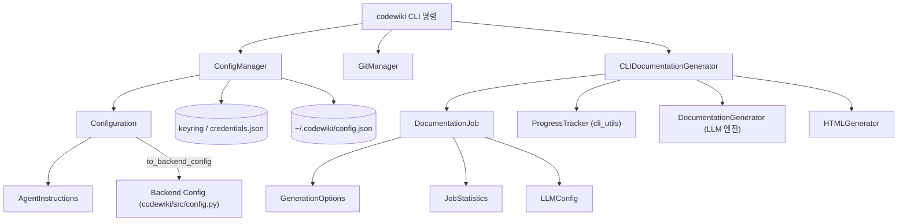
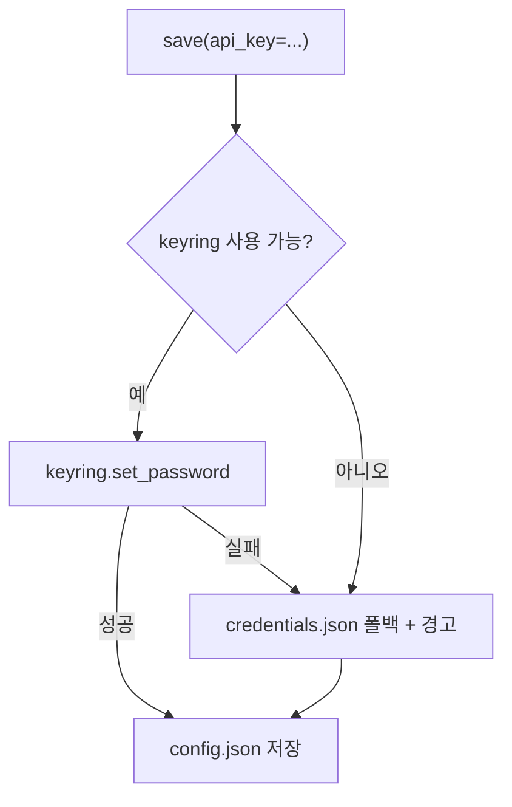
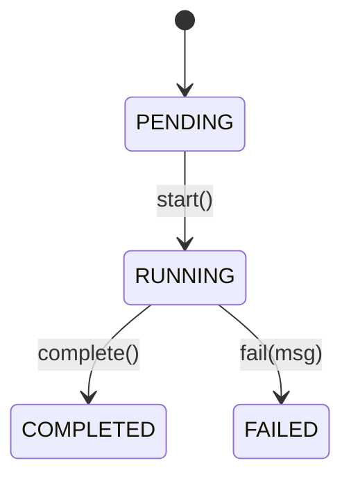
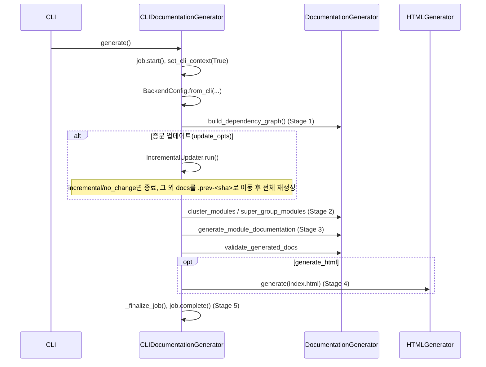
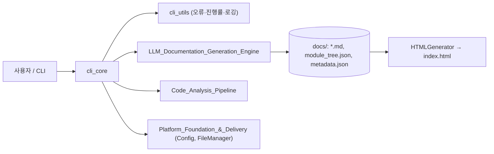

# cli_core 모듈 문서

`cli_core`는 CodeWiki CLI(`codewiki` 명령)의 핵심 로직을 담은 모듈이다. 사용자 설정 저장, Git 작업, 백엔드 문서 생성기 호출(어댑터), 정적 HTML 뷰어 생성, 작업(Job) 데이터 모델을 제공한다. 상위 모듈은 User_Interfaces_&_Access_Layer이며, 형제 모듈은 [cli_utils](cli_utils.md), [web_frontend](web_frontend.md), [mcp_sessions](mcp_sessions.md)이다.

## 구성 요소

| 파일 | 컴포넌트 | 역할 |
|---|---|---|
| `codewiki/cli/adapters/doc_generator.py` | `CLIDocumentationGenerator` | 백엔드 `DocumentationGenerator`를 감싸 단계별 진행 표시, 증분 업데이트, HTML 생성, 작업 상태 관리를 수행 |
| `codewiki/cli/config_manager.py` | `ConfigManager` | `~/.codewiki/config.json` 및 keyring/파일 기반 API 키 저장 |
| `codewiki/cli/git_manager.py` | `GitManager` | 상태 확인, 문서 브랜치 생성, 커밋, 원격 URL/PR URL 계산 |
| `codewiki/cli/html_generator.py` | `HTMLGenerator` | `viewer_template.html`에 module tree/metadata를 주입해 `index.html` 생성 |
| `codewiki/cli/models/config.py` | `Configuration`, `AgentInstructions` | 영속 설정 모델 및 백엔드 `Config`로의 변환 |
| `codewiki/cli/models/job.py` | `DocumentationJob`, `GenerationOptions`, `JobStatistics`, `JobStatus`, `LLMConfig` | 생성 작업의 상태·통계 모델 |

## 아키텍처

관련 모듈: 백엔드는 [documentation_generation](documentation_generation.md), 증분 업데이트는 [incremental_updater](incremental_updater.md), 오류/진행률 유틸은 [cli_utils](cli_utils.md), 공용 설정은 [shared_config_utils](shared_config_utils.md) 참고.

## 컴포넌트 상세

### ConfigManager
- 비민감 설정은 `~/.codewiki/config.json`(`CONFIG_VERSION = "1.0"`)에 저장한다.
- API 키는 시스템 keyring(`service="codewiki"`, `account="api_key"`)에 저장한다. keyring을 쓸 수 없거나(`CODEWIKI_NO_KEYRING=1` 포함) 런타임에 실패하면 `~/.codewiki/credentials.json`(평문, `chmod 0o600`)으로 폴백하고 경고를 로깅한다.
- `save()`는 전달된 필드만 갱신하고, 필수 값이 충족되면 `Configuration.validate()`를 호출한다. caw 계열 provider(`is_caw_provider`)는 `main_model`만 필요하고, 그 외에는 `base_url`, `main_model`, `cluster_model`이 필요하다.
- `is_configured()`는 caw provider가 아니면 API 키 존재 여부까지 확인한다.

### Configuration / AgentInstructions
- `Configuration`: `base_url`, 모델(`main_model`, `cluster_model`, `fallback_model`), provider(`openai-compatible`, `anthropic`, `bedrock`, `azure-openai` 등), 토큰/깊이/요청 제한, `use_gitignore`, `prompt_caching` 등을 보유하는 dataclass. `to_dict`/`from_dict`로 직렬화한다.
- `to_backend_config()`는 영속 설정과 런타임 `AgentInstructions`를 병합(런타임 우선)하여 `Config.from_cli(...)`로 백엔드 설정을 만든다. 참고: 병합 시 `artifact_exclude`는 새 `AgentInstructions`에 복사되지 않는다(코드 확인).
- `AgentInstructions`: include/exclude 패턴, `focus_modules`, `doc_type`, `custom_instructions`, `artifact_exclude`. `get_prompt_addition()`이 프롬프트 추가 문구를 만든다.

### GitManager
- `git.Repo(..., search_parent_directories=True)`로 저장소를 열고, 실패 시 `RepositoryError`를 발생시킨다.
- `create_documentation_branch()`는 작업 트리가 dirty이면(`force=False`) 거부하고, `docs/codewiki-YYYYmmdd-HHMMSS` 브랜치를 만들어 체크아웃한다.
- `commit_documentation()`, `get_remote_url()`, `get_current_branch()`, `get_commit_hash()`, `get_github_pr_url()` 제공.

### HTMLGenerator
- 템플릿(`codewiki/templates/github_pages/viewer_template.html`)의 `{{TITLE}}`, `{{MODULE_TREE_JSON}}`, `{{METADATA_JSON}}` 등의 플레이스홀더를 치환한다. `docs_dir`가 주어지면 `module_tree.json`, `metadata.json`을 자동 로드한다.
- `detect_repository_info()`는 git remote로부터 저장소 URL과 GitHub Pages URL을 추정한다.
- 제목은 `_escape_html`로 이스케이프하며, `codewiki-icon.png`를 출력 디렉터리에 복사한다.

### DocumentationJob 계열
`JobStatus`(PENDING/RUNNING/COMPLETED/FAILED)와 `start()`/`complete()`/`fail()` 메서드로 수명주기를 관리하고, `to_dict`/`to_json`/`from_dict`로 직렬화한다.

### CLIDocumentationGenerator
`generate()`가 진입점이다. `ProgressTracker(total_stages=5)`로 단계를 표시한다.

주요 동작:
- **로깅**: `codewiki.src.be` 로거를 재구성한다. verbose면 INFO를 stdout으로, 아니면 WARNING 이상만 stderr로 출력하며 `ColoredFormatter`를 사용한다.
- **클러스터링 캐시**: `first_module_tree.json`이 있으면 재사용하고, 기존 `module_tree.json`은 덮어쓰지 않는다. 새로 클러스터링한 트리만 이름 중복 제거(`dedupe_module_tree_names`)와, 아티팩트 활성 시 `ensure_artifact_module`을 적용한다.
- **증분 업데이트**: `_update_options()`는 `config["update"]`가 있고 rung이 `"0"`이 아니며 `module_tree.json`이 존재할 때만 `UpdateOptions`를 반환한다. 이전 그래프를 `snapshot_old_graph`로 보존한다. 결과가 `incremental`/`no_change`가 아니면 `_move_docs_aside()`로 기존 문서를 `<output>.prev-<sha8>`로 옮기고 전체 재생성한다. 메타데이터의 `update_history`는 `_read_update_history`/`_merge_update_summary`로 누적한다.
- **오류 처리**: 단계별 실패는 `APIError`로 감싼다(예: "Dependency analysis failed"). 최종 검증에서 누락된 문서가 있으면 `IncompleteGenerationError`(missing_modules 포함)를 발생시키며, 이는 API 오류로 감싸지지 않는다. 실패 시 `job.fail()` 후 예외를 재발생시킨다. 오류 클래스는 [cli_utils](cli_utils.md) 참고.
- **메타데이터**: 백엔드가 `metadata.json`을 만들지 않았다면 `_finalize_job()`이 job JSON으로 대신 작성한다.

## 시스템 내 위치와 데이터 흐름

설정 흐름: CLI 인자/저장된 `Configuration` + keyring의 API 키 → `Configuration.to_backend_config()` (또는 어댑터 내 `BackendConfig.from_cli`) → 백엔드 실행 → `docs/` 산출물 → 선택적 HTML 뷰어.

## 참고 사항
- 검증 수준: 위 내용은 제공된 소스 코드 기준(코드 확인)이며, CLI 명령 정의(`generate` 등)와 `codewiki/cli/utils/fs.py`, `validation.py`는 이 모듈 범위 밖이라 미확인이다.
- CI/패키징(`pyproject.toml`의 `codewiki` 엔트리 포인트 등)은 [build_ci_deployment](build_ci_deployment.md) 참고.
