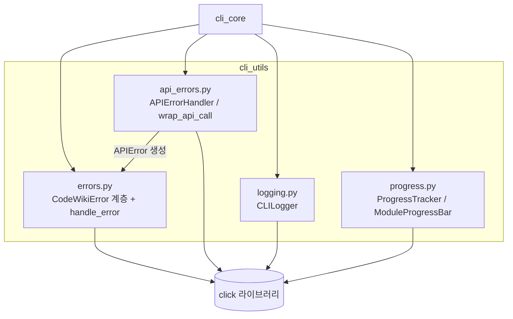
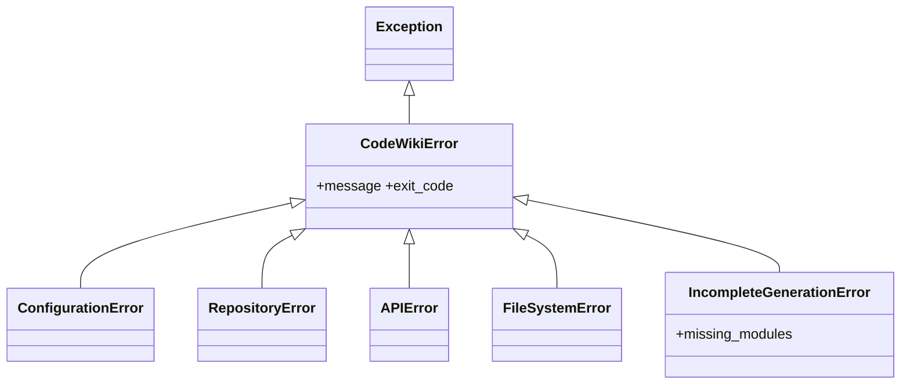
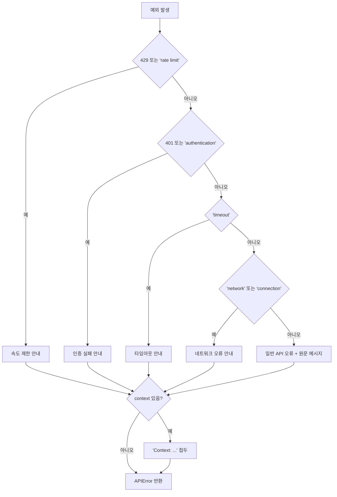
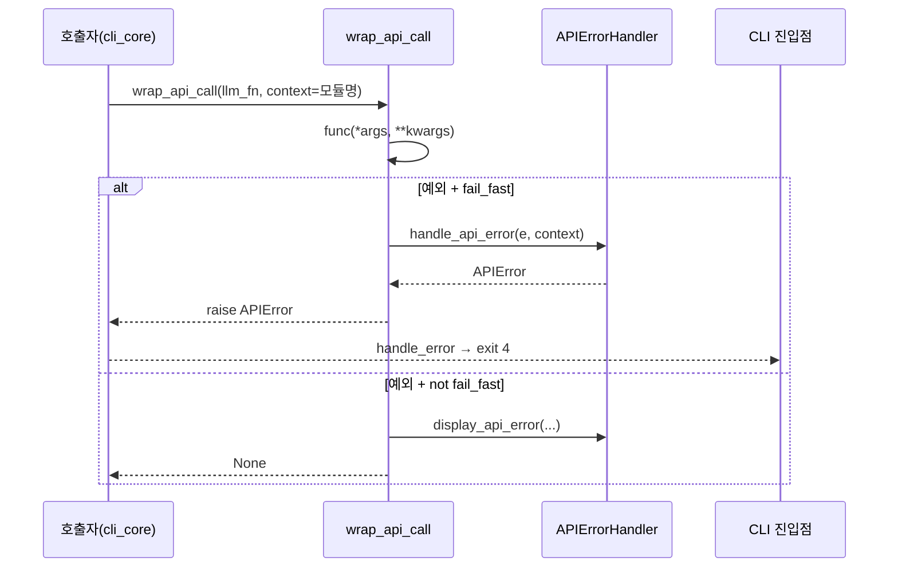
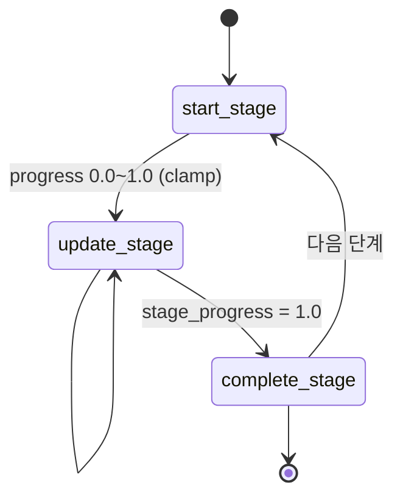
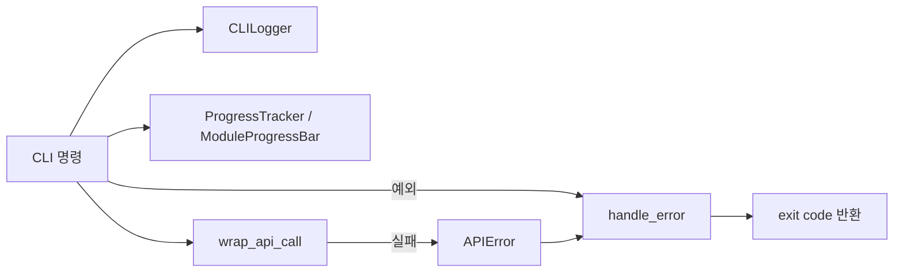

# cli_utils 모듈

`cli_utils`는 CodeWiki CLI(`codewiki/cli/utils/`)가 공통으로 사용하는 **오류 모델, LLM API 오류 처리, 로깅, 진행률 표시** 유틸리티 모음이다. 모든 출력은 `click`으로 수행하며, 상위 모듈 `User_Interfaces_&_Access_Layer`의 하위 모듈 중 하나다. 주로 [cli_core](cli_core.md)의 `CLIDocumentationGenerator`, `ConfigManager`, `GitManager`, `HTMLGenerator` 등이 이 유틸리티를 호출한다(호출 관계는 모듈 구성에 따른 추론이며, 개별 호출부는 이 문서 범위에서 코드로 확인하지 않았다).

## 구성 요소

| 파일 | 컴포넌트 | 역할 |
|---|---|---|
| `codewiki/cli/utils/errors.py` | `CodeWikiError`, `ConfigurationError`, `RepositoryError`, `APIError`, `FileSystemError`, `IncompleteGenerationError` | 종료 코드를 가진 예외 계층과 출력 헬퍼(`handle_error`, `error_with_suggestion`, `warning`, `success`, `info`) |
| `codewiki/cli/utils/api_errors.py` | `APIErrorHandler`, `wrap_api_call` | 원본 예외 메시지를 분류해 사용자 친화적 `APIError`로 변환·표시 |
| `codewiki/cli/utils/logging.py` | `CLILogger`, `create_logger` | verbose/일반 모드 로깅, 경과 시간 계산 |
| `codewiki/cli/utils/progress.py` | `ProgressTracker`, `ModuleProgressBar` | 단계별 가중치 기반 진행률/ETA, 모듈 단위 진행 막대 |

## 아키텍처

의존 방향: `api_errors.py`만 `errors.py`(`APIError`)에 의존하고, 나머지 파일은 서로 독립적이며 외부로는 `click`(과 표준 라이브러리)만 사용한다.

## 오류 모델 (`errors.py`)

모든 CLI 예외는 `CodeWikiError`를 상속하며 `message`와 `exit_code`를 가진다.

| 종료 코드 | 상수 | 예외 |
|---|---|---|
| 0 | `EXIT_SUCCESS` | - |
| 1 | `EXIT_GENERAL_ERROR` | `CodeWikiError`(기본), `IncompleteGenerationError` |
| 2 | `EXIT_CONFIG_ERROR` | `ConfigurationError` |
| 3 | `EXIT_REPOSITORY_ERROR` | `RepositoryError` |
| 4 | `EXIT_API_ERROR` | `APIError` |
| 5 | `EXIT_FILESYSTEM_ERROR` | `FileSystemError` |

- `handle_error(error, verbose)`: `CodeWikiError`이면 메시지를 stderr에 빨간색으로 출력하고 해당 `exit_code`를 반환한다. 그 외 예외는 "Unexpected error"로 출력하며 `verbose`일 때만 traceback을 출력하고 코드 1을 반환한다. 이 함수는 종료하지 않고 코드만 반환한다.
- `error_with_suggestion(message, suggestion, exit_code)`: 오류와 해결 제안을 출력한 뒤 `sys.exit`로 즉시 종료한다.
- `IncompleteGenerationError`: 생성은 끝났지만 일부 모듈 문서가 디스크에 없을 때 사용하며, 누락 목록을 `missing_modules`에 담는다.
- `warning` / `success` / `info`: 각각 노란색 `⚠️`, 초록색 `✓`, 일반 출력.

## LLM API 오류 처리 (`api_errors.py`)

`APIErrorHandler.handle_api_error`는 예외 문자열을 검사해 아래 순서로 첫 번째로 일치하는 안내 메시지를 만든다.

- 문자열 매칭(대소문자 무시 포함) 기반 휴리스틱이므로, 메시지에 "429" 등이 우연히 포함되면 오분류될 수 있다.
- 각 메시지에는 `codewiki config show`, `codewiki config set --api-key`, `codewiki config validate` 같은 복구 명령이 포함된다.
- `handle_api_error`의 `fail_fast` 인자는 변환 로직에서 사용되지 않는다. 실제 분기는 `wrap_api_call`에서 일어난다.
- `display_api_error(error, module_name)`: "✗ LLM API Error" 헤더, 모듈명, 메시지, "Documentation generation stopped. No partial results saved."를 출력한다.
- `wrap_api_call(func, *args, fail_fast=True, context=None, **kwargs)`: 호출을 감싸 예외를 `APIError`로 변환한다. `fail_fast=True`면 raise, `False`면 오류를 표시하고 `None`을 반환한다.

## 로깅 (`logging.py`)

`CLILogger(verbose)`는 생성 시각을 기록하고 다음 메서드를 제공한다.

- `debug`: verbose일 때만 `[HH:MM:SS]` 타임스탬프와 함께 cyan/dim 출력
- `info`, `success`(초록 `✓`), `warning`(노랑 `⚠️`), `error`(빨강 `✗`, stderr)
- `step(message, step, total)`: `[n/total]` 또는 `→` 접두의 파랑 볼드 출력
- `elapsed_time()`: `"Xm Ys"` 또는 `"Ys"` 형식 문자열
- `create_logger(verbose)`: 팩토리 함수

이름이 표준 라이브러리 `logging`과 같지만 `codewiki.cli.utils.logging`으로 임포트하므로 절대 임포트에서는 충돌하지 않는다.

## 진행률 표시 (`progress.py`)

### ProgressTracker

5단계 파이프라인을 가중치로 모델링해 전체 진행률과 ETA를 계산한다.

| 단계 | 이름 | 가중치 |
|---|---|---|
| 1 | Dependency Analysis | 0.40 |
| 2 | Module Clustering | 0.20 |
| 3 | Documentation Generation | 0.30 |
| 4 | HTML Generation (선택) | 0.05 |
| 5 | Finalization | 0.05 |

- `get_overall_progress()` = (현재 단계 이전 단계 가중치 합) + (현재 단계 가중치 × `stage_progress`).
- `get_eta()`: `경과시간 / 진행률 − 경과시간`. 진행률이 0이면 `None`, 음수면 `"< 1 min"`, 60분 초과면 `"Xh Ym"` 형식.
- verbose 모드에서만 경과 시간(`MM:SS`)과 단계 소요 시간을 출력하고, 일반 모드는 `[n/5] 단계명`만 출력한다.
- 4단계(HTML)가 생략되어도 가중치 합계는 조정되지 않는다. 생략된 단계는 `start_stage`를 건너뛰는 동안 `range(1, current_stage)`에 의해 완료로 계산된다.

### ModuleProgressBar

모듈별 생성 진행 표시기다. 일반 모드에서는 생성자에서 `click.progressbar`를 열고(`__enter__`), `update()`마다 1씩 증가시키며 `finish()`에서 닫는다(`__exit__`). verbose 모드에서는 막대 대신 `[i/N] 모듈명... ✓ (cached)` / `⟳ (generating)` 줄을 출력한다. 일반 모드에서는 `cached` 값이 화면에 반영되지 않는다. 예외 경로에서도 막대를 닫으려면 호출자가 `finish()`를 반드시 호출해야 한다.

## 사용 흐름 요약

## 참고

- 상위 구조: `User_Interfaces_&_Access_Layer`
- 주요 소비자: [cli_core](cli_core.md)
- 웹 프런트엔드에서 쓰는 별도 `JobStatus` 등은 [web_frontend](web_frontend.md)에서 다룬다. 이 모듈의 종료 코드/예외는 CLI 전용이다.
