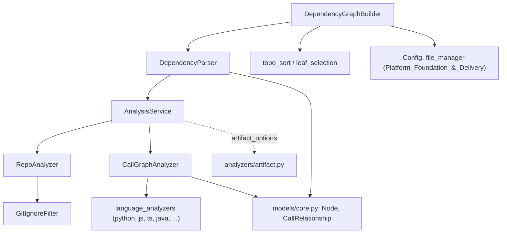
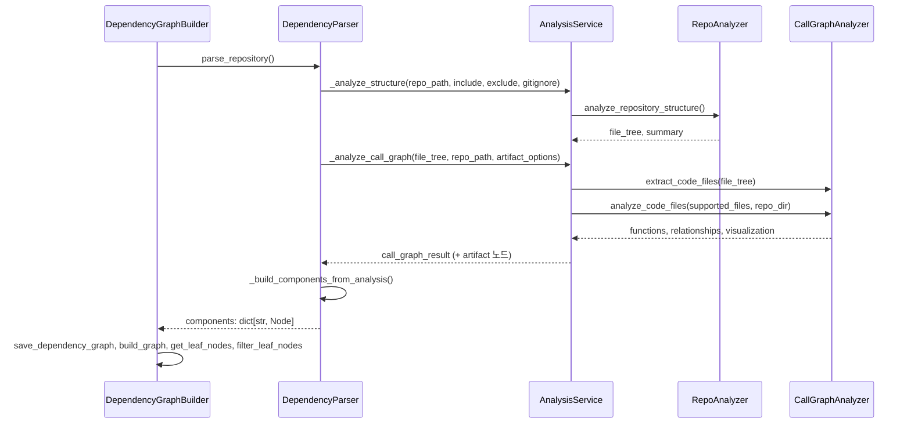
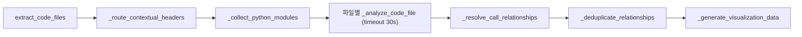

# dependency_analysis_core 모듈

`dependency_analysis_core`는 CodeWiki의 **Code_Analysis_Pipeline** 중 언어에 독립적인 오케스트레이션 계층이다. 저장소의 파일 트리를 만들고, 언어별 분석기([language_analyzers](language_analyzers.md))를 호출해 함수·클래스·메서드 노드와 호출 관계를 수집한 뒤, 이를 `Node` 딕셔너리(의존성 그래프)와 leaf 노드 목록으로 변환한다. 이 결과는 [LLM_Documentation_Generation_Engine](LLM_Documentation_Generation_Engine.md)의 입력이 된다.

## 구성 요소

| 파일 | 컴포넌트 | 역할 |
|---|---|---|
| `analysis/analysis_service.py` | `AnalysisService` | clone → 구조 분석 → 호출 그래프 분석 → 정리의 상위 오케스트레이션 |
| `analysis/repo_analyzer.py` | `RepoAnalyzer`, `GitIgnoreFilter` | include/exclude/gitignore를 적용한 파일 트리 생성 |
| `analysis/call_graph_analyzer.py` | `CallGraphAnalyzer`, `TimeoutError` | 파일별 언어 분석기 라우팅, 호출 대상 해석, 중복 제거, 시각화 데이터 |
| `ast_parser.py` | `DependencyParser` | 분석 결과를 `Node` 컴포넌트와 `depends_on` 그래프로 변환 |
| `dependency_graphs_builder.py` | `DependencyGraphBuilder` | `Config` 기반 진입점. 그래프 저장, leaf 노드 선정 |
| `models/core.py` | `Node`, `CallRelationship`, `Repository` | 핵심 pydantic 모델 |
| `models/analysis.py` | `AnalysisResult`, `NodeSelection` | 분석 결과 및 부분 export 선택 모델 |
| `utils/logging_config.py` | `ColoredFormatter` | 색상 로그 포매터 |

## 아키텍처

- 설정(`Config`)과 `file_manager`는 [shared_config_utils](shared_config_utils.md)에서 온다.
- 언어별 분석기와 artifact 분석은 [language_analyzers](language_analyzers.md), [artifact_analysis](artifact_analysis.md)를 참고한다.
- `topo_sort`, `leaf_selection`, `cloning`, `utils/security`, `utils/patterns`, `utils/external_symbols`는 이 모듈이 import하지만 제공된 핵심 컴포넌트에는 포함되지 않았다(본 문서에서는 사용 방식만 기술).

## 데이터 흐름

## 컴포넌트 상세

### AnalysisService
- `analyze_repository_full(github_url, ...)`: GitHub URL을 clone하고 구조·호출 그래프·README를 분석해 `AnalysisResult`를 반환한다. 성공/실패 모두 임시 디렉터리를 정리한다.
- `analyze_repository_structure_only(...)`: 호출 그래프 없이 파일 트리와 통계만 반환한다.
- `analyze_local_repository(repo_path, max_files, languages, use_gitignore)`: 로컬 폴더용. 언어 필터와 파일 수 제한을 지원한다.
- `_analyze_call_graph(file_tree, repo_dir, artifact_options)`: 지원 언어만 필터링해 `CallGraphAnalyzer`로 분석한다. `artifact_options.enabled`이면 빌드/CI/컨테이너/매니페스트 파일을 `artifact` 노드로 추가한다. 현재 지원 언어 목록은 python, javascript, typescript, java, csharp, c, cpp, php, ruby, kotlin, scala이다. `_filter_supported_languages`에는 go, rust도 있지만 `CallGraphAnalyzer._analyze_code_file`에 분기가 없어 실제로는 분석되지 않는다(코드 확인).
- `_read_readme_file`은 `assert_safe_path`/`safe_open_text`로 경로 탈출을 막는다.
- `cleanup_all`과 `__del__`로 추적 중인 임시 디렉터리를 정리한다. 하위 호환용 함수 `analyze_repository`, `analyze_repository_structure_only`가 모듈 수준에 있다.

### RepoAnalyzer / GitIgnoreFilter
- `GitIgnoreFilter`: git 저장소이면 `git ls-files --others --ignored --exclude-standard --directory -z`로 무시 목록을 한 번만 조회하여 Git 의미론과 일치시킨다. git이 없거나 worktree가 아니면 `pathspec.GitIgnoreSpec` 기반으로 중첩 `.gitignore`를 직접 평가한다.
- `RepoAnalyzer`: 제외 우선순위는 **사용자 exclude > 기본 ignore(단 `ARTIFACT_WHITELIST`는 예외, 예: `.github/workflows`) > gitignore**. include 패턴을 지정하면 기본값을 대체하고, exclude 패턴은 기본값과 병합된다. 심볼릭 링크와 base 밖으로 벗어나는 경로는 트리에서 제외한다.

### CallGraphAnalyzer

- **헤더 라우팅**: 모호한 `.h`는 파일 내용의 C++ 신호(`namespace`, `class`, `template<`, `::`, C++ 표준 헤더 include) 또는 C++ 전용 저장소 여부로 `cpp`/`c`를 결정한다.
- **타임아웃**: `timeout(seconds)`는 SIGALRM 기반이며 Unix 메인 스레드에서만 동작한다. 그 외(Windows, 워커 스레드)에서는 타임아웃 없이 실행한다. 파일 단위 예외는 삼켜서 한 파일의 실패가 전체 분석을 중단시키지 않는다.
- **호출 해석**: `_build_resolution_indexes`가 exact/simple 이름 인덱스를 전역 및 언어별로 만들고, `_resolve_callee`는 호출자 언어 파티션을 먼저 조회한 뒤 전역으로 fallback한다. 후보가 정확히 하나일 때만 해석한다(`_unique_match`). Java/C#은 동일 패키지 규칙을 추가로 적용한다.
- **외부 호출 제거**: 해석되지 않은 호출 중 표준 라이브러리/외부 심볼(`is_external_symbol`), C/C++ 매크로(ALL_CAPS), Java/C#의 프로젝트와 무관한 패키지, Python의 외부 import 루트나 코어 객체 메서드는 관계에서 제거한다.
- **중복 제거**: `(caller, callee)` 쌍의 첫 번째만 유지한다.
- **출력**: `call_graph` 요약, `functions`, `relationships`, Cytoscape.js용 `visualization`. `generate_llm_format`, `_select_most_connected_nodes`(degree centrality)도 있으나 이 파이프라인의 주 경로에서는 호출되지 않는다(코드 확인: 제공된 파일 내 호출 없음).

### DependencyParser
`AnalysisService`의 내부 메서드를 직접 호출해 구조·호출 그래프를 얻고 `_build_components_from_analysis`에서 다음을 수행한다.
1. 각 function dict를 `Node`로 변환하고 `components[id]`에 저장한다.
2. `file_path:name` 형식의 legacy id를 현재 component id로 매핑한다.
3. 관계의 callee가 id 매핑에 없으면 이름이 같은 컴포넌트로 fallback한다(첫 번째 일치).
4. caller `Node.depends_on`에 callee id를 추가한다.

`save_dependency_graph(output_path)`는 `depends_on` set을 list로 바꿔 JSON으로 저장한다.

### DependencyGraphBuilder
`Config`에서 include/exclude/gitignore/artifact 옵션(`artifacts_enabled`, `artifact_token_budget`, `with_prose`, `artifact_exclude`)을 읽어 `ArtifactOptions`와 `DependencyParser`를 구성한다. 이후:
1. `{sanitized_repo_name}_dependency_graph.json`을 `dependency_graph_dir`에 저장한다.
2. artifact 활성 시 `artifact_index.json`을 `output_dir`에 저장하고, artifact 노드가 0개면 `--include` 관련 경고를 낸다.
3. `build_graph_from_components` → `get_leaf_nodes` → `compute_valid_leaf_types`/`filter_leaf_nodes`로 문서화 대상 leaf 노드를 선정한다.
4. `(components, keep_leaf_nodes)`를 반환한다.

### 모델
- `Node`: id, name, component_type, file_path, relative_path, `depends_on: set[str]`, source_code, 라인 범위, docstring, `language`, `qualified_name`, artifact 노드 전용 `artifact_class` 등.
- `CallRelationship`: caller, callee, call_line, `is_resolved`.
- `Repository`: url, name, clone_path, analysis_id.
- `AnalysisResult`: 분석 전체 결과(repository, functions, relationships, file_tree, summary, visualization, readme_content). `NodeSelection`: 부분 export용 선택 정보.

### ColoredFormatter
`utils/logging_config.py`의 `ColoredFormatter`는 레벨별 색상(DEBUG 파랑, INFO 청록, WARNING 노랑, ERROR 빨강)과 `[HH:MM:SS]` 타임스탬프를 적용한다. `setup_logging`, `setup_module_logging`이 콘솔 핸들러에 연결한다.

## 시스템 내 위치와 주의점

- 상위 호출자: CLI/웹 프론트엔드의 문서 생성 흐름([User_Interfaces_&_Access_Layer](User_Interfaces_&_Access_Layer.md))이 [LLM_Documentation_Generation_Engine](LLM_Documentation_Generation_Engine.md)을 통해 `DependencyGraphBuilder`를 사용하며, 증분 업데이트([incremental_updater](incremental_updater.md))는 저장된 그래프와 비교한다.
- `DependencyParser`가 `AnalysisService`의 private 메서드(`_analyze_structure`, `_analyze_call_graph`)에 직접 의존한다. 서비스 내부 시그니처를 바꿀 때 함께 고쳐야 한다.
- 해석은 "유일 일치" 원칙이라 동명 심볼이 많은 저장소에서는 관계가 누락될 수 있다(의도된 보수적 설계로 추정).
- `DependencyParser`의 `_determine_component_type`, `_file_to_module_path`는 이 파일 안에서 사용되지 않는다(코드 확인).
- `AnalysisService.__init__`의 `CallGraphAnalyzer`는 상태(`functions`, `call_relationships`)를 가지므로 `analyze_code_files` 호출마다 초기화되며 동시 호출에 안전하지 않다.
