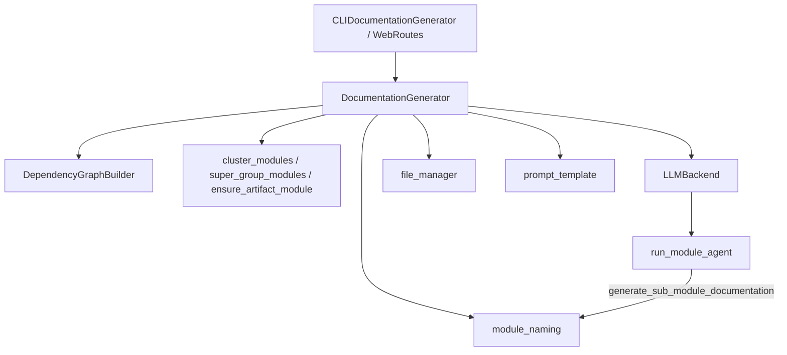
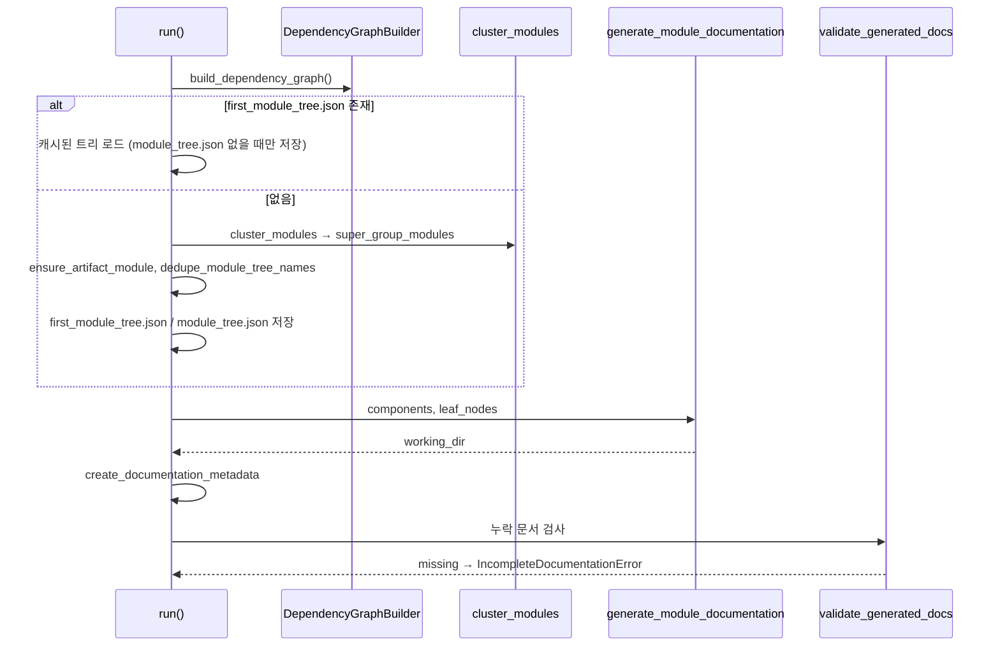
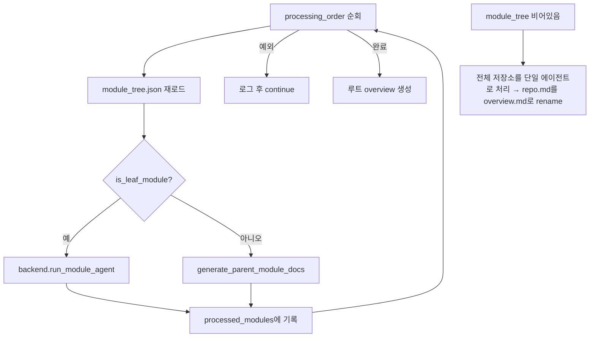
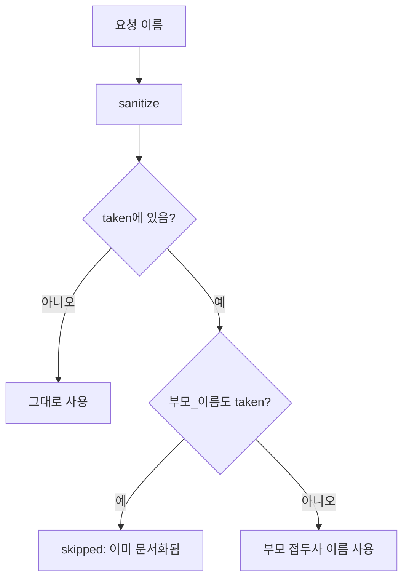

# documentation_generation 모듈

`documentation_generation`은 CodeWiki의 **문서 생성 오케스트레이터**다. 의존성 그래프 → 모듈 클러스터링 → 리프/부모 모듈 문서 → 저장소 개요(`overview.md`) → 메타데이터 및 검증까지의 전체 흐름을 조율한다. 실제 LLM 호출은 [llm_backends](llm_backends.md)에 위임하고, 이 모듈은 순서·재개(resume)·이름 충돌 방지·완결성 검증을 책임진다.

구성 파일:
- `codewiki/src/be/documentation_generator.py`: `DocumentationGenerator`, `IncompleteDocumentationError`
- `codewiki/src/be/module_naming.py`: `SubModulePlan` 및 이름 정규화/해결 유틸리티

## 1. 아키텍처



| 협력 모듈 | 역할 |
|---|---|
| [dependency_analysis_core](dependency_analysis_core.md) | `DependencyGraphBuilder.build_dependency_graph()`로 `components`, `leaf_nodes` 제공 |
| [llm_backends](llm_backends.md) | `LLMBackend.run_module_agent`, `complete` 제공 (`get_backend(config)`로 선택) |
| [agent_tools](agent_tools.md) | 에이전트가 하위 모듈을 만들 때 `module_naming`을 사용 |
| [incremental_updater](incremental_updater.md) | `--update` 시 무효화된 문서를 다시 생성하기 위해 이 생성기를 재사용 |
| [shared_config_utils](shared_config_utils.md) | `Config`, `file_manager`, 파일명 상수(`MODULE_TREE_FILENAME` 등) |
| [cli_core](cli_core.md) | `CLIDocumentationGenerator`가 이 클래스를 호출 |

## 2. DocumentationGenerator

### 2.1 `run()` 실행 흐름



핵심 설계 포인트 (코드 확인):
- **재개 안전성**: 캐시된 `first_module_tree.json`이 있어도 기존 `module_tree.json`은 덮어쓰지 않는다. 이전 실행에서 에이전트가 삽입한 하위 모듈이 유지되어야 하기 때문이다.
- **클러스터링 모델 분리**: `config.cluster_model`을 `backend.complete(p, model=...)`에 바인딩한다. 비어 있으면 백엔드 기본 모델을 쓴다.
- **아티팩트 모듈 보장**: `artifacts_enabled`이면 `ensure_artifact_module`로 빌드/CI/설정 파일이 LLM 판단과 무관하게 한 모듈에 포함된다.
- **중복 제거는 새 트리에만**: `dedupe_module_tree_names`는 새로 클러스터링된 트리에만 적용한다. 이미 `.md`가 있는 키를 바꾸면 문서가 고아가 되기 때문이다.

### 2.2 `generate_module_documentation()`

`get_processing_order()`가 후위 순회(자식 먼저, 부모 나중)로 `(path, name)` 목록을 만든다. 각 항목마다 `module_tree.json`을 다시 읽어(에이전트가 트리를 수정했을 수 있음) 다음을 수행한다.



- 순서는 `first_module_tree.json`이 아니라 `module_tree.json` 기준이다. `--update`가 에이전트 삽입 모듈을 무효화하므로, 첫 트리를 기준으로 하면 해당 모듈을 건너뛰어 `IncompleteDocumentationError`로 끝난다.
- 한 모듈의 실패는 전체를 중단하지 않는다(`continue`). 최종 누락은 검증 단계에서 잡힌다.
- 이미 `.md`가 있으면 에이전트/부모 생성에서 단락되므로 재개 시 LLM 비용이 들지 않는다.
- 트리가 비어 있으면 **전체 저장소 모드**로 동작한다: 리프 노드 전체를 한 번에 `run_module_agent`에 넘기고 결과 트리를 저장한다.

### 2.3 `generate_parent_module_docs()`

1. `module_path == []`이면 루트 `overview.md`, 아니면 `{module_name}.md`를 대상으로 한다. 이미 존재하면 반환한다.
2. `build_overview_structure()`로 트리를 복사하고 `components`를 제거(`_strip_components`)한 뒤, 1단계 자식에 `docs_path`(파일 경로)를 붙이고 대상에 `is_target_for_overview_generation`을 표시한다. 문서 본문을 인라인하지 않는 이유는 대형 저장소에서 프로바이더 입력 상한(코덱스 1,048,576자)을 초과하기 때문이다. 개요 에이전트가 파일을 직접 읽는다.
3. `MODULE_OVERVIEW_PROMPT` 또는 `REPO_OVERVIEW_PROMPT`를 구성하고, 루트이면 `render_artifact_index(components)` 결과를 `REPO_OVERVIEW_ARTIFACT_ADDENDUM`으로 덧붙인다.
4. `backend.complete()` 호출 후 `<OVERVIEW>…</OVERVIEW>`를 파싱한다. 구독형 CLI 백엔드(claude-code/codex)가 래퍼를 무시하면 원문을 그대로 저장한다. 빈 응답은 `RuntimeError`.

### 2.4 메타데이터와 검증

- `create_documentation_metadata()`: `metadata.json`에 타임스탬프, `main_model`, `generator_version`, `commit_id`, 컴포넌트/리프 통계, 생성된 `.md` 목록을 기록한다(파일 나열은 best-effort).
- `validate_generated_docs()`: `find_missing_module_docs`로 트리와 디스크를 대조한다.
- `IncompleteDocumentationError(missing_modules)`: 누락 모듈이 있으면 `run()`이 발생시킨다(이슈 #76). CLI 쪽 처리는 [cli_utils](cli_utils.md)의 `IncompleteGenerationError`와 연결된다.

## 3. module_naming

모든 모듈 문서는 하나의 평면 디렉터리에 `{module_name}.md`로 저장되며, 트리 키는 파일명 stem과 같아야 한다(HTML 뷰어와 `--update` 무효화가 의존). LLM이 이름을 자유롭게 짓기 때문에 삽입 전에 충돌을 해소한다.

| 함수 | 설명 |
|---|---|
| `sanitize_module_name` | 안전하지 않은 문자를 `_`로, 공백을 `_`로 바꾸고 양끝 `._` 제거. 대소문자 유지, 빈 결과는 `module` |
| `collect_module_tree_names` | 모든 깊이의 이름 집합 |
| `resolve_unique_name` | 충돌 시 `부모_이름` → 그래도 충돌하면 숫자 접미사 `_2`, `_3`… |
| `normalize_sub_module_specs` | 요청 이름 → 최종 이름 매핑 (트리, 디스크 `.md`, 예약어, 같은 배치 내 이름 회피) |
| `plan_sub_module_specs` → `SubModulePlan` | 생성할 항목(`name_map`)과 건너뛸 항목(`skipped`) 결정 |
| `dedupe_module_tree_names` | 새 클러스터링 트리 전체를 정규화·유일화 |
| `resolve_module_doc_path` | 공백→`_`/`-`/제거, 소문자 변형을 시도해 실제 `.md` 경로 탐색 |
| `find_missing_module_docs` | 문서가 없는 모듈명 목록(+ `overview`) |

예약 stem: `overview`, `module_tree`, `first_module_tree`, `metadata`, `index`.

### SubModulePlan

```python
@dataclass
class SubModulePlan:
    name_map: Dict[str, str]   # 요청 이름 -> 생성할 최종 stem
    skipped: Dict[str, str]    # 요청 이름 -> 건너뛴 이유
```

`plan_sub_module_specs`는 `normalize_sub_module_specs`와 달리 **숫자 접미사를 붙이지 않는다**. 원래 이름과 부모 접두사 이름이 모두 이미 존재하면 "이미 문서화됨"으로 보고 `skipped`에 넣는다. 에이전트가 같은 모듈을 `x_2`, `x_3`…로 끝없이 재생성하던 문제(이슈 #113)를 막기 위한 것이다.



## 4. 유의사항

- `resolve_module_doc_path`는 소문자 변형까지만 시도한다. 그 외 임의 변형은 누락으로 판정된다.
- `_resolve_child_docs_path`는 `resolve_module_doc_path`의 얇은 래퍼다.
- 모듈 단위 예외는 로그만 남기고 진행하므로, 완결성은 마지막 `validate_generated_docs`가 유일한 보증이다.
- 관련 구성 값(`docs_dir`, `max_depth`, `max_token_per_module`, `cluster_model`)은 [shared_config_utils](shared_config_utils.md)를 참고한다.
