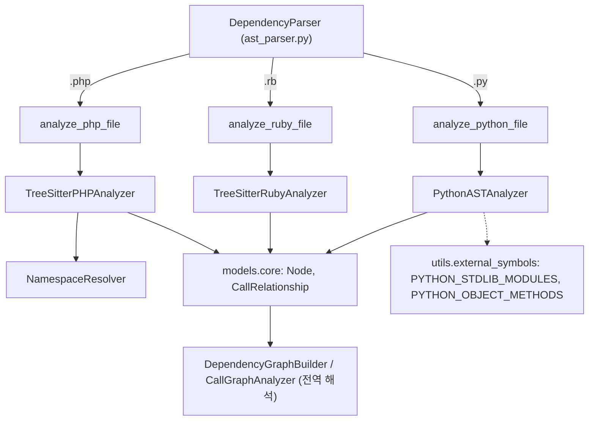
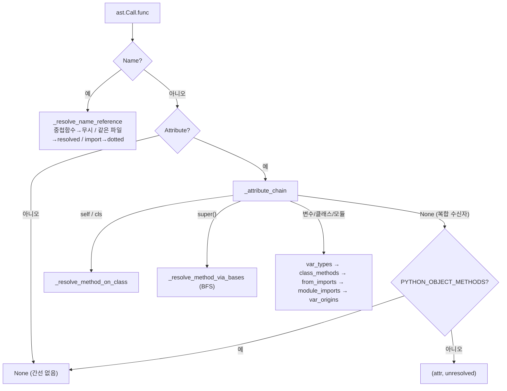
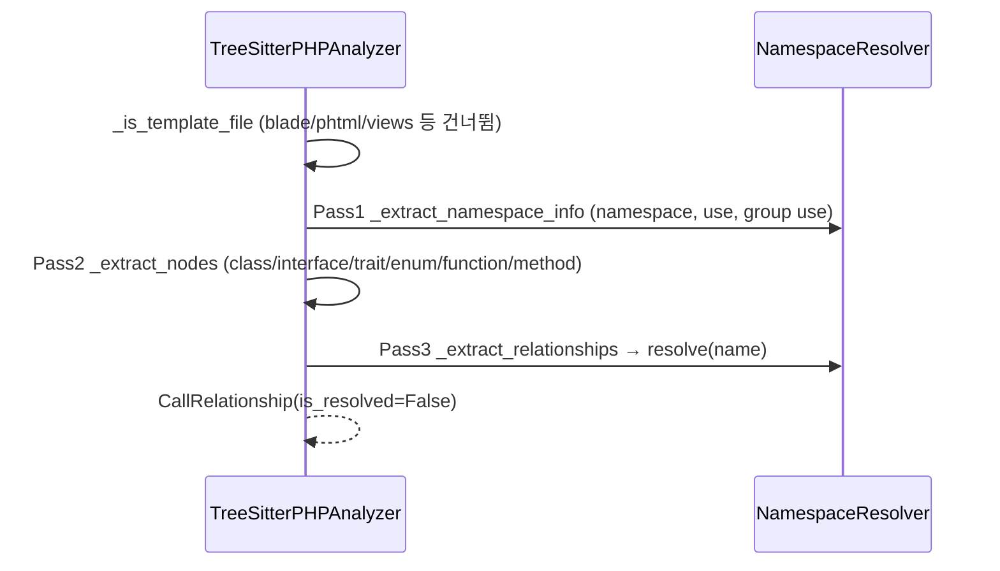

# dynamic_language_analyzers 모듈

## 1. 소개

`dynamic_language_analyzers`는 동적 타입 언어인 **Python, Ruby, PHP** 소스 파일을 정적 분석하여 코드 컴포넌트(`Node`)와 컴포넌트 간 의존 관계(`CallRelationship`)를 추출하는 언어별 분석기 묶음입니다. 상위 모듈 [language_analyzers](language_analyzers.md)의 하위 모듈이며, 전체 분석 파이프라인([Code_Analysis_Pipeline](Code_Analysis_Pipeline.md), [dependency_analysis_core](dependency_analysis_core.md))에서 파일 확장자별로 호출됩니다.

| 컴포넌트 | 파일 | 파싱 방식 |
|---|---|---|
| `PythonASTAnalyzer` | `analyzers/python.py` | 표준 라이브러리 `ast` (`ast.NodeVisitor`) |
| `TreeSitterRubyAnalyzer` | `analyzers/ruby.py` | `tree_sitter_ruby` |
| `TreeSitterPHPAnalyzer`, `NamespaceResolver` | `analyzers/php.py` | `tree_sitter_php` |

동적 언어는 타입 정보가 없어 호출 대상을 확정하기 어렵습니다. 이 모듈의 공통 전략은 다음과 같습니다.

- **같은 파일 안에서 확정 가능한 호출**은 컴포넌트 ID(`<relative_path>::<name>`)로 해석하고 `is_resolved=True`로 표시합니다.
- **확정 불가능한 호출**은 점(`.`)으로 구분한 이름 그대로 `is_resolved=False`로 내보내고, 이후 전역 리졸버(`DependencyGraphBuilder` 등, [dependency_analysis_core](dependency_analysis_core.md))가 이름 인덱스와 매칭합니다.
- **내장/표준 라이브러리 호출**은 노이즈이므로 가능한 한 버립니다.

## 2. 아키텍처

각 분석기는 진입 함수(`analyze_*_file`)를 통해 생성·실행되며, 결과로 `(nodes, call_relationships)`를 반환합니다. Python만 세 번째 반환값으로 서드파티 import 루트 집합(`external_import_roots`)을 추가로 돌려줍니다.

## 3. 컴포넌트 상세

### 3.1 PythonASTAnalyzer (`python.py`)

`ast.NodeVisitor`를 상속하며 한 번의 트리 순회로 노드와 관계를 동시에 수집합니다.

**생성자 입력**: `file_path`, `content`, `repo_path`, `project_modules`(레포 내 모든 Python 파일의 dotted 모듈 경로. import가 프로젝트 내부인지 판별).

**내부 상태**

| 상태 | 역할 |
|---|---|
| `scope_stack` / `component_stack` | 현재 클래스·함수 스코프와 호출자 귀속용 컴포넌트 ID |
| `top_level_nodes` | 같은 파일의 최상위 함수·클래스(이름 → `Node`) |
| `class_methods`, `class_bases` | 클래스별 메서드 표와 상속 목록 (`"Outer.Inner"` 키) |
| `module_imports`, `from_imports` | 로컬 별칭 → 정식 dotted 대상 |
| `var_types`, `var_origins` | 얕은 수신자 추론: 변수 → 같은 파일 클래스 / 변수 → 출처 표현식 |
| `local_function_names` | 함수 내부 중첩 함수 이름 (호출 시 간선 생략) |
| `external_import_roots` | stdlib 제외, 프로젝트 외부 import 루트 |

**컴포넌트 추출 규칙**
- 최상위 함수 → `function`, 클래스 본문 안 함수 → `method`, 클래스 → `class`. ID는 `relative_path::dotted_name`.
- 함수 내부에 정의된 클래스·함수는 컴포넌트로 만들지 않고, 호출만 바깥 컴포넌트에 귀속합니다.
- 이름이 `_test_`로 시작하는 함수는 제외(`_should_include_function`).
- 클래스의 base class는 이름 해석 후 `CallRelationship`(클래스 → base)으로 기록합니다.

**호출 분류 (`_classify_call`)**

- `self.x()`/`cls.x()`는 현재 클래스 메서드 표를 먼저 보고, 없으면 `_resolve_method_via_bases`가 같은 파일 상속 체인을 BFS로 탐색합니다. import된 base면 `"<base dotted>.<method>"`를 unresolved로 내보냅니다.
- `x = SomeClass()` 같은 대입은 `_track_assignment`가 `var_types`/`var_origins`에 기록해 `x.method()`를 해석하는 데 씁니다(단일 이름 대상, 호출 값만 처리).
- 상대 import(`from . import x`)는 `_get_module_path()`로 패키지 경로를 계산해 절대 경로로 변환합니다.
- `is_project_import`/`_dotted_contains`는 `src/` 레이아웃처럼 import 루트와 레포 루트가 다른 경우를 허용하기 위해 점 경계 포함 검사를 사용합니다.
- `analyze()`는 `SyntaxWarning`을 억제하고, `SyntaxError`는 경고 로그, 그 외 예외는 에러 로그로 처리해 한 파일의 실패가 전체 분석을 막지 않게 합니다.

### 3.2 TreeSitterRubyAnalyzer (`ruby.py`)

생성자에서 곧바로 `_analyze()`를 실행하는 2-패스 구조입니다.

1. **Pass 1 `_extract_nodes`**: `class`/`module`/`method`/`singleton_method`를 재귀 순회. `class << self`는 현재 스코프 유지, `def self.foo`나 `def Const.foo`는 소유자 스코프로 매핑합니다. 앞선 `comment`를 docstring으로 채택합니다. `initialize`는 호출 해석용 심볼 테이블(`top_level_nodes`)에만 등록하고 `nodes`에는 넣지 않습니다.
2. **Pass 2 `_extract_relationships`**: 호출자(caller)를 논리 이름으로 유지하며 `call` 노드를 `_extract_call`로 분류합니다.

**호출 처리 규칙 (`_extract_call`)**

| 형태 | 처리 |
|---|---|
| `include/extend/prepend Foo` | mixin 간선 |
| `require_relative "a/b"` | basename 기준 unresolved 간선 (일반 `require`는 `RUBY_CORE_METHODS`로 제거) |
| 수신자 없음 / `self` | `_add_relationship`: `Owner.name` → `name` → bare name 순으로 같은 파일 심볼 테이블 조회 |
| `Const.new` | 클래스 자체로의 간선 |
| `Const.method` | 같은 파일이면 resolved, 아니면 `Const.method` unresolved |
| `var.method` | `_receiver_class`가 메서드 내 `var = Const.new` 대입을 찾아 클래스 추론 |
| 복합 수신자 | core 메서드가 아니면 bare method name만 unresolved |

`RUBY_CORE_METHODS`(Kernel/Enumerable/String/DSL 등)와 `RUBY_BUILTIN_CONSTANTS`(Array, File, JSON…)는 프로젝트 컴포넌트를 가리킬 수 없는 호출을 걸러냅니다. `_add_relationship_raw`는 `(caller, callee, line)` 중복과 자기 참조를 제거합니다. 재귀 깊이는 `MAX_RECURSION_DEPTH = 100`으로 제한됩니다.

### 3.3 TreeSitterPHPAnalyzer / NamespaceResolver (`php.py`)

**NamespaceResolver**: `namespace`와 `use` 문(별칭 포함)을 기억하고 `resolve(name)`으로 정규화합니다. 우선순위는 ① 선행 `\`는 완전 정규화 ② `use_map` 별칭 ③ 첫 세그먼트가 별칭인 부분 한정 이름 ④ 현재 namespace 접두 부여입니다.

**TreeSitterPHPAnalyzer**: 3-패스로 동작합니다.

- 노드 타입: `class`, `abstract class`, `interface`, `trait`, `enum`, `function`, `method`(`Class.method`). PHPDoc(`/** */`)를 docstring으로 추출합니다.
- 관계 종류: `use` 선언(파일 → FQN), `extends`, `implements`, `new`, 정적 호출(`::`), PHP 8 생성자 프로퍼티 프로모션 타입.
- 모든 관계는 `\`를 `.`로 바꾼 FQN을 callee로 하고 `is_resolved=False`입니다. 즉 실제 매칭은 전역 리졸버의 몫입니다.
- `PHP_PRIMITIVES`(스칼라 타입, `self/static/parent`, `Exception`, `DateTime` 등)는 `_is_primitive`로 제외합니다.
- 템플릿 파일(`.blade.php`, `.phtml`, `.twig.php`, `views/`·`templates/` 디렉터리)은 분석하지 않습니다.

## 4. 공통 규약과 비교

| 항목 | Python | Ruby | PHP |
|---|---|---|---|
| 파서 | `ast` | tree-sitter | tree-sitter |
| 패스 수 | 1 (visitor) | 2 | 3 |
| 같은 파일 resolved 간선 | 예 | 예 | 아니오(전부 unresolved) |
| 수신자 타입 추론 | `var_types`, `var_origins` | `X = Const.new` 탐색 | 없음 |
| 노이즈 필터 | stdlib / object methods | core methods / constants | primitives / built-in 클래스 |
| `qualified_name` 설정 | 예 | 예 | 아니오 |
| 실패 처리 | 로그 후 빈 결과 | 로그 후 빈 결과 | 로그 후 빈 결과 |

## 5. 유의점 / 한계

- Python은 `import *`를 무시하고, 다단계 속성 체인의 타입은 추론하지 않습니다(`var_types` 기반 다단 접근은 unresolved 처리).
- Ruby의 `RUBY_CORE_METHODS`는 `find`, `first` 등 흔한 이름을 포함하므로, 같은 이름의 프로젝트 메서드 호출이 누락될 수 있습니다(보수적 필터).
- PHP는 클래스 단위(`_get_component_id(containing_class)`)로 관계를 귀속하므로 메서드 수준 호출 그래프는 제공하지 않습니다.
- PHP는 다른 파일 심볼과의 결합이 전역 해석 단계에서만 이루어집니다. `NamespaceResolver`는 이름을 FQN으로 정규화할 뿐입니다.

## 6. 관련 문서

- [language_analyzers](language_analyzers.md): 상위 모듈, 언어별 분석기 전체 구성
- [js_ts_analyzers](js_ts_analyzers.md), [jvm_and_managed_analyzers](jvm_and_managed_analyzers.md), [c_family_analyzers](c_family_analyzers.md): 형제 분석기
- [dependency_analysis_core](dependency_analysis_core.md): `DependencyParser`, `DependencyGraphBuilder`, `Node`/`CallRelationship` 모델과 전역 해석
