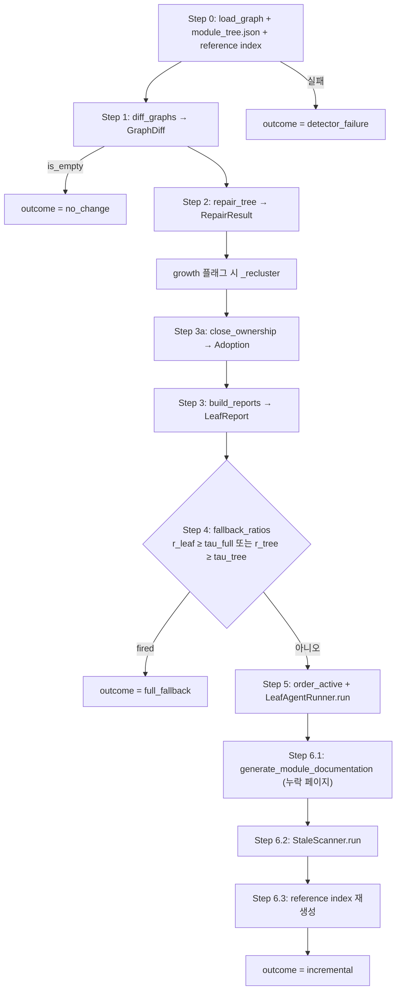
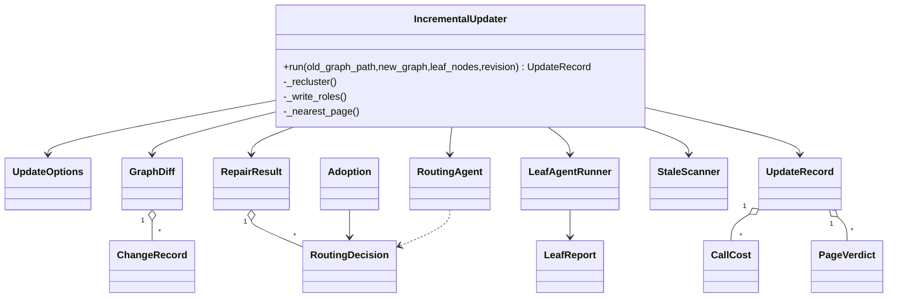
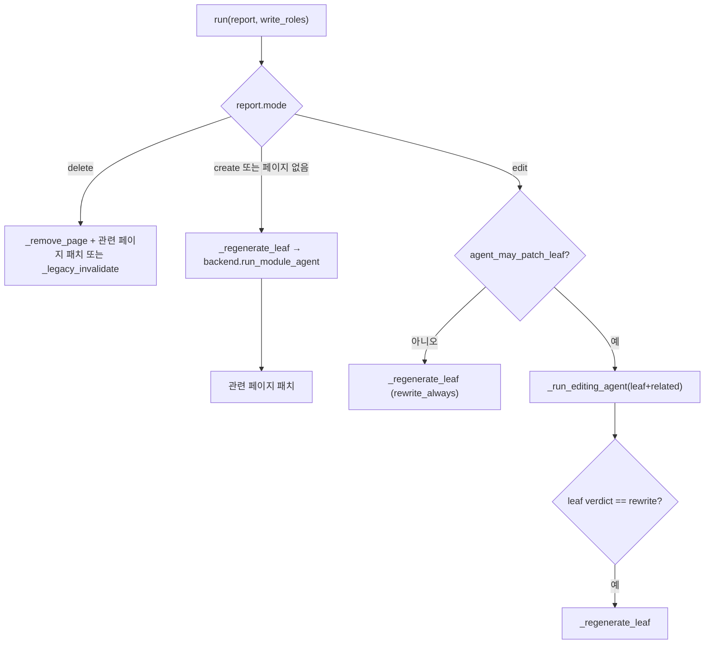

# incremental_updater 모듈

`incremental_updater`(`codewiki/src/be/updater/`)는 이전 빌드가 남긴 문서 디렉터리를 **전체 재생성 없이** 코드 변경분만 반영해 갱신하는 모듈입니다. 이전/신규 의존성 그래프를 컴포넌트 단위로 비교하고, 모듈 트리를 보수하고, 영향받은 리프(leaf)에만 LLM 편집 에이전트를 실행하며, 모든 결정을 하나의 `UpdateRecord`(`update_record.json`)로 남깁니다.

관련 모듈:
- [LLM_Documentation_Generation_Engine](LLM_Documentation_Generation_Engine.md): 상위 모듈. `DocumentationGenerator`가 이 모듈을 호출하고, 누락 페이지를 생성합니다.
- [llm_backends](llm_backends.md): `LLMBackend`(`run_update_agent`, `run_module_agent`, `complete`) 구현.
- [agent_tools](agent_tools.md): `CodeWikiDeps`(`allowed_write_paths`로 쓰기 범위 제한).
- [dependency_analysis_core](dependency_analysis_core.md): `Node` 그래프 모델 제공.
- [shared_config_utils](shared_config_utils.md): `Config`, `file_manager`.

> 참고: `tree.py`, `pages.py`, `prompts.py`, `verdicts.py`, `graph_store.py`, `reference_index.py`는 이 모듈의 패키지에 속하지만 제공된 핵심 컴포넌트에는 포함되지 않았습니다. 아래에서는 호출 관계만 언급하며 내부 구현은 검증하지 않았습니다(미확인).

## 1. 전체 파이프라인 (Step 0~6)

`IncrementalUpdater.run()` → `_run()`이 순서대로 실행합니다.

결과 `outcome` 값(`record.py`): `no_change`, `incremental`, `full_fallback`, `detector_failure`. 마지막 둘은 호출자가 전체 빌드로 되돌아가야 함을 뜻합니다(`logger.warning`에 "falling back to a full build"로 명시; 실제 전체 빌드 전환 코드는 호출자 쪽이며 이 문서 범위 밖).

## 2. 컴포넌트

### 2.1 `UpdateOptions` (`options.py`)
모든 임계값과 ablation rung(`"0","1","2","3","3b"`)을 한 dataclass에 모읍니다. `from_rung()`이 프리셋을 적용하고 `overrides`(None은 무시, 알 수 없는 키는 `ValueError`)를 반영합니다.

| 필드 | 기본값 | 의미 |
|---|---|---|
| `tau_ren` | 0.95 | 삭제+추가 쌍을 rename으로 볼 본문 유사도 |
| `max_diff_tokens` | 8000 | 컴포넌트당 diff 상한 |
| `tau_nb` | 0.5 | 이웃 다수결 라우팅 최소 비율 (rule 3) |
| `tau_grow` | 0.33 | 신규 컴포넌트 비율이 넘으면 재클러스터링 플래그 |
| `k_hop` | 1 | Up 계산 시 따라갈 의존성 홉 수 |
| `tau_full` | 0.5 | 활성 리프 / 전체 리프 |
| `tau_tree` | 0.3 | (생성+삭제+재클러스터) / 전체 리프 |
| `use_*`, `agent_*` | True | rung에 의해 파생되는 토글 |

Rung 요약(코드 확인): rung 1은 라우팅 에이전트·성장 재클러스터·Up·리프 패치·관련 페이지 패치·stale scan·소유권 폐포를 모두 끕니다. rung 2는 `agent_may_patch_leaf=False`(리프 페이지 항상 재작성). rung 3b는 `k_hop=2`. rung 0은 레거시(`is_legacy`)이며 이 패키지가 처리하지 않습니다.

### 2.2 Step 1 — `GraphDiff` / `ChangeRecord` (`graph_diff.py`)
컴포넌트 id(`path::name`)로 조인하여 분류합니다.

- `added`/`deleted`: id 집합 차이.
- `interface`: 시그니처 `(name, parameters, base_classes)` 변경.
- `body`: 공백 정규화 SHA-1 해시 변경.
- `edge`: `depends_on`만 변경.
- `renamed`: deleted×added 중 같은 `component_type`이고 토큰 유사도 ≥ `tau_ren`인 쌍을 그리디 최적 매칭(길이 비율 사전 필터 포함). 시그니처가 함께 바뀌면 `interface`에도 추가됩니다.

각 `ChangeRecord`에는 `truncate_to_tokens`로 잘린 unified diff(앞/뒤 절반 유지, `DIFF_TRUNCATED_MARKER`), 추가/삭제된 edge가 담깁니다. `GraphDiff.changed_ids`는 rename의 신규 id를 포함한 전체 변경 집합입니다.

### 2.3 Step 2 — `RepairResult` / `RoutingDecision` (`tree_repair.py`)
`repair_tree()`는 트리의 **복사본**을 다음 순서로 수정합니다: rename 제자리 치환 → 삭제 컴포넌트 제거 후 빈 노드 `prune_empty` → 추가 컴포넌트 라우팅 → 고아(orphan)를 rule 4로 위임 → entered/left 및 성장률 계산.

라우팅 규칙(`route_by_rules`):

| 규칙 | 상수 | 조건 |
|---|---|---|
| 1 | `RULE_SAME_FILE` | 같은 파일의 추적 컴포넌트가 이미 있는 리프 |
| 2 | `RULE_SAME_DIR` | 같은 디렉터리가 리프 하나에만 속함 |
| 3 | `RULE_NEIGHBOR` | 이웃 다수결 비율 ≥ `tau_nb` |
| 4 | `RULE_AGENT` | `OrphanRouter` 콜러블(`RoutingAgent`) |
| - | `RULE_UNTRACKED` | 신규 빌드에서 선택되지 않은 노드 |

성장 검사는 리프만 **플래그**(`growth_flagged`, 신규 생성 리프 제외)하며, 실제 재클러스터링은 오케스트레이터가 수행합니다(LLM 필요).

### 2.4 Step 3a — `Adoption` (`ownership.py`)
모듈 트리는 코드 그래프의 일부만 추적하므로 추적되지 않는 변경 컴포넌트는 소유 리프가 없어 누락될 수 있습니다. `close_ownership()`은 Step 2의 규칙 1~3(및 옵션에 따라 rule 4 에이전트)을 재사용해 **유효 소유자(effective owner)**를 부여합니다. 리프를 활성화하기 위한 용도일 뿐 트리는 변경하지 않으며 매 단계 재계산됩니다. 삭제된 미추적 컴포넌트는 이전 그래프/소유자 맵으로 판정하고, 에이전트가 새 리프를 만들라고 답해도 무시합니다.

### 2.5 Step 3 — `LeafReport` (`change_report.py`)
`build_reports()`가 새 트리의 모든 unit과 삭제된 리프에 대해 리포트를 만듭니다.

| 필드 | 의미 |
|---|---|
| `own` (+`adopted`) | 이 리프가 소유한 변경 컴포넌트 (rename의 old id 포함) |
| `up` | 인터페이스/삭제/rename된 컴포넌트를 `k_hop` 이내에서 사용하는 이 리프의 코드 |
| `context` | 주변의 미추적 변경(정보용; 단독으로는 리프를 활성화하지 않음) |
| `refch` | 이 리프 페이지가 참조하는 id/링크/이름 중 변경·소멸된 것 (`ref_index` 기반; 이름 언급은 계약이 바뀐 경우만) |
| `entered`/`left`, `children_added`/`children_removed`, `reclustered` | 트리 변경 |
| `mode` | `edit` / `create` / `delete` |

`is_empty`가 아니거나 `mode != edit`이면 **활성(active)** 입니다(`active_set`). `order_active()`는 "A가 B를 쓰면 B 먼저"인 위상 정렬이며, 사이클·동률은 트리 pre-order로 끊고 삭제 리프는 뒤로 보냅니다. `fallback_ratios()`는 `r_leaf`, `r_tree` 등을 계산합니다.

### 2.6 Step 4 — 폴백 판정
`r_leaf ≥ tau_full` 또는 `r_tree ≥ tau_tree`이면 `full_fallback`. 이때 트리는 디스크에 저장되지 않습니다. **whole-repo 모드**(`module_tree.json`이 빈 dict)에서는 단일 가상 리프(`P.OVERVIEW_STEM`)가 항상 100% 활성이므로 대신 `get_clustering_input_token_count`가 `config.max_token_per_module` 이하인지로 판정합니다(이슈 #113 주석).

### 2.7 Step 5 — `LeafAgentRunner` (`leaf_agent.py`)
활성 리프마다 순차 실행합니다. 쓰기 가능 페이지 집합(write set)은 `IncrementalUpdater._write_roles()`가 역할별로 계산합니다: `leaf`, `ancestor`(조상 + overview), `dependent`(리프 의존 관계), `referrer`(참조 역인덱스). 존재하는 페이지만, 삭제 예정 노드는 제외합니다.

`_run_editing_agent()`는 `CodeWikiDeps.allowed_write_paths`로 쓰기를 제한하고, 실행 전후 `page_hashes`를 비교해 실제 변경을 확인합니다.
- 에이전트 판정(`parse_verdicts`)과 디스크 상태를 조정: 판정 없음 → 변경 시 `patch`, 아니면 `no-op`; `no-op`인데 디스크가 바뀌었으면 `patch`로 승격.
- write set 밖 페이지가 변경되면 `write_set_violations`에 기록하고 오류 로그.
- 예외는 `CallCost.error`로 기록하고 계속 진행합니다.

`_legacy_invalidate`는 rung 1 동작: `ancestor` 페이지만 삭제하고 나중에 재생성합니다.

### 2.8 `RoutingAgent` (`routing.py`)
rule 4용 단발 LLM 호출(`backend.complete`). 트리 개요(각 페이지 첫 문장 요약 포함), 고아 목록, 이웃 리프 이름을 프롬프트로 만들고 JSON 블록(`parse_json_block`)을 `RoutingDecision`으로 변환합니다. 액션: `place`(기존 리프만 허용, 부모 노드면 미추적 유지), `create`(새 리프; ownership 목적에서는 금지), 그 외는 미추적. 호출 실패 시 오류만 기록하고 고아는 미추적으로 남습니다.

### 2.9 Step 6 — 후처리와 `StaleScanner` (`stale_scan.py`)
1. 6.1: `doc_generator.generate_module_documentation`이 아직 없는 페이지(새 부모, 재클러스터된 서브트리, 루트)를 생성.
2. 6.2: 이번 라운드에 쓰이지 않은 페이지를 훑어 `find_stale_items`로 rename/삭제된 id·백틱 이름(전역 유일한 이름만)·제거된 페이지로의 `.md` 링크를 찾고, 있으면 `run_update_agent`(`STALE_FIX_SYSTEM_PROMPT`, 해당 페이지만 쓰기 허용)로 수정. 링크 대체 페이지는 `_nearest_page`(가장 가까운 살아있는 조상, 없으면 overview).
3. 6.3: 참조 인덱스를 다시 만들어 저장.

### 2.10 `UpdateRecord` (`record.py`)
한 번의 갱신에서 내린 모든 결정(diff, repair, ownership, reports, active, write_sets, fallback, verdicts, pages_written/removed, write_set_violations, stale_scan, calls, errors …)을 담습니다. `run()`의 `finally`에서 `wall_seconds`, `finished_at`을 채우고 `update_record.json`으로 저장합니다(`OSError`는 로그만). `summary()`는 토큰 사용량 합계와 채택/에이전트 채택 수 등을 요약하고, `merge_into_metadata()`가 `metadata.json`의 `last_update`와 `update_history`에 추가합니다(호출자가 metadata를 재작성한 경우 `prior_history`로 복원).

`CallCost.kind` 값: `leaf_agent | rewrite | create | routing | stale_fix | missing_pages | recluster`. `PageVerdict.verdict`: `no-op | patch | rewrite | create | delete`.

## 3. 오류 처리 원칙
- 이전 상태 로드 실패는 크래시가 아니라 `detector_failure` 결과.
- 재클러스터·라우팅·리프 에이전트·stale fix의 실패는 각각 기록 후 계속 진행(한 리프 실패가 전체를 중단하지 않음).
- 재클러스터 실패 시 해당 서브트리는 그대로 두고 페이지 삭제를 건너뜁니다.

## 4. 시스템 내 위치
`DocumentationGenerator`([documentation_generation](documentation_generation.md))가 신규 그래프와 `leaf_nodes`, 이전 그래프 경로를 넘겨 `IncrementalUpdater.run()`을 호출합니다. LLM 작업은 [llm_backends](llm_backends.md)의 `LLMBackend`에 위임되고, 클러스터링은 `cluster_modules`를 재사용합니다. 진입 경로(CLI 옵션 등)는 [cli_core](cli_core.md) 쪽에서 확인해야 하며 여기서는 검증하지 않았습니다(미확인).

검증 수준: 위 내용은 제공된 소스 코드 기준 **코드 확인**이며, 실행 확인은 하지 않았습니다.
