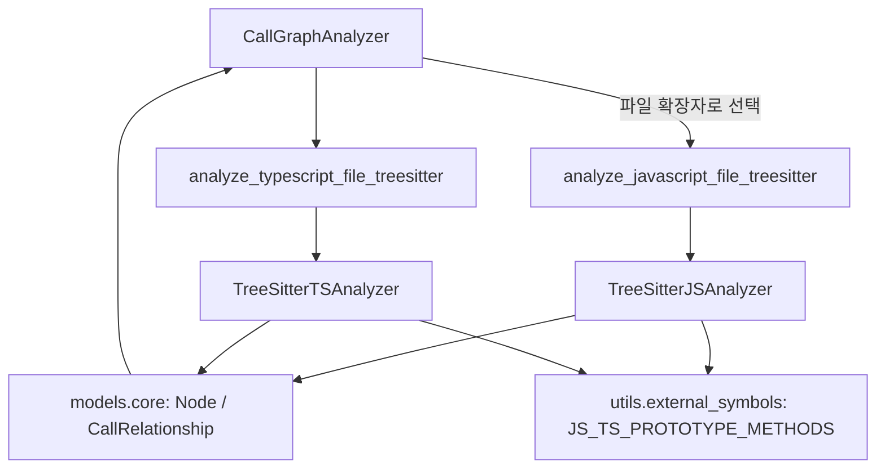

# js_ts_analyzers 모듈

## 개요

`js_ts_analyzers`는 JavaScript / TypeScript 소스 파일을 tree-sitter로 파싱하여 **컴포넌트(`Node`)** 와 **호출·의존 관계(`CallRelationship`)** 를 추출하는 언어별 분석기 모듈이다. 상위 모듈 [language_analyzers](language_analyzers.md)의 하위 모듈이며, 결과는 [dependency_analysis_core](dependency_analysis_core.md)의 `CallGraphAnalyzer` / `DependencyGraphBuilder`가 취합해 전체 의존성 그래프로 만든다.

| 파일 | 핵심 컴포넌트 | tree-sitter 문법 |
|---|---|---|
| `codewiki/src/be/dependency_analyzer/analyzers/javascript.py` | `TreeSitterJSAnalyzer` | `tree_sitter_javascript.language()` |
| `codewiki/src/be/dependency_analyzer/analyzers/typescript.py` | `TreeSitterTSAnalyzer` | `tree_sitter_typescript.language_typescript()` |

두 파일 모두 진입 함수(`analyze_javascript_file_treesitter`, `analyze_typescript_file_treesitter`)를 제공하며 `(nodes, call_relationships)` 튜플을 반환한다. 예외 발생 시 빈 리스트 `([], [])`를 반환하므로 한 파일의 실패가 전체 분석을 중단시키지 않는다. 두 분석기가 작고 서로 유사한 구조라서 별도 하위 모듈 문서로 나누지 않고 이 문서에서 함께 설명한다.

## 아키텍처

### 공통 규약

- **컴포넌트 ID**: `<repo 상대경로>::<이름>` (메서드는 JS에서 `<경로>::<Class>.<method>`).
- **해결(resolved) 규칙**: 같은 파일의 top-level 컴포넌트로 확인되면 `is_resolved=True`이고 callee는 컴포넌트 ID가 된다. 해결 못 하면 파일 경로 접두어 없는 **논리 이름(bare name)** 으로 남겨 두어 상위의 전역 resolver가 처리한다.
- **수신자(receiver) 우선 해석**: `this`/`super`는 둘러싼 클래스와 그 base class에서, `new X()`로 초기화된 지역 변수는 해당 클래스에서 메서드를 찾는다.
- **내장 메서드 필터**: 리터럴·복합식 수신자에 대한 호출이 `JS_TS_PROTOTYPE_METHODS`(예: `map`, `push`)에 해당하면 관계를 만들지 않는다 (프로젝트 컴포넌트로 해석될 수 없으므로).
- **파서 초기화 실패 시**: `parser=None`으로 두고 `analyze()`가 해당 파일을 건너뛴다.

## TreeSitterJSAnalyzer (`javascript.py`)

2단계 실행: `_extract_functions` → `_extract_call_relationships`.

1. **노드 추출** (`_traverse_for_functions`): class/abstract class/interface, `function_declaration`, generator, `export` 함수, `const f = () => {}` 형태의 `lexical_declaration`을 추출한다. 클래스 내부 `method_definition`과 화살표 함수 `field_definition`은 `Class.method` 이름의 `method` 노드로 만든다(`constructor`는 노드 목록에서 제외). 결과는 `start_line`으로 정렬된다.
2. **관계 추출** (`_traverse_for_calls`): 현재 top-level 컨텍스트를 추적하며
   - 클래스 상속(`class_heritage`) → 상속 관계
   - `call_expression`, `await_expression`, `new_expression` → 호출/생성 관계 (`_extract_call_from_node`)
   - JSDoc(`@param {T}`, `@returns`, `@type`, `@typedef`, `@interface`)의 타입 참조 → 타입 의존 관계 (`_parse_jsdoc_types`, 내장 타입은 `_is_builtin_type_js`로 제외)
3. **중복 제거**: `(caller, callee, call_line)` 키 기준.

## TreeSitterTSAnalyzer (`typescript.py`)

3단계 실행: 엔티티 수집 → top-level 필터링 → 관계 추출.

1. **`_extract_all_entities`**: 모든 깊이에서 function, arrow function, method, class, interface, type alias, enum, 변수, export, ambient declaration 엔티티를 dict로 수집한다.
2. **`_filter_top_level_declarations`**: `_is_actually_top_level`로 함수 본문 내부(`_is_inside_function_body`) 선언을 제외하고 `Node`로 변환한다. `variable` 타입과 `constructor`/`__proto__`/`prototype`은 제외(`_should_include_node`). 클래스는 생성자 파라미터 타입을 의존성으로 추가한다(`_extract_constructor_dependencies`).
3. **`_traverse_for_relationships`**: 호출, `new`, 타입 어노테이션, 타입 인자, `extends`/`implements` 관계를 만든다. 호출 해석은 `_extract_call_relationship` → `_member_call_parts`(receiver 종류: this/super/identifier/chain/composite/literal) → `_emit_instance_method_call` / `_emit_receiver_method_call`. 지역 변수 타입은 `_infer_identifier_type`이 `new X()` 또는 TS 타입 어노테이션에서 추론한다.
4. **중복 제거**: `(caller_id, callee_id)` 키 기준 (JS와 달리 라인 미포함).

## JS와 TS의 주요 차이

| 항목 | JS | TS |
|---|---|---|
| 추출 구조 | 트리 순회 중 즉시 `Node` 생성 | dict 엔티티 수집 후 필터링 |
| 추출 대상 | 함수, 클래스, 메서드 | + interface, type alias, enum, ambient/module |
| 타입 의존 | JSDoc 주석 정규식 | 타입 어노테이션/인자, implements |
| 메서드 노드 | `component_type="method"` | `component_type="function"`, `node_type="method"` |
| `language` 필드 | 메서드 노드에만 `"javascript"` 지정 | 모든 노드에 `"typescript"` |
| 중복 키 | caller+callee+line | caller+callee |

## 한계 (코드 확인 기반)

- 한 호출식당 최대 하나의 관계만 생성하며, 계산된 프로퍼티(`a[b]()`)나 동적 호출은 해석하지 않는다.
- import 해석은 이 모듈이 하지 않는다. 다른 파일 대상 호출은 unresolved bare name으로 남는다.
- `TreeSitterJSAnalyzer._extract_arrow_function_from_declaration`은 선언문당 첫 번째 함수만 추출한다. JS의 `lexical_declaration` 처리는 한 선언에 여러 함수를 두면 일부를 놓칠 수 있다(코드상 첫 매치에서 return).
- `export default`의 이름 처리(`"default"`)는 `function (` 문자열 매칭에 의존하는 휴리스틱이다.
