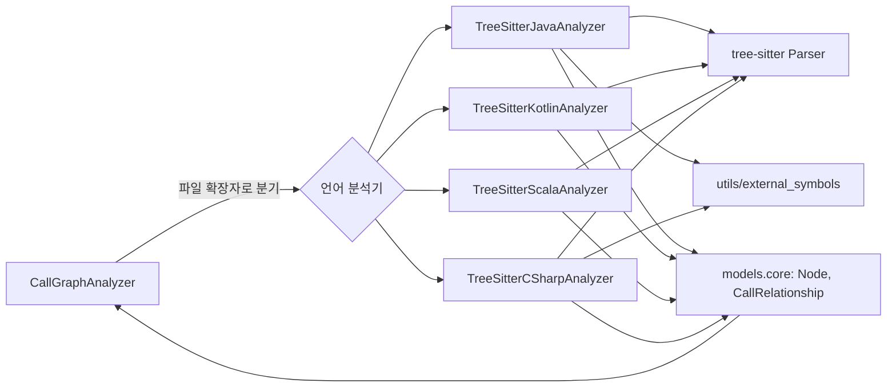
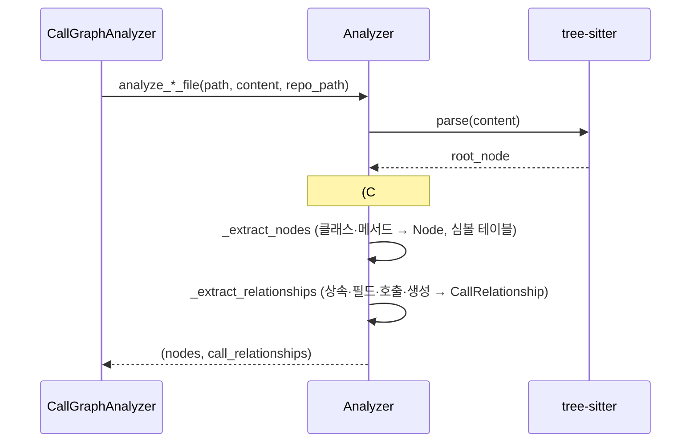

# jvm_and_managed_analyzers 모듈

## 1. 개요

`jvm_and_managed_analyzers`는 JVM 및 .NET 계열(관리형 런타임) 언어의 소스 파일을 tree-sitter로 파싱해 **컴포넌트(`Node`)** 와 **의존 관계(`CallRelationship`)** 를 추출하는 언어별 분석기 묶음이다. 상위 모듈 [language_analyzers](language_analyzers.md)의 하위 모듈이며, 결과는 [dependency_analysis_core](dependency_analysis_core.md)의 `CallGraphAnalyzer` / `DependencyGraphBuilder`가 취합해 저장소 전체 그래프로 만든다.

| 언어 | 파일 | 클래스 | 진입 함수 |
|---|---|---|---|
| Java | `analyzers/java.py` | `TreeSitterJavaAnalyzer` | `analyze_java_file` |
| Kotlin | `analyzers/kotlin.py` | `TreeSitterKotlinAnalyzer` | `analyze_kotlin_file` |
| Scala | `analyzers/scala.py` | `TreeSitterScalaAnalyzer` | `analyze_scala_file` |
| C# | `analyzers/csharp.py` | `TreeSitterCSharpAnalyzer` | `analyze_csharp_file` |

같은 계열의 다른 분석기: [c_family_analyzers](c_family_analyzers.md), [js_ts_analyzers](js_ts_analyzers.md), [dynamic_language_analyzers](dynamic_language_analyzers.md), [artifact_analysis](artifact_analysis.md).

## 2. 아키텍처

모든 분석기는 동일한 계약을 따른다. 생성자 `(file_path, content, repo_path)`에서 즉시 `_analyze()`를 실행하고, 결과를 `self.nodes`, `self.call_relationships`에 담는다.

### 2단계 추출 흐름

1. **1차 패스 `_extract_nodes`**: 타입/메서드 선언을 `Node`로 만들고 `top_level_nodes` 심볼 테이블에 이름·컴포넌트 ID·정규화 이름으로 등록한다.
2. **2차 패스 `_extract_relationships`**: 상속, 인터페이스 구현, 필드/프로퍼티 타입 사용, 메서드 호출, 객체 생성을 간선으로 만든다.

컴포넌트 ID는 `<repo 상대경로>::<이름>` 형식이다(Scala는 companion object에 `$` 접미사).

## 3. 언어별 분석기

### 3.1 Java — `TreeSitterJavaAnalyzer`
- 추출 대상: `class`(abstract 구분), `interface`, `enum`, `record`, `annotation`, `method`.
- `package`/`import`는 정규식으로 읽어 `package_name`, `import_map`, `wildcard_imports`를 구성한다(static import 포함).
- **패키지 정규화 이름(`qualified_name`)** 을 `Node`에 기록해 파일 간 해석에 쓴다. 중첩 타입은 `Outer.Inner` 형태.
- 타입 해석 `_resolve_java_type`: import map → 포함 타입 중첩 → 같은 패키지 순.
- **외부 심볼 필터**: `_is_primitive_type`이 primitive와 `utils/external_symbols.is_external_symbol("java", …)`를 이용해 JDK/런타임 타입을 걸러낸다. `JAVA_OBJECT_METHODS`(`toString` 등)는 프로젝트가 재정의하지 않았다면 간선에서 제외한다.
- 제네릭 타입 파라미터(`K`, `V`)는 `_find_type_parameters`로 스코프 내에서 제외한다.
- 호출 수신자 타입은 지역 변수 → 파라미터 → 필드 순으로 `_find_variable_type`이 추정한다. 대문자로 시작하는(ALL_CAPS 제외) 수신자는 정적 호출의 타입으로 간주한다.

### 3.2 Kotlin — `TreeSitterKotlinAnalyzer`
- 추출 대상: `class`, `interface`, `abstract/data/enum/annotation class`, `object`, `function`/`method`.
- 가장 단순한 분석기로, 패키지/임포트 해석이 없다. 관계의 callee는 `_get_component_id(type)` 또는 단순 이름 문자열이며 해석은 하류 resolver에 맡긴다.
- 간선: `delegation_specifiers`(상속/구현), 프로퍼티 타입, 주 생성자 파라미터 타입, `call_expression`.
- `_is_primitive_type`은 Kotlin 기본형·표준 컬렉션 이름의 고정 집합.
- 파싱 오류는 예외를 잡아 로그만 남긴다(파일 하나가 전체 분석을 중단시키지 않음).
- 직전 주석(`line_comment`/`block_comment`)을 docstring으로 취한다.

### 3.3 Scala — `TreeSitterScalaAnalyzer`
- 추출 대상: `class`, `trait`, `object`, `package object`, Scala 3 `enum`, `def`.
- **`component_type`/`node_type` 이중 구조**: `component_type`은 파이프라인의 leaf 선택 기준(trait→`interface`, object→`class`), `node_type`/`display_name`은 실제 Scala 구성 요소를 유지한다(`_TYPE_MAPPING`).
- **companion object**는 `Foo$` 키를 써서 동일 이름 클래스와 충돌하지 않게 한다(JVM 인코딩과 유사).
- 다른 분석기와 달리 **같은 파일 내에서 해석된 간선은 `is_resolved=True`** 로 기록한다(`_resolve_candidates`). 미해석은 이름 문자열로 남긴다.
- **노이즈 필터**: `SCALA_PRIMITIVE_TYPES`, `SCALA_CORE_CALLS`(`map`, `filter`…)로 표준 라이브러리 호출을 제거한다. 중복 간선은 `seen_relationships`로 방지한다.
- curried 메서드의 모든 파라미터 그룹은 `children_by_field_name`으로 수집한다. Scala 3 trait 파라미터도 지원한다.

### 3.4 C# — `TreeSitterCSharpAnalyzer`
- Java 분석기를 이식한 것으로, 추출 대상은 `class`(static/abstract), `interface`, `struct`, `enum`, `record`(`record struct`), `delegate`, `method`.
- `using` 지시문은 AST 순회(`_extract_usings`)로 `using_namespaces`, `alias_map`, `static_usings`, file-scoped namespace를 수집한다.
- 네임스페이스는 `_namespace_for`가 file-scoped + 블록 namespace를 합성한다.
- **"먼저 해석, 나중에 필터"** 원칙: `_skip_type`은 primitive와 제네릭 파라미터만 제외한다. 프레임워크 타입은 미해석으로 내보내 cross-file resolver가 먼저 기회를 갖고, 남은 것만 하류에서 외부로 분류한다.
- `using static` 멤버 호출은 static using마다 후보 간선을 하나씩 낸다. `System.Object` 메서드(`CSHARP_OBJECT_METHODS`)는 제외한다.
- `///` XML 문서 주석을 docstring으로 수집한다.
- **알려진 한계**: 여러 파일의 partial class는 파일마다 노드가 생기고, top-level statements, `global using`의 cross-file 가시성, `new()` 암시적 생성, 튜플 타입, 체인 수신자(`a.B().C()`) 타이핑은 다루지 않는다.

## 4. 분석기 비교

| 항목 | Java | Kotlin | Scala | C# |
|---|---|---|---|---|
| 패키지/네임스페이스 정규화 | 예 | 아니오 | 아니오 | 예 |
| import/using 해석 | 예(정규식) | 아니오 | 아니오 | 예(AST) |
| `qualified_name`·`language` 기록 | 예 | 아니오 | `language`만 | 예 |
| 외부 심볼 필터 | `external_symbols` | 고정 집합 | 고정 집합 | primitive만(하류 필터) |
| 파싱 예외 처리 | 없음 | try/except | try/except | 없음 |
| 같은 파일 해석 표시(`is_resolved`) | 항상 False | 항상 False | 해석 시 True | 항상 False |

## 5. 유의점
- 분석 결과는 정적 휴리스틱이다. 타입 추론이 없으므로 `var`/`val` 추론, 체인 호출, 리플렉션은 누락될 수 있다(Kotlin·C#은 `new T()`/생성자 호출 초기화 일부만 추론).
- Java `_get_module_path`, Kotlin `_get_module_path`, Java/Kotlin의 `_find_containing_class_name` 등 일부 헬퍼는 현재 코드 내에서 호출되지 않는 잔여 코드로 보인다(코드 확인: 제공된 파일 범위 기준).
- 새 JVM/.NET 언어를 추가하려면 같은 생성자 계약과 `analyze_<lang>_file` 함수를 제공하고 상위 디스패처에 등록해야 한다. 등록 위치는 [language_analyzers](language_analyzers.md)와 [dependency_analysis_core](dependency_analysis_core.md)를 참조.
