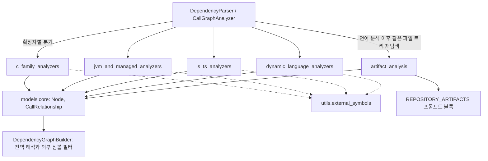
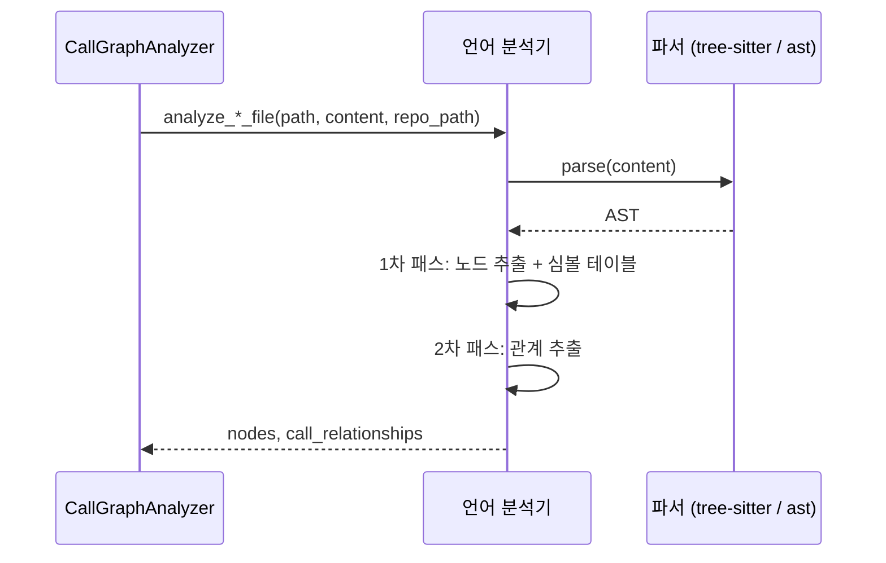

# language_analyzers 모듈 개요

## 1. 목적

`language_analyzers`는 `codewiki/src/be/dependency_analyzer/analyzers` 아래에 있는 **언어별 정적 분석기 모음**이다. 상위 그룹은 Code_Analysis_Pipeline이다. 소스 파일 하나를 받아 두 가지 결과를 돌려준다.

- **컴포넌트(`Node`)**: 함수, 클래스, 메서드, 인터페이스 같은 문서화 단위.
- **의존 관계(`CallRelationship`)**: 호출, 상속, 인스턴스화, 타입 참조 같은 컴포넌트 간 엣지.

이 결과는 `dependency_analysis_core`의 `CallGraphAnalyzer`와 `DependencyGraphBuilder`가 받아 저장소 전체 의존성 그래프로 합친다. 이 그래프가 LLM 문서 생성 엔진의 입력이 된다.

모든 언어 분석기는 같은 규약을 따른다.

- **컴포넌트 ID**: `<repo 상대경로>::<이름>`.
- **진입 함수**: `analyze_<lang>_file`이 `(nodes, call_relationships)`를 반환한다. Python은 세 번째 반환값으로 외부 import 루트 집합도 준다.
- **해석 표시**: 같은 파일 안에서 확정된 관계는 컴포넌트 ID와 `is_resolved=True`로 낸다. 확정하지 못한 관계는 이름 문자열만 담아 전역 리졸버에 넘긴다.
- **노이즈 억제**: 표준 라이브러리, 내장 메서드, primitive 타입 호출은 가능한 한 엣지에서 뺀다.
- **오류 격리**: 대부분의 분석기가 파일 하나의 실패를 로그로 남기고 전체 분석은 계속한다. 다만 C, C++, Java, C#은 예외 처리가 없어서 호출자가 실패를 다뤄야 한다(하위 문서 기준).

## 2. 아키텍처

### 공통 추출 흐름

Python은 표준 `ast`의 visitor로 한 번에 순회한다. 나머지 분석기는 tree-sitter를 쓴다. 패스 수는 언어마다 다르다. Ruby는 2패스, PHP는 3패스, TypeScript는 3단계다.

## 3. 하위 모듈

| 하위 모듈 | 대상 | 특징 |
|---|---|---|
| [c_family_analyzers](c_family_analyzers.md) | C, C++ | C++은 ALL_CAPS 매크로 때문에 파싱 오류가 나면 매크로를 제거해 재파싱한다. 오류가 더 적은 쪽을 채택한다. 수신자 타입 추정도 한다. |
| [jvm_and_managed_analyzers](jvm_and_managed_analyzers.md) | Java, Kotlin, Scala, C# | Java와 C#은 패키지·네임스페이스와 import 해석을 한다. Scala는 `component_type`과 `node_type`을 분리하고 companion object를 `$`로 구분한다. |
| [js_ts_analyzers](js_ts_analyzers.md) | JavaScript, TypeScript | JS는 순회하면서 바로 노드를 만든다. TS는 엔티티를 먼저 모은 뒤 top-level만 남긴다. import 해석은 하지 않는다. |
| [dynamic_language_analyzers](dynamic_language_analyzers.md) | Python, Ruby, PHP | 타입 정보가 없어 얕은 수신자 추론에 의존한다. PHP는 `NamespaceResolver`로 FQN만 만들고 모든 엣지를 미해석으로 낸다. |
| [artifact_analysis](artifact_analysis.md) | 빌드, CI, 컨테이너, 매니페스트, 스크립트 | 언어 분석기가 다루지 않는 파일을 `component_type="artifact"` 노드로 만든다. 해석이 끝난 id만 엣지로 낸다. 토큰 예산 안에서 읽는다. |

## 4. 설계 포인트

- **해석은 2단계로 나뉜다.** 분석기는 같은 파일 안의 해석까지만 한다. 파일 간 해석과 외부 심볼 필터는 `dependency_analysis_core`가 맡는다.
- **해석 정책은 분석기마다 다르다.** Scala는 같은 파일에서 해석한 엣지를 `is_resolved=True`로 표시한다. Java, Kotlin, C#은 항상 `False`다. C#은 "먼저 해석, 나중에 필터"를 원칙으로 삼는다.
- **아티팩트 분석은 성격이 다르다.** 언어 분석기와 달리 파서 대신 정규식으로 단위를 뽑는다. 누락은 있어도 잘못된 이름 매칭은 만들지 않는다.
- **새 언어를 추가하려면** 같은 생성자 계약과 `analyze_<lang>_file` 함수를 제공하고 상위 디스패처에 등록해야 한다. 등록 위치는 `dependency_analysis_core` 문서를 참고한다.

## 5. 검증 수준과 한계

- 위 내용은 하위 모듈 문서 5개를 읽고 정리했다. 소스 코드를 직접 열어 재확인하지는 않았으므로 검증 수준은 **문서 기반**이다.
- 확장자별 분기, 특히 `.h` 파일을 C와 C++ 중 어느 분석기로 보내는지는 이 모듈 범위 밖이라 **미확인**이다.
- 하위 문서들이 공통으로 지적하는 한계는 다음과 같다. 정적 휴리스틱이라 타입 추론이 없다. 체인 호출, 리플렉션, 동적 호출은 누락될 수 있다. 일부 헬퍼는 호출되지 않는 잔여 코드로 보인다.