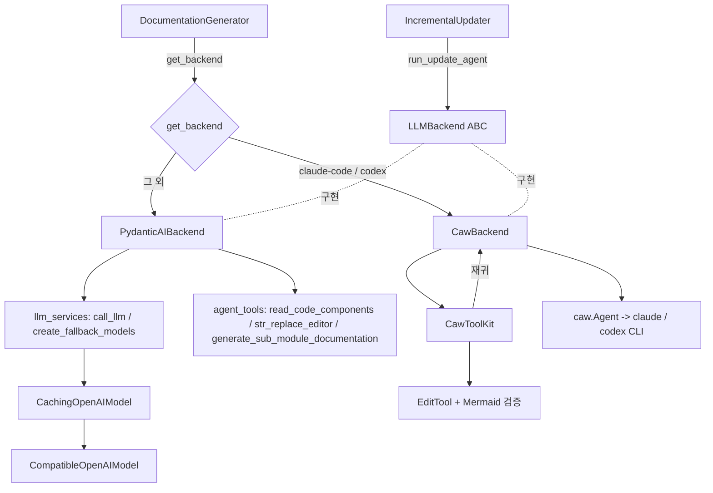
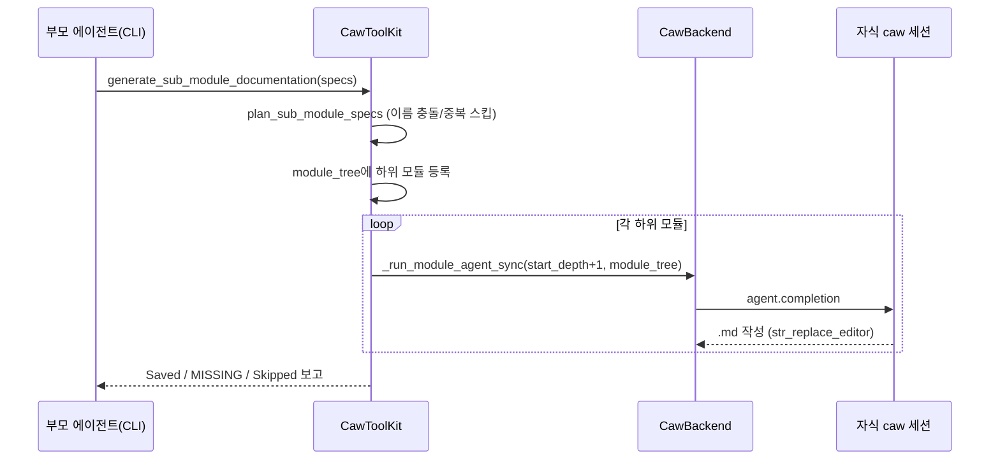

# llm_backends 모듈

`llm_backends`는 CodeWiki가 LLM을 호출하는 방식을 하나의 추상화(`LLMBackend`) 뒤로 숨기는 모듈이다. API 키 기반 경로(pydantic-ai + openai/litellm)와 구독 기반 경로(`claude` / `codex` CLI, `caw` 라이브러리)를 동일한 인터페이스로 제공하므로, 문서 생성기와 증분 업데이터는 어떤 백엔드가 쓰이는지 알 필요가 없다.

상위 모듈: LLM_Documentation_Generation_Engine. 관련 문서: [documentation_generation](documentation_generation.md), [agent_tools](agent_tools.md), [incremental_updater](incremental_updater.md), [shared_config_utils](shared_config_utils.md).

## 구성 요소

| 파일 | 컴포넌트 | 역할 |
|---|---|---|
| `codewiki/src/be/backend.py` | `LLMBackend`, `AgentReply`, `get_backend` | 추상 인터페이스, 결과 dataclass, provider 선택 팩토리 |
| `codewiki/src/be/pydantic_ai_backend.py` | `PydanticAIBackend` | API 키 기반 구현 |
| `codewiki/src/be/caw_backend.py` | `CawBackend` | CLI 구독 기반 구현 (`claude-code`, `codex`) |
| `codewiki/src/be/caw_toolkit.py` | `CawToolKit` | CodeWiki 도구 3종을 caw MCP 서버로 노출 |
| `codewiki/src/be/llm_services.py` | `CachingOpenAIModel`, `CompatibleOpenAIModel`, `call_llm` 등 | 모델/클라이언트 생성, 프롬프트 캐싱, 호환성 패치 |

## 아키텍처

### LLMBackend 인터페이스 (`backend.py`)

- `complete(prompt, *, model, system_prompt)` — 동기 단발 완성. 클러스터링, 부모/저장소 overview에 사용.
- `run_module_agent(...)` — 비동기 다중 턴 에이전트. 모듈별 문서를 작성하고 갱신된 `module_tree`를 반환.
- `run_update_agent(system_prompt, user_prompt, deps)` — 읽기 + `str_replace_editor` 도구만 가진 편집 에이전트(위임 없음). 기본 구현은 `NotImplementedError`. 쓰기 범위는 `deps.allowed_write_paths`로 제한된다. 결과는 `AgentReply(text, usage, seconds, meta)`.
- `last_usage` — 마지막 호출의 토큰 사용량. 증분 업데이터가 기록용으로 읽는다. `usage_to_dict`가 provider별 usage 객체를 숫자 dict로 정규화한다.
- `get_backend(config)` — `config.provider`가 `CAW_PROVIDERS = {"claude-code", "codex"}`이면 `CawBackend`, 아니면 `PydanticAIBackend`. 순환 import를 피하려 지연 import한다.

## PydanticAIBackend

`llm_services.create_fallback_models(config)`로 `FallbackModel(main, fallback)`을 만들고 pydantic-ai `Agent`를 구성한다.

- `complete` → `call_llm` 호출 후 `pop_last_usage()`로 usage 수집.
- `run_module_agent` → `is_complex_module`이면 `generate_sub_module_documentation_tool`까지 포함한 재귀 프롬프트(`format_system_prompt`), 아니면 leaf 프롬프트(`format_leaf_system_prompt`)를 사용. `UsageLimits(request_limit=...)`로 요청 수 제한.
- 재개(resume) 지원: 루트는 `overview.md`, 하위 모듈은 `{module_name}.md`가 이미 있으면 건너뛴다.
- `run_update_agent` → 읽기/편집 도구 2개만 등록.

### llm_services 핵심 동작

- `CompatibleOpenAIModel`: 프록시가 `choices[].index = None`을 돌려주는 경우 순번으로 보정.
- `CachingOpenAIModel`: 마지막 system 메시지와 마지막 메시지에 `cache_control: ephemeral`을 주입. 400/422로 거부되면 마커 없이 1회 재시도하고 `(base_url, model)`을 `_CACHE_UNSUPPORTED`에 기록해 이후 주입을 생략. 재시도도 실패하면 캐싱 탓이 아니므로 기록을 취소.
- `call_llm`: provider별 분기 — `bedrock`/`anthropic`은 litellm, `azure-openai`는 `AzureOpenAI`, 기본은 OpenAI 호환. `max_tokens` vs `max_completion_tokens`는 모델명으로 선택하고, 서버가 거부하면 반대 키로 1회 재시도.
- `create_fallback_models`: `fallback_on=(ModelAPIError, UnexpectedModelBehavior)`로 본문 파싱 실패(200 응답)도 fallback 대상에 포함.

## CawBackend

`claude` / `codex` CLI를 `caw.Agent`로 구동한다. 인증은 사용자의 OAuth 구독이며 API 키가 필요 없다. 생성 시 CLI가 PATH에 없으면 `RuntimeError`를 던진다. `fallback_model`은 무시되고, `main_model`은 CLI의 `--model`로 그대로 전달된다.

핵심 설계:

- **스레드 오프로딩**: `agent.completion`은 subprocess를 블로킹하므로 `asyncio.to_thread`로 실행. Mermaid 검증(PythonMonkey)이 메인 스레드에 묶여 있어 `set_main_loop`로 메인 루프를 넘긴다.
- **도구 그룹**: `ToolGroup.READER | PARALLEL`. Write/Edit 등을 막아 반드시 CodeWiki의 `str_replace_editor`(Mermaid 검증 포함)를 쓰게 한다. `codex`는 MCP 호출이 취소되는 문제 때문에 `EXEC`를 추가한다.
- **cwd 고정**: claude는 저장소 루트(관리 정책으로 bypass가 꺼져도 소스/출력이 워크스페이스 안에 들어오도록), codex는 문서 출력 디렉터리(`file_change`의 상대 경로 때문).
- **위임 게이트**: `is_complex_module` AND `start_depth < max_depth` AND 토큰 수 ≥ `max_token_per_leaf_module`일 때만 `can_delegate`. 아니면 leaf 프롬프트 사용.
- **stopgap 패치** (모듈 import 시 적용, upstream caw에 기능이 생기면 제거 대상):
  - `_patch_codex_tool_timeout`: codex MCP `tool_timeout_sec`을 24h로.
  - `_patch_claude_allowed_tools`: `subprocess` 프록시로 `claude` 명령에 `--allowedTools mcp__<server>`를 추가(`_with_allowed_tools`). 없으면 MCP 도구가 거부되어 빈 문서가 생성된다.
  - claude-code는 `MCP_TOOL_TIMEOUT`, `MCP_TIMEOUT` 환경변수를 `setdefault`로 설정.

### CawToolKit

세션(모듈/하위 모듈)마다 새로 만들어지는 MCP 서버(`codewiki_tools`)이다.

- `read_code_components` — 컴포넌트 ID로 소스 반환.
- `str_replace_editor` — `working_dir`(`repo`/`docs`)·`command` 검증, 절대경로 거부, `..` 탈출 방지, `repo`는 `view`만 허용, `check_write_allowed`로 쓰기 범위 확인, `.md` 변경 시 Mermaid 검증 결과를 덧붙임. 구현은 [agent_tools](agent_tools.md)의 `EditTool`을 재사용.
- `generate_sub_module_documentation` — `allow_subagent=False`이면 거부 메시지를 반환. 허용되면 `to_thread`로 `_run_sub_modules`를 실행하고, `_heartbeat`가 10초마다 진행 알림을 보내 CLI의 취소를 방지.

`start_depth`와 메모리상의 `module_tree`를 재귀 호출에 넘겨 `max_depth` 우회와, 저장 전 트리 유실을 막는다. 하위 모듈 이름은 `plan_sub_module_specs`([documentation_generation](documentation_generation.md))로 flat한 문서 디렉터리 내 충돌을 해소하며, 이미 문서화된 이름은 재생성하지 않고 스킵한다.

## 두 백엔드 비교

| 항목 | PydanticAIBackend | CawBackend |
|---|---|---|
| 인증 | API 키 | CLI OAuth 구독 |
| fallback 모델 | 있음 (`FallbackModel`) | 없음 (무시) |
| 실행 모델 | 네이티브 async | subprocess를 스레드로 오프로딩 |
| 재귀 위임 | pydantic-ai 도구 | MCP 도구 + 새 caw 세션 |
| 프롬프트 캐싱 | `CachingOpenAIModel` | CLI에 위임 |
| 위임 조건 | `is_complex_module` | `is_complex_module` + 깊이 + 토큰 임계값 |

## 참고

- 설정값(`provider`, `main_model`, `max_depth`, `max_token_per_leaf_module`, `agent_retries`, `request_limit`, `prompt_caching`)은 [shared_config_utils](shared_config_utils.md)의 `Config`가 제공한다.
- 도구 구현(`CodeWikiDeps`, `EditTool`)은 [agent_tools](agent_tools.md)를 참고.
- 검증 수준: 위 내용은 제공된 소스 코드 기준(코드 확인)이며, 실제 CLI 실행 동작은 미확인이다.
