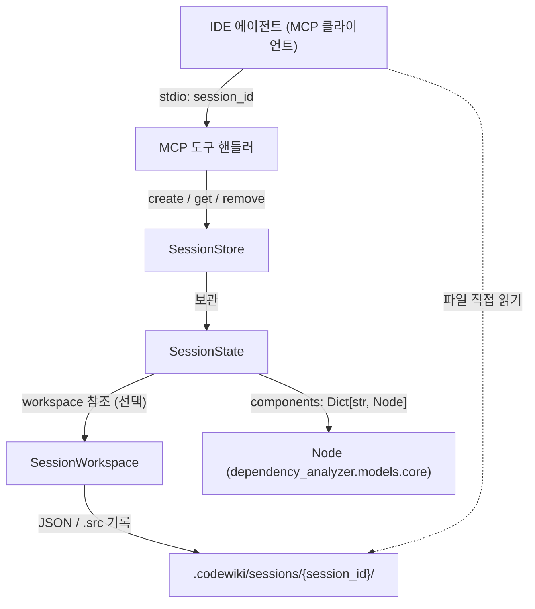
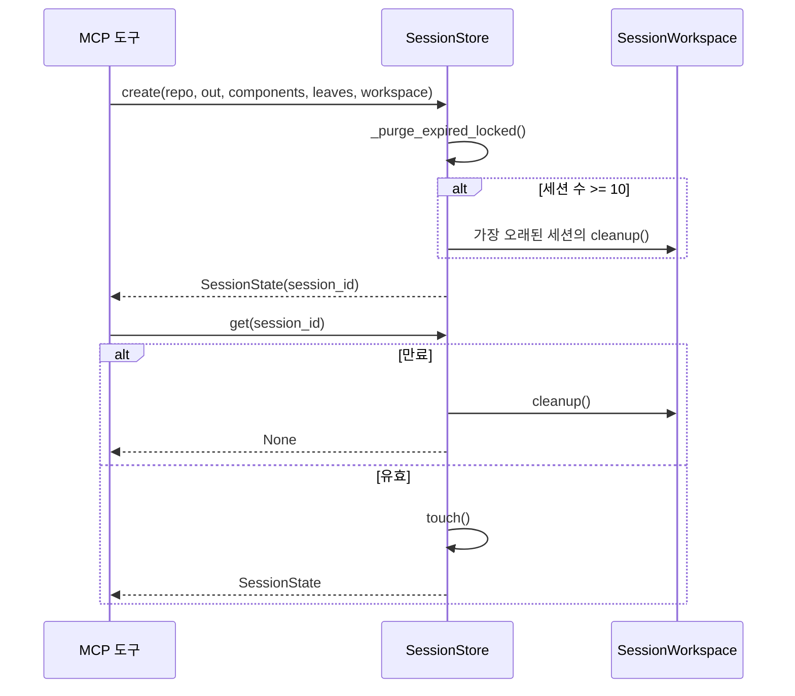
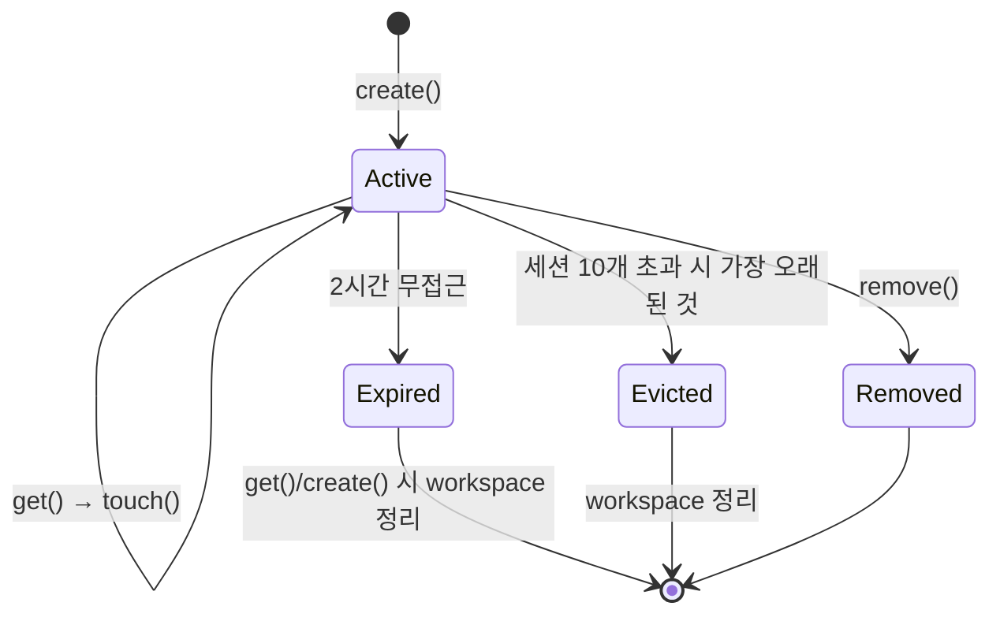

# mcp_sessions 모듈

`mcp_sessions`는 CodeWiki MCP 서버에서 `analyze_repo` 호출 한 번으로 만들어지는 **세션의 메모리 상태와 디스크 작업 공간**을 관리하는 모듈이다. 저장소를 다시 파싱하지 않고도 이후 도구 호출(코드 읽기, 문서 쓰기, 모듈 트리 관리)이 `session_id`만으로 같은 분석 결과를 재사용할 수 있게 한다.

구성 요소는 세 가지다.

| 파일 | 컴포넌트 | 역할 |
|---|---|---|
| `codewiki/mcp/session.py` | `SessionState` | 세션 하나의 가변 상태 (dataclass) |
| `codewiki/mcp/session.py` | `SessionStore` | 활성 세션의 스레드 안전 인메모리 저장소 (TTL·용량 제한) |
| `codewiki/mcp/workspace.py` | `SessionWorkspace` | 세션별 디스크 디렉터리 (대용량 산출물 기록) |

상위 그룹인 [User_Interfaces_&_Access_Layer](User_Interfaces_&_Access_Layer.md)에 속하며, 같은 그룹의 [cli_core](cli_core.md), [web_frontend](web_frontend.md)와는 별개의 접근 경로(MCP)를 담당한다. 세션이 캐시하는 `Node`는 [dependency_analysis_core](dependency_analysis_core.md)의 `models/core.py`에서 온다.

---

## 1. 아키텍처



설계의 핵심은 **큰 데이터를 MCP stdio 채널로 보내지 않는 것**이다. 서버는 분석 결과(컴포넌트 인덱스, 리프 노드, 소스 코드 등)를 디스크에 쓰고, IDE 에이전트가 자체 파일 접근 기능으로 직접 읽는다. 메모리에는 후속 호출에 필요한 상태(`SessionState`)만 남는다.

---

## 2. 컴포넌트 상세

### 2.1 `SessionState`

| 필드 | 설명 |
|---|---|
| `session_id` | 12자리 hex 식별자 (`uuid4().hex[:12]`) |
| `repo_path`, `output_dir` | 분석 대상 저장소 및 문서 출력 경로 |
| `components` | `Dict[str, Node]` — 분석된 컴포넌트 |
| `leaf_nodes` | 리프 컴포넌트 ID 목록 |
| `module_tree`, `registry` | 도구 호출 중 갱신되는 모듈 트리/레지스트리 (기본 빈 dict) |
| `workspace` | 연결된 `SessionWorkspace` (없을 수 있음) |
| `analyzed_commit` | `analyze_repo` 시점의 HEAD. 증분 업데이트의 기준선 |
| `docs_written` | `write_doc_file`/`edit_doc_file` 성공 횟수 |
| `created_at`, `last_accessed` | 타임스탬프 (epoch 초) |

- `touch()`: `last_accessed`를 현재 시각으로 갱신.
- `is_expired`: 마지막 접근 후 `_SESSION_TTL_SECONDS`(2시간) 초과 여부.

주석에 명시된 설계 의도:
- `analyzed_commit`은 `close_session` 시점 HEAD가 아니라 **분석 시점 HEAD**를 기록해야 한다. 그렇지 않으면 세션 중 생긴 커밋이 문서화되지 않은 채 기준선에 흡수된다.
- `docs_written == 0`이면 `metadata.json` 기준선 업데이트를 건너뛴다.

### 2.2 `SessionStore`

`threading.Lock` 하나로 `_sessions` dict 전체를 보호하는 단순 저장소다.

| 메서드 | 동작 |
|---|---|
| `create(...)` | 만료 세션 정리 → 용량(`_MAX_SESSIONS = 10`) 초과 시 `last_accessed`가 가장 오래된 세션 축출(workspace `cleanup()` 포함) → 충돌 없는 ID 생성 → 등록 |
| `get(session_id)` | 없으면 `None`. 만료됐으면 workspace 정리 후 삭제하고 `None`. 정상이면 `touch()` 후 반환 |
| `remove(session_id)` | dict에서만 제거하고 존재 여부 반환 |
| `_purge_expired_locked()` | 락을 쥔 상태에서 만료 세션 일괄 제거 (내부용) |

> 주의 (코드 확인): `remove()`는 workspace `cleanup()`을 호출하지 않는다. 디스크 정리는 호출 측이 `workspace.cleanup()`을 직접 수행해야 하는 것으로 보이며, 호출부는 이 모듈 범위 밖이라 **미확인**이다.



### 2.3 `SessionWorkspace`

생성 시 `repo_path/.codewiki/sessions/{session_id}/`와 `sources/` 하위 디렉터리를 만든다.

```
.codewiki/sessions/{session_id}/
    component_index.json, leaf_nodes.json, languages.json,
    changes.json, summary.json, processing_order.json,
    module_tree_validation.json
    sources/{sanitized_component_id}_{hash8}.src
```

| 메서드 | 동작 |
|---|---|
| `write_json(name, data)` | 들여쓰기 2, `ensure_ascii=False`로 저장 후 경로 반환 |
| `write_component_source(id, source, language)` | `// Component: ...`, `// Language: ...` 헤더를 붙여 `sources/`에 저장 |
| `read_json(name)` | 파일이 없으면 `None`, 있으면 파싱 결과 |
| `cleanup()` | 세션 디렉터리를 `rmtree(ignore_errors=True)`로 삭제하고, 비어 있으면 `sessions/`와 `.codewiki/`까지 정리 (`OSError`는 무시) |

**파일명 안전화 (`_safe_filename`)**: 컴포넌트 ID(`src/main.py::MyClass`)에서 `[\w\-.]`가 아닌 문자를 `__`로 치환하고 180자로 자른 뒤, ID의 SHA-1 앞 8자리를 붙인다. 치환 후 동일해지는 ID(`a-b.py` vs `a_b.py`)의 충돌과 NAME_MAX(255바이트) 초과를 동시에 막는다.

---

## 3. 세션 수명주기



만료는 **지연 평가**다. 백그라운드 타이머가 없고, `get()`/`create()`가 호출될 때만 정리된다. 따라서 아무도 호출하지 않으면 만료된 세션과 디스크 디렉터리가 남는다.

## 4. 설계 특성과 한계

- **프로세스 로컬**: 세션은 메모리에만 있어 서버 재시작 시 사라진다. 단, 디스크의 `.codewiki/sessions/`는 남을 수 있다 (추론).
- **단일 전역 락**: 간단하지만 처리량이 커지면 병목이 될 수 있다. 최대 10세션이라 현실적 문제는 작다.
- **`SessionState` 자체는 락으로 보호되지 않는다**: `module_tree`, `docs_written` 갱신은 호출 측 책임이다.
- 상한 값(`_SESSION_TTL_SECONDS`, `_MAX_SESSIONS`)은 모듈 상수로 하드코딩되어 있으며 설정으로 노출되지 않는다.

검증 수준: 위 내용은 제공된 `session.py`, `workspace.py` 소스 기준 **코드 확인**이며, MCP 도구 핸들러 측 사용 방식은 **미확인**이다.
