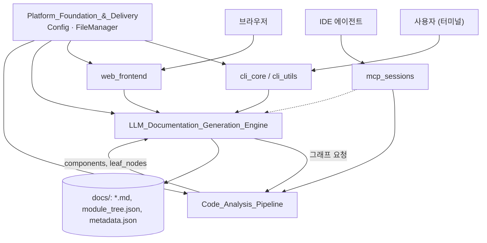
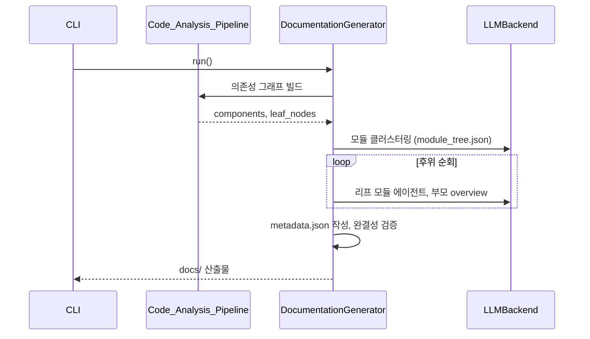

# CodeWiki 개요

## 목적

CodeWiki는 소스 저장소를 분석해 **구조화된 Markdown 문서**를 자동으로 만드는 도구다. 처리 순서는 다음과 같다.

1. 정적 분석으로 함수, 클래스, 빌드·CI 같은 artifact와 이들 사이의 의존성 그래프를 추출한다.
2. 그래프를 바탕으로 모듈 트리를 만든다.
3. LLM 에이전트가 모듈별 문서와 저장소 `overview.md`를 작성한다.
4. 이전 결과가 있으면 변경분만 반영하는 증분 업데이트(`--update`)를 쓴다.

사용 경로는 세 가지다.

- CLI(`codewiki`)
- FastAPI 웹 UI
- IDE 에이전트용 MCP 서버

## 전체 아키텍처

### 대표 실행 흐름 (`codewiki generate`)

## 핵심 모듈 문서

| 모듈 | 역할 | 문서 |
|---|---|---|
| User_Interfaces_&_Access_Layer | CLI, 웹, MCP 진입점. 설정 구성과 진행률·오류 표시를 맡는다. | [User_Interfaces_&_Access_Layer](User_Interfaces_&_Access_Layer.md) |
| Code_Analysis_Pipeline | 언어별 정적 분석(C/C++, JVM, JS/TS, Python/Ruby/PHP, artifact)으로 의존성 그래프를 만든다. | [Code_Analysis_Pipeline](Code_Analysis_Pipeline.md) |
| LLM_Documentation_Generation_Engine | 모듈 트리 구성, LLM 백엔드 추상화, 에이전트 도구, 증분 갱신을 맡는다. | [LLM_Documentation_Generation_Engine](LLM_Documentation_Generation_Engine.md) |
| Platform_Foundation_&_Delivery | 공용 `Config`와 `FileManager`, 패키징·컨테이너·CI를 제공한다. | [Platform_Foundation_&_Delivery](Platform_Foundation_&_Delivery.md) |

하위 문서는 다음과 같다.

- [cli_core](cli_core.md)
- [cli_utils](cli_utils.md)
- [web_frontend](web_frontend.md)
- [mcp_sessions](mcp_sessions.md)
- [dependency_analysis_core](dependency_analysis_core.md)
- [language_analyzers](language_analyzers.md)
- [documentation_generation](documentation_generation.md)
- [llm_backends](llm_backends.md)
- [agent_tools](agent_tools.md)
- [incremental_updater](incremental_updater.md)
- [shared_config_utils](shared_config_utils.md)

## How it is built and run

- **패키징**: `pyproject.toml`이 진입점 `codewiki.cli.main:cli`를 정의한다. `requirements.txt`는 버전을 고정한다.
- **테스트·CI**: `.github/workflows/ci.yml`이 `test`(pytest) 잡과 `lint`(변경된 Python 파일에 대한 ruff) 잡을 실행한다.
- **배포**: `docker/Dockerfile`(python:3.12-slim)과 `docker/docker-compose.yml`의 `codewiki` 서비스로 웹 UI를 실행한다.

세부 내용과 주의 사항은 [build_ci_deployment](build_ci_deployment.md)와 [Platform_Foundation_&_Delivery](Platform_Foundation_&_Delivery.md)를 참고한다.

주의 사항:

- `pyproject.toml`과 `requirements.txt`의 버전이 어긋날 수 있다.
- 기본 `LLM_API_KEY`는 자리표시자이므로 배포 시 덮어써야 한다.
- 웹 UI에는 인증 코드가 없다.

검증 수준: 위 내용은 각 모듈 문서를 종합한 것이다(하위 문서 기준 **코드 확인**). 실제 LLM 실행 동작은 **미확인**이다.