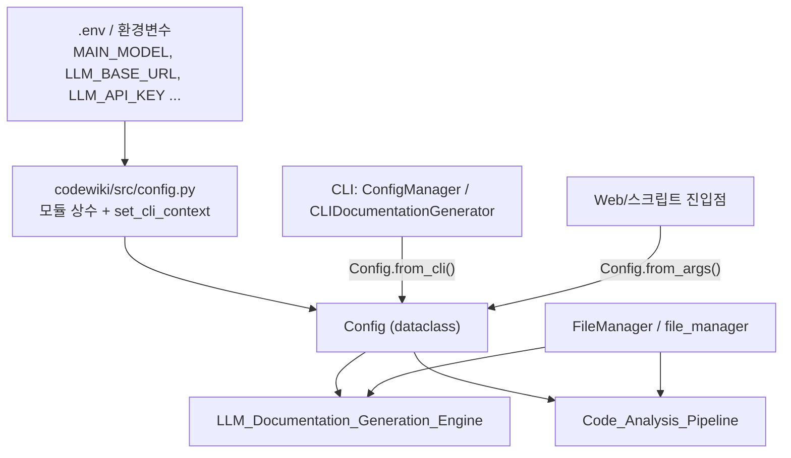
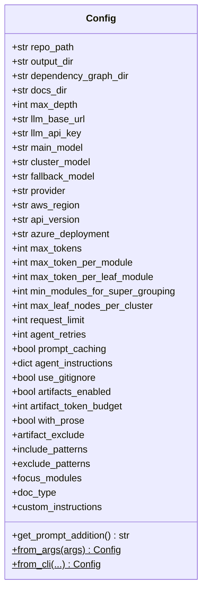
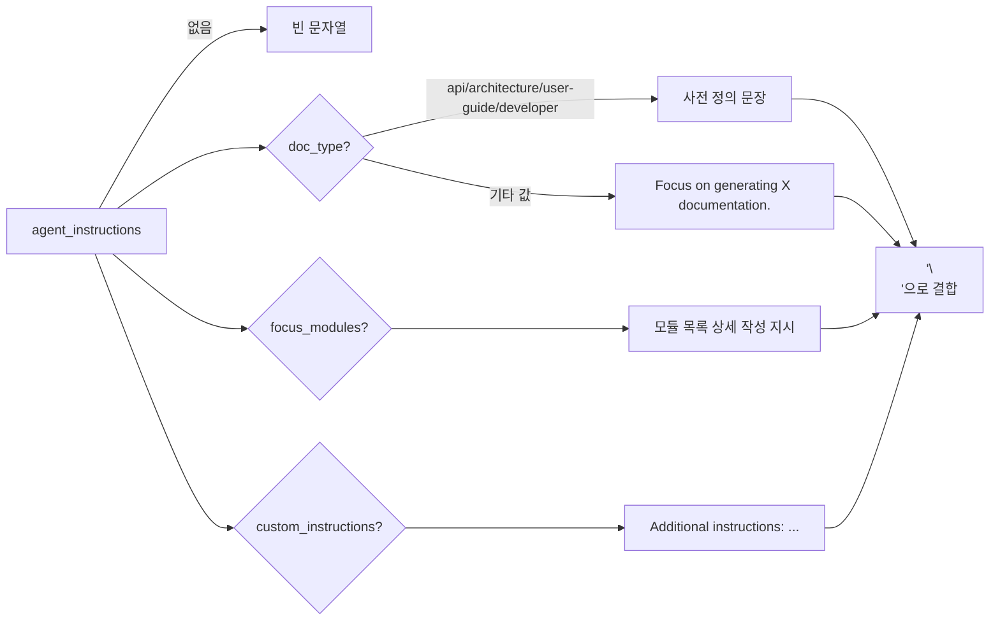
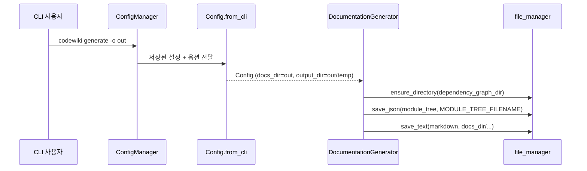

# shared_config_utils 모듈

`shared_config_utils`는 CodeWiki의 CLI, 웹 앱, 백엔드 파이프라인이 공통으로 사용하는 **설정 객체(`Config`)** 와 **파일 I/O 헬퍼(`FileManager`)** 를 제공하는 기반 모듈이다. 상위 모듈 `Platform_Foundation_&_Delivery`에 속하며, 빌드/CI/배포 관련 파일은 [build_ci_deployment](build_ci_deployment.md)에서 다룬다.

| 파일 | 핵심 컴포넌트 | 역할 |
|---|---|---|
| `codewiki/src/config.py` | `Config` | 경로, LLM, 토큰 한도, 에이전트, 아티팩트 설정을 담은 dataclass와 팩토리 |
| `codewiki/src/utils.py` | `FileManager` | 디렉터리 생성, JSON/텍스트 저장·로드 정적 메서드 |

---

## 1. 아키텍처 개요

- `config.py`는 import 시점에 `load_dotenv()`를 호출하고 환경변수에서 모델·엔드포인트 기본값을 읽는다.
- `Config`는 실행 컨텍스트(CLI/웹)에 따라 서로 다른 팩토리로 생성된다.
- `FileManager`는 상태가 없는 정적 메서드 모음이며, 모듈 끝에서 싱글턴 `file_manager = FileManager()`로 노출된다.

---

## 2. `codewiki/src/config.py`

### 2.1 모듈 상수

| 분류 | 상수 | 값/의미 |
|---|---|---|
| 경로 | `OUTPUT_BASE_DIR`, `DEPENDENCY_GRAPHS_DIR`, `DOCS_DIR` | `output`, `dependency_graphs`, `docs` |
| 파일명 | `FIRST_MODULE_TREE_FILENAME`, `MODULE_TREE_FILENAME`, `OVERVIEW_FILENAME` | `first_module_tree.json`, `module_tree.json`, `overview.md` |
| 계층 | `MAX_DEPTH` | 2 (모듈 계층 분해 최대 깊이) |
| 토큰 | `DEFAULT_MAX_TOKENS` / `DEFAULT_MAX_TOKEN_PER_MODULE` / `DEFAULT_MAX_TOKEN_PER_LEAF_MODULE` | 32,768 / 36,369 / 4,000 |
| 에이전트 | `DEFAULT_REQUEST_LIMIT`, `DEFAULT_AGENT_RETRIES` | 100 (pydantic-ai 기본 50 상향), 3 |
| 클러스터링 | `DEFAULT_MIN_MODULES_FOR_SUPER_GROUPING`, `DEFAULT_MAX_LEAF_NODES_PER_CLUSTER` | 3, 600 |
| 아티팩트 | `DEFAULT_ARTIFACT_TOKEN_BUDGET` | 200,000 |
| 레거시 | `MAX_TOKEN_PER_MODULE`, `MAX_TOKEN_PER_LEAF_MODULE` | 하위 호환용 별칭 |
| LLM | `MAIN_MODEL`, `FALLBACK_MODEL_1`, `CLUSTER_MODEL`, `LLM_BASE_URL`, `LLM_API_KEY` | 환경변수 → 기본값 (`claude-sonnet-4`, `glm-4p5`, `MAIN_MODEL`, `http://0.0.0.0:4000/`, `sk-1234`) |
| 기타 | `ATLAS_CLOUD_BASE_URL` | `atlas-cloud` provider 선택 시 base URL 자동 채움용 |

### 2.2 CLI 컨텍스트 플래그

`set_cli_context(enabled)` / `is_cli_context()`는 전역 `_CLI_CONTEXT`를 통해 CLI 실행인지 웹 앱 실행인지를 구분한다. 주석에 따르면 CLI 모드는 `~/.codewiki/config.json` + keyring에서, 웹 앱 모드는 환경변수에서 LLM 설정을 읽는다. CLI 측 로딩은 [User_Interfaces_&_Access_Layer](User_Interfaces_&_Access_Layer.md)의 `ConfigManager`가 담당한다.

### 2.3 `Config` 필드 구조

필드 그룹:

- **경로**: `repo_path`, `output_dir`(중간 산출물), `dependency_graph_dir`, `docs_dir`(최종 문서).
- **LLM/Provider**: `llm_base_url`, `llm_api_key`, `main_model`, `cluster_model`, `fallback_model`, `provider`(`openai-compatible`, `atlas-cloud`, `anthropic`, `bedrock`, `azure-openai`), Bedrock용 `aws_region`, Azure용 `api_version`·`azure_deployment`.
- **토큰/클러스터링**: `max_tokens`, `max_token_per_module`, `max_token_per_leaf_module`, `min_modules_for_super_grouping`, `max_leaf_nodes_per_cluster`.
- **에이전트 실행**: `request_limit`, `agent_retries`, `prompt_caching`(provider가 `cache_control`을 거부하면 모델별로 자동 비활성화).
- **분석 범위**: `use_gitignore`, `agent_instructions`.
- **아티팩트 인식 생성**: `artifacts_enabled`, `artifact_token_budget`, `with_prose`(README/`docs/`를 `prose` 아티팩트로 포함, 기본 off).

### 2.4 `agent_instructions` 파생 프로퍼티

`agent_instructions` dict에서 값을 꺼내는 읽기 전용 프로퍼티들이다. dict가 없으면 모두 `None`.

| 프로퍼티 | dict 키 |
|---|---|
| `artifact_exclude` | `artifact_exclude` |
| `include_patterns` | `include_patterns` |
| `exclude_patterns` | `exclude_patterns` |
| `focus_modules` | `focus_modules` |
| `doc_type` | `doc_type` |
| `custom_instructions` | `custom_instructions` |

`get_prompt_addition()`은 이를 LLM 프롬프트 추가 문장으로 합친다.

### 2.5 팩토리 메서드

| 메서드 | 용도 | 경로 결정 방식 |
|---|---|---|
| `Config.from_args(args)` | argparse 네임스페이스 기반 (웹/스크립트). 모델·URL·키는 모듈 상수(환경변수)를 사용 | `output_dir=output`, `dependency_graph_dir=output/dependency_graphs`, `docs_dir=output/docs/<sanitized_repo>-docs`. repo 이름의 영숫자가 아닌 문자는 `_`로 치환 |
| `Config.from_cli(...)` | CLI 컨텍스트. 모든 LLM/토큰/에이전트/아티팩트 옵션을 인자로 받음 | `output_dir=<output>/temp`, `dependency_graph_dir=<output>/temp/dependency_graphs`, `docs_dir=<output>` |

`from_cli`는 중간 산출물을 `<output>/temp` 아래로 분리하고 최종 문서만 출력 루트에 둔다. 이 구조 덕분에 `--update` 시 저장된 `temp/dependency_graphs/`와 비교할 수 있다. `from_args`는 `use_gitignore`만 `getattr(args, "use_gitignore", True)`로 읽는다.

---

## 3. `codewiki/src/utils.py` — `FileManager`

| 메서드 | 동작 |
|---|---|
| `ensure_directory(path)` | `os.makedirs(path, exist_ok=True)` |
| `save_json(data, filepath)` | UTF-8, `indent=4`, `ensure_ascii=False`로 저장 (한글 유지) |
| `load_json(filepath)` | 파일이 없으면 `None`, 있으면 파싱한 dict |
| `save_text(content, filepath)` | UTF-8 텍스트 저장 |
| `load_text(filepath)` | UTF-8 텍스트 로드 (파일 없으면 예외 발생) |

주의점:

- `load_json`만 파일 부재를 `None`으로 처리하고 `load_text`는 예외를 그대로 던진다.
- `save_*`는 상위 디렉터리를 만들지 않으므로 호출 전에 `ensure_directory`가 필요하다.
- 임시 파일 후 교체 같은 원자적 쓰기는 하지 않는다.

---

## 4. 데이터 흐름

## 5. 다른 모듈과의 관계

- [User_Interfaces_&_Access_Layer](User_Interfaces_&_Access_Layer.md): `ConfigManager`와 `CLIDocumentationGenerator`가 `set_cli_context`, `Config.from_cli`를 사용해 CLI 설정을 `Config`로 변환한다. CLI 자체의 `Configuration`/`AgentInstructions` 모델(`codewiki/cli/models/config.py`)은 별개이며 `agent_instructions` dict로 전달된다.
- [Code_Analysis_Pipeline](Code_Analysis_Pipeline.md): `use_gitignore`, `include_patterns`, `exclude_patterns`, 아티팩트 관련 필드를 참조한다.
- [LLM_Documentation_Generation_Engine](LLM_Documentation_Generation_Engine.md): 모델, provider, 토큰 한도, `request_limit`, `agent_retries`, `prompt_caching`, `get_prompt_addition()`을 사용하고 `FileManager`로 결과를 저장한다.
- [build_ci_deployment](build_ci_deployment.md): 컨테이너/CI 환경에서 `.env`·환경변수로 `MAIN_MODEL`, `LLM_BASE_URL`, `LLM_API_KEY` 등을 주입하는 경로와 연결된다.

## 6. 유지보수 시 참고

1. 기본값을 바꿀 때는 `DEFAULT_*` 상수만 수정하면 dataclass 기본값과 `from_cli` 시그니처에 함께 반영된다.
2. 새 옵션 추가 시 `Config` 필드와 `from_cli` 인자/전달부를 모두 수정해야 한다 (`from_args`는 일부 값만 지원).
3. 모듈 상수(`MAIN_MODEL` 등)는 import 시점에 한 번 평가되므로, 런타임에 환경변수를 바꿔도 반영되지 않는다.
4. 기본 `LLM_API_KEY="sk-1234"`, `LLM_BASE_URL="http://0.0.0.0:4000/"`는 로컬 프록시용 자리표시자이므로 실제 배포에서는 반드시 덮어써야 한다.
