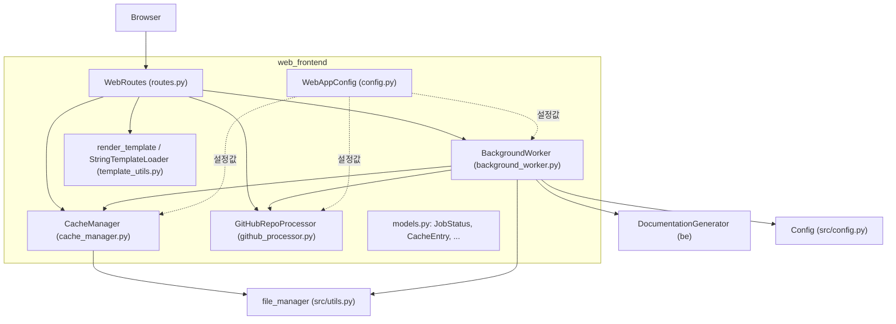
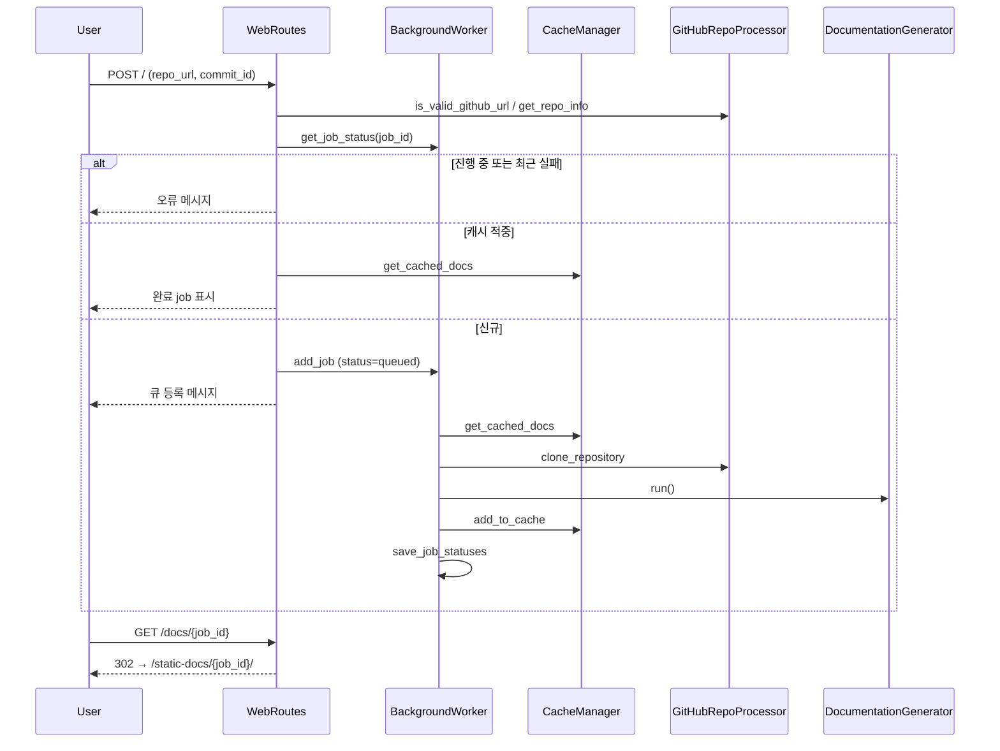
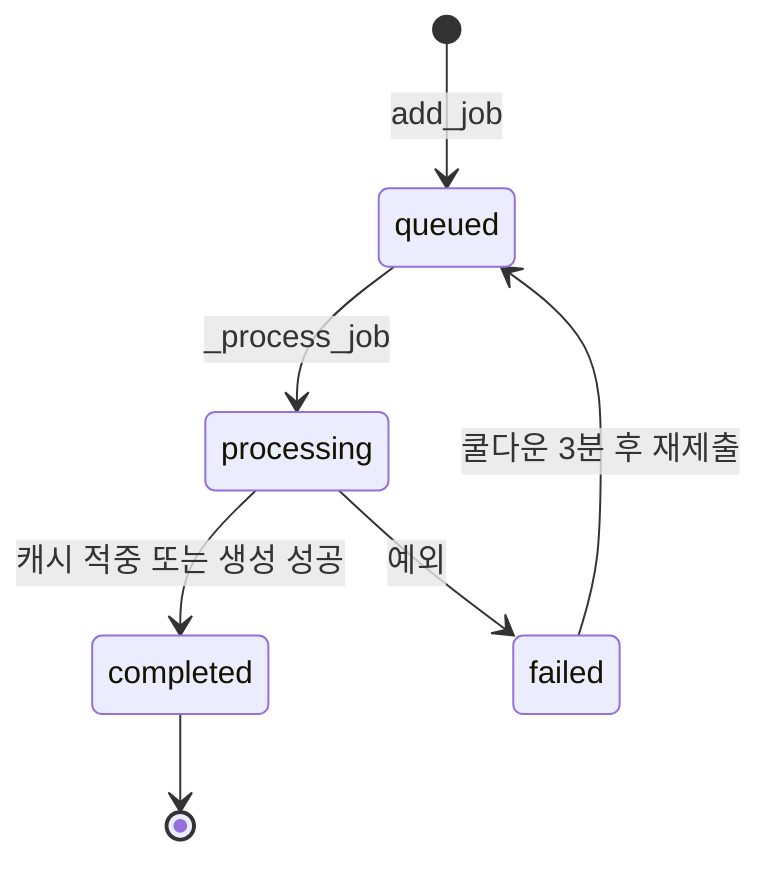

# web_frontend 모듈

`web_frontend`(`codewiki/src/fe/`)는 CodeWiki의 FastAPI 기반 웹 UI 계층입니다. 사용자가 GitHub 저장소 URL(선택적으로 commit ID)을 제출하면 작업을 큐에 넣고, 백그라운드 스레드가 저장소를 clone해 문서를 생성합니다. 결과는 캐시하고, 생성된 Markdown 문서를 HTML로 렌더링해 보여줍니다.

상위 모듈: User_Interfaces_&_Access_Layer. 형제 모듈: [cli_core](cli_core.md), [cli_utils](cli_utils.md), [mcp_sessions](mcp_sessions.md).
문서 생성 엔진은 [documentation_generation](documentation_generation.md), 공용 설정/유틸은 [shared_config_utils](shared_config_utils.md)를 참고하세요.

> 검증 수준: 제공된 소스 코드 기준 **코드 확인**. `templates.py`, `visualise_docs.py`, FastAPI 앱 조립부(라우트 등록, 정적 파일 마운트)는 제공되지 않아 **미확인**입니다.

## 1. 아키텍처

## 2. 컴포넌트

### WebAppConfig (`config.py`)
클래스 상수로 된 설정 모음입니다.

| 항목 | 값 | 의미 |
|---|---|---|
| `CACHE_DIR` / `TEMP_DIR` / `OUTPUT_DIR` | `./output/cache`, `./output/temp`, `./output` | 캐시·임시 clone·산출물 위치 |
| `QUEUE_SIZE` | 100 | 작업 큐 최대 크기 |
| `CACHE_EXPIRY_DAYS` | 365 | 캐시 유효 기간 |
| `JOB_CLEANUP_HOURS` | 24000 | 완료/실패 job 정리 기준 |
| `RETRY_COOLDOWN_MINUTES` | 3 | 실패 job 재시도 대기 |
| `DEFAULT_HOST` / `DEFAULT_PORT` | `127.0.0.1` / 8000 | 서버 기본값 |
| `CLONE_TIMEOUT` / `CLONE_DEPTH` | 300 / 1 | git clone 타임아웃, shallow depth |

`ensure_directories()`는 필요한 디렉터리를 생성합니다.

### models.py
- `RepositorySubmission`: pydantic 폼 모델(`repo_url: HttpUrl`).
- `JobStatus`(dataclass): `queued → processing → completed | failed` 상태와 시각, `progress`, `docs_path`, `main_model`, `commit_id`를 추적합니다.
- `JobStatusResponse`: `/api` 응답용 pydantic 모델. `JobStatus`와 필드가 같습니다.
- `CacheEntry`: `repo_url`, `repo_url_hash`, `docs_path`, `created_at`, `last_accessed`.

### GitHubRepoProcessor (`github_processor.py`)
정적 메서드만 있습니다.
- `is_valid_github_url`: 호스트가 `github.com`/`www.github.com`이고 경로에 `owner/repo`가 있는지 검사합니다.
- `get_repo_info`: `owner`, `repo`, `full_name`, `clone_url`을 추출합니다(`.git` 접미사 제거).
- `clone_repository`: `commit_id`가 없으면 `--depth CLONE_DEPTH` shallow clone을 합니다. 있으면 전체 clone 후 `git checkout <commit_id>`를 실행합니다. 성공 여부를 `bool`로 반환합니다.

### CacheManager (`cache_manager.py`)
- 키는 `sha256(repo_url)[:16]`이고, 인덱스는 `cache_dir/cache_index.json`에 저장합니다.
- `get_cached_docs`: 유효기간 이내이면 `last_accessed`를 갱신하고 `docs_path`를 반환합니다. 만료됐으면 항목을 제거합니다.
- `add_to_cache`, `remove_from_cache`, `cleanup_expired_cache`를 제공합니다.
- 캐시 키가 URL만 기반이므로 commit ID는 키에 반영되지 않습니다(코드 확인). 다른 commit을 요청해도 기존 캐시가 재사용될 수 있습니다.

### BackgroundWorker (`background_worker.py`)
- `Queue(maxsize=QUEUE_SIZE)`와 daemon 스레드 하나(`_worker_loop`)로 job을 순차 처리합니다.
- `job_status` 딕셔너리(메모리)와 `cache_dir/jobs.json`(디스크)에 상태를 유지합니다.
- `load_job_statuses`는 `completed` job만 복원합니다. `jobs.json`이 없으면 `_reconstruct_jobs_from_cache`로 캐시 인덱스에서 job을 재구성합니다. job_id는 `owner--repo` 형식입니다.
- `_process_job`은 다음 순서로 진행합니다.
  1. 상태를 `processing`으로 바꾸고 캐시를 조회합니다. 적중하면 즉시 `completed`로 처리합니다.
  2. `GitHubRepoProcessor.clone_repository`로 `TEMP_DIR/<job_id>`에 clone합니다.
  3. `Config.from_args`로 설정을 만들고 `docs_dir`을 `output/docs/<job_id>-docs`로 덮어씁니다.
  4. 새 event loop에서 `DocumentationGenerator(config, commit_id).run()`을 실행합니다.
  5. 캐시에 등록하고 `completed`로 저장합니다. 예외가 나면 `failed`와 `error_message`를 기록합니다.
  6. `finally`에서 임시 clone 디렉터리를 `rm -rf`로 삭제합니다.

### WebRoutes (`routes.py`)

| 메서드 | 역할 |
|---|---|
| `index_get` | 메인 폼과 최근 job 목록 렌더링 |
| `index_post` | URL 검증·정규화 → 중복/쿨다운 검사 → 캐시 확인 → 큐 등록 |
| `get_job_status` | job 상태 JSON(`JobStatusResponse`), 없으면 404 |
| `view_docs` | 완료된 job이면 `/static-docs/{job_id}/`로 302 리다이렉트 |
| `serve_generated_docs` | `module_tree.json`, `metadata.json`, 요청 파일을 읽어 Markdown→HTML 렌더링 |
| `cleanup_old_jobs` | `JOB_CLEANUP_HOURS` 이전의 완료/실패 job 제거 |

`serve_generated_docs`는 job 상태가 없으면 `job_id`를 `owner/repo`로 되돌려 캐시에서 문서를 찾고 job을 복원합니다. Markdown 변환(`markdown_to_html`, `get_file_title`)은 `visualise_docs.py`를, 템플릿 문자열(`WEB_INTERFACE_TEMPLATE`, `DOCS_VIEW_TEMPLATE`)은 `templates.py`를 사용합니다(둘 다 미확인).

### template_utils.py
- `StringTemplateLoader`: 문자열 자체를 Jinja2 템플릿으로 제공하는 로더입니다.
- `render_template`: 호출마다 `Environment`를 만들며 html/xml autoescape를 켭니다.
- `render_navigation`, `render_job_list`: 모듈 트리 내비게이션과 job 목록용 보조 렌더러입니다.

## 3. 처리 흐름

### 저장소 제출부터 문서 생성까지

### job 상태 전이

## 4. 운영상 참고 (코드 확인)
- 작업 스레드가 하나라서 job은 직렬로 처리됩니다. 큐가 가득 차면 `Queue.put`이 블로킹될 수 있습니다.
- `failed`와 `processing` 상태는 디스크에서 복원하지 않으므로, 재시작하면 진행 중이던 job은 사라집니다.
- `_process_job`의 `main_model`은 `MAIN_MODEL`(`codewiki/src/config.py`)에서 가져옵니다.
- `index_post`는 사용자가 지정한 `commit_id`를 clone·checkout에 쓰지만, 캐시 조회는 URL 기준입니다.
- 접근 제어와 인증 코드는 이 모듈에 없습니다(코드 확인). 외부에 노출할 때는 별도 보호가 필요합니다(추론).
- 빌드와 배포는 [build_ci_deployment](build_ci_deployment.md)를 참고하세요.
