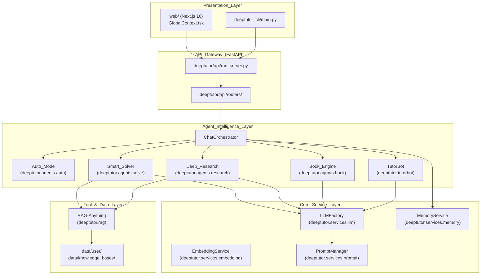
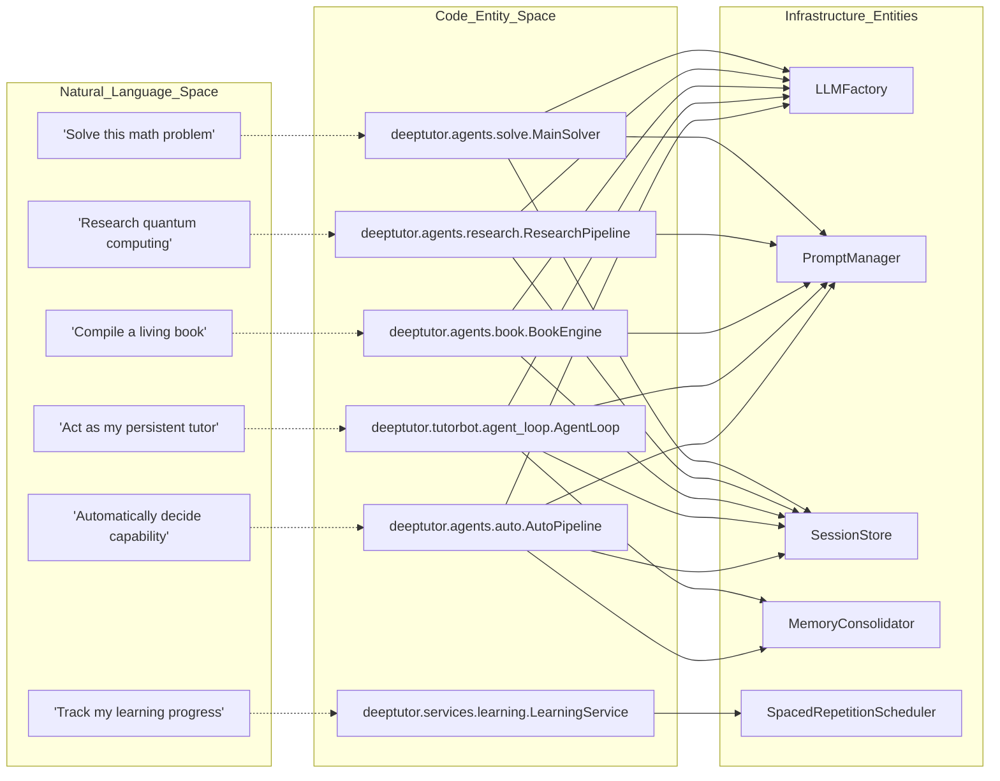
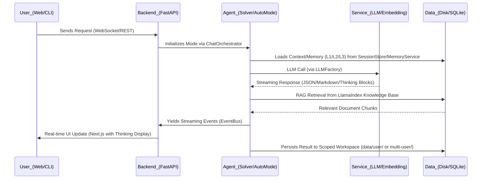

# Overview

Relevant source files

The following files were used as context for generating this wiki page:

- [.github/workflows/pypi-release.yml](.github/workflows/pypi-release.yml)
- [.gitignore](.gitignore)
- [README.md](README.md)
- [assets/README/README_AR.md](assets/README/README_AR.md)
- [assets/README/README_CN.md](assets/README/README_CN.md)
- [assets/README/README_ES.md](assets/README/README_ES.md)
- [assets/README/README_FR.md](assets/README/README_FR.md)
- [assets/README/README_HI.md](assets/README/README_HI.md)
- [assets/README/README_JA.md](assets/README/README_JA.md)
- [assets/README/README_PL.md](assets/README/README_PL.md)
- [assets/README/README_PT.md](assets/README/README_PT.md)
- [assets/README/README_RU.md](assets/README/README_RU.md)
- [assets/README/README_TH.md](assets/README/README_TH.md)
- [deeptutor/api/run_server.py](deeptutor/api/run_server.py)
- [deeptutor_cli/main.py](deeptutor_cli/main.py)
- [requirements.txt](requirements.txt)
- [requirements/dev.txt](requirements/dev.txt)
- [requirements/math-animator.txt](requirements/math-animator.txt)

## Purpose and Scope

DeepTutor is an **agent-native** AI-powered personalized learning assistant designed to transform educational materials into interactive, multi-modal learning journeys. Unlike traditional chatbots, DeepTutor uses an autonomous agent architecture to provide specialized workflows including deep problem solving, multi-agent research, interactive book generation, and persistent tutoring. [README.md:5-19]()

The system is built on a modular, multi-layer architecture that bridges high-level natural language instructions with low-level code execution, tool manipulation, and a persistent memory system. [README.md:107-108](), [README.md:117-121]()

---

## High-Level Architecture

DeepTutor implements a multi-layer architecture, moving from user presentation down to persistent data storage. The core of the system is the `ChatOrchestrator`, which manages the transition between different agent modes (Solver, Researcher, Quiz, Book Engine, etc.) within a single conversation thread. [README.md:119-122]()

### System Component Map

The following diagram maps the logical system components to their specific implementation paths in the codebase.

**Sources:** [README.md:47-50](), [README.md:107-114](), [README.md:119-122](), [README.md:126-128](), [deeptutor/api/run_server.py:1-10](), [deeptutor_cli/main.py:1-15]()

---

## Core Design Principles

### 1. Agent-Native Interface
Every capability in DeepTutor is accessible via both a Web UI and a rich CLI. The system treats "Skills" as first-class citizens; providing a `SKILL.md` file allows autonomous agents to operate the system's tools and navigate the workspace. [README.md:127-128]()

### 2. Unified Chat Workspace
DeepTutor maintains a single conversation thread context across distinct modes. A user can start a conversation in "Chat", escalate to "Deep Solve" for complex math, visualize the concepts, and then move to "Deep Research" to generate a report—all while preserving the message history and learned context via a unified `Space` context. [README.md:68](), [README.md:119-119]()

### 3. Three-Layer Memory Workbench
The system implements a sophisticated memory architecture:
*   **L1 (Trace):** Immediate interaction history.
*   **L2 (Surface Summaries):** Per-capability summaries.
*   **L3 (Cross-Surface Knowledge):** Global persistent learner profile. [README.md:47-49](), [README.md:124-124]()

### 4. Mastery Path Learning Engine
DeepTutor includes a specialized learning engine that tracks progress using spaced repetition and qualitative gates (e.g., Feynman technique). It calculates mastery based on recency-weighted accuracy and manages review tasks via the `SpacedRepetitionScheduler`. [README.md:47-48]()

---

## Technical Implementation: Code to Entity Mapping

The following diagram bridges the **Natural Language Space** (User Concepts) to the **Code Entity Space** (Class/File Names) to assist developers in navigating the repository.

### Bridge: Agent Workflows to Code Entities

**Sources:** [README.md:47-50](), [README.md:107-114](), [README.md:119-122](), [README.md:126-128]()

---

## Key Capabilities

| Capability | Description |
| :--- | :--- |
| **Auto Mode** | A three-stage agentic capability router (`ANALYZING`, `DELEGATING`, `SYNTHESIZING`) that automatically dispatches tasks to sub-capabilities. [README.md:47-51]() |
| **Smart Solver** | A dual-loop architecture that first analyzes/investigates a problem before attempting a formal solution. [README.md:119]() |
| **Deep Research** | A multi-agent pipeline: Topic Planning, Web/Paper Gathering, Note-taking, and Synthesis into Markdown reports. [README.md:119]() |
| **Book Engine** | Multi-agent "living book" compiler that turns materials into interactive pages with 14 block types (quizzes, flashcards, concept graphs). [README.md:64](), [README.md:121]() |
| **TutorBot (Partners)** | Persistent autonomous tutors with independent workspaces, memory, and personality, supporting 15+ messaging channels (Telegram, Discord, Zulip). [README.md:51](), [README.md:126-128]() |
| **Mastery Path** | Guided learning engine with hard mastery gates, Feynman technique validation, and a `/learning` dashboard. [README.md:47]() |
| **Vision Solver & Math Animator** | Vision-based analysis of geometry/math problems and Manim-based mathematical animation generation. [README.md:47](), [README.md:82]() |
| **Visualization Agent** | Data visualization pipeline using Chart.js, Cytoscape, and Mermaid for rendering conceptual and mathematical data. [README.md:60](), [README.md:74](), [README.md:78]() |
| **RAG System** | Retrieval-augmented generation using the LlamaIndex-only refactor, supporting multiple search providers (Brave, Tavily, Serper). [README.md:47-49](), [README.md:110]() |

**Sources:** [README.md:47-64](), [README.md:107-128]()

---

## Data Flow and Persistence

All system data is stored locally by default to ensure privacy. DeepTutor supports optional **Multi-User Mode** which provides isolated user workspaces, administrative grants, and auth routes via `AUTH_ENABLED` and the `Grant` system. [README.md:33](), [README.md:51](), [README.md:62](), [README.md:125]()

*   **Knowledge Bases**: Stores versioned RAG indices, document extractions, and vector indices. [README.md:49](), [README.md:74](), [README.md:123]()
*   **Session Management**: Handled via a persistent `SessionStore` (SQLite) that maintains conversation turns, WebSocket heartbeats, and session snapshots. [README.md:31](), [README.md:53](), [README.md:68]()
*   **Memory Workbench**: A three-layer subsystem (L1/L2/L3) for persistent learning progress and learner profiles shared across the system via the `MemoryService`. [README.md:47-49](), [README.md:124]()

### Data Flow Diagram

**Sources:** [README.md:31-53](), [README.md:107-114](), [README.md:119-128](), [deeptutor/api/run_server.py:1-20]()

---

## Next Steps

To dive deeper into the system:
*   **Installation**: See [Getting Started](2.-Getting-Started) for the interactive setup tour. [README.md:53]()
*   **Configuration**: Refer to the [Configuration Guide](2.2.-Configuration-Guide) for environment variables and LLM setup. [README.md:39]()
*   **Deployment**: See [Docker Deployment](2.1.-Docker-Deployment) for containerized setups. [README.md:47]()
*   **CLI Reference**: See [CLI Reference](9.-CLI-Reference) for managing agents, sessions, and knowledge bases via terminal. [README.md:127-128]()
