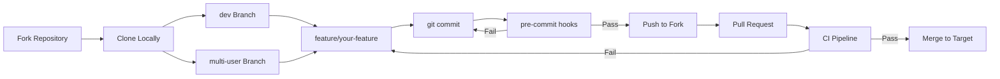
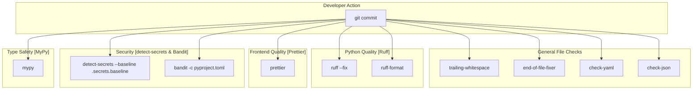
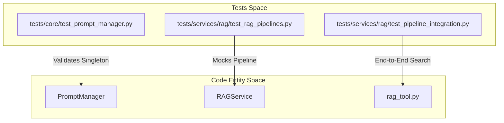

# Development Guide

Relevant source files

The following files were used as context for generating this wiki page:

- [.gitattributes](.gitattributes)
- [.github/pull_request_template.md](.github/pull_request_template.md)
- [.pre-commit-config.yaml](.pre-commit-config.yaml)
- [.secrets.baseline](.secrets.baseline)
- [CONTRIBUTING.md](CONTRIBUTING.md)
- [Dockerfile](Dockerfile)
- [tests/core/__init__.py](tests/core/__init__.py)
- [tests/core/test_prompt_manager.py](tests/core/test_prompt_manager.py)
- [tests/services/rag/test_pipeline_integration.py](tests/services/rag/test_pipeline_integration.py)
- [tests/services/rag/test_rag_pipelines.py](tests/services/rag/test_rag_pipelines.py)
- [tests/services/rag/testfile.txt](tests/services/rag/testfile.txt)
- [web/app/(workspace)/page.tsx](web/app/(workspace)/page.tsx)

## Purpose and Scope

This document provides guidelines for developers contributing to the DeepTutor codebase. It covers the development workflow, code quality tools, testing procedures, and CI/CD pipeline configuration. This is a high-level overview; for detailed instructions, please refer to the child pages: [Contributing Guidelines](#10.1), [Code Quality Tools](#10.2), and [Testing and CI/CD](#10.3).

---

## Development Workflow Overview

DeepTutor enforces a structured development workflow with automated quality checks. All contributions must target the `dev` or `multi-user` branches [CONTRIBUTING.md:32-42](). Code must pass pre-commit validation before submission [CONTRIBUTING.md:80-84]().

### Git Branch Strategy

**Workflow: Development Branch Strategy**

| Target Branch | Purpose | PR Content |
|---------------|---------|------------|
| `dev` | Default development branch [CONTRIBUTING.md:59-60]() | New features, refactoring, general bug fixes [CONTRIBUTING.md:46-51]() |
| `multi-user` | Experimental multi-tenant branch [CONTRIBUTING.md:39-39]() | Session isolation, user management, permissions [CONTRIBUTING.md:53-58]() |

**Sources:** [CONTRIBUTING.md:32-61](), [.github/pull_request_template.md:1-40]()

---

## Code Quality Tools

DeepTutor uses a multi-layered approach to maintain code quality through automated tools configured in `.pre-commit-config.yaml`.

### Pre-commit Hook Architecture

The following diagram bridges the high-level quality requirements to the specific tools defined in the configuration.

**Workflow: Pre-commit Hook Execution Chain**

**Sources:** [.pre-commit-config.yaml:12-106](), [CONTRIBUTING.md:149-162]()

### Toolstack Summary

| Tool | Purpose | Configuration |
|------|---------|---------------|
| **Ruff** | Python linting and formatting [CONTRIBUTING.md:155-155]() | [.pre-commit-config.yaml:42-51]() |
| **Prettier** | Frontend (`web/`) and config formatting [CONTRIBUTING.md:156-156]() | [.pre-commit-config.yaml:55-61]() |
| **detect-secrets** | Scans for hardcoded secrets [CONTRIBUTING.md:157-157]() | [.pre-commit-config.yaml:66-73]() |
| **MyPy** | Static type checking [CONTRIBUTING.md:160-160]() | [.pre-commit-config.yaml:97-106]() |
| **Bandit** | Security issue analysis [CONTRIBUTING.md:159-159]() | [.pre-commit-config.yaml:84-91]() |

For configuration details and how to update the secrets baseline via `detect-secrets scan > .secrets.baseline` [CONTRIBUTING.md:134-134](), see [Code Quality Tools](#10.2).

---

## Testing Infrastructure

DeepTutor uses `pytest` for testing, covering core services, agent modules, and RAG pipelines.

### Test Organization

The test suite is organized to mirror the system architecture, ensuring that core logic and specialized agent behaviors are validated independently.

**Mapping: Test Suites to Code Entities**

**Sources:** [tests/core/test_prompt_manager.py:8-30](), [tests/services/rag/test_rag_pipelines.py:9-12](), [tests/services/rag/test_pipeline_integration.py:202-207]()

### Running Tests

| Task | Command |
|------|---------|
| Run general tests | `pytest tests/` |
| Run RAG integration | `python tests/services/rag/test_pipeline_integration.py --pipeline all` [tests/services/rag/test_pipeline_integration.py:13-14]() |
| Prompt Manager tests | `pytest tests/core/test_prompt_manager.py` [tests/core/test_prompt_manager.py:1-189]() |

For details on test workflows and coverage reporting, see [Testing and CI/CD](#10.3).

---

## CI/CD Pipeline

DeepTutor uses GitHub Actions for continuous integration, focusing on cross-platform compatibility and code integrity.

### CI Highlights
- **Docker Multi-Stage Builds**: Production images use a `frontend-builder` stage [Dockerfile:23-23](), a `python-base` stage [Dockerfile:63-63](), and a final `production` stage [Dockerfile:103-103]().
- **Service Orchestration**: Production environments use `supervisord` to manage both the FastAPI backend (`start-backend.sh`) and Next.js frontend (`start-frontend.sh`) processes [Dockerfile:187-208]().
- **Strict Linting**: While local hooks may show warnings, CI performs strict checks and rejects PRs that fail [CONTRIBUTING.md:163-165]().
- **Security Baseline**: Scans for secrets using `.secrets.baseline` to prevent accidental credential leakage [.pre-commit-config.yaml:66-73]().
- **Cross-Platform Compatibility**: Critical build files and scripts are forced to use LF line endings via `.gitattributes` [.gitattributes:1-19]().

For a complete breakdown of CI workflows, see [Testing and CI/CD](#10.3).

**Sources:** [CONTRIBUTING.md:163-165](), [Dockerfile:1-208](), [.pre-commit-config.yaml:1-106](), [.gitattributes:1-19]()
