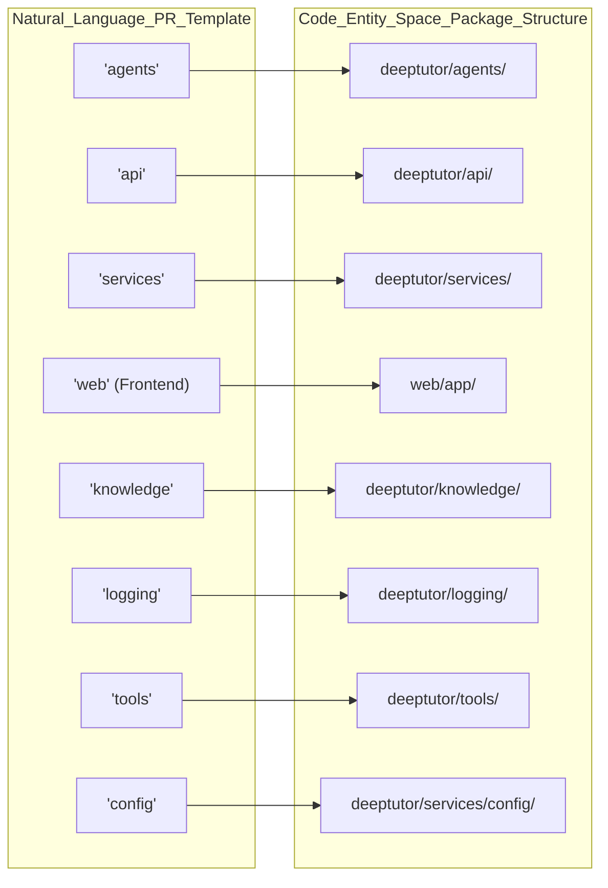
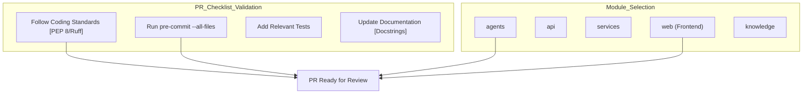

# Contributing Guidelines

<details>
<summary>Relevant source files</summary>

The following files were used as context for generating this wiki page:

- [.gitattributes](.gitattributes)
- [.github/pull_request_template.md](.github/pull_request_template.md)
- [.secrets.baseline](.secrets.baseline)
- [CONTRIBUTING.md](CONTRIBUTING.md)
- [Dockerfile](Dockerfile)
- [web/app/(workspace)/page.tsx](web/app/(workspace)/page.tsx)

</details>


## Purpose and Scope

This document defines the contribution process, git workflow, and commit conventions for the DeepTutor project. It outlines the mandatory branch strategy, pre-commit requirements, and community engagement channels that all contributors must follow to maintain a robust intelligent learning companion [CONTRIBUTING.md:1-2]().

DeepTutor uses a suite of automated tools (Ruff, Prettier, detect-secrets, etc.) to maintain high standards of code quality and security [CONTRIBUTING.md:149-152](). All contributions must pass these checks before being merged into the codebase.

---

## Branch Strategy

We use a multi-branch model to keep development organized [CONTRIBUTING.md:32-34](). **Do not submit PRs directly to `main`** [CONTRIBUTING.md:41-42]().

| Branch | Purpose | Stability |
|---|---|---|
| `dev` | General development (Default target) | May have bugs or breaking changes |
| `multi-user` | Multi-user scenario development | Experimental, focused on multi-tenant features |

**Target `dev`** for new features, refactoring, API changes, or general bug fixes [CONTRIBUTING.md:46-51]().
**Target `multi-user`** for session isolation, user management, or collaborative workspace features [CONTRIBUTING.md:53-58]().

### Git Workflow Diagram

```mermaid
graph TB
    ["Fork_Repository"] --> ["Clone_Fork_Locally"]
    ["Clone_Fork_Locally"] --> ["Checkout_dev_Branch"]
    ["Checkout_dev_Branch"] --> ["Pull_Latest_Changes"]
    ["Pull_Latest_Changes"] --> ["Create_Feature_Branch"]
    ["Create_Feature_Branch"] --> ["Make_Changes"]
    ["Make_Changes"] --> ["Run_Pre-commit_Checks"]
    ["Run_Pre-commit_Checks"] -->|Fails| ["Make_Changes"]
    ["Run_Pre-commit_Checks"] -->|Passes| ["Commit_Changes"]
    ["Commit_Changes"] --> ["Push_to_Fork"]
    ["Push_to_Fork"] --> ["Open_Pull_Request"]
    ["Open_Pull_Request"] --> ["CI_Pipeline_Runs"]
    ["CI_Pipeline_Runs"] -->|Fails| ["Make_Changes"]
    ["CI_Pipeline_Runs"] -->|Passes| ["Code_Review"]
    ["Code_Review"] -->|Changes_Requested| ["Make_Changes"]
    ["Code_Review"] -->|Approved| ["Merge_to_dev"]
```

**Sources**: [CONTRIBUTING.md:32-86]()

---

## Contribution Process

### Step 1: Fork and Clone

1. Fork the repository via the GitHub UI.
2. Clone your fork locally: `git clone https://github.com/YOUR_USERNAME/DeepTutor.git`.

### Step 2: Setup Development Environment

Synchronize your local environment with the upstream target branch before starting any work [CONTRIBUTING.md:67-71]().

```bash
# Sync with target branch
git checkout dev && git pull origin dev

# Create feature branch
git checkout -b feature/your-feature-name
```

### Step 3: Install Pre-commit Hooks

Pre-commit hooks are **mandatory**. They are configured via `.pre-commit-config.yaml` and ensure that code meets quality standards before it is even committed [CONTRIBUTING.md:114-128]().

```bash
# Create and activate virtual environment
python -m venv venv
source venv/bin/activate  # Windows: venv\Scripts\activate

# Install dependencies with development tools
pip install -e ".[all]"

# Install pre-commit tool and git hooks
pip install pre-commit
pre-commit install
```

**Sources**: [CONTRIBUTING.md:98-128]()

### Step 4: Make Changes and Commit

DeepTutor enforces strict coding standards, including **Type Hints** for all Python function signatures and the use of `pathlib.Path` for cross-platform compatibility [CONTRIBUTING.md:170-175, 215]().

```bash
# Stage changes
git add .

# Commit (hooks run automatically)
git commit -m "feat: add support for new embedding provider"

# If hooks fail, fix issues and retry.
# To run checks manually on all files:
pre-commit run --all-files
```

### Step 5: Push and Create Pull Request

Submit your Pull Request to the correct target branch (usually `dev`) [CONTRIBUTING.md:86](). Use the provided PR template which requires checking off affected modules such as `agents`, `api`, or `web` [.github/pull_request_template.md:14-28]().

---

## Commit Message Conventions

DeepTutor follows a structured commit format to maintain a clean history [CONTRIBUTING.md:184-190]().

### Format
```
<type>: <short description>

[optional body]
```

### Commit Types
| Type | Description |
|---|---|
| `feat` | A new feature (MINOR version bump) |
| `fix` | A bug fix (PATCH version bump) |
| `docs` | Documentation only changes |
| `style` | Formatting, no logic changes |
| `refactor` | Code restructuring, no new features or fixes |
| `test` | Adding or correcting tests |
| `chore` | Build process, tooling, or dependency updates |

**Sources**: [CONTRIBUTING.md:192-201]()

---

## Code Quality and Security Tools

The following tools are integrated into the workflow to ensure high standards:

| Tool | Purpose | Source |
|---|---|---|
| **Ruff** | Python linting and formatting | [CONTRIBUTING.md:155]() |
| **Prettier** | Frontend & config file formatting | [CONTRIBUTING.md:156]() |
| **detect-secrets** | Hardcoded secret scanning | [CONTRIBUTING.md:157]() |
| **pip-audit** | Dependency vulnerability scanning | [CONTRIBUTING.md:158]() |
| **Bandit** | Security issue analysis | [CONTRIBUTING.md:159]() |
| **MyPy** | Static type checking | [CONTRIBUTING.md:160]() |
| **Interrogate** | Docstring coverage reporting | [CONTRIBUTING.md:161]() |

### Secret Management
If you encounter a false positive secret (e.g., a mock API key in a test), update the baseline file [CONTRIBUTING.md:129-135](). The `.secrets.baseline` file uses various plugins to detect sensitive information like `OpenAIDetector` or `JwtTokenDetector` [.secrets.baseline:46-59]().

```bash
detect-secrets scan > .secrets.baseline
```

**Sources**: [CONTRIBUTING.md:129-135](), [.secrets.baseline:1-88]()

---

## Security Best Practices

Contributors must adhere to these security standards:

*   **File Uploads**: General files capped at 100 MB; PDFs capped at 50 MB. Multi-layer validation (extension + MIME type + content sanitization) is required [CONTRIBUTING.md:208-210]().
*   **Pathing**: Use `pathlib.Path` for cross-platform compatibility and to prevent path traversal [CONTRIBUTING.md:211, 215]().
*   **Subprocesses**: Always use `shell=False` to prevent command injection [CONTRIBUTING.md:214]().
*   **Line Endings**: LF (Unix) line endings are enforced for critical files like `Dockerfile`, `.sh`, and `.py` via `.gitattributes` to prevent CRLF-related issues in Docker containers [.gitattributes:3-18]().

**Sources**: [CONTRIBUTING.md:205-218](), [.gitattributes:1-19]()

---

## Community Engagement

Join the community for discussion and support:

*   **Discord**: [Join Community](https://discord.gg/eRsjPgMU4t) [CONTRIBUTING.md:6]()
*   **WeChat**: [Join Group (Issue #78)](https://github.com/HKUDS/DeepTutor/issues/78) [CONTRIBUTING.md:7]()
*   **Feishu**: [Join Group (See Communication.md)](./Communication.md) [CONTRIBUTING.md:8]()

---

## Pull Request Template Structure

When opening a PR, ensure the following checklist is completed as per the template [.github/pull_request_template.md:30-36]().

### Module Mapping to PR Checklist

This diagram bridges the natural language categories in the PR template to the specific directories in the codebase.



### PR Lifecycle Flow



**Sources**: [.github/pull_request_template.md:14-36](), [CONTRIBUTING.md:150-161]()
