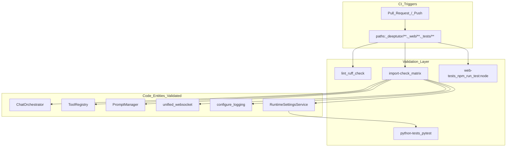
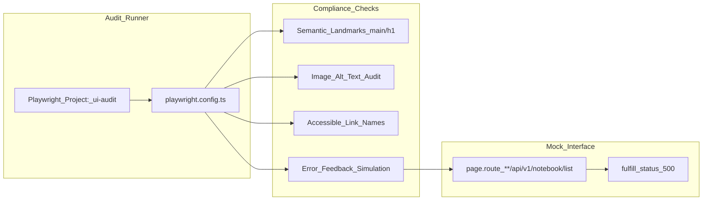

# Testing and CI/CD

Relevant source files

The following files were used as context for generating this wiki page:

- [.github/workflows/docker-release.yml](.github/workflows/docker-release.yml)
- [.github/workflows/tests.yml](.github/workflows/tests.yml)
- [web/eslint.config.mjs](web/eslint.config.mjs)
- [web/next-env.d.ts](web/next-env.d.ts)
- [web/next.config.js](web/next.config.js)
- [web/package-lock.json](web/package-lock.json)
- [web/package.json](web/package.json)
- [web/playwright.config.ts](web/playwright.config.ts)
- [web/tests/e2e/compliance-and-ux.audit.ts](web/tests/e2e/compliance-and-ux.audit.ts)
- [web/tsconfig.json](web/tsconfig.json)

## Purpose and Scope

This document describes DeepTutor's automated testing infrastructure and continuous integration (CI) pipeline. It covers the GitHub Actions workflows that enforce code quality, execute test suites across a multi-Python-version matrix, and perform critical module import validation. The system is designed to ensure that the agent-native architecture remains stable across updates to the core `deeptutor` package, the `deeptutor_cli`, and the Next.js frontend.

---

## Test Infrastructure Overview

DeepTutor uses a combination of Python and Node.js testing tools to validate the full stack. Python logic is tested primarily with **pytest**, while the frontend uses **Playwright** for UI audits and compliance checks.

| Component | Tooling | Purpose |
|-----------|----------|---------|
| **Backend Unit/Integration** | `pytest` | Validates core logic, agent modules, and learning services [[.github/workflows/tests.yml:178]](). |
| **Import Validation** | `python -c` | Ensures critical modules boot without circular dependencies across Python versions [[.github/workflows/tests.yml:114-123]](). |
| **Linting & Formatting** | `ruff` | Enforces Python code style and static analysis [[.github/workflows/tests.yml:50-54]](). |
| **Frontend Node Tests** | `npm run test:node` | Unit tests for frontend logic and utility functions [[web/package.json:11]](). |
| **UI & Compliance Audit** | `playwright` | Accessibility, semantic landmark, and UX signal validation [[web/package.json:18]](), [[web/tests/e2e/compliance-and-ux.audit.ts:23-24]](). |
| **Internationalization** | `i18n-audit` | Ensures translation parity and detects literal UI text [[web/package.json:14-17]](), [[web/eslint.config.mjs:12-14]](). |

**Sources:** [[.github/workflows/tests.yml:45-54]](), [[web/package.json:11-20]](), [[web/tests/e2e/compliance-and-ux.audit.ts:1-5]]()

---

## GitHub Actions Workflows

### Tests Workflow (`tests.yml`)

The primary test workflow triggers on pushes and pull requests to `main` and `dev` branches when relevant files in `deeptutor/`, `deeptutor_cli/`, `tests/`, `requirements/`, or `web/` are modified [[.github/workflows/tests.yml:3-29]]().

#### Job: `lint`
Executes `ruff check` and `ruff format --check` on the entire repository using Python 3.11 [[.github/workflows/tests.yml:32-54]]().

#### Job: `web-tests`
Sets up Node.js 22 and runs frontend-specific tests [[.github/workflows/tests.yml:56-77]](). This includes the `test:node` script defined in the frontend configuration [[web/package.json:11]]().

#### Job: `import-check`
Uses a matrix strategy for Python 3.11, 3.12, and 3.13 (with 3.14 as experimental) [[.github/workflows/tests.yml:79-91]](). It installs `requirements/server.txt` and attempts to import key classes to ensure the runtime environment is valid [[.github/workflows/tests.yml:110-123]]().

**Import Check Entities:**
- `ChatOrchestrator` (`deeptutor.runtime.orchestrator`) [[.github/workflows/tests.yml:117]]().
- `get_tool_registry` (`deeptutor.runtime.registry.tool_registry`) [[.github/workflows/tests.yml:118]]().
- `get_capability_registry` (`deeptutor.runtime.registry.capability_registry`) [[.github/workflows/tests.yml:119]]().
- `RuntimeSettingsService` (`deeptutor.services.config.runtime_settings`) [[.github/workflows/tests.yml:120]]().
- `unified_websocket` (`deeptutor.api.routers.unified_ws`) [[.github/workflows/tests.yml:121]]().
- `PromptManager` (`deeptutor.services.prompt.manager`) [[.github/workflows/tests.yml:122]]().
- `configure_logging` (`deeptutor.logging`) [[.github/workflows/tests.yml:123]]().

#### Job: `python-tests`
Depends on `import-check` [[.github/workflows/tests.yml:130]](). It creates a minimal runtime configuration in `data/user/settings/main.yaml` [[.github/workflows/tests.yml:165-173]]() and executes `pytest` across the `tests/` directory and `deeptutor/learning/tests` [[.github/workflows/tests.yml:178]]().

**Sources:** [[.github/workflows/tests.yml:31-181]]()

---

## Frontend Compliance and UX Audits

DeepTutor utilizes **Playwright** to perform automated accessibility and compliance audits. These tests are located in `web/tests/e2e/compliance-and-ux.audit.ts` and focus on semantic integrity [[web/tests/e2e/compliance-and-ux.audit.ts:1-4]]().

### Key Audit Metrics
*   **Semantic Landmarks:** Verifies presence of `<main>` and `<h1>` tags [[web/tests/e2e/compliance-and-ux.audit.ts:24-32]]().
*   **Accessibility:** Checks for `alt` text on all `` tags and accessible names (aria-label/title) on `<a>` links [[web/tests/e2e/compliance-and-ux.audit.ts:34-67]]().
*   **Responsive Design:** Validates the presence of the `viewport` meta tag [[web/tests/e2e/compliance-and-ux.audit.ts:69-73]]().
*   **Error Handling:** Simulates backend failures (e.g., 500 status on `/api/v1/notebook/list`) to ensure the UI surfaces user-friendly feedback via `[role="alert"]` or empty state indicators [[web/tests/e2e/compliance-and-ux.audit.ts:77-99]]().

**Sources:** [[web/tests/e2e/compliance-and-ux.audit.ts:23-100]](), [[web/package.json:18-20]]()

---

## Docker Release Pipeline

The `docker-release.yml` workflow automates the creation of production-ready images when a GitHub Release is published [[.github/workflows/docker-release.yml:1-15]]().

*   **Multi-Platform Support:** Builds for `linux/amd64` and `linux/arm64` using QEMU and Buildx [[.github/workflows/docker-release.yml:31-63]]().
*   **Layer Caching:** Uses `type=gha` with `mode=max` to cache expensive intermediate layers like the frontend builder and Python base image [[.github/workflows/docker-release.yml:69-70]]().
*   **Output Optimization:** The Next.js build uses `output: "standalone"` to minimize image size by including only necessary `node_modules` [[web/next.config.js:89]]().

**Sources:** [[.github/workflows/docker-release.yml:22-71]](), [[web/next.config.js:87-89]]()

---

## CI/CD Pipeline Flow

The following diagrams bridge the Natural Language requirements to the specific Code Entities that handle them during the CI lifecycle.

Title: DeepTutor CI Pipeline and Entity Mapping

Title: Frontend Compliance Audit Logic

**Sources:** [[.github/workflows/tests.yml:1-185]](), [[web/playwright.config.ts:9-27]](), [[web/tests/e2e/compliance-and-ux.audit.ts:23-100]](), [[web/package.json:5-20]]()
