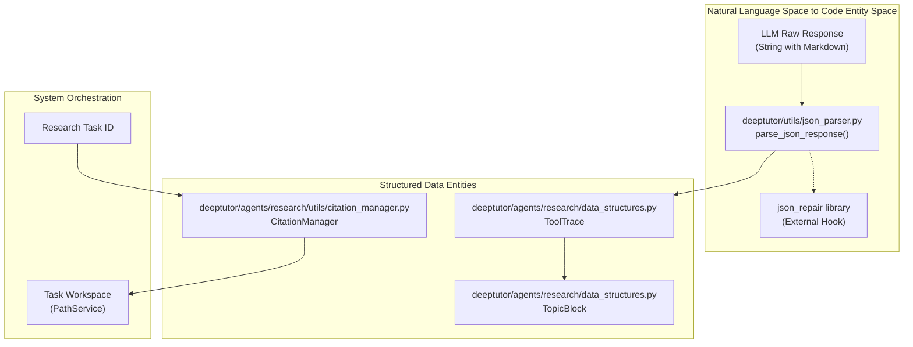
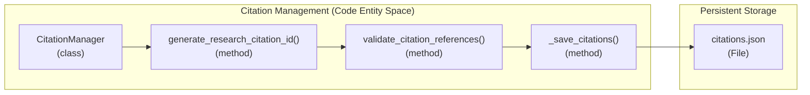

# Utilities and Helpers

Relevant source files

The following files were used as context for generating this wiki page:

- [deeptutor/agents/research/data_structures.py](deeptutor/agents/research/data_structures.py)
- [deeptutor/agents/research/utils/citation_manager.py](deeptutor/agents/research/utils/citation_manager.py)
- [deeptutor/utils/json_parser.py](deeptutor/utils/json_parser.py)

## Purpose and Scope

This page provides an overview of common utility functions and helper modules used throughout the DeepTutor codebase. These utilities handle cross-cutting concerns such as robust JSON parsing from LLM outputs, URL sanitization for various LLM providers, document validation/extraction for RAG systems, and unified logging infrastructure. These helpers bridge the gap between raw LLM outputs and the structured data required by the agent orchestration layers.

**Detailed Coverage:**
- **[JSON Utilities](#11.1)**: Robust JSON extraction from LLM outputs and parsing utilities.
- **[URL Sanitization and Server Detection](#11.2)**: URL cleaning, local server detection, and API compatibility utilities.
- **[Logging Infrastructure](#11.3)**: Unified logging system with console, file, and WebSocket handlers.

Sources: [deeptutor/utils/json_parser.py:1-10](), [deeptutor/agents/research/utils/citation_manager.py:1-5]()

---

## Utility Module Architecture

**Utility Interaction Flow**

This diagram illustrates how utility modules transform unstructured input into structured data. The `parse_json_response` function [deeptutor/utils/json_parser.py:34-38]() acts as a primary gateway for LLM communication, implementing a three-tier strategy to extract and fix JSON. For the Research module, the `CitationManager` [deeptutor/agents/research/utils/citation_manager.py:18-19]() handles the lifecycle of evidence IDs like `CIT-X-XX` [deeptutor/agents/research/utils/citation_manager.py:84-84]() and `PLAN-XX` [deeptutor/agents/research/utils/citation_manager.py:58-58](). To prevent context overflow, `ToolTrace` implements intelligent truncation [deeptutor/agents/research/data_structures.py:95-105]() that preserves JSON validity while respecting the `DEFAULT_RAW_ANSWER_MAX_SIZE` of 50KB [deeptutor/agents/research/data_structures.py:63-63]().

Sources: [deeptutor/utils/json_parser.py:34-106](), [deeptutor/agents/research/utils/citation_manager.py:18-47](), [deeptutor/agents/research/data_structures.py:63-133]()

---

## JSON Processing Utilities

DeepTutor provides robust JSON extraction utilities specifically designed to handle LLM output, which often contains JSON embedded in natural language or Markdown code blocks. For details, see [JSON Utilities](#11.1).

### Core Functions
- `parse_json_response()`: Implements a three-tier parsing strategy: markdown extraction via regex [deeptutor/utils/json_parser.py:75-79](), direct parsing [deeptutor/utils/json_parser.py:82-83](), and automated repair via `json-repair` if available [deeptutor/utils/json_parser.py:93-98]().
- `safe_json_loads()`: A simple wrapper for `json.loads` that returns a fallback value (defaulting to `{}`) on failure to prevent runtime crashes [deeptutor/utils/json_parser.py:108-125]().
- `_truncate_raw_answer()`: A specialized method in `ToolTrace` that attempts to parse malformed JSON before truncating to preserve key fields like `answer`, `content`, or `chunks` while adding a `[truncated]` marker [deeptutor/agents/research/data_structures.py:110-121]().

### Research Data Integration
The `ToolTrace` class uses `parse_json_response` to intelligently truncate tool outputs while maintaining valid JSON structure [deeptutor/agents/research/data_structures.py:110-111](). This ensures that the Research agent's trace history [deeptutor/agents/research/data_structures.py:67-70]() remains within context window limits without breaking the data schema used for reporting.

Sources: [deeptutor/utils/json_parser.py:34-126](), [deeptutor/agents/research/data_structures.py:63-133]()

---

## URL and Server Utilities

The system includes helpers to manage the complexities of local vs. remote LLM providers and API endpoint sanitization. For details, see [URL Sanitization and Server Detection](#11.2).

### URL Handling
Utilities ensure that `base_url` strings are correctly formatted for specific providers and detect if the system is running in a restricted environment like Docker to adjust local networking addresses. This is critical for connecting to local Ollama or vLLM instances where `localhost` might refer to the container rather than the host.

---

## Logging and Tracing Infrastructure

DeepTutor maintains a unified logging system that captures activity across all modules. This is critical for tracing the complex multi-agent interactions. For details, see [Logging Infrastructure](#11.3).

### Research Tracing and Citations
The `CitationManager` provides a structured way to track evidence across the research lifecycle, generating unique IDs for planning (`PLAN-XX`) and research (`CIT-X-XX`) stages [deeptutor/agents/research/utils/citation_manager.py:50-84](). It persists these in a `citations.json` file [deeptutor/agents/research/utils/citation_manager.py:35-35]() within the task workspace provided by the `PathService` [deeptutor/agents/research/utils/citation_manager.py:31-31]().

**Citation Management Flow**

The `CitationManager` ensures that citations generated by agents are valid and exist in the research cache [deeptutor/agents/research/utils/citation_manager.py:175-189](). This allows the system to cross-reference LLM-generated reports with raw tool outputs stored in `ToolTrace` objects [deeptutor/agents/research/data_structures.py:67-81](). The manager maintains thread-safety during parallel research via an `asyncio.Lock` [deeptutor/agents/research/utils/citation_manager.py:46-46](), which is essential when multiple sub-topics are being investigated simultaneously.

Sources: [deeptutor/agents/research/utils/citation_manager.py:18-189](), [deeptutor/agents/research/data_structures.py:67-81](), [deeptutor/utils/json_parser.py:29-30]()
