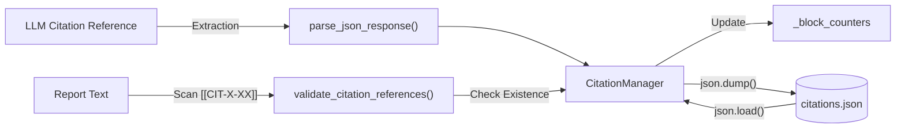

# JSON Utilities

<details>
<summary>Relevant source files</summary>

The following files were used as context for generating this wiki page:

- [deeptutor/agents/research/data_structures.py](deeptutor/agents/research/data_structures.py)
- [deeptutor/agents/research/utils/citation_manager.py](deeptutor/agents/research/utils/citation_manager.py)
- [deeptutor/utils/json_parser.py](deeptutor/utils/json_parser.py)

</details>


## Purpose and Scope

The JSON Utilities module provides robust parsing and extraction functions specifically designed to handle JSON data embedded in LLM outputs. Large language models frequently generate JSON responses wrapped in markdown code blocks, mixed with explanatory text, or containing formatting errors that violate standard JSON syntax. This module implements a multi-strategy extraction pipeline that sanitizes and parses JSON from diverse text formats, including automatic repair of malformed structures.

This page documents the utilities in `deeptutor/utils/json_parser.py`. These utilities are foundational to the system's operation, used by the **Deep Research** module for citation management [deeptutor/agents/research/utils/citation_manager.py:15-15](), core data structure truncation [deeptutor/agents/research/data_structures.py:16-16](), and general agent response processing.

---

## Core Parsing Logic

The system utilizes a tiered strategy for parsing JSON, primarily implemented in `parse_json_response`. This function is designed to be "agent-safe," meaning it expects and handles the common formatting quirks of LLMs.

### Three-Tier Parsing Strategy

The `parse_json_response` function [deeptutor/utils/json_parser.py:34-105]() follows this execution path:

1.  **Markdown Extraction**: If the string contains ` ``` `, it uses regex `r"```(?:json)?\s*\n?(.*?)```"` to isolate the content within the first code block [deeptutor/utils/json_parser.py:75-80]().
2.  **Direct Parsing**: Attempts a standard `json.loads()` on the extracted (or original) string [deeptutor/utils/json_parser.py:82-85]().
3.  **Automated Repair**: If direct parsing fails, it attempts to use the `json-repair` library (via the `repair_json` hook) to fix common issues like trailing commas, missing quotes, or unescaped characters [deeptutor/utils/json_parser.py:88-98]().

**Sources:** [deeptutor/utils/json_parser.py:17-105]()

### Extraction Flowchart

> **Figure 1: Robust JSON Parsing Flow**
> This diagram illustrates the logic within `parse_json_response` to bridge "Natural Language Space" (LLM text) to "Code Entity Space" (Python dict/list).

```mermaid
flowchart TD
    Input["Input: Raw LLM String"]
    CheckEmpty{"Is Empty?"}
    Markdown{"Contains ```?"}
    ExtractMD["Extract via Regex<br/>'re.search(r\"```(?:json)?...\", response)'"]
    
    TryDirect["Strategy 1: json.loads()"]
    CheckDirect{"Success?"}
    
    TryRepair["Strategy 2: repair_json()"]
    CheckRepair{"Success?"}
    
    ReturnVal["Return: Parsed Object"]
    ReturnFallback["Return: Fallback (default {})"]

    Input --> CheckEmpty
    CheckEmpty -->|Yes| ReturnFallback
    CheckEmpty -->|No| Markdown
    
    Markdown -->|Yes| ExtractMD
    Markdown -->|No| TryDirect
    ExtractMD --> TryDirect
    
    TryDirect --> CheckDirect
    CheckDirect -->|Yes| ReturnVal
    CheckDirect -->|No| TryRepair
    
    TryRepair --> CheckRepair
    CheckRepair -->|Yes| ReturnVal
    CheckRepair -->|No| ReturnFallback
```

**Sources:** [deeptutor/utils/json_parser.py:34-105]()

---

## Intelligent Truncation

When managing large datasets like research tool traces, the system must ensure that JSON objects do not exceed size limits while remaining valid and parsable. The `ToolTrace` class [deeptutor/agents/research/data_structures.py:67-81]() implements intelligent truncation.

### Truncation Mechanism

The `_truncate_raw_answer` method [deeptutor/agents/research/data_structures.py:94-133]() prevents memory overflow from massive tool outputs (default limit: 50KB) [deeptutor/agents/research/data_structures.py:63-63]():

1.  **JSON Awareness**: It attempts to parse the string into a Python object first using `parse_json_response` [deeptutor/agents/research/data_structures.py:110-110]().
2.  **Field-Specific Pruning**: It targets specific fields like `answer`, `content`, `text`, `chunks`, or `documents`. If these fields are strings, they are sliced [deeptutor/agents/research/data_structures.py:115-116](); if they are lists, it prunes them to the first 3 items [deeptutor/agents/research/data_structures.py:118-120]().
3.  **Structure Preservation**: After pruning the Python object, it attempts to re-serialize it to JSON [deeptutor/agents/research/data_structures.py:123-125]().
4.  **Fallback**: If JSON parsing fails or the object is still too large, it performs a hard string truncation with a descriptive marker including the original size [deeptutor/agents/research/data_structures.py:130-133]().

**Sources:** [deeptutor/agents/research/data_structures.py:63-133](), [deeptutor/agents/research/data_structures.py:170-185]()

---

## Data Flow in Research Context

The JSON utilities are critical for the `CitationManager` when persisting research progress and validating citation references within generated text.

> **Figure 2: Citation Management Data Flow**
> Bridges "Code Entity Space" (Citation objects) to "Storage Space" (JSON files).



**Sources:** [deeptutor/agents/research/utils/citation_manager.py:113-171](), [deeptutor/agents/research/utils/citation_manager.py:15-15](), [deeptutor/agents/research/utils/citation_manager.py:175-200]()

---

## Utility Functions Summary

| Function | Location | Purpose |
| :--- | :--- | :--- |
| `parse_json_response` | `deeptutor/utils/json_parser.py` | Main entry point for LLM JSON extraction with repair logic [deeptutor/utils/json_parser.py:34](). |
| `safe_json_loads` | `deeptutor/utils/json_parser.py` | Simple wrapper for `json.loads` that returns a fallback on error [deeptutor/utils/json_parser.py:108](). |
| `_truncate_raw_answer` | `deeptutor/agents/research/data_structures.py` | Prunes JSON structures while maintaining validity [deeptutor/agents/research/data_structures.py:94](). |

### Error Handling and Fallbacks

The utilities are designed to be resilient:
*   `parse_json_response` defaults to an empty dictionary `{}` if all parsing and repair strategies fail [deeptutor/utils/json_parser.py:65-66]().
*   `safe_json_loads` allows for custom fallbacks and logs a warning on `JSONDecodeError` [deeptutor/utils/json_parser.py:123-126]().
*   The `repair_json` hook is dynamically loaded, ensuring the system remains functional even if the `json-repair` library is missing [deeptutor/utils/json_parser.py:19-27]().

**Sources:** [deeptutor/utils/json_parser.py:19-126](), [deeptutor/agents/research/data_structures.py:110-133]()
