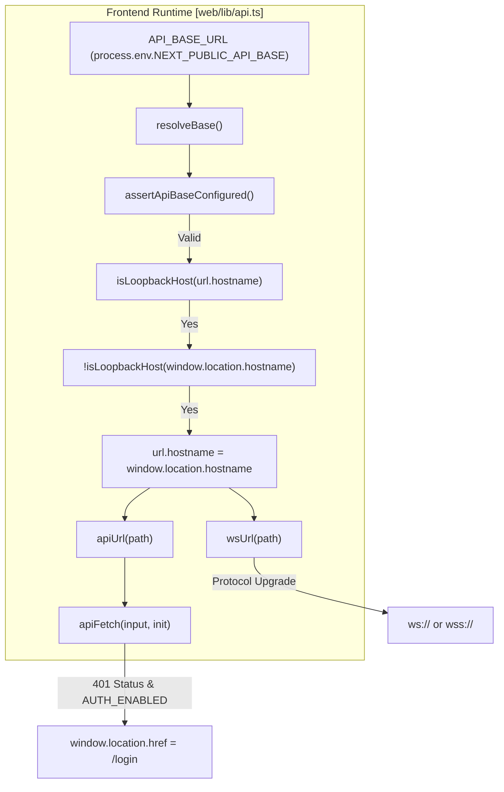
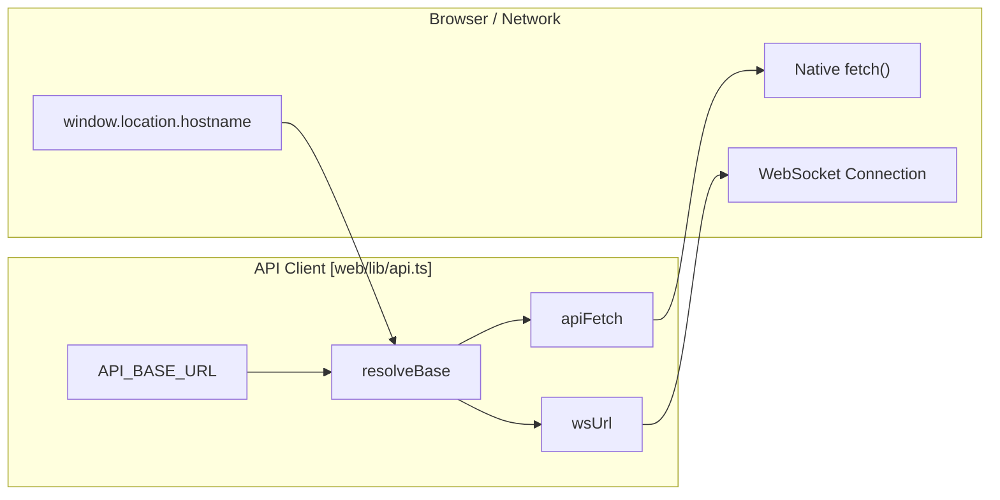

# URL Sanitization and Server Detection

Relevant source files

The following files were used as context for generating this wiki page:

- [tests/api/test_unified_ws_turn_runtime.py](tests/api/test_unified_ws_turn_runtime.py)
- [tests/services/memory/test_meta_settings.py](tests/services/memory/test_meta_settings.py)
- [tests/services/session/test_regenerate.py](tests/services/session/test_regenerate.py)
- [tests/services/session/test_turn_runtime_subscribe.py](tests/services/session/test_turn_runtime_subscribe.py)
- [tests/services/test_path_service.py](tests/services/test_path_service.py)
- [web/lib/api.ts](web/lib/api.ts)
- [web/proxy.ts](web/proxy.ts)
- [web/tests/api-resolve-base.test.ts](web/tests/api-resolve-base.test.ts)

## Purpose and Scope

This document describes the URL sanitization, local server detection, and API endpoint normalization utilities that enable DeepTutor to communicate reliably with diverse LLM providers, search engines, and frontend services. These utilities handle the automatic detection of local loopback addresses to facilitate cross-device LAN access, ensure secure WebSocket protocol enforcement, and manage authenticated fetch requests. This ensures that whether the system is running in a local dev environment, a Docker container, or a production reverse proxy, network requests reach their intended destinations.

**Sources:** [web/lib/api.ts:1-21]()

---

## Runtime API Base Resolution

DeepTutor uses a dynamic resolution strategy for its API base URL to solve the "Localhost Problem" in LAN environments.

### Loopback Host Detection and Swapping
When the frontend is built, `NEXT_PUBLIC_API_BASE` is typically set to `http://localhost:<port>`. If a user accesses the frontend from a different machine on the network, "localhost" would incorrectly point to the *user's* machine instead of the *server*.

The `resolveBase` function in `web/lib/api.ts` detects this by checking if the configured API host is a loopback address (`127.0.0.1`, `localhost`, `0.0.0.0`, `::1`, or `[::1]`) while the browser's current `window.location.hostname` is a remote address. If detected, it automatically swaps the hostname to ensure the frontend can reach the backend.

**Sources:** [web/lib/api.ts:46-52](), [web/lib/api.ts:73-90]()

### Placeholder Detection
The system uses a specific token `NEXT_PUBLIC_API_BASE_PLACEHOLDER` during Docker builds [web/lib/api.ts:10-10](). The `isApiBasePlaceholder` function identifies if this token has been successfully substituted by the launcher at startup [web/lib/api.ts:19-21](). If the substitution fails, the `assertApiBaseConfigured` function triggers a console error and throws an exception to prevent silent failures [web/lib/api.ts:23-41]().

**Sources:** [web/lib/api.ts:10-21](), [web/lib/api.ts:23-41]()

### URL Construction Utilities
The system provides helpers to build full URLs for REST and WebSockets, ensuring consistent path joining and protocol selection.

| Function | File | Purpose |
| :--- | :--- | :--- |
| `resolveBase` | `web/lib/api.ts` | Resolves the effective API root, handling loopback host swapping. |
| `apiUrl` | `web/lib/api.ts` | Appends paths to the resolved base, preventing double slashes. |
| `wsUrl` | `web/lib/api.ts` | Converts `http(s)` to `ws(s)` and appends the WebSocket path. |
| `apiFetch` | `web/lib/api.ts` | Authenticated fetch wrapper that handles 401 redirects to `/login`. |

**Sources:** [web/lib/api.ts:73-95](), [web/lib/api.ts:102-111](), [web/lib/api.ts:118-132]()

**Network Resolution Data Flow**

**Sources:** [web/lib/api.ts:17-21](), [web/lib/api.ts:23-41](), [web/lib/api.ts:46-52](), [web/lib/api.ts:73-95](), [web/lib/api.ts:102-111](), [web/lib/api.ts:118-132](), [web/lib/api.ts:140-153]()

---

## Authentication and Security Utilities

The system includes utilities to handle security hardening for WebSockets and session management for authenticated requests.

### WebSocket Protocol Enforcement
The `wsUrl` function performs security hardening by explicitly replacing `http:` with `ws:` and `https:` with `wss:` [web/lib/api.ts:121-123](). This ensures that in production environments where the API is served over TLS, the WebSocket connection also utilizes encryption.

**Sources:** [web/lib/api.ts:118-124]()

### Authenticated Fetch Wrapper
The `apiFetch` utility serves as a proxy for the standard `fetch` API. It enforces session persistence by setting `credentials: "include"` and provides a global handler for authentication failures [web/lib/api.ts:140-144](). If the backend returns a `401 Unauthorized` status and `NEXT_PUBLIC_AUTH_ENABLED` is true, the utility automatically redirects the user to the login page, preserving the current path as a redirect parameter via `encodeURIComponent` [web/lib/api.ts:146-150]().

**Sources:** [web/lib/api.ts:134-153]()

### Path Security and Sanitization
On the backend, the `PathService` provides utilities to ensure that requested file paths are within allowed public artifact directories. The `is_public_output_path` method validates that paths for plots, animations, and generated reports (e.g., PDF, PNG, MP4) do not escape into sensitive directories like `settings/` or source code folders [tests/services/test_path_service.py:8-120]().

**Sources:** [tests/services/test_path_service.py:8-120]()

**Entity Mapping: Web API Utilities**

**Sources:** [web/lib/api.ts:17-21](), [web/lib/api.ts:73-95](), [web/lib/api.ts:118-132](), [web/lib/api.ts:140-153]()

---

## Session and Turn Utilities

The backend `TurnRuntimeManager` handles the sanitization of turn requests, including the extraction of internal flags like `_regenerate`.

### Regenerate Flag Extraction
When a user requests to regenerate a response, the backend uses `_extract_regenerate_flag` to identify the intent from the configuration payload. This function safely pops the flag from the config dictionary and converts truthy string values (e.g., "true", "1") into booleans [tests/services/session/test_regenerate.py:42-62]().

**Sources:** [tests/services/session/test_regenerate.py:42-62]()

### Stale Turn Detection
The `TurnRuntimeManager` detects and cleans up "orphan" turns—turns marked as "running" in the database but lacking an active in-process execution. This typically occurs after a server restart. During subscription or starting a new turn, the system identifies these stale turns and marks them as "failed" to prevent blocking the UI [tests/services/session/test_turn_runtime_subscribe.py:49-104]().

**Sources:** [tests/services/session/test_turn_runtime_subscribe.py:49-104]()
