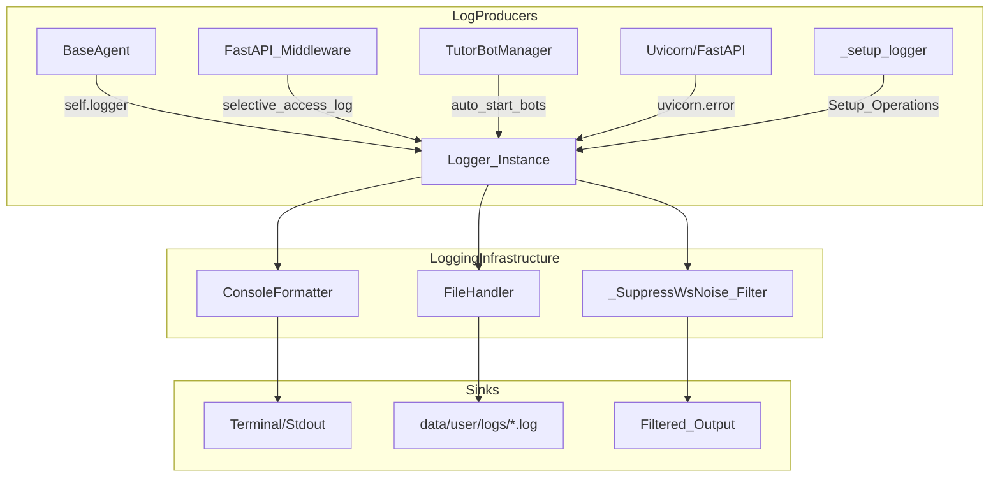
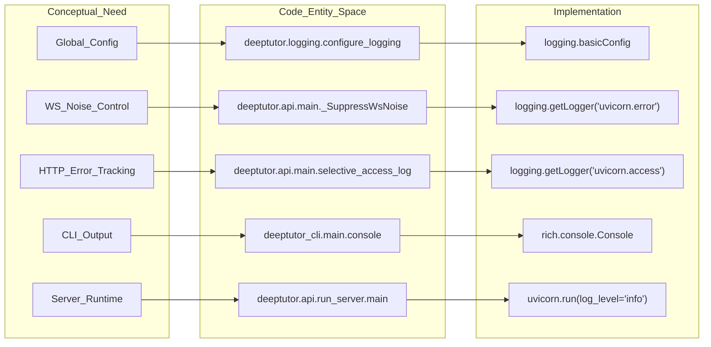

# Logging Infrastructure

Relevant source files

The following files were used as context for generating this wiki page:

- [.github/workflows/pypi-release.yml](.github/workflows/pypi-release.yml)
- [.gitignore](.gitignore)
- [deeptutor/api/run_server.py](deeptutor/api/run_server.py)
- [deeptutor_cli/main.py](deeptutor_cli/main.py)
- [requirements.txt](requirements.txt)
- [requirements/dev.txt](requirements/dev.txt)
- [requirements/math-animator.txt](requirements/math-animator.txt)

The DeepTutor logging infrastructure provides a unified, thread-safe, and multi-channel logging system designed to support the complex requirements of an agent-native architecture. It facilitates real-time debugging via the console, persistent storage for audit trails, and specialized filtering for high-churn asynchronous operations across CLI and Server environments.

## Architecture Overview

The logging system is built upon the standard Python `logging` library, enhanced with custom formatters and filters. It ensures that every module—from the low-level LLM services to the high-level agent orchestrators—outputs structured and consistent logs. The system is initialized early in the process lifecycle via `configure_logging()` [deeptutor_cli/main.py:27-27](), [deeptutor/api/run_server.py:41-41]().

### Log Flow Diagram
This diagram illustrates how log records generated by various system components are processed and routed to different sinks, including specialized handling for WebSocket noise.

**Log Record Routing and Handling**

Sources: [deeptutor/api/run_server.py:41-41](), [deeptutor_cli/main.py:27-27](), [deeptutor/api/main.py:30-40](), [deeptutor/api/main.py:176-188]()

## Core Components

### Logging Configuration
The system is initialized via `configure_logging()`. In the CLI, this happens immediately after setting the `RunMode` [deeptutor_cli/main.py:26-27](). In the server, it is invoked within the `main()` startup routine before the `uvicorn` runner is triggered [deeptutor/api/run_server.py:40-42]().

### Log Filtering and Noise Reduction
To maintain a clean log stream during high-concurrency operations, the system implements custom filters:

*   **WebSocket Suppression**: The `_SuppressWsNoise` filter inherits from `logging.Filter` to silence repetitive Uvicorn logs related to WebSocket connection churn ("connection open" and "connection closed") [deeptutor/api/main.py:30-37](). This filter is applied specifically to the `uvicorn.error` logger [deeptutor/api/main.py:40-40]().
*   **Selective Access Logging**: Instead of logging every request via standard Uvicorn access logs (which are typically disabled in the server runner via `access_log=False` [deeptutor/api/run_server.py:68-68]()), the `selective_access_log` middleware only captures non-200 HTTP responses. This prevents logs from being flooded with routine health checks while ensuring errors are recorded [deeptutor/api/main.py:176-188]().

### Structured Access Logs
When logging non-200 requests, the system explicitly formats the record to be compatible with `uvicorn`'s `AccessFormatter`, providing a 5-element tuple containing the Client Host, Method, Path, HTTP Version, and Status Code [deeptutor/api/main.py:180-187]().

## Code Entity Mapping

The following diagram bridges the conceptual logging requirements to the specific code entities and data structures used in the implementation.

**Natural Language to Code Entity Space**

Sources: [deeptutor/api/run_server.py:41-69](), [deeptutor_cli/main.py:9-27](), [deeptutor/api/main.py:30-40](), [deeptutor_cli/common.py:14-14]()

## Integration with System Modules

### CLI and Console Output
The CLI utilizes a dedicated `rich` console instance for formatted output [deeptutor_cli/common.py:14-14](). While internal logic uses standard Python logging, the CLI entry points use `console.print` for user-facing errors, such as missing API server dependencies [deeptutor_cli/main.py:148-151]().

### Server Lifecycle and Uvicorn
The server startup script `deeptutor/api/run_server.py` configures `uvicorn` to use a specific log level and excludes high-churn data directories from the auto-reload watcher to prevent unnecessary restart loops [deeptutor/api/run_server.py:46-69](). It also forces unbuffered output to ensure logs are visible in containerized environments [deeptutor/api/run_server.py:23-27]().

### Application Lifecycle
The `lifespan` context manager in the main API entry point logs critical startup and shutdown milestones, including LLM client initialization and EventBus activation [deeptutor/api/main.py:91-160]().

### RAG and Knowledge Base Logging
The `RAGService` utilizes a specialized `_capture_raw_logs` context manager. This allows the service to capture internal logs generated during a knowledge base search and emit them as `raw_log` events through an `event_sink` [deeptutor/services/rag/service.py:138-160](). This bridges the gap between standard Python logging and the real-time event streaming protocol used by the frontend.

### LLM Utilities
The system provides `clean_thinking_tags` to remove `<think>` blocks from model outputs before they are processed by downstream loggers or UI components, ensuring that internal model "scratchpads" do not clutter the structured logs [deeptutor/services/llm/utils.py:142-164]().

Sources: [deeptutor/api/run_server.py:23-69](), [deeptutor_cli/main.py:148-151](), [deeptutor/api/main.py:91-160](), [deeptutor/services/rag/service.py:138-160](), [deeptutor/services/llm/utils.py:142-164]()
