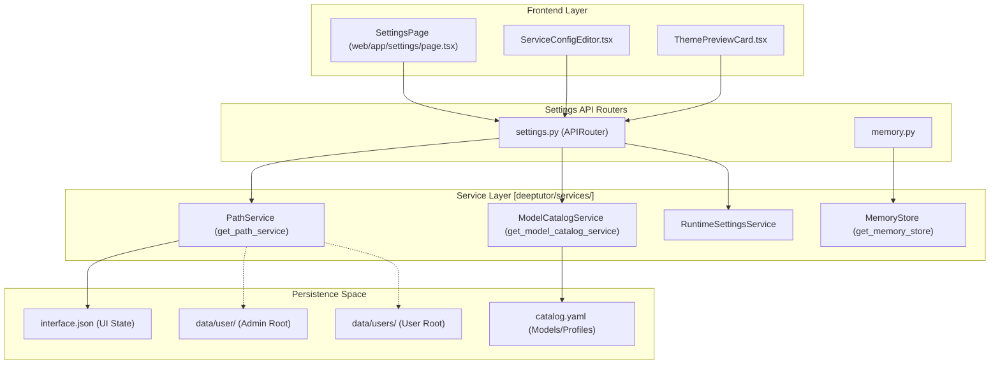
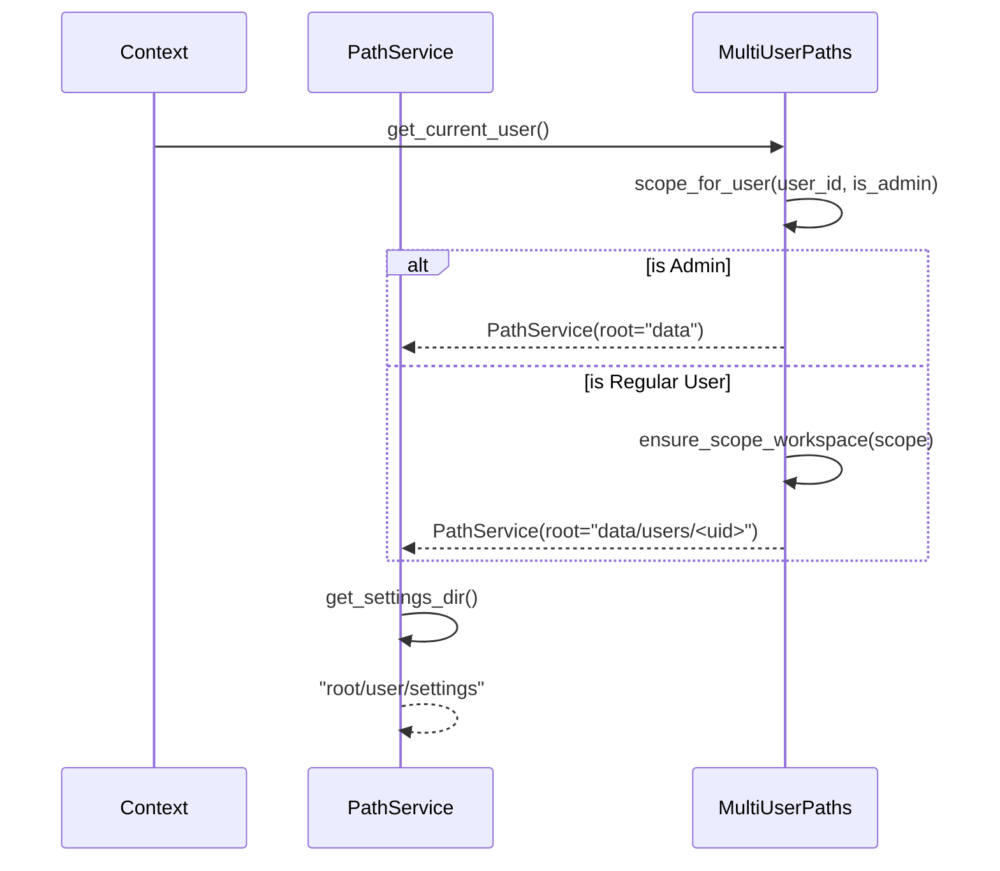

# Settings API

Relevant source files

The following files were used as context for generating this wiki page:

- [deeptutor/api/routers/memory.py](deeptutor/api/routers/memory.py)
- [deeptutor/api/routers/settings.py](deeptutor/api/routers/settings.py)
- [deeptutor/multi_user/context.py](deeptutor/multi_user/context.py)
- [deeptutor/multi_user/paths.py](deeptutor/multi_user/paths.py)
- [deeptutor/services/path_service.py](deeptutor/services/path_service.py)
- [tests/api/test_settings_router.py](tests/api/test_settings_router.py)
- [web/components/settings/ServiceConfigEditor.tsx](web/components/settings/ServiceConfigEditor.tsx)
- [web/components/settings/ThemePreviewCard.tsx](web/components/settings/ThemePreviewCard.tsx)

The Settings API provides REST endpoints for managing DeepTutor's runtime configuration, including UI preferences, model catalogs, multi-user access control, capability tunables, and diagnostic tests. It serves as the primary interface for users and administrators to configure LLM providers, embedding models, and agent behaviors.

---

## Overview and Scope

The Settings API is implemented primarily in `deeptutor/api/routers/settings.py` [[deeptutor/api/routers/settings.py:1-6]](). It manages several distinct configuration layers:

1.  **UI Preferences**: Client-side settings such as `theme`, `language`, and `sidebar_nav_order` stored in `interface.json` within the user's settings directory [[deeptutor/api/routers/settings.py:42-44]](), [[deeptutor/api/routers/settings.py:57-68]]().
2.  **Model Catalog**: A structured management system for LLM, Embedding, and Search profiles accessed via `get_model_catalog_service()` [[deeptutor/api/routers/settings.py:26-26]]().
3.  **Tool Management**: User-toggleable chat tools that can be enabled or disabled via the settings interface, based on `USER_TOGGLEABLE_TOOL_NAMES` [[deeptutor/api/routers/settings.py:35-35]](), [[deeptutor/api/routers/settings.py:199-212]]().
4.  **Network and Environment**: Configuration for backend/frontend ports, CORS origins, and public API bases via `NetworkSettingsUpdate` [[deeptutor/api/routers/settings.py:113-118]]().
5.  **Multi-User Access**: Integration with the context system to provide users with authorized model options via `allowed_llm_options` [[deeptutor/api/routers/settings.py:22-23]]().

**Sources**: [[deeptutor/api/routers/settings.py:1-37]](), [[deeptutor/api/routers/settings.py:113-118]]()

---

## Settings API Architecture

The Settings API integrates with the `PathService` to resolve storage locations and the `ModelCatalogService` to manage provider configurations.

### Configuration Flow and Code Entities

**Sources**: [[deeptutor/api/routers/settings.py:37-50]](), [[deeptutor/api/routers/memory.py:84-86]](), [[deeptutor/multi_user/paths.py:1-10]](), [[web/components/settings/ServiceConfigEditor.tsx:45-69]]()

---

## UI and Tool Management

### UI Settings
UI settings control visual presentation and are persisted in the user's workspace.
- **Models**: `UISettings` handles `theme` (light, dark, glass, snow) and `language` (zh, en) [[deeptutor/api/routers/settings.py:76-81]]().
- **Default Sidebar**: Defined by `DEFAULT_SIDEBAR_NAV_ORDER` including paths like `/history`, `/knowledge`, and `/research` [[deeptutor/api/routers/settings.py:52-55]]().
- **Persistence**: Settings are saved via `save_ui_settings()` to a file path provided by `get_path_service().get_settings_file("interface")` [[deeptutor/api/routers/settings.py:42-44]](), [[deeptutor/api/routers/settings.py:215-225]]().

### Tool Switchboard
DeepTutor features a toggleable tool system. 
- **Toggleable Tools**: Defined in `USER_TOGGLEABLE_TOOL_NAMES` [[deeptutor/api/routers/settings.py:35-35]]().
- **Sanitization**: `_sanitize_enabled_tools` ensures retired or invalid tool names do not persist and filters duplicates [[deeptutor/api/routers/settings.py:186-196]]().
- **Retrieval**: `get_enabled_optional_tools()` serves as the source of truth, intersecting saved toggles with the admin grant whitelist [[deeptutor/api/routers/settings.py:199-212]]().

**Sources**: [[deeptutor/api/routers/settings.py:52-81]](), [[deeptutor/api/routers/settings.py:186-212]]()

---

## Long-Term Memory (Memory v3) API

Managed in `deeptutor/api/routers/memory.py`, this API provides a workbench for the three-layer memory subsystem.

- **Overview**: `GET /overview` returns the state of all memory documents (L2 and L3) and lists available v1-migration backups [[deeptutor/api/routers/memory.py:84-92]]().
- **Document Access**: `GET` and `PUT` endpoints for `/doc/{layer}/{key}` allow reading and manual editing of memory markdown files [[deeptutor/api/routers/memory.py:140-156]]().
- **Entry Resolution**: `GET /resolve_entry/{entry_id}` scans L2 documents (e.g., `chat`, `solve`) to find the owner of a specific entry ID (e.g., for L3 footnote navigation) [[deeptutor/api/routers/memory.py:95-121]]().
- **Lifecycle**: `POST /doc/{layer}/{key}/reset` wipes a document and its metadata sidecar (e.g. `seen_entity_refs`) to force fresh re-ingestion [[deeptutor/api/routers/memory.py:169-180]]().

**Sources**: [[deeptutor/api/routers/memory.py:1-28]](), [[deeptutor/api/routers/memory.py:84-121]](), [[deeptutor/api/routers/memory.py:169-180]]()

---

## Model Catalog and Runtime Integration

The Model Catalog allows administrators to define multiple provider profiles (e.g., OpenAI, Ollama, Anthropic).

### Catalog Invalidation
When the catalog is updated or applied, the system must force runtime clients to pick up changes. `_invalidate_runtime_caches()` resets process-wide singletons [[deeptutor/api/routers/settings.py:150-164]]():
1. `clear_llm_config_cache()`: Clears cached provider configurations [[deeptutor/api/routers/settings.py:162]]().
2. `reset_llm_client()`: Re-instantiates the global LLM client [[deeptutor/api/routers/settings.py:163]]().
3. `reset_embedding_client()`: Re-instantiates the global embedding client [[deeptutor/api/routers/settings.py:164]]().

### Network Settings Normalization
When updating network settings via `update_network_settings`, CORS origins are normalized using `normalize_origins` [[deeptutor/api/routers/settings.py:29]](). This process handles multiple formats (semicolon or comma separated) and strips paths to keep only the origin [[tests/api/test_settings_router.py:182-199]]().

**Sources**: [[deeptutor/api/routers/settings.py:150-164]](), [[tests/api/test_settings_router.py:182-199]]()

---

## Multi-User Context and Path Resolution

DeepTutor uses a scoped path system to separate administrative data from user-specific data.

### Workspace Resolution Logic

**Sources**: [[deeptutor/multi_user/paths.py:85-102]](), [[deeptutor/multi_user/paths.py:139-151]](), [[deeptutor/services/path_service.py:80-85]](), [[deeptutor/services/path_service.py:175-176]]()

### Storage Layout
The `PathService` determines storage locations based on the `CurrentUser` context:
- **Admin Workspace**: `data/` [[deeptutor/multi_user/paths.py:33]]().
- **Multi-User Workspace**: `data/users/<uid>` [[deeptutor/multi_user/paths.py:7]](), [[deeptutor/multi_user/paths.py:102]]().
- **System Data**: `data/system` for auth, grants, and audit logs [[deeptutor/multi_user/paths.py:9-10]](), [[deeptutor/multi_user/paths.py:35]]().

### Access Control
- **User Context**: `get_current_user()` returns the active user from context variables or defaults to the `local_admin_user()` [[deeptutor/multi_user/context.py:22-23]]().
- **Redaction**: When standard users fetch settings, sensitive fields like API tokens for MinerU are redacted (returning `None` or empty) to prevent leakage [[deeptutor/api/routers/settings.py:120-130]](), [[tests/api/test_settings_router.py:202-210]]().

**Sources**: [[deeptutor/multi_user/paths.py:32-36]](), [[deeptutor/multi_user/context.py:22-23]](), [[deeptutor/api/routers/settings.py:120-130]]()
