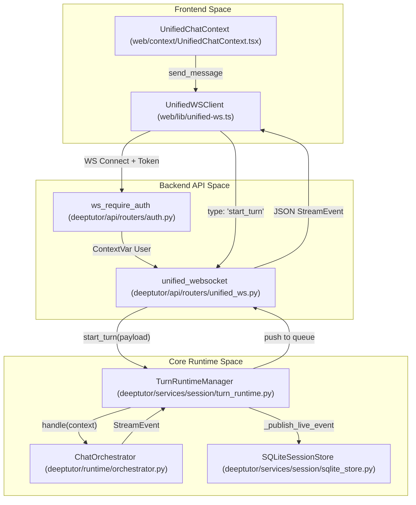
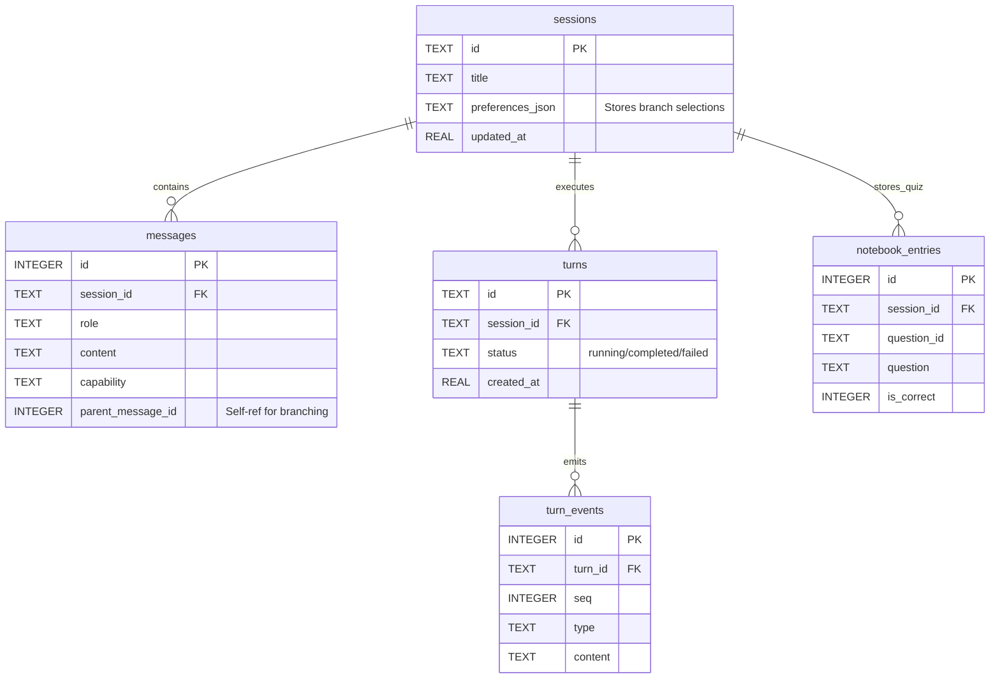

# Unified WebSocket and Session API

Relevant source files

The following files were used as context for generating this wiki page:

- [deeptutor/api/routers/sessions.py](deeptutor/api/routers/sessions.py)
- [deeptutor/api/routers/unified_ws.py](deeptutor/api/routers/unified_ws.py)
- [deeptutor/core/stream.py](deeptutor/core/stream.py)
- [deeptutor/learning/storage.py](deeptutor/learning/storage.py)
- [deeptutor/services/session/pocketbase_store.py](deeptutor/services/session/pocketbase_store.py)
- [deeptutor/services/session/sqlite_store.py](deeptutor/services/session/sqlite_store.py)
- [deeptutor/services/session/turn_runtime.py](deeptutor/services/session/turn_runtime.py)
- [deeptutor/services/storage/attachment_store.py](deeptutor/services/storage/attachment_store.py)
- [tests/api/test_unified_ws_turn_runtime.py](tests/api/test_unified_ws_turn_runtime.py)
- [tests/services/memory/test_meta_settings.py](tests/services/memory/test_meta_settings.py)
- [tests/services/session/test_regenerate.py](tests/services/session/test_regenerate.py)
- [tests/services/session/test_sqlite_store.py](tests/services/session/test_sqlite_store.py)
- [tests/services/session/test_turn_runtime_subscribe.py](tests/services/session/test_turn_runtime_subscribe.py)
- [tests/services/test_path_service.py](tests/services/test_path_service.py)
- [web/app/(workspace)/chat/[[...sessionId]]/page.tsx](web/app/(workspace)/chat/[[...sessionId]]/page.tsx)
- [web/components/chat/home/ChatMessages.tsx](web/components/chat/home/ChatMessages.tsx)
- [web/context/UnifiedChatContext.tsx](web/context/UnifiedChatContext.tsx)
- [web/lib/api.ts](web/lib/api.ts)
- [web/tests/api-resolve-base.test.ts](web/tests/api-resolve-base.test.ts)

The API layer provides a unified communication interface for real-time agent interaction and persistent session management. It centers around a single WebSocket endpoint for streaming events and a set of RESTful routes for managing conversation history and the Question Notebook.

## Unified WebSocket Protocol

DeepTutor uses a single WebSocket endpoint at `/api/v1/ws` to handle all agentic interactions [deeptutor/api/routers/unified_ws.py:44-45](). This endpoint supports starting new turns, subscribing to existing ones, resuming interrupted streams, and regenerating previous responses.

### Client-to-Server Messages
The protocol defines several message types that the frontend sends to control the agent lifecycle:

| Message Type | Purpose | Key Fields |
|:---|:---|:---|
| `message` / `start_turn` | Initiates a new agent interaction. | `content`, `capability`, `session_id`, `attachments`, `tools` |
| `subscribe_turn` | Listens to an already running background task. | `turn_id`, `after_seq` |
| `subscribe_session` | Streams events for the active turn of a session. | `session_id`, `after_seq` |
| `resume_from` | Reconnects to a turn after a network drop. | `turn_id`, `seq` |
| `unsubscribe` | Stop a previously created subscription. | `turn_id`, `session_id` |
| `cancel_turn` | Signals the backend to abort a specific task. | `turn_id` |
| `regenerate` | Re-runs the last user message in a session. | `session_id`, `overrides` |
| `check_active_turn` | Verifies if a session has a live running turn. | `session_id` |
| `user_input` | Delivers a reply to a pending `ask_user` pause. | `content`, `turn_id` |

Sources: [deeptutor/api/routers/unified_ws.py:7-29](), [deeptutor/api/routers/unified_ws.py:113-200]()

### Server-to-Client Events
The backend streams `StreamEvent` objects. Every event includes a `seq` (sequence number) to ensure ordered delivery and support resumption [deeptutor/core/stream.py:58]().

*   **`stage_start` / `stage_end`**: Marks transitions between agent phases (e.g., Thinking → Acting).
*   **`thinking`**: Real-time reasoning tokens or status from the LLM.
*   **`tool_call` / `tool_result`**: Details of external tool execution.
*   **`content`**: Response fragments (text/markdown).
*   **`result`**: The final structured payload of the turn.
*   **`error`**: Exception details if the turn fails.
*   **`wait_for_input`**: Indicates the agent is paused waiting for user feedback.

Sources: [deeptutor/core/stream.py:17-35](), [deeptutor/api/routers/unified_ws.py:65-67]()

## Session and Turn Management

The backend utilizes `TurnRuntimeManager` to decouple the HTTP/WebSocket request lifecycle from the actual agent execution.

### Turn Execution Flow
When a turn starts, the system initiates the logic via `TurnRuntimeManager.start_turn()` [deeptutor/api/routers/unified_ws.py:118](). The orchestrator then triggers the specific agent pipeline.

**Agentic Event Flow Diagram**

Sources: [deeptutor/api/routers/unified_ws.py:113-134](), [deeptutor/services/session/turn_runtime.py:167-182](), [web/context/UnifiedChatContext.tsx:21-28](), [tests/api/test_unified_ws_turn_runtime.py:167-182]()

### Regeneration and Branching
The system supports "Edit-branching," where a new user message can be inserted as a sibling under a parent message rather than appended to the session tail [web/context/UnifiedChatContext.tsx:77-81]().
*   **`regenerate`**: Re-runs the last user message in the session, replacing the trailing assistant message if one exists [deeptutor/api/routers/unified_ws.py:17-23]().
*   **Branch Selection**: Users can pick between different response branches (siblings), which is persisted in the session preferences [deeptutor/api/routers/sessions.py:25-32](), [deeptutor/api/routers/sessions.py:166-177]().

Sources: [web/context/UnifiedChatContext.tsx:77-81](), [deeptutor/api/routers/sessions.py:166-177](), [deeptutor/api/routers/unified_ws.py:17-23]()

## Session Persistence API

The REST API (located in `deeptutor/api/routers/sessions.py`) provides CRUD operations for conversation history, backed by `SQLiteSessionStore` or `PocketBaseSessionStore`.

### Key Operations

| Operation | Implementation | Description |
|:---|:---|:---|
| List Sessions | `list_sessions` | Returns recent sessions with pagination [deeptutor/api/routers/sessions.py:80-87](). |
| Get Session | `get_session` | Returns a session and its full message history [deeptutor/api/routers/sessions.py:133-140](). |
| Rename | `rename_session` | Updates the session title in the DB [deeptutor/api/routers/sessions.py:143-150](). |
| Delete | `delete_session` | Removes a session and all associated attachments [deeptutor/api/routers/sessions.py:153-163](). |
| Branch Selection | `update_branch_selection` | Updates the active branch path for a session [deeptutor/api/routers/sessions.py:166-177](). |

Sources: [deeptutor/api/routers/sessions.py:80-177](), [deeptutor/services/session/sqlite_store.py:77-86]()

### Data Schema (SQLite)
The `SQLiteSessionStore` manages the persistence layer using several interconnected tables initialized in `_initialize()` [deeptutor/services/session/sqlite_store.py:100-186]().

**Database Entity Relationship Diagram**

Sources: [deeptutor/services/session/sqlite_store.py:100-186]()

## Multi-User Path Isolation
The API supports multi-user isolation by dynamically resolving storage paths based on the `CurrentUser` context via the `PathService`.
*   **Path Service**: Resolves paths for `chat_history.db`, `logs`, and `workspace` [deeptutor/services/path_service.py:113-121]().
*   **Workspace Routing**: Each user has a dedicated directory containing their own database and settings [deeptutor/services/path_service.py:85]().
*   **Auth Guard**: `ws_require_auth` ensures that the WebSocket connection is associated with a valid user before accepting the upgrade [deeptutor/api/routers/unified_ws.py:49-51]().

Sources: [deeptutor/services/path_service.py:85-121](), [deeptutor/api/routers/unified_ws.py:46-51]()

## Question Notebook and Learning Storage

The API includes specialized logic for the **Question Notebook** and **Learning Progress**, which persist structured educational data.
*   **Quiz Results Recording**: The `/quiz-results` endpoint accepts a list of `QuizResultItem` and persists them as both user messages and structured notebook entries [deeptutor/api/routers/sessions.py:195-217]().
*   **Learning Store**: `LearningStore` provides atomic file-based persistence for `LearningProgress` models, ensuring CAS (Compare-and-Swap) semantics via a module-level lock [deeptutor/learning/storage.py:12-44]().
*   **Notebook Upsert**: Handles the insertion of quiz results into the `notebook_entries` table for long-term tracking [deeptutor/services/session/sqlite_store.py:175-186]().

Sources: [deeptutor/api/routers/sessions.py:195-217](), [deeptutor/learning/storage.py:12-51](), [deeptutor/services/session/sqlite_store.py:175-186]()

## Attachment Management

The `AttachmentStore` handles the persistence of binary files uploaded during a chat session or generated by tools.

| Component | Role |
|:---|:---|
| `AttachmentStore` | Protocol defining `put` and `delete` operations [deeptutor/services/storage/attachment_store.py:64-70](). |
| `LocalDiskAttachmentStore` | Implementation saving files to user workspace [deeptutor/services/storage/attachment_store.py:103-109](). |
| `_artifact_attachments` | Extracts tool-generated files (e.g., from code execution) and converts them to message attachments [deeptutor/services/session/turn_runtime.py:61-102](). |
| Attachment Cleanup | Deletes associated files when a session or message is removed [deeptutor/api/routers/sessions.py:160-162](), [deeptutor/api/routers/sessions.py:190-194](). |

Sources: [deeptutor/services/storage/attachment_store.py:64-109](), [deeptutor/api/routers/sessions.py:160-194](), [deeptutor/services/session/turn_runtime.py:61-102]()
