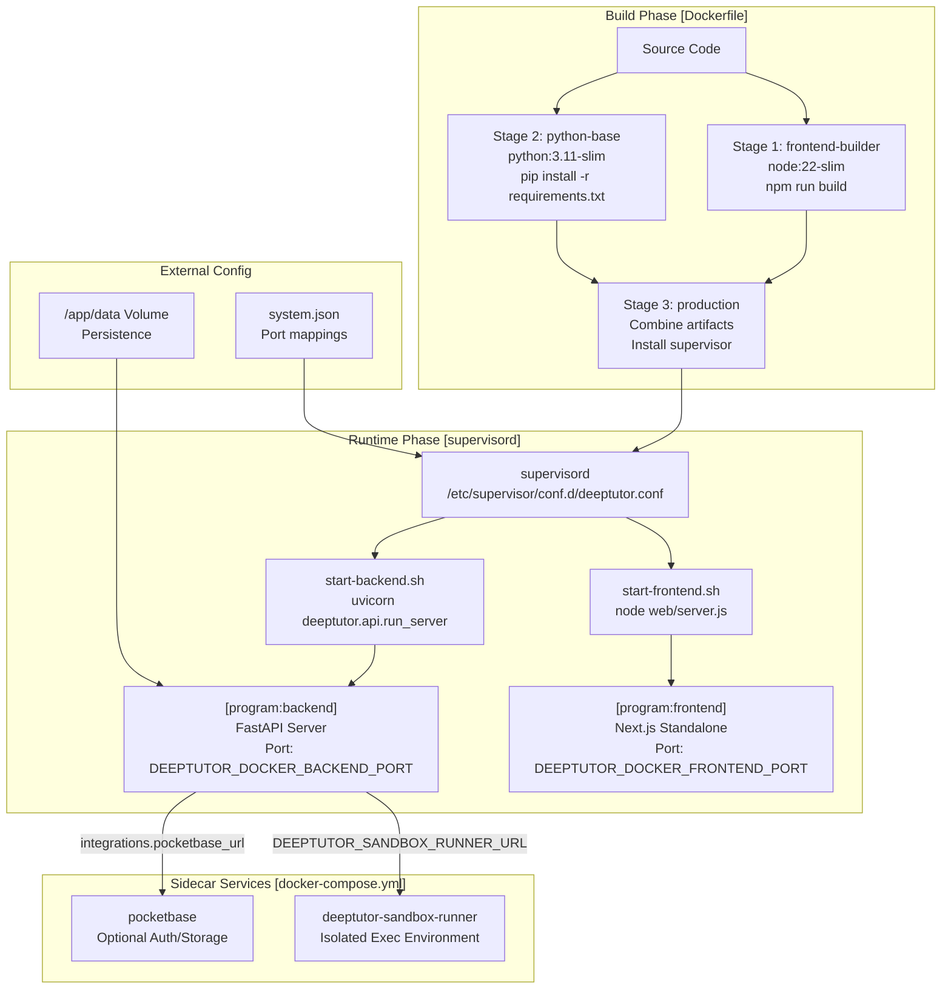
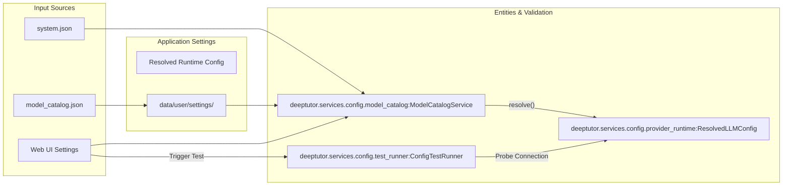

# Deployment and Operations

Relevant source files

The following files were used as context for generating this wiki page:

- [.dockerignore](.dockerignore)
- [README.md](README.md)
- [assets/README/README_AR.md](assets/README/README_AR.md)
- [assets/README/README_CN.md](assets/README/README_CN.md)
- [assets/README/README_ES.md](assets/README/README_ES.md)
- [assets/README/README_FR.md](assets/README/README_FR.md)
- [assets/README/README_HI.md](assets/README/README_HI.md)
- [assets/README/README_JA.md](assets/README/README_JA.md)
- [assets/README/README_PL.md](assets/README/README_PL.md)
- [assets/README/README_PT.md](assets/README/README_PT.md)
- [assets/README/README_RU.md](assets/README/README_RU.md)
- [assets/README/README_TH.md](assets/README/README_TH.md)
- [deeptutor/agents/notebook/summarize_agent.py](deeptutor/agents/notebook/summarize_agent.py)
- [deeptutor/services/config/test_runner.py](deeptutor/services/config/test_runner.py)
- [docker-compose.dev.yml](docker-compose.dev.yml)
- [docker-compose.ghcr.yml](docker-compose.ghcr.yml)
- [docker-compose.yml](docker-compose.yml)
- [tests/agents/notebook/__init__.py](tests/agents/notebook/__init__.py)
- [tests/api/test_main_notebook_router.py](tests/api/test_main_notebook_router.py)
- [tests/services/config/test_llm_probe_config.py](tests/services/config/test_llm_probe_config.py)
- [tests/services/llm/test_factory_provider_exec.py](tests/services/llm/test_factory_provider_exec.py)

This document provides production deployment strategies and operational considerations for running DeepTutor in various environments. It covers deployment methods, runtime configuration, service management, and operational best practices.

**Scope**: This page focuses on deployment architecture and operational workflows. For detailed configuration reference, see:
- **Environment Variables Reference**: Complete reference of all environment variables and their purposes. For details, see [Environment Variables Reference](#13.1).
- **Multi-User Mode and Administration**: Guide to enabling `AUTH_ENABLED`, user roles, and workspace isolation. For details, see [Multi-User Mode and Administration](#13.2).
- **Data Persistence and Backups**: Understanding data directory structure and backup strategies. For details, see [Data Persistence and Backups](#13.3).

---

## Deployment Architecture Overview

DeepTutor supports two primary deployment methods: containerized Docker deployment (recommended) and manual installation for development environments. The system uses a multi-stage build process for Docker and `supervisord` for process management within the container. 

A critical component of the production architecture is the **Sandbox Runner**, a sidecar service that executes untrusted shell commands in an isolated environment to protect the main application [docker-compose.yml:94-103]().

### System Deployment Flow
The following diagram bridges the high-level deployment stages to the specific scripts and configurations defined in the codebase.

**Sources**: [Dockerfile:1-210](), [docker-compose.yml:21-154]()

---

## Docker Deployment Process

### Multi-Stage Build Strategy
The Docker build uses a multi-stage process to minimize image size and separate build-time from runtime dependencies. 

| Stage | Base Image | Purpose | Key Operations |
|-------|-----------|---------|----------------|
| `frontend-builder` | `node:22-slim` | Build Next.js app | `npm run build` with standalone output [Dockerfile:50]() |
| `python-base` | `python:3.11-slim` | Install Python deps | Install Rust toolchain and `requirements.txt` [Dockerfile:89-98]() |
| `production` | `python:3.11-slim` | Final runtime image | Copy artifacts and configure `supervisord` [Dockerfile:175-208]() |

### Sandbox Isolation
For production security, the `sandbox-runner` service is deployed as a separate container. It shares only the `/app/data/user/workspace` and `/app/data/users` volumes with the main app, ensuring that system secrets and configurations in `data/system` are never accessible to untrusted code [docker-compose.yml:111-123](). It is hardened with `no-new-privileges:true` and a read-only root filesystem [docker-compose.yml:128-136]().

### Runtime Environment Injection
DeepTutor uses a placeholder replacement strategy to allow `NEXT_PUBLIC_*` variables to be configured at runtime without rebuilding the image. 

**Local LLM Integration**: When running in Docker while the LLM provider (e.g., LM Studio, Ollama, vLLM) runs on the host, users must use `host.docker.internal` instead of `localhost` in provider `base_url` fields [docker-compose.yml:16-17]().

**Sources**: [Dockerfile:23-51](), [Dockerfile:103-208](), [docker-compose.yml:1-154]()

---

## Process Management

DeepTutor uses `supervisord` to manage the lifecycle of both the FastAPI backend and Next.js frontend within a single container.

### Supervisord Configuration
The configuration at `/etc/supervisor/conf.d/deeptutor.conf` ensures that both services are started and monitored [Dockerfile:179-208]().

- **Backend**: Managed via `start-backend.sh`, it launches the FastAPI application with appropriate environment variables like `PYTHONPATH` [Dockerfile:186-195]().
- **Frontend**: Managed via `start-frontend.sh`, it handles environment injection and launches the standalone Next.js server [Dockerfile:197-208]().

**Sources**: [Dockerfile:179-208]()

---

## Runtime Configuration and Testing

Configuration flows from system settings and `model_catalog.json` into the application's internal services. The `ConfigTestRunner` allows for real-time validation of these settings through the UI.

### Configuration Flow

### Configuration Probes
The `ConfigTestRunner` executes diagnostic tests for LLM, Embedding, and Search services [deeptutor/services/config/test_runner.py:68-88](). For embedding services, the runner automatically detects and persists the vector dimension into the catalog upon a successful test connection [deeptutor/services/config/test_runner.py:132-153]().

**Sources**: [deeptutor/services/config/provider_runtime.py:1-331](), [deeptutor/services/config/test_runner.py:68-202]()

---

## Operational Considerations

### Data Persistence
DeepTutor requires several sub-directories under the `/app/data` volume to be persisted [docker-compose.yml:58-66]().

- `data/user/settings`: Global system configurations and `model_catalog.json`.
- `data/users`: Per-user isolated workspaces for multi-user mode.
- `data/partners`: Configuration and state for TutorBot (Partners) channels.
- `data/system`: Auth state, grants, and audit logs.
- `data/knowledge_bases`: RAG vector indices.
- `data/memory`: SQLite databases for session and memory storage.

### Security and Maintenance
- **Secrets**: Secret scanning is performed using `detect-secrets` [CONTRIBUTING.md:129-137]().
- **Multi-User Isolation**: When `AUTH_ENABLED` is set, the system enforces per-user resource isolation and scoped runtime access [README.md:68-69]().
- **Line Endings**: Critical scripts are forced to use LF line endings via `.gitattributes` to prevent execution issues in Linux/Docker environments [.gitattributes:1-19]().

**Sources**: [Dockerfile:159-173](), [docker-compose.yml:58-66](), [CONTRIBUTING.md:129-215](), [.gitattributes:1-19](), [README.md:68-69]()
