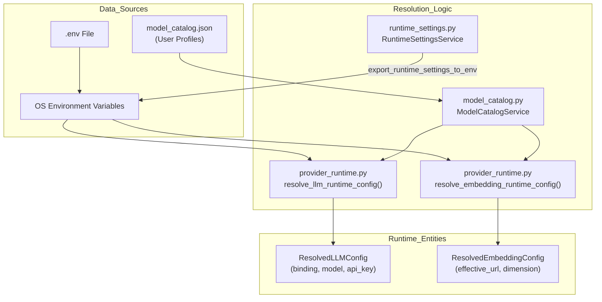
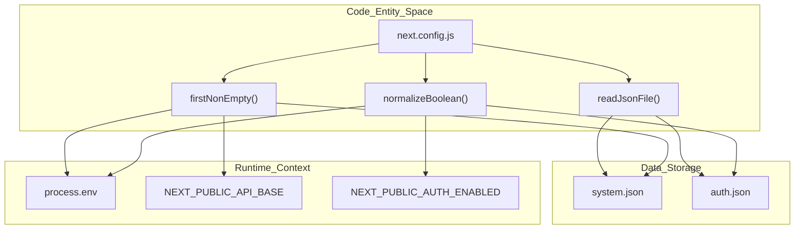

# Environment Variables Reference

Relevant source files

The following files were used as context for generating this wiki page:

- [.github/workflows/docker-release.yml](.github/workflows/docker-release.yml)
- [README.md](README.md)
- [assets/README/README_AR.md](assets/README/README_AR.md)
- [assets/README/README_CN.md](assets/README/README_CN.md)
- [assets/README/README_ES.md](assets/README/README_ES.md)
- [assets/README/README_FR.md](assets/README/README_FR.md)
- [assets/README/README_HI.md](assets/README/README_HI.md)
- [assets/README/README_JA.md](assets/README/README_JA.md)
- [assets/README/README_PL.md](assets/README/README_PL.md)
- [assets/README/README_PT.md](assets/README/README_PT.md)
- [assets/README/README_RU.md](assets/README/README_RU.md)
- [assets/README/README_TH.md](assets/README/README_TH.md)
- [web/eslint.config.mjs](web/eslint.config.mjs)
- [web/next-env.d.ts](web/next-env.d.ts)
- [web/next.config.js](web/next.config.js)
- [web/package-lock.json](web/package-lock.json)
- [web/package.json](web/package.json)

This document provides a complete reference for all environment variables used in DeepTutor. Environment variables control deployment configuration, API credentials, service endpoints, and runtime behavior. They are loaded from a `.env` file at startup and can be modified at runtime through the Settings API.

DeepTutor uses a multi-layer configuration system where environment variables define the infrastructure (ports, API keys, hosts), while YAML files and the model catalog define agent behaviors and application logic.

## Environment Variable System Architecture

DeepTutor uses a unified configuration loading mechanism that merges environment variables with static configuration files. The configuration system resolves paths and injects runtime configurations into the application state. The system uses a `ModelCatalogService` to manage active profiles, which fallbacks to environment variables if catalog entries are missing [deeptutor/services/config/provider_runtime.py:28-29]().

### Configuration Loading and Resolution Flow

The resolution logic is encapsulated in `provider_runtime.py`, specifically through functions like `resolve_llm_runtime_config` and `resolve_embedding_runtime_config`. These functions transform raw environment strings or catalog entries into structured `ResolvedLLMConfig` or `ResolvedEmbeddingConfig` objects [deeptutor/services/config/provider_runtime.py:198-232](). The `RuntimeSettingsService` also exports runtime settings to the environment to ensure consistency across modules [deeptutor/services/config/runtime_settings.py:69-69]().

Title: Configuration Data Flow and Resolution

**Sources:** [deeptutor/services/config/provider_runtime.py:198-232](), [deeptutor/services/config/runtime_settings.py:22-30](), [deeptutor/services/config/runtime_settings.py:69-69]()

### Frontend Configuration and Placeholder Injection

The Next.js frontend utilizes a `next.config.js` file to normalize and expose configuration to the browser. It reads from `data/user/settings/system.json` and `data/user/settings/auth.json` as the primary source of truth, while allowing environment variables to serve as deployment overrides [web/next.config.js:41-42](). During Docker builds, placeholders like `__NEXT_PUBLIC_AUTH_ENABLED_PLACEHOLDER__` are used to allow runtime substitution [web/next.config.js:24-26]().

Title: Frontend Configuration Resolution Space

**Sources:** [web/next.config.js:6-61](), [web/next.config.js:78-85]()

## Complete Environment Variable Reference

### Server and Network Configuration

These variables control the server environment and execution behavior. The `next.config.js` script handles the logic for determining the backend port and API base [web/next.config.js:35-49]().

| Variable | Required | Default | Description |
|----------|----------|---------|-------------|
| `BACKEND_PORT` | No | `8001` | Port used by the FastAPI backend [web/next.config.js:38-39](). |
| `NEXT_PUBLIC_API_BASE` | Yes (Web) | `http://localhost:8001` | External API base URL for frontend communication [web/next.config.js:43-49](). |
| `NEXT_PUBLIC_AUTH_ENABLED` | No (Web) | `false` | Enables/disables authentication logic [web/next.config.js:51-58](). |
| `NODE_ENV` | No | `production` | Set to `production` in production images [Dockerfile:113](). |
| `PYTHONDONTWRITEBYTECODE` | No | `1` | Prevents Python from writing .pyc files [Dockerfile:110](). |
| `PYTHONUNBUFFERED` | No | `1` | Ensures Python output is sent straight to terminal [Dockerfile:111](). |
| `DEEPTUTOR_IGNORE_PROCESS_ENV_OVERRIDES` | No | `1` | Prevents local env files from overriding container env [Dockerfile:114](). |

**Sources:** [web/next.config.js:32-61](), [Dockerfile:110-115]()

### LLM and Embedding Configuration

DeepTutor supports a wide range of providers including `openai`, `anthropic`, `gemini`, `ollama`, and `vllm`. Embedding configurations require a fully-qualified endpoint URL [deeptutor/services/config/provider_runtime.py:50-53]().

| Variable | Protocol Bindings | Description |
|----------|-------------------|-------------|
| `LLM_BINDING` | `openai`, `anthropic`, `gemini`, `ollama`, `vllm` | Protocol binding for the primary LLM [deeptutor/services/config/provider_runtime.py:43-44](). |
| `EMBEDDING_BINDING` | `openai`, `ollama`, `cohere`, `jina` | Protocol binding for vector generation [deeptutor/services/config/provider_runtime.py:47-48](). |
| `EMBEDDING_HOST` | - | The **FULL** endpoint URL (e.g. `https://api.openai.com/v1/embeddings`) [deeptutor/services/config/provider_runtime.py:51-53](). |

**Sources:** [deeptutor/services/config/provider_runtime.py:43-62]()

### Search Service Providers

Configures external search providers for the Deep Research and RAG modules.

| Variable | Supported Values |
|----------|------------------|
| `SEARCH_PROVIDER` | `brave`, `tavily`, `jina`, `searxng`, `duckduckgo`, `perplexity`, `serper` [deeptutor/services/config/provider_runtime.py:31-38](). |

**Sources:** [deeptutor/services/config/provider_runtime.py:30-40]()

### Security and Maintenance

| Variable | Description |
|----------|-------------|
| `DISABLE_SSL_VERIFY` | Disables SSL verification for SDK providers, useful for local proxies [README.md:64](). |
| `AUTH_ENABLED` | Flag to enable multi-user mode and workspace isolation [README.md:68](). |

**Sources:** [README.md:64-68]()
