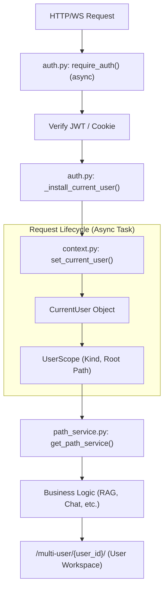
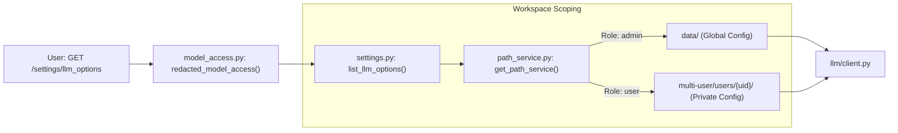

# Multi-User Mode and Administration

Relevant source files

The following files were used as context for generating this wiki page:

- [deeptutor/api/main.py](deeptutor/api/main.py)
- [deeptutor/api/routers/auth.py](deeptutor/api/routers/auth.py)
- [deeptutor/multi_user/router.py](deeptutor/multi_user/router.py)
- [tests/api/test_auth_contextvar.py](tests/api/test_auth_contextvar.py)
- [tests/api/test_selective_access_log.py](tests/api/test_selective_access_log.py)
- [web/components/SessionList.tsx](web/components/SessionList.tsx)
- [web/components/sidebar/UtilitySidebar.tsx](web/components/sidebar/UtilitySidebar.tsx)
- [web/components/sidebar/WorkspaceSidebar.tsx](web/components/sidebar/WorkspaceSidebar.tsx)
- [web/lib/admin-api.ts](web/lib/admin-api.ts)
- [web/lib/auth.ts](web/lib/auth.ts)
- [web/lib/session-api.ts](web/lib/session-api.ts)

DeepTutor includes an optional, robust multi-user layer designed for shared deployments where an administrator manages resources (LLMs, Knowledge Bases, and Skills) and assigns them to individual users. This system ensures strict workspace isolation, resource governance, and auditability.

## Overview and Activation

Multi-user mode is toggled via the `AUTH_ENABLED` flag [deeptutor/services/auth.py:30-30](). When enabled, the system transitions from a single-user local tool to a multi-tenant platform with role-based access control (RBAC). The frontend detects this state via `NEXT_PUBLIC_AUTH_ENABLED` [web/lib/auth.ts:3-3]().

### Key Components
*   **Identity Store**: Supports built-in SQLite/JSON auth or external providers like PocketBase [deeptutor/api/routers/auth.py:29-44]().
*   **Grant System**: A granular permission engine that maps administrative resources (Models, KBs, Skills) to specific users [deeptutor/multi_user/router.py:118-143]().
*   **Workspace Isolation**: Per-user directory structures managed by `PathService` [deeptutor/services/path_service.py:16-16]().
*   **Context Propagation**: The `CurrentUser` and `UserScope` objects are injected into the request pipeline via `ContextVar` [deeptutor/multi_user/context.py:27-46]().

### Request Pipeline and Context Flow

The following diagram illustrates how a request is authenticated and how the user context is propagated to ensure data isolation.

**User Context and Request Pipeline**

Sources: [deeptutor/api/routers/auth.py:183-205](), [deeptutor/multi_user/context.py:27-46](), [deeptutor/services/path_service.py:34-34](), [deeptutor/multi_user/paths.py:35-40]()

---

## Identity and Roles

DeepTutor defines two primary roles: `admin` and `user` [deeptutor/api/routers/auth.py:104-105]().

1.  **Admin**: Has full access to the global `data/` directory (the "Admin Workspace") [deeptutor/multi_user/paths.py:15-15](). Admins manage users, view audit logs, and configure the global model catalog [deeptutor/multi_user/router.py:36-62]().
2.  **User**: Restricted to a private workspace under `multi-user/users/{user_id}/` [deeptutor/multi_user/paths.py:38-38](). They can only use LLMs, KBs, and Skills explicitly granted to them by an admin.

### User Registration and First-Run
The system implements an "automatic first admin" logic. The first user to register is identified as the potential administrator via `is_first_user()` [deeptutor/api/routers/auth.py:40-40](). Registration requires a valid username (email or plain string) and a minimum 8-character password [deeptutor/api/routers/auth.py:72-93]().

---

## The Grant System

The Grant system allows admins to "loan" resources from the admin workspace to standard users without exposing underlying credentials.

### Resource Types
Admins can assign the following resources to users via the `/users/{user_id}/grants` endpoint [deeptutor/multi_user/router.py:118-143]():

| Resource | Logic Implementation | Description |
| :--- | :--- | :--- |
| **Models** | `_admin_catalog_summary` | LLM profiles from the admin's global catalog [deeptutor/multi_user/router.py:36-62](). |
| **Knowledge Bases** | `_admin_kb_summary` | Specific KBs hosted in the admin workspace [deeptutor/multi_user/router.py:65-74](). |
| **Skills** | `_admin_skill_summary` | Tools and skills installed from the Skill Hub [deeptutor/multi_user/router.py:77-80](). |
| **Tools** | `build_tool_options` | Access to system tools and MCP partners [deeptutor/multi_user/router.py:102-109](). |

### Redaction and Security
The Grant system ensures that non-admin users only interact with high-level identifiers. The `save_grant` function persists these permissions to the system metadata store [deeptutor/multi_user/grants.py:17-17](), while business logic uses the `get_path_service()` to resolve the correct scoped resource at runtime [deeptutor/services/path_service.py:34-34]().

**Resource Resolution Logic**

Sources: [deeptutor/multi_user/router.py:96-109](), [deeptutor/services/path_service.py:34-34](), [deeptutor/multi_user/paths.py:35-40](), [deeptutor/multi_user/context.py:27-46]()

---

## Workspace Isolation

Each user is assigned a unique directory structure to prevent data leakage.

### Directory Layout
The `PathService` [deeptutor/services/path_service.py:16-16]() resolves paths based on the `UserScope` in the current `ContextVar`.

*   **Admin Root**: `data/` [deeptutor/multi_user/paths.py:15-15]()
*   **User Root**: `multi-user/users/{user_id}/` [deeptutor/multi_user/paths.py:38-38]()
    *   `sessions/`: User-specific chat histories.
    *   `knowledge_bases/`: User-specific RAG databases [deeptutor/multi_user/paths.py:44-44]().
    *   `memory/`: User-specific memory v3 documents [deeptutor/multi_user/paths.py:45-45]().
*   **System Root**: `multi-user/_system/` (stores auth, grants, and audit logs) [deeptutor/multi_user/paths.py:17-18]().

### Context Propagation Fix (#481)
To prevent silent routing to the admin workspace, `require_auth` and `require_admin` are implemented as `async def` [deeptutor/api/routers/auth.py:183-183](). This ensures that the `ContextVar.set()` call happens within the same asyncio task as the endpoint, preventing the context from being lost in a threadpool copy [tests/api/test_auth_contextvar.py:1-19]().

---

## Administration and Auditing

The admin interface (located at `/admin/users`) provides tools for managing the platform and monitoring activity.

### User Management
Admins can perform operations via the `admin-api.ts` module:
*   **List Users**: Fetch all registered users [web/lib/admin-api.ts:11-15]().
*   **Create/Delete Users**: Manage user lifecycle [web/lib/admin-api.ts:17-28](), [web/lib/admin-api.ts:55-76]().
*   **Toggle Roles**: Update user permissions between `admin` and `user` [web/lib/admin-api.ts:30-46]().

### Audit Logging
Critical administrative actions, such as updating grants or installing skills from the hub, are logged via `log_admin_action` [deeptutor/multi_user/audit.py:16-16](). These logs include the `target_user_id` and a summary of the change (e.g., `model_count`, `skill_count`) [deeptutor/multi_user/router.py:129-142]().

### Skill Administration
Admins can install skills globally using the `/admin/skills/install` endpoint [deeptutor/multi_user/router.py:146-150](). These skills land in the admin workspace and remain invisible to standard users until explicitly assigned via the Grant system [deeptutor/multi_user/router.py:151-158]().

Sources: [web/lib/admin-api.ts:3-76](), [deeptutor/multi_user/router.py:1-200](), [deeptutor/api/routers/auth.py:183-205](), [deeptutor/multi_user/paths.py:15-45](), [deeptutor/multi_user/audit.py:16-16]()
