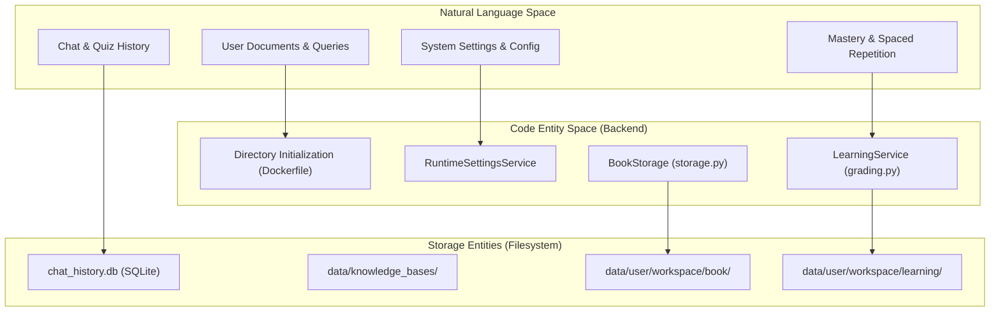
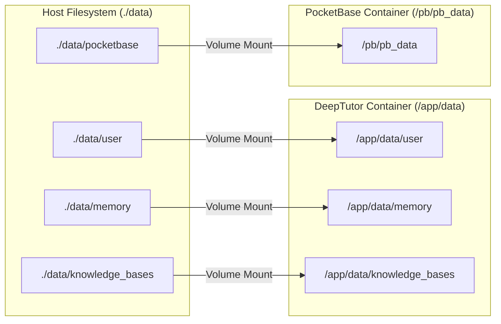

# Data Persistence and Backups

<details>
<summary>Relevant source files</summary>

The following files were used as context for generating this wiki page:

- [README.md](README.md)
- [assets/README/README_AR.md](assets/README/README_AR.md)
- [assets/README/README_CN.md](assets/README/README_CN.md)
- [assets/README/README_ES.md](assets/README/README_ES.md)
- [assets/README/README_FR.md](assets/README/README_FR.md)
- [assets/README/README_HI.md](assets/README/README_HI.md)
- [assets/README/README_JA.md](assets/README/README_JA.md)
- [assets/README/README_PL.md](assets/README/README_PL.md)
- [assets/README/README_PT.md](assets/README/README_PT.md)
- [assets/README/README_RU.md](assets/README/README_RU.md)
- [assets/README/README_TH.md](assets/README/README_TH.md)
- [deeptutor/book/storage.py](deeptutor/book/storage.py)
- [deeptutor/learning/grading.py](deeptutor/learning/grading.py)
- [deeptutor/learning/tests/test_grading.py](deeptutor/learning/tests/test_grading.py)

</details>


This page documents DeepTutor's data persistence architecture, directory structure, and backup strategies. It covers what data is stored, where it is located, and how the system manages state across restarts using a centralized file-based approach.

DeepTutor uses a file-based persistence model designed for containerization and easy migration. All system state, user activity, and knowledge bases are stored within a centralized `data/` directory or a `multi-user/` workspace.

## Data Persistence Architecture

DeepTutor follows a **file-based persistence model** where all user data, knowledge bases, and system state are stored as files on disk. This design enables simple backup strategies, easy data migration, and deployment flexibility across different environments.

### Core Persistence Principles

| Principle | Implementation |
|-----------|----------------|
| **Single Data Root** | All persistent data lives under a project-relative `data/` directory. |
| **Relational Integrity** | Chat history, turns, and messages are managed via a SQLite database (`chat_history.db`). |
| **User Isolation** | In multi-user mode, data is scoped to `multi-user/<user_id>/` directories [README.md:51-51](). |
| **Stateless Application** | All state persists to disk; the application can be recreated from the image by mounting the data volumes [docker-compose.yml:58-63](). |
| **Pre-initialized Structure** | The production Docker image pre-creates the necessary directory tree to ensure volume mounts have correct permissions [Dockerfile:158-173](). |

**Natural Language to Code Entity: Data Persistence Flow**



Sources: [Dockerfile:158-173](), [docker-compose.yml:58-63](), [deeptutor/learning/grading.py:1-3](), [deeptutor/book/storage.py:1-10]()

## Directory Structure Reference

### Root Data Directory

The persistence layer is organized into primary top-level directories within the `data/` volume. The Docker image ensures these paths exist before the application starts [Dockerfile:158-173]().

```
data/
├── knowledge_bases/          # RAG indices and source documents [Dockerfile:173-173]
├── memory/                   # Persistent memory files (L1/L2/L3) [README.md:60-60]
└── user/                     # User-specific data [Dockerfile:160-160]
    ├── logs/                 # System and performance logs [Dockerfile:172-172]
    ├── settings/             # UI and Provider configurations [Dockerfile:160-160]
    └── workspace/            # Feature-specific artifacts
        ├── memory/           # Workspace-specific memory traces [Dockerfile:162-162]
        ├── notebook/         # Quiz records and learner profiles [Dockerfile:163-163]
        ├── learning/         # Mastery path and spaced repetition data
        └── chat/             # Agent-specific outputs
            ├── chat/         # Standard chat history [Dockerfile:166-166]
            ├── deep_solve/   # Smart Solver outputs [Dockerfile:167-167]
            ├── deep_research/# Research reports [Dockerfile:169-169]
            ├── math_animator/# Manim videos [Dockerfile:170-170]
```

### Specialized Feature Storage

DeepTutor segregates data by feature to prevent cross-contamination and facilitate modular backups.

| Directory | Feature Mapping | Implementation Detail |
|:---|:---|:---|
| `workspace/learning/` | Mastery Path Engine | Stores graded records and error classifications [deeptutor/learning/grading.py:52-61]() |
| `workspace/book/` | Living Book Engine | Manages book page persistence and rebuild flows [README.md:76-76]() |
| `workspace/chat/deep_solve` | Smart Solver | Dual-loop problem-solving outputs [README.md:60-60]() |
| `workspace/chat/deep_research` | Deep Research | Multi-agent research reports and notes [README.md:60-60]() |

Sources: [Dockerfile:158-173](), [deeptutor/learning/grading.py:1-64](), [README.md:47-76]()

## Persistence Implementation

### Learning and Mastery Persistence
The `LearningService` utilizes deterministic grading and error classification to persist student progress.
- **Grading Logic**: Answers are graded based on type (`choice`, `short`, `open`) using string normalization or `SequenceMatcher` [deeptutor/learning/grading.py:13-49]().
- **Error Classification**: Wrong answers are classified as `METACOGNITIVE` (blank) or `APPLICATION_ERROR` to inform the mastery path [deeptutor/learning/grading.py:52-61]().

### Docker Volume Mapping
In containerized deployments, persistence is achieved through host-to-container volume mounts. The `docker-compose.yml` file maps local host directories to the pre-created paths in the container [docker-compose.yml:58-63]().

**Natural Language to Code Entity: Docker Persistence Mapping**



Sources: [docker-compose.yml:33-34](), [docker-compose.yml:58-63](), [docker-compose.dev.yml:37-40]()

## Backup and Migration Strategies

### Backup Checklist
To ensure a consistent backup, the following components must be archived from the `data/` directory:
1. **Relational Data**: `user/chat_history.db` (SQLite) or the `data/pocketbase` directory if external auth is enabled [docker-compose.yml:33-34]().
2. **Configurations**: `user/settings/` directory (includes provider profiles and agent configs).
3. **Knowledge Bases**: `knowledge_bases/` directory containing vector indices and RAG source files [README.md:78-78]().
4. **Memory**: `memory/` directory containing the three-layer memory traces (L1/L2/L3) [README.md:60-60]().
5. **Learning Progress**: `user/workspace/learning/` containing mastery gates and repetition schedules.

### Security and Secrets
DeepTutor uses a secrets baseline to prevent sensitive information from being committed. When backing up configurations, ensure that any API keys stored in JSON/YAML configs or `.env` files are handled securely [.secrets.baseline:1-124]().

### Exclusions
The system is designed so that the application code and static assets are separate from user data. In development mode, source code is mounted as read-only, while data directories remain writable [docker-compose.dev.yml:21-41]().

Sources: [docker-compose.yml:33-34](), [docker-compose.dev.yml:21-41](), [.secrets.baseline:1-124](), [Dockerfile:158-173](), [README.md:60-78]()
