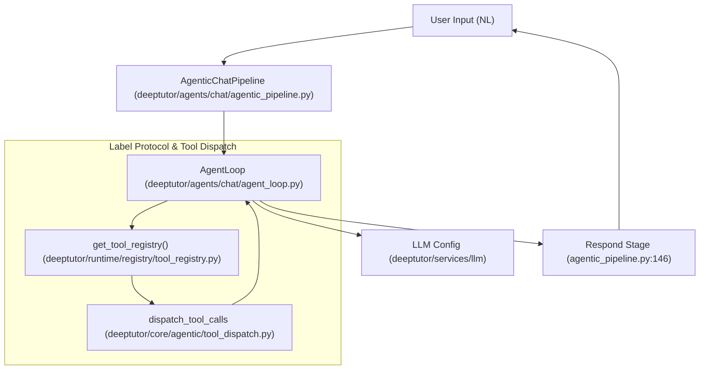
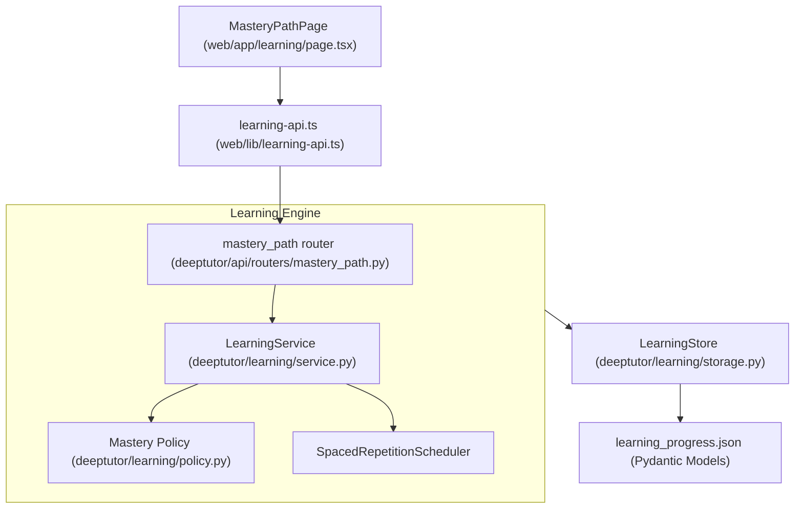

# Glossary

Relevant source files

The following files were used as context for generating this wiki page:

- [README.md](README.md)
- [assets/README/README_AR.md](assets/README/README_AR.md)
- [assets/README/README_CN.md](assets/README/README_CN.md)
- [assets/README/README_ES.md](assets/README/README_ES.md)
- [assets/README/README_FR.md](assets/README/README_FR.md)
- [assets/README/README_HI.md](assets/README/README_HI.md)
- [assets/README/README_JA.md](assets/README/README_JA.md)
- [assets/README/README_PL.md](assets/README/README_PL.md)
- [assets/README/README_PT.md](assets/README/README_PT.md)
- [assets/README/README_RU.md](assets/README/README_RU.md)
- [assets/README/README_TH.md](assets/README/README_TH.md)
- [deeptutor/agents/chat/agentic_pipeline.py](deeptutor/agents/chat/agentic_pipeline.py)
- [deeptutor/learning/models.py](deeptutor/learning/models.py)
- [deeptutor/learning/tests/test_api_endpoints.py](deeptutor/learning/tests/test_api_endpoints.py)
- [deeptutor/learning/tests/test_guided_mastery_updates.py](deeptutor/learning/tests/test_guided_mastery_updates.py)
- [deeptutor/learning/tests/test_models.py](deeptutor/learning/tests/test_models.py)
- [deeptutor/learning/tests/test_scheduler.py](deeptutor/learning/tests/test_scheduler.py)
- [deeptutor/learning/tests/test_storage.py](deeptutor/learning/tests/test_storage.py)
- [deeptutor/tools/mastery_tool.py](deeptutor/tools/mastery_tool.py)
- [site/src/content/docs/docs/cli/agent-handoff.md](site/src/content/docs/docs/cli/agent-handoff.md)
- [site/src/content/docs/docs/cli/commands.md](site/src/content/docs/docs/cli/commands.md)
- [site/src/content/docs/zh-cn/docs/cli/agent-handoff.md](site/src/content/docs/zh-cn/docs/cli/agent-handoff.md)
- [site/src/content/docs/zh-cn/docs/cli/commands.md](site/src/content/docs/zh-cn/docs/cli/commands.md)
- [web/app/(workspace)/learning/page.tsx](web/app/(workspace)/learning/page.tsx)
- [web/app/globals.css](web/app/globals.css)
- [web/components/sidebar/SidebarShell.tsx](web/components/sidebar/SidebarShell.tsx)
- [web/components/ui/Tooltip.tsx](web/components/ui/Tooltip.tsx)
- [web/lib/learning-api.ts](web/lib/learning-api.ts)
- [web/locales/en/app.json](web/locales/en/app.json)
- [web/locales/zh/app.json](web/locales/zh/app.json)

This glossary defines the technical terms, architectural patterns, and internal jargon used within the DeepTutor codebase. It is designed to assist onboarding engineers in navigating the agent-native design, the three-layer memory subsystem, and the various intelligent modules.

## Core Concepts

### Agent-Native
A design philosophy where every system capability is built to be equally accessible by a human via a UI and an AI agent via structured interfaces [README.md:5-6](). In DeepTutor, this is manifested through the `SKILL.md` format and the `ClawHub` registry, allowing agents to operate system tools autonomously [README.md:49-50]().

### TutorBot (Partners)
An autonomous, persistent AI tutor instance. Unlike a stateless chatbot, a TutorBot has its own workspace, persistent memory, and a specific set of skills [README.md:51-52](). They are powered by the `TutorBotManager` lifecycle and support 15+ messaging channels like Telegram, Discord, Slack, and Zulip [README.md:51-52]().

### Auto Mode
A three-stage agentic capability router that handles complex user requests by decomposing them into atomic tool calls. It follows an `ANALYZING` -> `DELEGATING` -> `SYNTHESIZING` lifecycle [README.md:60-61](). Implementation is centered in the `AutoPipeline`.

### Memory v2 (Three-Layer Memory)
A sophisticated memory subsystem introduced in v1.4.0 [README.md:60-61]().
*   **L1 (Trace):** Short-term runtime interaction logs.
*   **L2 (Surface Summaries):** Per-surface (e.g., specific chat or book page) summaries.
*   **L3 (Knowledge):** Cross-surface consolidated learner profile and persistent entities.
Managed by the `MemoryConsolidator` [README.md:60-61]().

### Living Book (Book Engine)
A structured, interactive educational content format generated by a multi-agent pipeline [README.md:76-77](). It supports 14 block types (e.g., `quiz`, `concept_graph`, `flash_cards`, `animation`) and handles per-page chat persistence [README.md:76-77]().

### Mastery Path
A learning engine providing mastery-based study with hard gates and spaced repetition [README.md:47-48](). It tracks `LearningProgress` through stages like `DIAGNOSTIC`, `EXPLAIN`, and `FEYNMAN_CHECK` [deeptutor/learning/models.py:61-72]().

Sources: [README.md:5-77](), [deeptutor/learning/models.py:61-72]().

---

## Architectural Components

### ChatOrchestrator
The central runtime engine that connects the streaming event bus, tool registry, and agent capabilities. It manages the `RunMode` and ensures same-capability quotas and retry budgets are respected [README.md:60-61]().

### AgenticChatPipeline
The chat capability assembly for the exploring-loop agent. It orchestrates the transition from exploration (tool usage) to final response generation [deeptutor/agents/chat/agentic_pipeline.py:145-146]().

### Tool Registry & Capability Registry
The system's "plugin" architecture. Tools are managed by the `get_tool_registry` helper [deeptutor/agents/chat/agentic_pipeline.py:158-158](), while high-level modules like `Smart Solver` or `Deep Research` are orchestrated via the `agentic_pipeline`.

### Label Protocol
The communication contract between the agentic loop and the LLM. It uses specific markers to determine the next step in the pipeline, such as `TOOL` calls or `FINISH` signals [deeptutor/agents/chat/agentic_pipeline.py:18-26]().

Sources: [README.md:60-61](), [deeptutor/agents/chat/agentic_pipeline.py:145-158]().

---

## Technical Terminology & Jargon

| Term | Definition | Code Pointer |
| :--- | :--- | :--- |
| **Thinking Block** | A UI component that displays the internal reasoning process of reasoning-capable models (e.g., DeepSeek-R1). | [README.md:70-71]() |
| **Feynman Check** | A qualitative gate where the tutor assesses the learner's explanation of a concept. | [deeptutor/learning/models.py:68-68]() |
| **Consolidator Pipeline** | The process that moves data between Memory layers (Update/Audit/Dedup/Merge modes). | [README.md:60-61]() |
| **Vision Solver** | A capability using GeoGebra for geometric analysis and figure reconstruction. | [web/locales/en/app.json:76-80]() |
| **Grant System** | The administrative layer for assigning specific models, KBs, or skills to users in multi-user mode. | [README.md:68-69]() |
| **Turn Runtime** | A restart-safe runtime that manages individual user-agent interaction cycles. | [README.md:60-61]() |
| **SpacedRepetitionScheduler** | The engine that calculates the next review time based on `INTERVAL_SEQUENCES`. | [deeptutor/learning/models.py:144-152]() |
| **DeferredToolLoader** | Utility for loading tools that require runtime context or external initialization. | [deeptutor/agents/chat/agentic_pipeline.py:38-40]() |

Sources: [README.md:60-71](), [deeptutor/learning/models.py:68-152](), [web/locales/en/app.json:76-80](), [deeptutor/agents/chat/agentic_pipeline.py:38-40]().

---

## Data Flow Diagrams

### Agentic Loop Lifecycle
This diagram bridges the Natural Language interaction to the `AgenticChatPipeline` and the `LLM` provider logic.

"Natural Language Space to Code Entity Space: Agentic Loop"

**Sources:** [deeptutor/agents/chat/agentic_pipeline.py:145-188](), [deeptutor/core/agentic/tool_dispatch.py:27-27]().

### Mastery Path Learning Engine
This diagram illustrates the flow from the frontend `MasteryPathPage` to the backend `LearningService` and storage.

"Natural Language Space to Code Entity Space: Mastery Path"

**Sources:** [web/app/learning/page.tsx:37-45](), [web/lib/learning-api.ts:1-111](), [deeptutor/learning/models.py:185-214]().

---

## CLI Command Glossary

The `deeptutor` CLI is the primary entry point for agent-native operations.

*   `deeptutor run`: Executes specific capabilities or agent pipelines [README.md:66-67]().
*   `deeptutor chat`: Launches the REPL for terminal-based tutoring [README.md:66-67]().
*   `deeptutor serve`: Starts the FastAPI backend server [README.md:66-67]().
*   `deeptutor start`: Convenience command for launching the full stack [README.md:66-67]().
*   `deeptutor kb`: Manages knowledge bases (create, add, search, set-default) [README.md:72-73]().
*   `deeptutor memory`: Provides access to the L1/L2/L3 memory workbench [README.md:62-63]().
*   `deeptutor skill`: Installs community skills from ClawHub [README.md:49-50]().

Sources: [README.md:49-73]().
