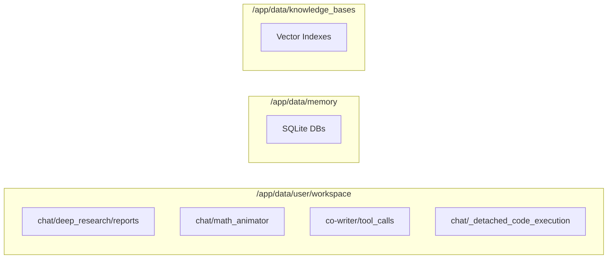

# Docker Deployment

<details>
<summary>Relevant source files</summary>

The following files were used as context for generating this wiki page:

- [.dockerignore](.dockerignore)
- [.gitattributes](.gitattributes)
- [.github/pull_request_template.md](.github/pull_request_template.md)
- [.secrets.baseline](.secrets.baseline)
- [CONTRIBUTING.md](CONTRIBUTING.md)
- [Dockerfile](Dockerfile)
- [deeptutor/agents/notebook/summarize_agent.py](deeptutor/agents/notebook/summarize_agent.py)
- [deeptutor/services/config/test_runner.py](deeptutor/services/config/test_runner.py)
- [docker-compose.dev.yml](docker-compose.dev.yml)
- [docker-compose.ghcr.yml](docker-compose.ghcr.yml)
- [docker-compose.yml](docker-compose.yml)
- [tests/agents/notebook/__init__.py](tests/agents/notebook/__init__.py)
- [tests/api/test_main_notebook_router.py](tests/api/test_main_notebook_router.py)
- [tests/services/config/test_llm_probe_config.py](tests/services/config/test_llm_probe_config.py)
- [tests/services/llm/test_factory_provider_exec.py](tests/services/llm/test_factory_provider_exec.py)
- [web/app/(workspace)/page.tsx](web/app/(workspace)/page.tsx)

</details>


## Purpose and Scope

This document provides a technical overview of DeepTutor's Docker-based deployment architecture. It details the multi-stage build process defined in the `Dockerfile`, the process orchestration managed by `supervisord`, and the runtime environment variable injection mechanism that allows the Next.js frontend to communicate with the FastAPI backend across different network environments.

---

## Docker Architecture Overview

DeepTutor utilizes a multi-stage Docker build to optimize image size and build performance. The architecture separates the heavy frontend compilation and Python dependency resolution into distinct stages, ultimately producing a unified production image that runs both services concurrently.

### System Component Association

The following diagram bridges the high-level deployment stages with the specific code entities and scripts they manage.

```mermaid
graph TB
    subgraph "Build Phase (Dockerfile)"
        ["frontend-builder"] -- "Compiles Static Assets" --> FB["web/.next/standalone"]
        ["python-base"] -- "Installs PyPI & System Deps" --> PB["site-packages"]
        ["production"] -- "Final Image" --> PI["/app"]
    end

    subgraph "Runtime Process Space"
        ["supervisord"] -- "manages" --> B["program:backend"]
        ["supervisord"] -- "manages" --> F["program:frontend"]
        
        B -- "executes" --> S1["/app/start-backend.sh"]
        F -- "executes" --> S2["/app/start-frontend.sh"]
        
        S1 -- "runs" --> P1["deeptutor.api.run_server"]
        S2 -- "runs" --> P2["node web/server.js"]
    end

    subgraph "Configuration Entities"
        [docker-compose.yml] -- "injects" --> E[".env"]
        E -- "defines" --> V1["NEXT_PUBLIC_API_BASE_EXTERNAL"]
        E -- "defines" --> V2["BACKEND_PORT"]
    end
```

**Sources:** [Dockerfile:1-173](), [docker-compose.yml:21-78](), [Dockerfile:186-208]()

---

## Multi-Stage Build Process

### 1. Frontend Builder (`frontend-builder`)
This stage is pinned to the build platform natively using `--platform=$BUILDPLATFORM` to ensure high-performance compilation of static assets regardless of the target architecture [Dockerfile:23]().

*   **Implementation**: It performs a standard `npm ci` followed by `npm run build` [Dockerfile:31-50]().
*   **Next.js Standalone**: The build uses the `standalone` output mode. This generates a minimal `server.js` and a subset of `node_modules`, significantly reducing the production image footprint [Dockerfile:48-50]().
*   **Placeholder Injection**: To allow runtime API URL configuration, it injects unique strings like `__NEXT_PUBLIC_API_BASE_PLACEHOLDER__` and `__NEXT_PUBLIC_AUTH_ENABLED_PLACEHOLDER__` into the `.env.local` file during the build [Dockerfile:43-46]().

### 2. Python Base (`python-base`)
This stage prepares the backend environment.
*   **System Dependencies**: Installs `libgl1` and `libglib2.0-0` which are required for `OpenCV` (used by the `mineru` document processing tool) [Dockerfile:77-88]().
*   **Rust Toolchain**: Installs the Rust compiler via `rustup` [Dockerfile:89](). This is strictly necessary for building Python packages like `tiktoken` from source when pre-built wheels are unavailable for specific architectures [Dockerfile:76-77]().

### 3. Production Image (`production`)
The final stage is a clean `python:3.11-slim` image that pulls:
*   **Node.js Runtime**: Copied from a platform-matched `node-runtime` stage to ensure binary compatibility [Dockerfile:141-145]().
*   **Frontend Artifacts**: Only the `.next/standalone` directory, `.next/static`, and `public` folders are copied from the builder [Dockerfile:154-156]().
*   **Application Source**: Copies the `deeptutor` core package, `deeptutor_cli`, and necessary `scripts` [Dockerfile:159-161]().

**Sources:** [Dockerfile:17-165]()

---

## Process Orchestration with Supervisord

DeepTutor uses `supervisord` to manage the lifecycle of the two primary services within the container. This ensures that if the backend or frontend crashes, they are automatically restarted.

### Configuration Details
The configuration is generated dynamically within the `Dockerfile` at `/etc/supervisor/conf.d/deeptutor.conf` [Dockerfile:185-187]().

| Program | Command | Logs |
| :--- | :--- | :--- |
| `backend` | `/bin/bash /app/start-backend.sh` | Forwarded to stdout/stderr via Docker log capture [Dockerfile:194-196]() |
| `frontend` | `/bin/bash /app/start-frontend.sh` | Forwarded to stdout/stderr via Docker log capture [Dockerfile:198-200]() |

**Sources:** [Dockerfile:185-208]()

---

## Runtime Environment Injection

Because Next.js inlines environment variables starting with `NEXT_PUBLIC_` at build time, DeepTutor uses a `sed`-based replacement strategy in the entrypoint scripts to allow these to be changed at runtime without rebuilding the image.

### Dynamic URL and Auth Resolution
The `start-frontend.sh` script (defined in the `Dockerfile` heredoc) performs the following logic before starting the Node server:
1.  **API URL**: It determines the API URL using the priority: `NEXT_PUBLIC_API_BASE_EXTERNAL` > `NEXT_PUBLIC_API_BASE` > default `http://localhost:8001` [Dockerfile:221-236]().
2.  **Auth State**: It resolves the `NEXT_PUBLIC_AUTH_ENABLED` state from environment variables or `auth.json` [Dockerfile:238-245]().
3.  **Sed Replacement**: It uses `sed` to find the placeholders inside the compiled JS chunks and replaces them with the resolved values [Dockerfile:252-258]().

This mechanism is critical for **Remote Server Deployment**, where the frontend (running in the user's browser) must know the public IP of the server to make API and WebSocket requests [docker-compose.ghcr.yml:23-37]().

**Sources:** [Dockerfile:211-260](), [docker-compose.ghcr.yml:23-37]()

---

## Data Flow and Persistence

The Docker configuration defines critical volume mounts to ensure user data, knowledge bases, and memory persist across container restarts.

### Volume Mappings

| Host Path | Container Path | Description |
| :--- | :--- | :--- |
| `./data` | `/app/data` | Root data directory containing all persistent state [docker-compose.yml:66]() |
| `./data/user` | `/app/data/user` | Contains `settings`, `logs`, and `workspace` files [docker-compose.ghcr.yml:51]() |
| `./data/memory` | `/app/data/memory` | SQLite databases for session and learner memory [docker-compose.ghcr.yml:52]() |
| `./data/knowledge_bases` | `/app/data/knowledge_bases` | RAG vector stores and processed documents [docker-compose.ghcr.yml:53]() |

### Directory Initialization
The `Dockerfile` pre-creates a deep directory structure within the workspace to handle various agent outputs and tool-specific storage, including `deep_research/reports`, `math_animator`, and `co-writer/tool_calls` [Dockerfile:167-181]().



**Sources:** [Dockerfile:167-181](), [docker-compose.yml:58-66]()

---

## Deployment Modes

DeepTutor supports three primary Docker deployment patterns:

1.  **Production (Standard)**: Uses `docker-compose.yml` to build the image locally and run the optimized production stack, including the `pocketbase` and `sandbox-runner` sidecars [docker-compose.yml:21-104]().
2.  **Pre-built (GHCR)**: Uses `docker-compose.ghcr.yml` to pull the official image from `ghcr.io/hkuds/deeptutor`, requiring no local build tools [docker-compose.ghcr.yml:40-42]().
3.  **Development**: Uses `docker-compose.dev.yml` as an override to mount local source code (e.g., `deeptutor/`, `web/app/`) into the container, enabling hot-reloading [docker-compose.dev.yml:12-35]().

### Local LLM Integration
When the LLM server (e.g., Ollama, LM Studio) runs on the host machine, the provider `base_url` should be set to `host.docker.internal` instead of `localhost` to allow the container to reach the host's network [docker-compose.yml:16-18]().

**Sources:** [docker-compose.yml:1-104](), [docker-compose.ghcr.yml:1-68](), [docker-compose.dev.yml:1-52]()
