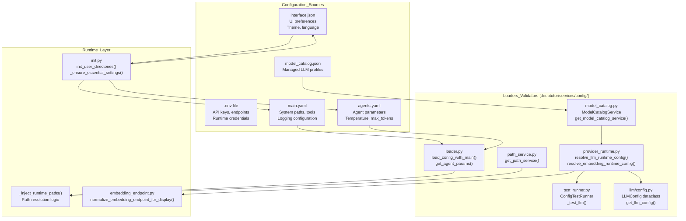
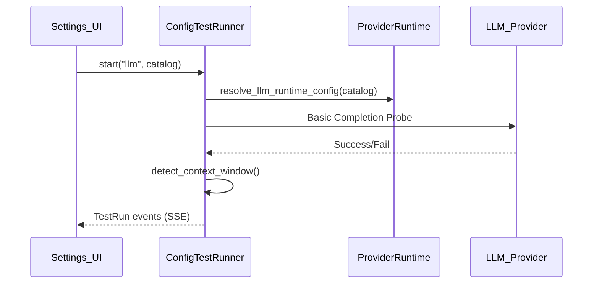

# Configuration Guide

Relevant source files

The following files were used as context for generating this wiki page:

- [README.md](README.md)
- [assets/README/README_AR.md](assets/README/README_AR.md)
- [assets/README/README_CN.md](assets/README/README_CN.md)
- [assets/README/README_ES.md](assets/README/README_ES.md)
- [assets/README/README_FR.md](assets/README/README_FR.md)
- [assets/README/README_HI.md](assets/README/README_HI.md)
- [assets/README/README_JA.md](assets/README/README_JA.md)
- [assets/README/README_PL.md](assets/README/README_PL.md)
- [assets/README/README_PT.md](assets/README/README_PT.md)
- [assets/README/README_RU.md](assets/README/README_RU.md)
- [assets/README/README_TH.md](assets/README/README_TH.md)
- [deeptutor/services/config/embedding_endpoint.py](deeptutor/services/config/embedding_endpoint.py)
- [deeptutor/services/config/launch_settings.py](deeptutor/services/config/launch_settings.py)
- [deeptutor/services/llm/config.py](deeptutor/services/llm/config.py)
- [scripts/start_tour.py](scripts/start_tour.py)
- [tests/scripts/test_start_tour.py](tests/scripts/test_start_tour.py)
- [tests/services/config/test_provider_runtime.py](tests/services/config/test_provider_runtime.py)
- [web/components/chat/home/ModelSelector.tsx](web/components/chat/home/ModelSelector.tsx)
- [web/tests/skill-slug.test.ts](web/tests/skill-slug.test.ts)

This document provides a comprehensive guide to configuring DeepTutor. It covers environment variables, YAML configuration files, LLM provider setup, and runtime configuration management. For deployment-specific configuration details, see [Docker Deployment](2.1).

---

## Configuration Architecture Overview

DeepTutor uses a multi-layered configuration system that combines environment variables, YAML files, and JSON settings. The system centralizes path resolution and agent hyperparameters to ensure consistency across the distributed agent architecture.

### Code Entity Configuration Map

The following diagram maps high-level configuration concepts to the specific classes and functions in the codebase that implement them.

**Configuration Priority Order** (highest to lowest):
1.  **Context Scoped Config:** LLM settings explicitly set for the current async context via `set_scoped_llm_config` [deeptutor/services/llm/config.py:136-138]().
2.  **Model Catalog:** Managed LLM profiles and active models. The catalog becomes the source of truth once a user has customized settings through the UI [deeptutor/services/config/test_runner.py:85-88]().
3.  **YAML configuration:** `main.yaml` and `agents.yaml` [deeptutor/services/setup/init.py:161-166]().
4.  **Default values:** Hardcoded in `init.py` for first-run initialization of JSON and YAML files [deeptutor/services/setup/init.py:18-92]().

**Sources:** [deeptutor/services/llm/config.py:136-138](), [deeptutor/services/config/test_runner.py:85-88](), [deeptutor/services/setup/init.py:18-92](), [deeptutor/services/setup/init.py:161-166]()

---

## Environment Variables and Launch Settings

While YAML and JSON files handle agent behavior, environment variables and the `LaunchSettings` class manage server-level networking and authentication.

### File Location and Loading

The primary entry point for manual configuration setup is the `scripts/start_tour.py` script, which provides an interactive tour and delegates to `run_init` to create settings under `data/user/settings` [scripts/start_tour.py:2-10](), [scripts/start_tour.py:43-47](). Launch settings such as ports are managed by `launch_settings.py` [deeptutor/services/config/launch_settings.py:9-10]().

DeepTutor also performs early environment setup for OpenAI-compatible SDKs by reading the runtime config and setting `OPENAI_API_KEY` and `OPENAI_BASE_URL` at module import time [deeptutor/services/llm/config.py:75-92]().

**Sources:** [scripts/start_tour.py:2-10](), [scripts/start_tour.py:43-47](), [deeptutor/services/config/launch_settings.py:9-10](), [deeptutor/services/llm/config.py:75-92]()

### Server and Networking Configuration

| Variable / Setting | Description | Default |
| :--- | :--- | :--- |
| `backend_port` | FastAPI server port resolved via `load_launch_settings` [deeptutor/services/setup/init.py:209-220]() | `8001` |
| `NEXT_PUBLIC_API_BASE` | Direct backend URL for Next.js client [web/tests/api-resolve-base.test.ts:6]() | `http://localhost:8001/api` |
| `AUTH_ENABLED` | Enable authentication and multi-user mode [deeptutor/services/config/runtime_settings.py:27]() | `false` |
| `DISABLE_SSL_VERIFY` | Disable SSL verification for SDK providers [README.md:64]() | `false` |

**Sources:** [deeptutor/services/setup/init.py:209-220](), [web/tests/api-resolve-base.test.ts:4-6](), [deeptutor/services/config/runtime_settings.py:27](), [README.md:64]()

### LLM and Embedding Configuration

DeepTutor uses a normalized runtime resolution for providers. LLM and Embedding settings are processed through `provider_runtime.py` and encapsulated in the `LLMConfig` dataclass [deeptutor/services/llm/config.py:95-114]().

**LLM Configuration (Resolved via `get_llm_config`):**

| Field | Description | Requirement |
| :--- | :--- | :--- |
| `model` | The specific model identifier (e.g., gpt-4o) | Required [deeptutor/services/llm/config.py:165-168]() |
| `api_key` | Authentication token for the provider | Required |
| `base_url` | The API endpoint URL | Optional [deeptutor/services/llm/config.py:101]() |
| `binding` | The SDK/Adapter to use (openai, anthropic, etc.) | Default: "openai" [deeptutor/services/llm/config.py:103]() |
| `reasoning_effort` | Effort level for thinking models | Optional [deeptutor/services/llm/config.py:108]() |

**Embedding Configuration (Resolved via `resolve_embedding_runtime_config`):**

| Variable | Description | Requirement |
| :--- | :--- | :--- |
| `binding` | Provider type (openai, cohere, jina, etc.) [deeptutor/services/config/test_runner.py:110]() | Canonical name matching provider registry |
| `base_url` | **FULL endpoint URL** | Adapters use URL verbatim; normalization ensures correct paths [deeptutor/services/config/embedding_endpoint.py:67-93]() |
| `dimension` | Vector dimension | Overwritten by probe-detected dimension during connection tests [deeptutor/services/config/test_runner.py:132-153]() |

**Sources:** [deeptutor/services/llm/config.py:95-114](), [deeptutor/services/llm/config.py:165-168](), [deeptutor/services/config/test_runner.py:110](), [deeptutor/services/config/embedding_endpoint.py:67-93](), [deeptutor/services/config/test_runner.py:132-153]()

---

## YAML Configuration

YAML files provide structured settings for system behavior. These are managed by the `loader.py` module and initialized by `init.py`.

### Path Resolution and Injection
Essential user directories are initialized on-demand, while essential settings files are created at startup [deeptutor/services/setup/init.py:109-150]().

| Path Key | Resolved Directory | Usage |
| :--- | :--- | :--- |
| `user_data_dir` | `data/user/` | User root directory [deeptutor/services/setup/init.py:120]() |
| `workspace` | `data/user/workspace/` | Working area for agents [deeptutor/services/setup/init.py:127]() |
| `notebook` | `data/user/workspace/notebook/` | Saved notes and records [deeptutor/services/setup/init.py:128]() |
| `research` | `data/user/workspace/chat/deep_research/` | Research agent artifacts [deeptutor/services/setup/init.py:136]() |

**Sources:** [deeptutor/services/setup/init.py:109-150](), [deeptutor/services/setup/init.py:120-136]()

### Agent Hyperparameters (agents.yaml)
The `agents.yaml` file contains hyperparameters for various agent capabilities [deeptutor/services/setup/init.py:70-93]().

*   **Capabilities:** Default settings for `solve` (temp: 0.3), `research` (temp: 0.5), `question` (temp: 0.7), and `chat` (temp: 0.2) [deeptutor/services/setup/init.py:72-78]().
*   **Token Limits:** Per-stage limits such as `responding` (8000) and `answer_now` (8000) for chat [deeptutor/services/setup/init.py:79-80]().
*   **Diagnostics:** Configuration for the `llm_probe` used during connection tests (default max_tokens: 4096) [tests/services/config/test_llm_probe_config.py:32-41]().

**Sources:** [deeptutor/services/setup/init.py:70-93](), [tests/services/config/test_llm_probe_config.py:32-41]()

---

## LLM Provider Validation and Testing

DeepTutor provides a `ConfigTestRunner` to validate LLM and Embedding configurations before they are used in production.

*   **Connection Probes:** The system performs a basic completion to verify API keys and endpoints [deeptutor/services/config/test_runner.py:200-205]().
*   **Dimension Detection:** For embedding providers, the test runner probes the actual output dimension and persists it back to the `model_catalog.json` via `_persist_embedding_dimension` [deeptutor/services/config/test_runner.py:132-153]().
*   **Endpoint Normalization:** The `embedding_endpoint.py` utility ensures that user-provided URLs are corrected to the full path required by the adapter (e.g., appending `/v1/embeddings` for OpenAI-compatible providers) [deeptutor/services/config/embedding_endpoint.py:67-93]().

**Sources:** [deeptutor/services/config/test_runner.py:132-153](), [deeptutor/services/config/test_runner.py:200-205](), [deeptutor/services/config/embedding_endpoint.py:67-93]()

---

## Setup Wizard and CLI Configuration

DeepTutor includes an interactive setup wizard (`deeptutor init`) and a settings tour script (`scripts/start_tour.py`) to simplify initial configuration.

*   **Initialization:** `scripts/start_tour.py` creates or updates settings under `data/user/settings` without installing dependencies [scripts/start_tour.py:25-39]().
*   **Wizard Helpers:** `init_wizard.py` provides curated lists of featured LLM and embedding providers, including fallback model lists for when live API discovery fails [deeptutor_cli/init_wizard.py:33-107]().
*   **Search Providers:** Supports multiple search engines including Brave, Tavily, Jina, and Serper, with automatic environment variable detection for API keys [deeptutor_cli/init_wizard.py:129-185]().

**Sources:** [scripts/start_tour.py:25-39](), [deeptutor_cli/init_wizard.py:33-107](), [deeptutor_cli/init_wizard.py:129-185]()
