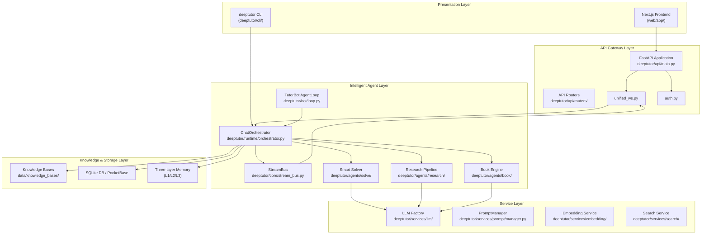
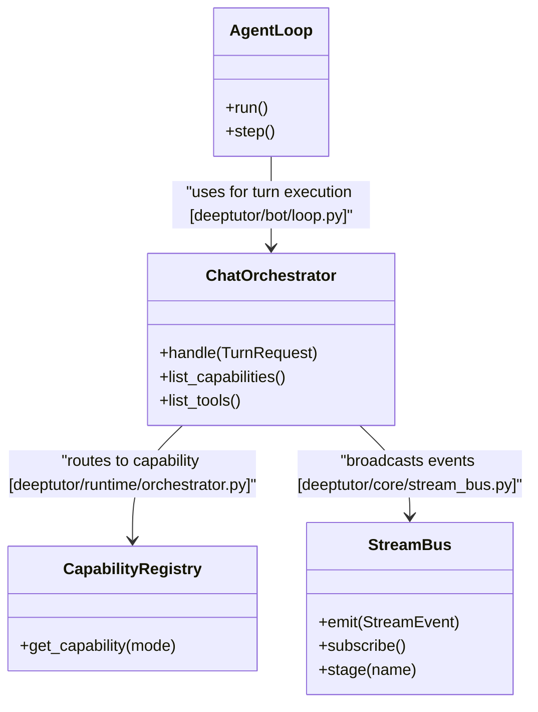
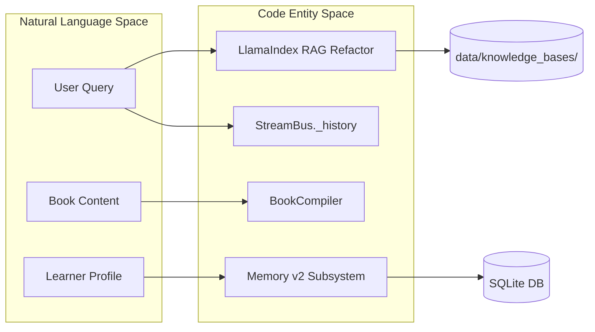

# System Architecture

Relevant source files

The following files were used as context for generating this wiki page:

- [README.md](README.md)
- [assets/README/README_AR.md](assets/README/README_AR.md)
- [assets/README/README_CN.md](assets/README/README_CN.md)
- [assets/README/README_ES.md](assets/README/README_ES.md)
- [assets/README/README_FR.md](assets/README/README_FR.md)
- [assets/README/README_HI.md](assets/README/README_HI.md)
- [assets/README/README_JA.md](assets/README/README_JA.md)
- [assets/README/README_PL.md](assets/README/README_PL.md)
- [assets/README/README_PT.md](assets/README/README_PT.md)
- [assets/README/README_RU.md](assets/README/README_RU.md)
- [assets/README/README_TH.md](assets/README/README_TH.md)
- [deeptutor/core/stream_bus.py](deeptutor/core/stream_bus.py)
- [deeptutor/runtime/orchestrator.py](deeptutor/runtime/orchestrator.py)
- [tests/runtime/test_orchestrator.py](tests/runtime/test_orchestrator.py)

**Purpose**: This document describes the overall architecture of DeepTutor, explaining how the four primary layers interact to deliver an AI-powered learning assistant. It covers the high-level structure, communication patterns, and deployment model. For detailed information about specific components, see [Frontend Architecture](#3.1), [Data Flow and Storage](#3.3), and [Runtime and Orchestration](#3.4).

---

## Architectural Overview

DeepTutor implements a **four-layer architecture** that separates concerns between presentation, orchestration, intelligence, and persistence. The system supports both web-based and CLI interactions, with real-time bidirectional communication powered by a streaming event bus [deeptutor/core/stream_bus.py:1-18]().

### Layer Diagram: Complete System Structure

**Sources**: [README.md:119-126](), [deeptutor/core/stream_bus.py:31-39](), [deeptutor/runtime/orchestrator.py:1-20]()

---

## Presentation Layer

The presentation layer provides two primary interaction modes: a rich web interface and an agent-native CLI.

### Web Frontend: Next.js Application

The web frontend implements a modern React-based UI using Next.js 16 [README.md:28](). It communicates with the backend via REST for configuration and WebSockets for streaming agent responses.

**Key characteristics**:
- **Unified Chat Workspace**: Multiple modes (Chat, Deep Solve, Quiz, Research, Animator, Visualize) sharing the same context [README.md:119-124]().
- **AI Co-Writer**: Interactive Markdown workspace for multi-document collaboration [README.md:120-120]().
- **WebSocket Protocol**: Supports real-time streaming, heartbeats, and auto-reconnection [README.md:90-90]().

For details, see [Frontend Architecture](#3.1).

### Agent-Native CLI

The CLI provides a direct interface to all system capabilities, knowledge bases, and TutorBots [README.md:126-126](). It allows users to manage sessions and execute agent turns directly from the terminal.

**Sources**: [README.md:126-126](), [README.md:37-37]()

---

## API Gateway Layer

The API Gateway is powered by FastAPI and serves as the bridge between the frontend and the agent runtime.

### Communication Patterns

DeepTutor uses a hybrid communication strategy:
- **REST API**: Handles synchronous operations like settings management, user authentication, and knowledge base configuration.
- **Unified WebSocket**: Coordinates the real-time event bus between the orchestrator and the client, supporting streaming reasoning thinking-blocks via the `StreamBus` [deeptutor/core/stream_bus.py:40-47]().

For details, see [API Layer](#12).

---

## Intelligent Agent & Orchestration Layer

This layer contains the core logic for problem-solving, research, and autonomous tutoring.

### Natural Language to Code Entity Mapping

The following diagram maps high-level system concepts to their specific implementation classes and files.

**Key Components**:
- **ChatOrchestrator**: The central runtime that routes context to the correct capability [deeptutor/runtime/orchestrator.py:1-20]().
- **StreamBus**: A fan-out async event bus for a single chat turn that handles `StreamEvent` types like `CONTENT`, `THINKING`, and `TOOL_CALL` [deeptutor/core/stream_bus.py:31-37](), [deeptutor/core/stream_bus.py:157-164]().
- **TutorBot Agent Loop**: Persistent autonomous AI tutors that can be integrated into messaging platforms like Telegram, Discord, and Zulip [README.md:51-51]().

For details, see [Runtime and Orchestration](#3.4).

---

## Data Flow and Storage Layer

DeepTutor emphasizes persistence for both user knowledge and agent memory.

### Persistence Structure

| Data Type | Code Entity / Path | Storage Mechanism |
|-----------|-------------------|-------------------|
| **Knowledge Bases** | `data/knowledge_bases/` | Vector DB with versioned indexes and re-index workflow [README.md:78-78]() |
| **Settings** | `agents.yaml` | YAML configuration used for LLM diagnostic probes [README.md:88-88]() |
| **Sessions** | `SQLite` | Persistent storage for chat history and session snapshots [README.md:72-72]() |
| **Memory** | `MemoryConsolidator` | Three-layer subsystem (L1 trace/L2 summaries/L3 cross-surface knowledge) [README.md:51-53]() |

### Data Interaction Diagram

For details, see [Data Flow and Storage](#3.3).

---

## Deployment and Operations

DeepTutor is designed for flexibility, supporting Docker, local Python environments, and various LLM providers.

**Key Operational Features**:
- **Multi-User Mode**: Optional deployment with isolated user workspaces, admin grants, and scoped runtime access [README.md:62-62]().
- **Multi-Provider LLM Factory**: Supports OpenAI, Anthropic, Gemini, NVIDIA NIM, and local providers like LM Studio and llama.cpp [README.md:72-72]().
- **Event Bus Orchestration**: The `StreamBus` allows multiple consumers (CLI renderer, WebSocket pusher) to subscribe to the same agent turn events simultaneously [deeptutor/core/stream_bus.py:5-6]().

**Sources**: [README.md:62-62](), [README.md:72-72](), [deeptutor/core/stream_bus.py:5-18](), [deeptutor/runtime/orchestrator.py:1-20]()
