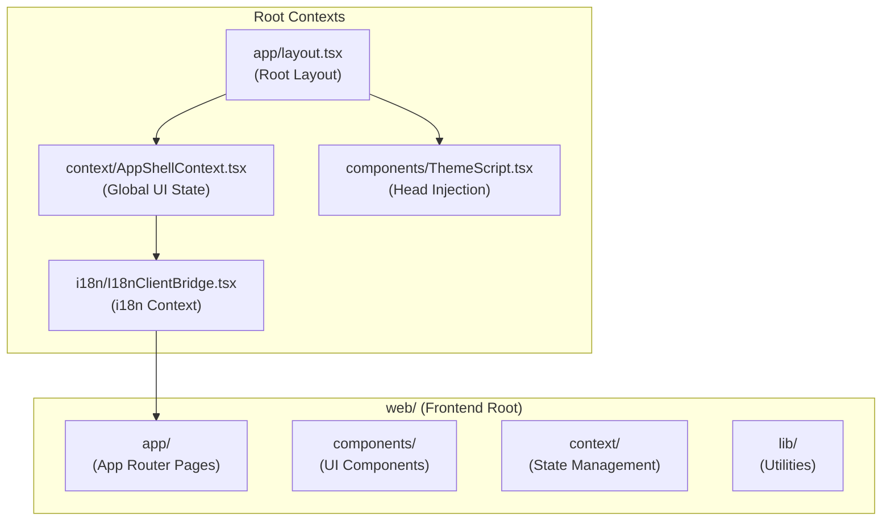
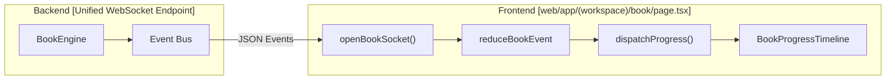

# Frontend Architecture

Relevant source files

The following files were used as context for generating this wiki page:

- [.github/workflows/docker-release.yml](.github/workflows/docker-release.yml)
- [assets/roster/forkers.svg](assets/roster/forkers.svg)
- [assets/roster/stargazers.svg](assets/roster/stargazers.svg)
- [web/app/(workspace)/book/page.tsx](web/app/(workspace)/book/page.tsx)
- [web/app/(workspace)/co-writer/page.tsx](web/app/(workspace)/co-writer/page.tsx)
- [web/app/layout.tsx](web/app/layout.tsx)
- [web/components/ThemeScript.tsx](web/components/ThemeScript.tsx)
- [web/context/AppShellContext.tsx](web/context/AppShellContext.tsx)
- [web/context/app-shell-storage.ts](web/context/app-shell-storage.ts)
- [web/eslint.config.mjs](web/eslint.config.mjs)
- [web/lib/debounce.ts](web/lib/debounce.ts)
- [web/lib/theme-utils.ts](web/lib/theme-utils.ts)
- [web/lib/theme.ts](web/lib/theme.ts)
- [web/next-env.d.ts](web/next-env.d.ts)
- [web/next.config.js](web/next.config.js)
- [web/package-lock.json](web/package-lock.json)
- [web/package.json](web/package.json)

## Purpose and Scope

This document describes the architecture of DeepTutor's web frontend, a Next.js application that provides the user interface for all intelligent agent modules. The frontend implements a modern single-page application with real-time streaming capabilities for AI operations, unified state management via React Context, and a comprehensive internationalization system.

The frontend is designed as an "agent-native" interface, specifically optimized for long-running asynchronous tasks like deep research, multi-step problem solving, and interactive book generation.

---

## Technology Stack

The frontend is built with Next.js 16+ and leverages the following core technologies:

| Technology | Version | Purpose |
|------------|---------|---------|
| Next.js | ^16.2.3 | React framework with App Router support [web/package.json:34]() |
| React | ^19.0.0 | UI component library [web/package.json:35]() |
| TypeScript | ^5 | Type safety [web/package.json:58]() |
| TailwindCSS | ^3.4.17 | Utility-first CSS framework [web/package.json:57]() |
| React Markdown | ^10.1.0 | Markdown rendering [web/package.json:39]() |
| KaTeX | ^7.0.1 | Math formula rendering via `rehype-katex` [web/package.json:41]() |
| Mermaid | ^11.14.0 | Diagram rendering [web/package.json:33]() |
| Framer Motion | ^12.24.0 | Animation library [web/package.json:28]() |
| i18next | ^25.8.0 | Internationalization framework [web/package.json:30]() |
| Chart.js / Cytoscape | ^4.5.1 / ^3.33.1 | Data visualization and graph rendering [web/package.json:23-25]() |

**Sources:** [web/package.json:22-59](), [web/package-lock.json:7-46]()

---

## Project Structure

The frontend follows Next.js App Router conventions with a clear separation of concerns:

### Component Hierarchy
The root layout establishes the context providers and global styling.

**Key Architectural Entities:**
- `RootLayout`: The entry point that injects `ThemeScript` into the head and wraps children in `AppShellProvider` and `I18nClientBridge` [web/app/layout.tsx:35-61]().
- `AppShellProvider`: Manages global UI state including theme, language, and sidebar visibility [web/app/layout.tsx:54]().
- `ThemeScript`: A server component that inlines a script to initialize the theme from `localStorage` before React hydration to prevent flickering [web/components/ThemeScript.tsx:10-49]().

**Sources:** [web/app/layout.tsx:1-61](), [web/components/ThemeScript.tsx:1-49]()

---

## State Management and Data Flow

DeepTutor uses a centralized state approach for UI preferences and session persistence.

### Theme and Persistence
The theme system is managed through `web/lib/theme.ts`, which handles persistence to `localStorage` and application to the document root [web/lib/theme.ts:84-98]().

- **Theme Types**: Supports `light`, `dark`, `glass`, and `snow` [web/lib/theme.ts:6]().
- **Initialization**: The `initializeTheme` function determines priority: `localStorage` > system preference > default (snow/dark) [web/lib/theme.ts:104-117]().
- **Persistence**: Uses the key `deeptutor-theme` [web/lib/theme.ts:8]().

### Global Configuration and API
The frontend environment and API base are resolved at build-time and exposed via `process.env` [web/next.config.js:81-85]().

| Variable | Source | Description |
|----------|--------|-------------|
| `NEXT_PUBLIC_API_BASE` | `SYSTEM_SETTINGS` or `BACKEND_PORT` | The base URL for the FastAPI backend [web/next.config.js:43-49]() |
| `NEXT_PUBLIC_AUTH_ENABLED` | `AUTH_SETTINGS` | Determines if authentication middleware is active [web/next.config.js:51-58]() |
| `NEXT_PUBLIC_APP_VERSION` | `__version__.py` | The build version shown in the UI [web/next.config.js:66-76]() |

**Sources:** [web/lib/theme.ts:1-127](), [web/next.config.js:1-121]()

---

## WebSocket and Real-time Communication

The frontend maintains real-time synchronization with the backend through specialized WebSocket connections for complex agent workflows.

### Book Engine WebSocket Flow
The `BookPage` component demonstrates the standard pattern for handling long-running agentic tasks via WebSockets [web/app/(workspace)/book/page.tsx:137-165]().

- **Event Handling**: Incoming events update the local `progress` state via a reducer (`reduceBookEvent`) [web/app/(workspace)/book/page.tsx:101-105]().
- **Automatic Refresh**: Certain event kinds (e.g., `block_ready`, `page_compiled`) trigger an automatic data re-fetch via `loadBookDetail` to ensure the UI stays in sync with persistent storage [web/app/(workspace)/book/page.tsx:148-156]().

**Sources:** [web/app/(workspace)/book/page.tsx:101-165](), [web/lib/book-api.ts:1-50]()

---

## UI Components and Rendering

### Localization (i18n)
The system uses `i18next` with localized JSON files [web/package.json:30]().
- **Integration**: Wrapped in `I18nClientBridge` at the root layout [web/app/layout.tsx:55]().
- **Parity Checking**: The codebase includes scripts `i18n:parity` and `i18n:audit` to ensure translation files remain synchronized across languages [web/package.json:14-17]().

### Visual Themes
The frontend supports four distinct visual themes initialized by `ThemeScript` [web/components/ThemeScript.tsx:16-36]():

| Theme | Implementation | Characteristics |
|-------|-----------|-----------------|
| **Snow** | `.theme-snow` | Cool near-white canvas; default for light systems [web/lib/theme.ts:73-79]() |
| **Dark** | `.dark` | Standard dark mode; default for dark systems [web/lib/theme.ts:73-79]() |
| **Glass** | `.theme-glass` | Translucent dark panels with backdrop filters [web/lib/theme.ts:94]() |
| **Light** | (Default) | Standard light mode [web/lib/theme.ts:24]() |

### Page-Level Components
Pages are organized within the `(workspace)` group to share layout elements.
- **BookPage**: Implements a multi-view state machine ("list", "creator", "spine", "reader") to guide users through the book generation lifecycle [web/app/(workspace)/book/page.tsx:43-72]().
- **Loading States**: Uses `Suspense` boundaries with custom fallback loaders [web/app/(workspace)/book/page.tsx:49-59]().

**Sources:** [web/app/layout.tsx:1-61](), [web/app/(workspace)/book/page.tsx:1-227](), [web/lib/theme.ts:1-127]()
