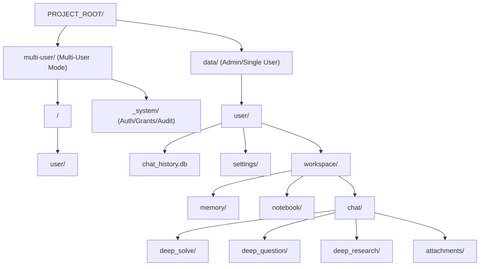
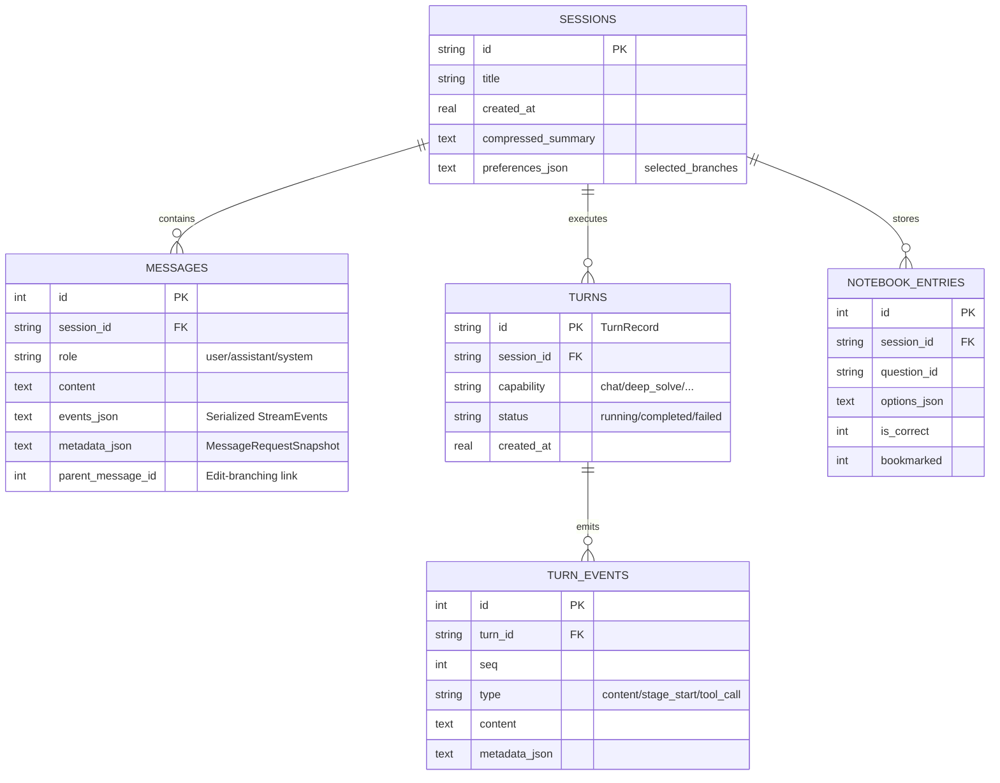
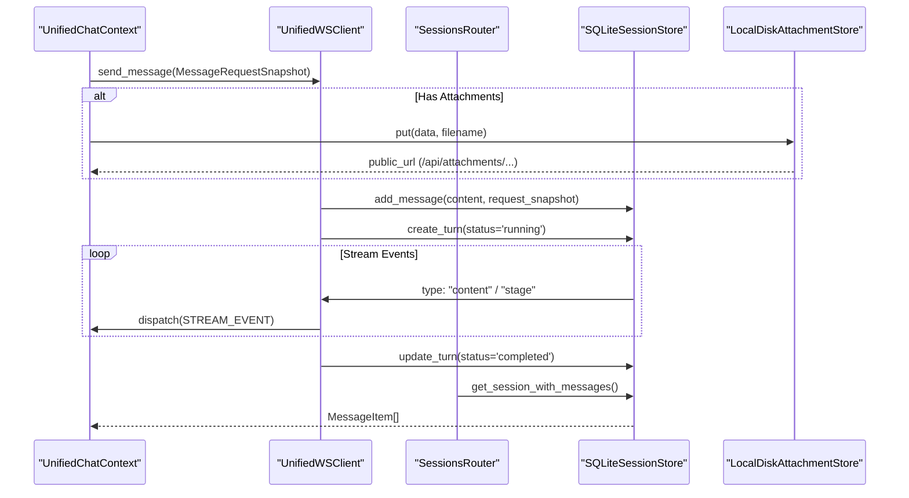

# Data Flow and Storage

Relevant source files

The following files were used as context for generating this wiki page:

- [README.md](README.md)
- [assets/README/README_AR.md](assets/README/README_AR.md)
- [assets/README/README_CN.md](assets/README/README_CN.md)
- [assets/README/README_ES.md](assets/README/README_ES.md)
- [assets/README/README_FR.md](assets/README/README_FR.md)
- [assets/README/README_HI.md](assets/README/README_HI.md)
- [assets/README/README_JA.md](assets/README/README_JA.md)
- [assets/README/README_PL.md](assets/README/README_PL.md)
- [assets/README/README_PT.md](assets/README/README_PT.md)
- [assets/README/README_RU.md](assets/README/README_RU.md)
- [assets/README/README_TH.md](assets/README/README_TH.md)
- [deeptutor/api/routers/memory.py](deeptutor/api/routers/memory.py)
- [deeptutor/api/routers/settings.py](deeptutor/api/routers/settings.py)
- [deeptutor/multi_user/context.py](deeptutor/multi_user/context.py)
- [deeptutor/multi_user/paths.py](deeptutor/multi_user/paths.py)
- [deeptutor/services/path_service.py](deeptutor/services/path_service.py)
- [tests/api/test_settings_router.py](tests/api/test_settings_router.py)

## Purpose and Scope

This document describes DeepTutor's data persistence architecture, directory structures, and file formats. It details how the system manages unified chat sessions, knowledge base (KB) ingestion, and agent-specific workspace artifacts. DeepTutor uses a centralized `data/` directory for all persistent state, with a migration-hardened structure that separates user-specific data from global knowledge assets. The architecture supports both single-user local deployments and multi-user scoped isolation.

---

## Directory Structure Overview

DeepTutor organizes all persistent data under a root `data/` directory or a `multi-user/` directory depending on the deployment mode. The system uses a `PathService` to resolve these locations relative to the project root [deeptutor/services/path_service.py:76-82]().

### Root Data Directory Layout

**Sources:** [deeptutor/services/path_service.py:76-82](), [deeptutor/multi_user/paths.py:14-18](), [deeptutor/multi_user/paths.py:41-46](), [deeptutor/api/routers/settings.py:42-44]()

### Directory Purpose Table

| Path | Purpose | Key Code Entity |
|------|---------|-----------------|
| `.../user/chat_history.db` | Unified SQLite storage for sessions, messages, and turns | `SQLiteSessionStore` |
| `.../user/settings/` | UI preferences (`interface.json`) and model catalog persistence | `deeptutor/api/routers/settings.py` |
| `.../user/workspace/chat/deep_solve/` | Smart Solver artifacts and reasoning chains | `PathService.get_chat_feature_dir` |
| `.../user/workspace/chat/attachments/` | Binary file storage for chat uploads | `LocalDiskAttachmentStore` |
| `.../user/workspace/chat/_detached_code_execution/` | Sandbox for executing LLM-generated code | `PathService.get_chat_feature_dir` |
| `.../user/workspace/notebook/` | User's personal question notebook and bookmarks | `notebook_entries` (Table) |
| `.../user/workspace/memory/` | Learner profiles and session summaries (L2/L3) | `MemoryStore` |

**Sources:** [deeptutor/services/path_service.py:76-82](), [deeptutor/api/routers/settings.py:42-44](), [deeptutor/api/routers/settings.py:46-49]()

---

## Unified Session Storage (SQLite)

DeepTutor uses a single SQLite database, `chat_history.db`, per user scope to manage the lifecycle of interactions. This provides ACID compliance for multi-agent operations and supports advanced features like edit-branching.

### Database Schema and Entity Mapping

The schema bridges high-level "Natural Language" concepts (like a "Chat Session") to "Code Entity Space" (the SQL tables and Pydantic models).

**Sources:** [deeptutor/api/routers/memory.py:1-28](), [deeptutor/api/routers/settings.py:52-68]()

---

## Data Flow: Unified Turn Lifecycle

When a user sends a message, data flows through the WebSocket interface into the backend orchestration layers.

### Interaction Flow Diagram

**Sources:** [deeptutor/api/routers/settings.py:167-183](), [deeptutor/api/routers/settings.py:199-212]()

---

## Multi-User Isolation and Paths

DeepTutor supports a multi-user mode where data is partitioned by `user_id`.

### User Scoping and Path Resolution
The `PathService` is retrieved based on the `CurrentUser` in the `ContextVar` [deeptutor/multi_user/context.py:22-23]().

- **Admin Scope**: Rooted at `data/` [deeptutor/multi_user/paths.py:22-23]().
- **User Scope**: Rooted at `multi-user/<user_id>/` [deeptutor/multi_user/paths.py:38]().
- **System Data**: Rooted at `multi-user/_system/` for auth, grants, and audit logs [deeptutor/multi_user/paths.py:17](), [deeptutor/multi_user/paths.py:49-51]().

**Sources:** [deeptutor/multi_user/paths.py:14-18](), [deeptutor/multi_user/context.py:22-23](), [deeptutor/services/path_service.py:76-82]()

---

## Memory and Persistence Services

DeepTutor distinguishes between structured database state and semi-structured markdown memory.

### Three-Layer Memory System
The memory subsystem manages three layers of persistent data [deeptutor/api/routers/memory.py:1-28]():
1.  **L1 Trace**: Raw event logs per surface (e.g., chat, research).
2.  **L2 Summary**: Per-surface summaries (e.g., `workspace/memory/chat.md`).
3.  **L3 Knowledge**: Cross-surface slots for synthesized knowledge (e.g., `workspace/memory/profile.md`).

### Attachment Storage
The `LocalDiskAttachmentStore` handles binary uploads. Files are stored within the user's workspace to prevent collisions and ensure isolation. Before being written, filenames are sanitized to prevent path traversal vulnerabilities.

### Configuration Persistence
- **UI Settings**: Stored in `settings/interface.json`. This includes theme preferences, language, and enabled optional tools [deeptutor/api/routers/settings.py:42-44](), [deeptutor/api/routers/settings.py:57-68]().
- **Tour Cache**: A local `.tour_cache.json` file tracks whether the user has completed the onboarding tour [deeptutor/api/routers/settings.py:46-49]().
- **Model Catalog**: Managed via `ModelCatalogService` and persisted to the user's settings directory [deeptutor/api/routers/settings.py:24-28]().
- **Runtime Invalidation**: When an admin applies a new model catalog, the system resets global LLM and embedding clients to pick up changes, potentially affecting in-flight turns [deeptutor/api/routers/settings.py:150-165]().

**Sources:** [deeptutor/api/routers/memory.py:1-28](), [deeptutor/api/routers/settings.py:42-68](), [deeptutor/api/routers/settings.py:150-165](), [deeptutor/services/path_service.py:76-82]()
