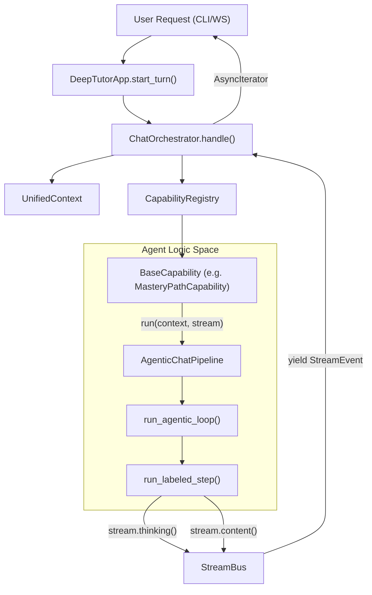
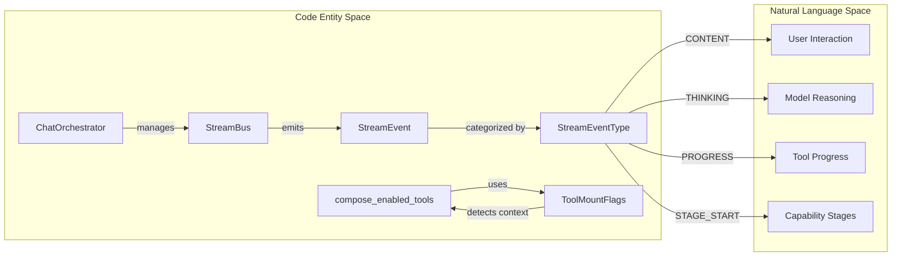

# Runtime and Orchestration

Relevant source files

The following files were used as context for generating this wiki page:

- [AGENTS.md](AGENTS.md)
- [SKILL.md](SKILL.md)
- [deeptutor/agents/_shared/tool_composition.py](deeptutor/agents/_shared/tool_composition.py)
- [deeptutor/agents/chat/agent_loop.py](deeptutor/agents/chat/agent_loop.py)
- [deeptutor/agents/chat/prompt_blocks.py](deeptutor/agents/chat/prompt_blocks.py)
- [deeptutor/agents/research/pipeline.py](deeptutor/agents/research/pipeline.py)
- [deeptutor/app/facade.py](deeptutor/app/facade.py)
- [deeptutor/book/models.py](deeptutor/book/models.py)
- [deeptutor/capabilities/mastery_path.py](deeptutor/capabilities/mastery_path.py)
- [deeptutor/core/stream_bus.py](deeptutor/core/stream_bus.py)
- [deeptutor/loop_plugins/__init__.py](deeptutor/loop_plugins/__init__.py)
- [deeptutor/loop_plugins/mastery/__init__.py](deeptutor/loop_plugins/mastery/__init__.py)
- [deeptutor/loop_plugins/mastery/plugin.py](deeptutor/loop_plugins/mastery/plugin.py)
- [deeptutor/runtime/bootstrap/builtin_capabilities.py](deeptutor/runtime/bootstrap/builtin_capabilities.py)
- [deeptutor/runtime/orchestrator.py](deeptutor/runtime/orchestrator.py)
- [deeptutor/tools/builtin/__init__.py](deeptutor/tools/builtin/__init__.py)
- [deeptutor/tools/paper_search_tool.py](deeptutor/tools/paper_search_tool.py)
- [tests/runtime/test_orchestrator.py](tests/runtime/test_orchestrator.py)
- [web/lib/unified-ws.ts](web/lib/unified-ws.ts)

The Runtime and Orchestration layer serves as the central nervous system of DeepTutor. It bridges high-level **Capabilities** (complex multi-agent workflows) and low-level **Tools** (atomic functions) through a unified execution environment. This layer manages the lifecycle of user "turns," capability discovery, and the streaming event bus that connects backend logic to frontend or CLI interfaces.

## ChatOrchestrator and Registries

The `ChatOrchestrator` is the primary coordinator responsible for executing a "Turn" (a single user interaction). It relies on specialized registries to discover and invoke system features.

### Capability Registry
The `CapabilityRegistry` manages high-level agent modules such as `chat`, `deep_solve`, `deep_question`, and `deep_research` [deeptutor/runtime/orchestrator.py:20-21](). Capabilities are registered via class paths in `BUILTIN_CAPABILITY_CLASSES` [deeptutor/runtime/bootstrap/builtin_capabilities.py:3-12](). Each capability implements `BaseCapability` and defines a `CapabilityManifest` containing its name, description, and execution stages [deeptutor/capabilities/mastery_path.py:58-67]().

### Tool Registry
The `ToolRegistry` handles the discovery and execution of LLM-callable functions. The orchestrator uses it to list available tools and generate OpenAI-compatible JSON schemas for function calling [deeptutor/runtime/orchestrator.py:121-132](). Tools are composed based on user toggles and context flags (e.g., if a knowledge base is attached, the `rag` tool is auto-mounted) [deeptutor/agents/_shared/tool_composition.py:71-88, 120-121]().

| Registry | Responsibility | Key Method |
|:---|:---|:---|
| **Capability Registry** | Orchestrating multi-stage agent workflows | `get_capability_registry().get(name)` [deeptutor/runtime/orchestrator.py:47]() |
| **Tool Registry** | Providing schemas and execution for atomic functions | `get_tool_registry().list_tools()` [deeptutor/runtime/orchestrator.py:122]() |

**Sources:**
- `deeptutor/runtime/orchestrator.py` [20-21, 47, 121-132]()
- `deeptutor/runtime/bootstrap/builtin_capabilities.py` [3-12]()
- `deeptutor/capabilities/mastery_path.py` [58-67]()
- `deeptutor/agents/_shared/tool_composition.py` [71-88, 120-121]()

## Execution Data Flow

The runtime utilizes a `StreamBus` to propagate events from deep agent layers to the user interface. This ensures that long-running processes provide real-time feedback through "stages" and "thinking" events.

### Orchestration Pipeline
The `ChatOrchestrator.handle` method manages the `StreamBus` lifecycle. It creates a task to run the selected capability and subscribes to the resulting event stream [deeptutor/runtime/orchestrator.py:80-98](). The `UnifiedContext` acts as the data carrier, containing the user message, session metadata, and metadata like `agent_identity` for personalized personas [deeptutor/agents/chat/prompt_blocks.py:100-117]().

**Runtime Request Flow**

**Sources:**
- `deeptutor/runtime/orchestrator.py` [80-98]()
- `deeptutor/app/facade.py` [114-134]()
- `deeptutor/capabilities/mastery_path.py` [69-73]()
- `deeptutor/core/stream_bus.py` [40-69]()

## Streaming Event Bus and Trace

The `StreamBus` is the unified channel for all real-time communication. It captures not just final content, but the "trace" of the agent's internal reasoning.

### Event Protocol
The bus handles several types of `StreamEvent` objects defined in `StreamEventType` [deeptutor/core/stream_bus.py:27](). Key event types include:
1.  **THINKING:** Captures internal reasoning or "pre-prose" logic [deeptutor/core/stream_bus.py:123-138]().
2.  **TOOL_CALL / TOOL_RESULT:** Tracks function invocation and data returns [deeptutor/core/stream_bus.py:157-191]().
3.  **PROGRESS:** Status updates for long-running operations (e.g., "Step 1 of 5") [deeptutor/core/stream_bus.py:193-213]().
4.  **STAGE_START / STAGE_END:** Defines logical phases of a capability (e.g., "Rephrasing" in research) [deeptutor/core/stream_bus.py:78-104]().

### Built-in Tool Ecosystem
Tools are categorized as **User-Toggleable** (e.g., `web_search`, `brainstorm`) or **Auto-Mounted** (e.g., `rag`, `code_execution`, `ask_user`) [deeptutor/agents/_shared/tool_composition.py:33-50](). Auto-mounted tools only appear in the LLM's manifest when specific context flags are met, such as `has_kb` or `has_memory` [deeptutor/agents/_shared/tool_composition.py:71-88]().

**Code Entity Association**

**Sources:**
- `deeptutor/core/stream_bus.py` [27, 78-213]()
- `deeptutor/agents/_shared/tool_composition.py` [33-50, 71-88, 115-143]()
- `deeptutor/runtime/orchestrator.py` [11-19]()

## Turn Lifecycle and Session Management

The `DeepTutorApp` facade provides a stable entry point for all adapters (CLI, WebSocket, SDK) to interact with the runtime [deeptutor/app/facade.py:56-59]().

### Turn Initialization
When a turn starts, the `TurnRequest` is converted into a payload that includes the resolved capability name and configuration [deeptutor/app/facade.py:16-31, 119-125](). The system then updates session preferences like language and notebook references [deeptutor/app/facade.py:126-133]().

### Multi-Phase Capabilities
Complex capabilities like `deep_research` break the turn into distinct phases (Rephrase, Decompose, Research, Reporting) [deeptutor/agents/research/pipeline.py:4-30](). Each phase uses specific `LabelProtocol` definitions to govern allowed LLM outputs, such as `LABEL_THINK`, `LABEL_TOOL`, and `LABEL_FINISH` [deeptutor/agents/research/pipeline.py:107-124]().

| Component | Code Entity | Responsibility |
|:---|:---|:---|
| **Turn Request** | `TurnRequest` | Data structure for starting a turn [deeptutor/app/facade.py:16](). |
| **Agent Loop** | `run_agentic_loop` | Core execution loop for agentic capabilities [deeptutor/agents/research/pipeline.py:68](). |
| **Prompt Assembly** | `ChatPromptAssembler` | Building structured system prompts from blocks [deeptutor/agents/chat/prompt_blocks.py:12](). |
| **Event Completion** | `_publish_completion` | Notifying the global bus of turn finalization [deeptutor/runtime/orchestrator.py:101-120](). |

**Sources:**
- `deeptutor/app/facade.py` [16-31, 56-59, 114-134]()
- `deeptutor/agents/research/pipeline.py` [4-30, 107-124]()
- `deeptutor/agents/chat/prompt_blocks.py` [12-44]()
- `deeptutor/runtime/orchestrator.py` [101-120]()
