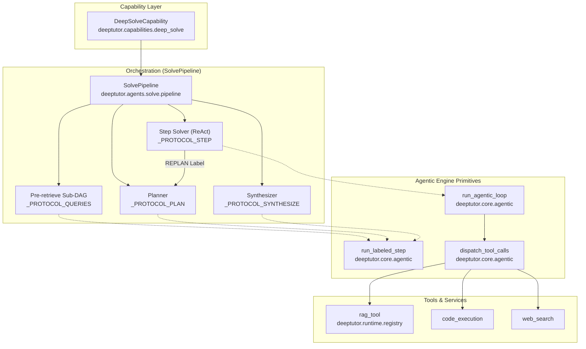
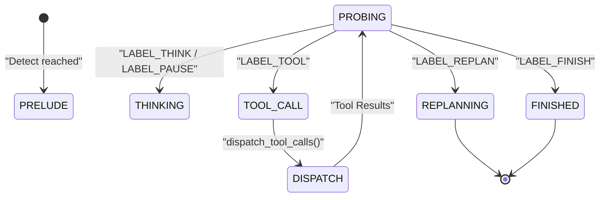

# Smart Solver

Relevant source files

The following files were used as context for generating this wiki page:

- [deeptutor/capabilities/_answer_now.py](deeptutor/capabilities/_answer_now.py)
- [deeptutor/capabilities/deep_research.py](deeptutor/capabilities/deep_research.py)
- [deeptutor/capabilities/deep_solve.py](deeptutor/capabilities/deep_solve.py)
- [deeptutor/capabilities/math_animator.py](deeptutor/capabilities/math_animator.py)
- [tests/capabilities/__init__.py](tests/capabilities/__init__.py)

## Purpose and Scope

The Smart Solver is DeepTutor's dual-loop problem-solving system that answers user questions by combining iterative knowledge gathering with structured solution generation. It operates through a sequential architecture: an **Analysis Phase** (pre-retrieval and planning) followed by a **Solve Phase** (agentic step execution).

The system utilizes the `SolvePipeline` [deeptutor/agents/solve/pipeline.py:11](), which implements an engine-based approach with labeled steps (`THINK`, `TOOL`, `FINISH`, `REPLAN`) to manage complex reasoning and tool use. It is designed to handle queries requiring multiple retrieval steps, code execution for verification, and multi-step reasoning with grounded citations.

Sources: [deeptutor/capabilities/deep_solve.py:1-6](), [deeptutor/agents/solve/pipeline.py:1-22]()

---

## Architecture Overview

### Dual-Loop Design

The Smart Solver implements a sequential dual-loop architecture where each loop serves a distinct purpose in the problem-solving workflow.

*   **Analysis Loop (Phase 0 & 1)**: Focuses on "Pre-retrieve" and "Plan". If a Knowledge Base (KB) is attached, it generates multiple queries, executes RAG in parallel, and aggregates results into a knowledge note before generating a structured JSON plan.
*   **Solve Loop (Phase 2 & 3)**: Executes the generated plan step-by-step. Each step runs an agentic loop. If a step fails or requires a change in direction, it triggers a `REPLAN` back-edge to Phase 1. Finally, it synthesizes the final answer.

Sources: [deeptutor/agents/solve/pipeline.py:3-22](), [deeptutor/capabilities/deep_solve.py:18-26]()

### System Flow and Code Entities

The following diagram maps the logical solver components to their specific implementation classes and engine protocols.

**Solver Execution Pipeline**

Sources: [deeptutor/capabilities/deep_solve.py:39-53](), [deeptutor/agents/solve/pipeline.py:85-133](), [deeptutor/agents/solve/pipeline.py:201-213]()

---

## Analysis Phase Components

### Pre-retrieval (Phase 0)
When a Knowledge Base is attached, the solver performs an initial research burst to ground the planner.
- **Query Generation**: Emits `LABEL_QUERIES` to generate $N$ search strings (default 3) [deeptutor/agents/solve/pipeline.py:75-139]().
- **Parallel RAG**: Executes queries in parallel via `rag` tool [deeptutor/agents/solve/pipeline.py:5-7]().
- **Knowledge Aggregation**: Emits `LABEL_SUMMARY` to condense retrieved snippets (capped at 6000 chars) into a "Knowledge Note" [deeptutor/agents/solve/pipeline.py:149-152]().

### Planning (Phase 1)
The planner decomposes the user question into ordered `PlanStep` entities.
- **Protocol**: Uses `_PROTOCOL_PLAN` which requires a single `PLAN` labeled JSON response [deeptutor/agents/solve/pipeline.py:99-105]().
- **Re-entry**: On a `REPLAN` signal from the Solve phase, the planner is re-entered with the previous attempt and the failure reason as additional context [deeptutor/agents/solve/pipeline.py:8-11]().

Sources: [deeptutor/agents/solve/pipeline.py:1-22](), [deeptutor/agents/solve/pipeline.py:178-195]()

---

## Solve Phase Components

### Step Execution (Phase 2)
For each step in the plan, the `SolvePipeline` [deeptutor/agents/solve/pipeline.py:11]() runs a full agentic loop.
- **Labels**: Supports `THINK`, `TOOL`, `FINISH`, and `REPLAN` [deeptutor/agents/solve/pipeline.py:107-112]().
- **Context Flow**: The `FINISH` text from a previous step is streamed into the next step's prompt context, ensuring the final output reads as a continuous, logical narrative [deeptutor/agents/solve/pipeline.py:13-15]().
- **Iteration Limits**: Capped at 7 iterations per step by default to prevent infinite loops [deeptutor/agents/solve/pipeline.py:137-138]().

### Synthesis (Phase 3)
After all steps are completed (or if the model decides it has sufficient information), a final synthesis step is triggered.
- **Final Answer**: Emits a `FINISH` labeled step to produce the precise final answer and a short recap [deeptutor/agents/solve/pipeline.py:16-17]().
- **Repair**: Includes a one-shot repair mechanism if the final output violates expected formatting [deeptutor/agents/solve/pipeline.py:151-152]().

Sources: [deeptutor/agents/solve/pipeline.py:106-119](), [deeptutor/agents/solve/pipeline.py:135-144]()

---

## Protocol and Engine Integration

The solver relies on the core `agentic` engine for streaming, label parsing, and tool dispatching.

| Entity | Code Symbol | File | Purpose |
| :--- | :--- | :--- | :--- |
| **Plan Step** | `PlanStep` | [deeptutor/agents/solve/pipeline.py:179]() | Individual goal with a unique ID. |
| **Full Plan** | `Plan` | [deeptutor/agents/solve/pipeline.py:185]() | Container for analysis and ordered steps. |
| **Label Protocol** | `LabelProtocol` | [deeptutor/core/agentic/labels.py]() | Defines valid transitions (e.g., `THINK` -> `TOOL`). |
| **Labeled Result** | `LabeledStepResult` | [deeptutor/core/agentic/labeled_step.py:87-93]() | Outcome of a single labeled LLM call including parsed tool calls. |

### Agentic Loop State Machine
The solver uses `run_agentic_loop` to handle the low-level mechanics of streaming and tool execution. It supports pre-label reasoning blocks (e.g., ``) which are routed to the reasoning sub-trace before label probing resumes [deeptutor/core/agentic/labeled_step.py:18-31]().

**Engine State Transitions**

Sources: [deeptutor/core/agentic/labeled_step.py:1-31](), [deeptutor/agents/solve/pipeline.py:106-112](), [deeptutor/core/agentic/__init__.py]()

---

## Fast-Path (Answer Now)

While `deep_solve` is a heavy-duty capability, it participates in the system-wide `answer_now` protocol for emergency exits.

- **Extraction**: `extract_answer_now_context` [deeptutor/capabilities/_answer_now.py:54]() validates the interrupted turn's payload, requiring a non-empty `original_user_message` [deeptutor/capabilities/_answer_now.py:58-74]().
- **Trace Summary**: Renders captured stream events (up to 6000 chars) into a compact, prompt-friendly summary for one-shot synthesis [deeptutor/capabilities/_answer_now.py:76-122]().
- **Skip Notice**: Prepends an i18n-aware notice indicating which stages (e.g., `planning`, `reasoning`) were skipped [deeptutor/capabilities/_answer_now.py:131-147]().

Sources: [deeptutor/capabilities/_answer_now.py:1-27](), [deeptutor/capabilities/math_animator.py:68-78]()
