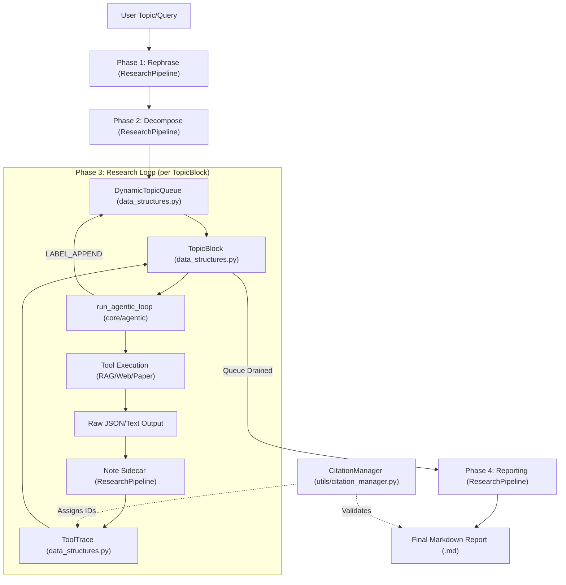
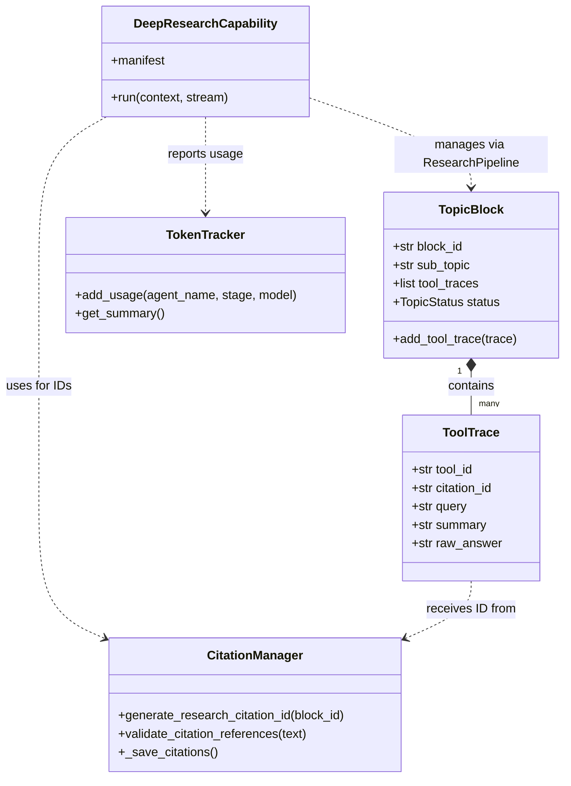

# Deep Research

Relevant source files

The following files were used as context for generating this wiki page:

- [deeptutor/agents/research/data_structures.py](deeptutor/agents/research/data_structures.py)
- [deeptutor/agents/research/utils/citation_manager.py](deeptutor/agents/research/utils/citation_manager.py)
- [deeptutor/agents/research/utils/token_tracker.py](deeptutor/agents/research/utils/token_tracker.py)
- [deeptutor/capabilities/_answer_now.py](deeptutor/capabilities/_answer_now.py)
- [deeptutor/capabilities/deep_research.py](deeptutor/capabilities/deep_research.py)
- [deeptutor/capabilities/deep_solve.py](deeptutor/capabilities/deep_solve.py)
- [deeptutor/capabilities/math_animator.py](deeptutor/capabilities/math_animator.py)
- [deeptutor/utils/json_parser.py](deeptutor/utils/json_parser.py)
- [tests/capabilities/__init__.py](tests/capabilities/__init__.py)

The Deep Research module is a multi-agent pipeline designed to perform autonomous, in-depth investigations into complex topics. It utilizes a "Decompose-Investigate-Note-Report" workflow to break down broad queries into manageable sub-topics, execute iterative tool-based research (web search, RAG, paper search), and synthesize findings into a structured report with full citation management.

### Multi-Agent Pipeline Architecture

The research process is orchestrated through a sequence of specialized agents and phases. The workflow is managed by the `ResearchPipeline`, which acts as an agentic-engine-based system that coordinates transitions between rephrasing, decomposing, researching, and reporting stages [deeptutor/capabilities/deep_research.py:69-74]().

| Phase | Responsibility | Protocol / Labels |
| :--- | :--- | :--- |
| **Phase 1: Rephrase** | Optimizes the initial user query for better research decomposition via `ask_user`. | `_PROTOCOL_REPHRASE` (`THINK`, `TOOL`, `FINISH`) |
| **Phase 2: Decompose** | Breaks the main topic into a queue of `TopicBlock` units for investigation. | `_PROTOCOL_DECOMPOSE` (`OUTLINE`) |
| **Phase 3: Research** | Executes tool calls (Web, RAG, Papers) to gather evidence for specific sub-topics. | `_PROTOCOL_BLOCK` (`THINK`, `TOOL`, `APPEND`, `FINISH`) |
| **Phase 4: Reporting** | Sequence of one-shot steps: Outline → Intro → Sections → Conclusion. | `_PROTOCOL_REPORT_SECTION` etc. |
| **Sidecar: Note** | Compresses raw tool results into short dense summaries for citations. | `_PROTOCOL_NOTE` (`FINISH`) |

#### Data Flow and Orchestration
The pipeline is designed to be resilient and dynamic. During **Phase 3**, the `APPEND` label allows the agent to mutate the research queue mid-stream, adding new sub-topics as discoveries are made. The research loop supports tools that produce evidence, specifically `rag`, `web_search`, `paper_search`, and `code_execution` [deeptutor/capabilities/deep_research.py:42-42]().

The `DeepResearchCapability` handles the two-stage outline-preview flow. The first call generates an `outline_preview` for the user to confirm; once confirmed, the second call drives the full research and reporting phases [deeptutor/capabilities/deep_research.py:58-67]().

**Research Pipeline Data Flow**

**Sources:** [deeptutor/capabilities/deep_research.py:37-45](), [deeptutor/agents/research/data_structures.py:189-203](), [deeptutor/agents/research/utils/citation_manager.py:18-30]()

---

### Core Data Structures

Deep Research relies on formal data structures defined in `deeptutor/agents/research/data_structures.py` to maintain state and provide a "paper trail" for every piece of information gathered.

#### TopicBlock and ToolTrace
- **`TopicBlock`**: The minimum scheduling unit in the queue. It represents a sub-topic and contains a list of `ToolTrace` objects representing the history of investigation for that specific sub-topic [deeptutor/agents/research/data_structures.py:189-203]().
- **`ToolTrace`**: Records a single tool interaction loop. It stores the unique `citation_id`, the `query`, the `raw_answer` (which is automatically truncated if it exceeds 50KB), and the `summary` generated by the Note sidecar [deeptutor/agents/research/data_structures.py:67-81]().
- **`TopicStatus`**: An enumeration tracking the lifecycle of a block: `PENDING`, `RESEARCHING`, `COMPLETED`, `FAILED` [deeptutor/agents/research/data_structures.py:44-50]().

#### Truncation Logic
To prevent context window overflow and storage bloat, `ToolTrace` implements intelligent truncation via `_truncate_raw_answer`. It attempts to parse the answer as JSON using `parse_json_response` and selectively truncates content fields like `answer`, `content`, `text`, `chunks`, or `documents` while attempting to preserve structural integrity [deeptutor/agents/research/data_structures.py:95-127](). If JSON parsing fails, it falls back to simple string truncation with a marker [deeptutor/agents/research/data_structures.py:129-133]().

**Sources:** [deeptutor/agents/research/data_structures.py:1-210](), [deeptutor/utils/json_parser.py:34-62]()

---

### Citation Management

The `CitationManager` class handles global ID management and ensures that every claim in the final report can be traced back to its source [deeptutor/agents/research/utils/citation_manager.py:18-20](). It manages two primary ID formats:
1.  **PLAN-XX**: For information gathered during the initial planning or pre-retrieval phase [deeptutor/agents/research/utils/citation_manager.py:50-58]().
2.  **CIT-X-XX**: For information gathered during the research stage, where `X` is the block number and `XX` is the sequence within that block [deeptutor/agents/research/utils/citation_manager.py:60-84]().

#### Reference Mapping and Persistence
The system maintains a `citations.json` file in the task workspace (managed by `get_path_service`) to persist counters and ID mappings across sessions [deeptutor/agents/research/utils/citation_manager.py:31-48](). It provides validation logic via `validate_citation_references`, which uses regex patterns like `\[\[([A-Z]+-\d+-?\d*)\]\]` to ensure that inline citations in the generated text correspond to existing tool traces [deeptutor/agents/research/utils/citation_manager.py:175-194]().

**Sources:** [deeptutor/agents/research/utils/citation_manager.py:18-112](), [deeptutor/services/path_service.py:14-14]()

---

### Token and Cost Tracking

Deep Research utilizes a specialized `TokenTracker` to monitor resource consumption across all agents and stages [deeptutor/agents/research/utils/token_tracker.py:105-111]().
- **Counting Methods**: Supports direct API usage reports, `tiktoken` for local counting, and word-count estimation (words * 1.3) as a fallback [deeptutor/agents/research/utils/token_tracker.py:115-150]().
- **Cost Calculation**: Uses a `MODEL_PRICING` table (e.g., `gpt-4o`, `deepseek-chat`) to calculate USD costs based on input/output pricing [deeptutor/agents/research/utils/token_tracker.py:24-34](), [deeptutor/agents/research/utils/token_tracker.py:82-86]().
- **Reporting**: Provides summaries by agent, model, and calculation method [deeptutor/agents/research/utils/token_tracker.py:171-195]().

**Entity Association Diagram**

**Sources:** [deeptutor/agents/research/data_structures.py:67-203](), [deeptutor/capabilities/deep_research.py:37-100](), [deeptutor/agents/research/utils/citation_manager.py:18-84](), [deeptutor/agents/research/utils/token_tracker.py:105-170]()
