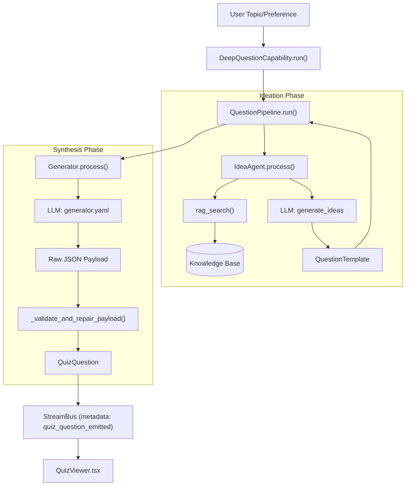
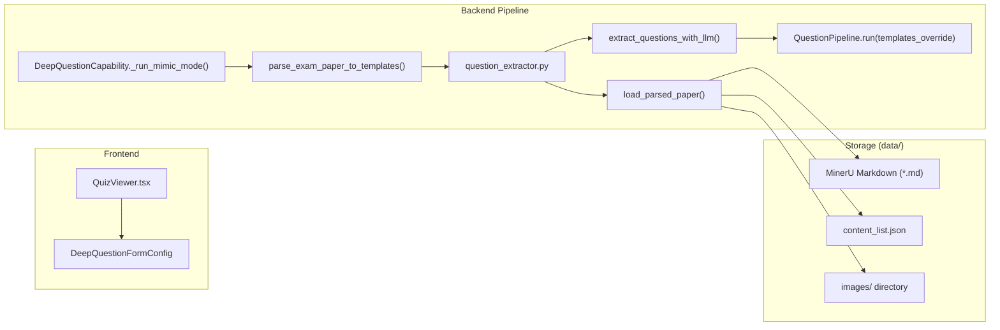

# Quiz Generation

Relevant source files

The following files were used as context for generating this wiki page:

- [deeptutor/agents/question/coordinator.py](deeptutor/agents/question/coordinator.py)
- [deeptutor/capabilities/deep_question.py](deeptutor/capabilities/deep_question.py)
- [deeptutor/tools/question/question_extractor.py](deeptutor/tools/question/question_extractor.py)
- [tests/tools/test_question_extractor.py](tests/tools/test_question_extractor.py)

The **Quiz Generation** module provides a multi-stage pipeline for creating high-quality, grounded educational assessments. It supports two primary workflows: **Topic-Driven Generation**, where questions are synthesized from a user-defined subject using RAG, and **Exam-Mimicry**, where existing exam papers (PDFs) are parsed and used as structural and thematic references for new questions.

## Core Architecture

The system follows a decoupled "Ideation-then-Generation" pattern. This ensures that pedagogical goals (difficulty, focus, question type) are established before the actual content is drafted, allowing for better validation and repair cycles.

### Deep Question Capability

The primary entry point for the quiz system is the `DeepQuestionCapability` [deeptutor/capabilities/deep_question.py:28](). It routes user requests into three distinct paths [deeptutor/capabilities/deep_question.py:3-9]():
*   **Followup**: Handles questions about a previously generated quiz using the `FollowupAgent` [deeptutor/capabilities/deep_question.py:53-56]().
*   **Custom Mode**: Standard topic-to-quiz generation using the `QuestionPipeline` [deeptutor/capabilities/deep_question.py:104-141]().
*   **Mimic Mode**: Parses an exam paper first, then uses the `QuestionPipeline` with template overrides [deeptutor/capabilities/deep_question.py:144-156]().

### Question Generation Pipeline

The generation process is orchestrated by the `QuestionPipeline` [deeptutor/agents/question/pipeline.py:19](), which is also exposed via the `AgentCoordinator` legacy facade [deeptutor/agents/question/coordinator.py:31-37](). The pipeline manages the lifecycle of specialized agents:

1.  **IdeaAgent**: Responsible for "Ideation". It performs RAG lookups on the knowledge base and generates question templates.
2.  **Generator**: Responsible for "Synthesis". It takes a template and produces a final `QuizQuestion` payload with questions, options, answers, and explanations.

### Data Flow: Topic-Driven Workflow

Title: "Topic-Driven Generation Data Flow"

**Sources:** [deeptutor/capabilities/deep_question.py:100-141](), [deeptutor/agents/question/coordinator.py:66-92](), [deeptutor/agents/question/pipeline.py:19-25]()

---

## Component Details

### 1. IdeaAgent (Ideation)
The `IdeaAgent` creates the pedagogical blueprint for a quiz. 
- **Knowledge Grounding**: If a knowledge base is provided in the `UnifiedContext` [deeptutor/capabilities/deep_question.py:43](), it retrieves relevant context to ensure questions are factually grounded.
- **Constraint Satisfaction**: It enforces user-defined difficulty levels and question types (choice, concept, fill_in_blank, short_answer, written, or coding).

### 2. Generator (Synthesis & Repair)
The `Generator` converts a template into a complete `QuizQuestion`.
- **Validation and Repair**: After the LLM generates a response, the agent runs `_validate_and_repair_payload`. This ensures structural integrity, such as ensuring `choice` questions have valid options and `concept` questions (True/False) are correctly formatted.
- **Multimodal Support**: The generator can process chat attachments (images), allowing vision-capable models to generate questions based on visual context [deeptutor/capabilities/deep_question.py:71]().

### 3. AgentCoordinator
The `AgentCoordinator` acts as a compatibility layer [deeptutor/agents/question/coordinator.py:1-7](). It initializes the `QuestionPipeline` [deeptutor/agents/question/coordinator.py:162-167]() and forwards events to the frontend via a `WsCallback` [deeptutor/agents/question/coordinator.py:63-64]().

**Sources:** [deeptutor/agents/question/coordinator.py:31-64](), [deeptutor/capabilities/deep_question.py:28-83]()

---

## Exam-Mimicry Workflow

The Exam-Mimicry workflow allows the system to "clone" the style and depth of existing exam papers. It uses a sophisticated extraction pipeline to turn static PDFs into generative templates.

### Implementation Logic
1.  **Paper Parsing**: The system uses `parse_exam_paper_to_templates` [deeptutor/agents/question/coordinator.py:116-121]() to handle uploaded documents.
2.  **Question Extraction**: `question_extractor.py` uses LLM analysis to identify question numbers, text, and associated images from MinerU-parsed markdown [deeptutor/tools/question/question_extractor.py:143-162]().
3.  **Image Handling**: It detects image references in the paper and maps them to local files in the `images/` directory [deeptutor/tools/question/question_extractor.py:139-143]().
4.  **Mimicry**: The extracted templates are passed to the `QuestionPipeline` as `templates_override` [deeptutor/capabilities/deep_question.py:177](), bypassing the standard `IdeaAgent` ideation phase.

Title: "Exam-Mimicry Code Entity Map"

**Sources:** [deeptutor/capabilities/deep_question.py:158-185](), [deeptutor/tools/question/question_extractor.py:58-133](), [deeptutor/agents/question/coordinator.py:94-146]()

---

## Supported Question Types

The system normalizes various LLM aliases into a set of canonical types defined in the `question_extractor` and frontend logic [deeptutor/tools/question/question_extractor.py:156-162]():

| Canonical Type | Description | LLM Field |
| :--- | :--- | :--- |
| `choice` | Multiple-choice with discrete options (A/B/C/D). | `question_type` |
| `concept` | True/False propositions for judgement. | `question_type` |
| `fill_in_blank` | Stem with a blank to fill in with a word/phrase. | `question_type` |
| `short_answer`| Conceptual question requiring a few sentences. | `question_type` |
| `written` | Longer essay, proof, or multi-step derivation. | `question_type` |
| `coding` | Programming / algorithm question expecting code. | `question_type` |

**Sources:** [deeptutor/tools/question/question_extractor.py:156-162](), [deeptutor/capabilities/deep_question.py:88-96]()

---

## Validation & Repair Lifecycle

The system ensures a seamless assessment experience through several layers of processing:

1.  **Streaming Extraction**: Backend events are emitted through the `StreamBus`. The `QuestionPipeline` handles the emission of `quiz_question_emitted` events as they are generated [deeptutor/agents/question/pipeline.py:140]().
2.  **History Awareness**: The `DeepQuestionCapability` loads session history via `load_session_quiz_history` [deeptutor/capabilities/deep_question.py:120]() to ensure the pipeline can avoid repeating questions or build upon previous turns.
3.  **Follow-up System**: If the user asks a question about a specific quiz item, the `FollowupAgent` [deeptutor/capabilities/deep_question.py:53]() processes the `question_followup_context` [deeptutor/capabilities/deep_question.py:49]() to provide targeted explanations.
4.  **Repair Mechanism**: The pipeline includes a validation step where the `Generator` ensures the LLM output matches the expected JSON schema, repairing common formatting errors before the question is emitted to the stream.

**Sources:** [deeptutor/capabilities/deep_question.py:48-83](), [deeptutor/agents/question/pipeline.py:100-141](), [deeptutor/agents/question/coordinator.py:180-191]()
