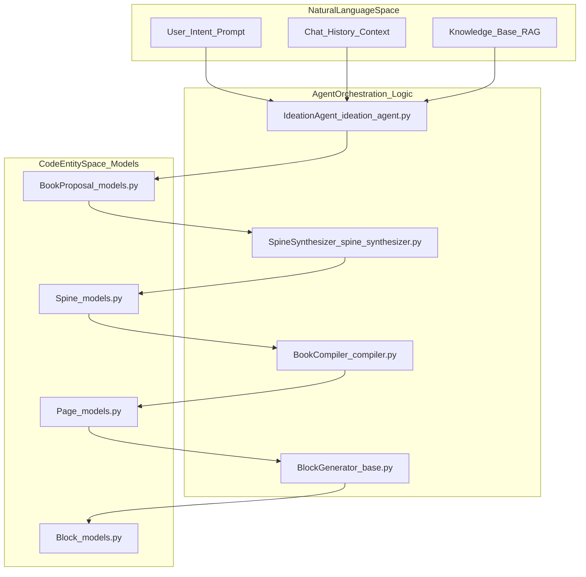
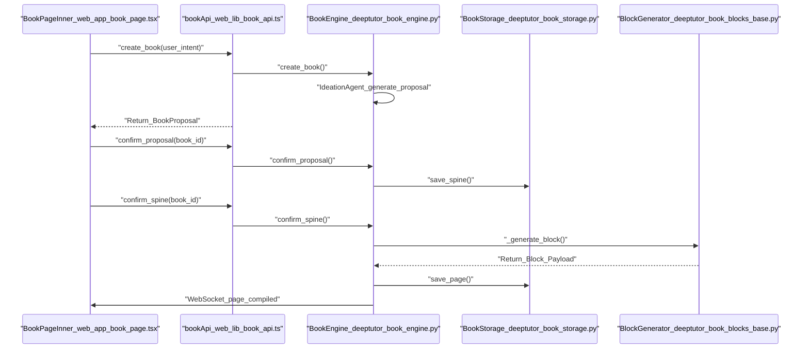

# Book Engine

Relevant source files

The following files were used as context for generating this wiki page:

- [assets/roster/forkers.svg](assets/roster/forkers.svg)
- [assets/roster/stargazers.svg](assets/roster/stargazers.svg)
- [deeptutor/book/blocks/_llm_writer.py](deeptutor/book/blocks/_llm_writer.py)
- [deeptutor/book/blocks/code.py](deeptutor/book/blocks/code.py)
- [deeptutor/book/blocks/deep_dive.py](deeptutor/book/blocks/deep_dive.py)
- [deeptutor/book/blocks/flash_cards.py](deeptutor/book/blocks/flash_cards.py)
- [deeptutor/book/blocks/timeline.py](deeptutor/book/blocks/timeline.py)
- [deeptutor/book/engine.py](deeptutor/book/engine.py)
- [deeptutor/book/kb_health.py](deeptutor/book/kb_health.py)
- [deeptutor/services/__init__.py](deeptutor/services/__init__.py)
- [web/app/(workspace)/book/components/BookLibrary.tsx](web/app/(workspace)/book/components/BookLibrary.tsx)
- [web/app/(workspace)/book/components/BookSidebar.tsx](web/app/(workspace)/book/components/BookSidebar.tsx)
- [web/app/(workspace)/book/components/PageReader.tsx](web/app/(workspace)/book/components/PageReader.tsx)
- [web/app/(workspace)/book/components/blocks/AnimationBlock.tsx](web/app/(workspace)/book/components/blocks/AnimationBlock.tsx)
- [web/app/(workspace)/book/page.tsx](web/app/(workspace)/book/page.tsx)
- [web/app/layout.tsx](web/app/layout.tsx)
- [web/components/ThemeScript.tsx](web/components/ThemeScript.tsx)
- [web/lib/debounce.ts](web/lib/debounce.ts)
- [web/lib/theme-utils.ts](web/lib/theme-utils.ts)
- [web/lib/theme.ts](web/lib/theme.ts)

The **Book Engine** is a multi-agent "living book" compiler designed to transform diverse educational materials—including chat history, knowledge bases, and quiz banks—into structured, interactive digital books [deeptutor/book/engine.py:2-7](). It utilizes a sophisticated pipeline that transitions from high-level ideation to granular block-level synthesis, supporting 14 distinct interactive block types [deeptutor/book/models.py:47-55]().

## System Architecture

The Book Engine operates as an orchestrator that manages a per-book compilation queue and a multi-stage agent lifecycle. The system bridges unstructured natural language intent with a strictly typed "Spine" and "Page" code entity space. Unlike standard agents, the `BookEngine` sits parallel to the `ChatOrchestrator` as a top-level service [deeptutor/book/engine.py:5-7]().

### Book Generation Lifecycle

The generation process follows a multi-stage pipeline managed by the `BookEngine` orchestrator and the `BookCompiler` [deeptutor/book/engine.py:100-113]():

1.  **IdeationAgent**: Analyzes user intent and provided sources (KB, Chat, Notebooks) to generate a `BookProposal` [deeptutor/book/engine.py:41-41](), [deeptutor/book/engine.py:200-211]().
2.  **SourceExplorer**: Maps relevant knowledge chunks and data points to proposed chapters using RAG-driven exploration [deeptutor/book/engine.py:42-42]().
3.  **SpineSynthesizer**: Formalizes the proposal into a `Spine`, defining the hierarchical structure of pages and their intended pedagogical goals [deeptutor/book/engine.py:43-43](), [deeptutor/book/engine.py:241-245]().
4.  **BookCompiler**: Executes the compilation of individual pages into `Block` components using specific `BlockGenerator` implementations for content [deeptutor/book/engine.py:110-113]().
5.  **Rendering**: The frontend `PageReader` renders the compiled JSON into interactive React components [web/app/(workspace)/book/page.tsx:39-39]().

### Natural Language to Code Entity Mapping

The following diagram illustrates how user concepts are translated into backend data structures and code entities.

**Diagram: NL Space to Code Entity Mapping**

**Sources:** [deeptutor/book/engine.py:41-44](), [deeptutor/book/models.py:46-63](), [deeptutor/book/blocks/base.py:19-20]().

## Implementation Details

### Per-Book Compilation Queue
The engine uses a persistent state machine to track progress. Each book transitions through statuses such as `draft`, `spine_ready`, `compiling`, and `ready` [deeptutor/book/models.py:53-53](). Real-time updates are pushed to the frontend via a dedicated WebSocket endpoint, `openBookSocket`, which feeds a `reduceBookEvent` function to update the local UI state [web/app/(workspace)/book/page.tsx:139-141](). Internally, the engine maintains a `_BookRuntime` containing an `asyncio.Queue` and a background worker task for each active book [deeptutor/book/engine.py:85-92]().

### The Compilation Pipeline
The `BookCompiler` manages the lifecycle of a single page. It iterates through planned blocks, invoking specific generators like `FlashCardsGenerator` or `CodeGenerator` [deeptutor/book/blocks/flash_cards.py:19-20](), [deeptutor/book/blocks/code.py:21-22](). The compiler is initialized with a `CompilerOptions` object, which currently defaults to `phase=2` [deeptutor/book/engine.py:112-113]().

### Interactive Block Types
Generators implement a `_generate` method that returns structured data, source anchors, and metadata [deeptutor/book/blocks/flash_cards.py:22-24]().

Key specialized generators include:
*   **Assessment**: `FlashCardsGenerator` returns a list of cards with `front`, `back`, and `hint` [deeptutor/book/blocks/flash_cards.py:57-63]().
*   **Visual/Structural**: `TimelineGenerator` returns a list of chronological events [deeptutor/book/blocks/timeline.py:43-55](). `DeepDiveGenerator` creates "Go deeper" affordances for sub-page creation [deeptutor/book/blocks/deep_dive.py:21-22]().
*   **Content/Logic**: `CodeGenerator` produces snippets with explanations [deeptutor/book/blocks/code.py:57-62](). `AnimationBlock` handles Manim-based mathematical animations [web/app/(workspace)/book/components/blocks/AnimationBlock.tsx:10-15]().

**Diagram: BookEngine Data Flow**

**Sources:** [deeptutor/book/engine.py:200-260](), [web/app/(workspace)/book/page.tsx:139-156](), [deeptutor/book/storage.py:148-153](), [deeptutor/book/storage.py:206-209]().

## LLM and Content Synthesis

Block generators utilize shared LLM helpers like `llm_json` to ensure consistent output and language adherence [deeptutor/book/blocks/_llm_writer.py:134-142](). These helpers include robust JSON parsing, thinking tag stripping, and retry logic to prevent failures during structured output generation [deeptutor/book/blocks/_llm_writer.py:93-131](), [deeptutor/book/blocks/_llm_writer.py:156-186]().

### Block Context
Every generator receives a `BlockContext` containing:
*   **Chapter Context**: Access to `ctx.chapter.title` and `ctx.chapter.summary` for topical alignment [deeptutor/book/blocks/timeline.py:26-27]().
*   **Language Directive**: The `llm_text` helper appends a strict language directive to the system prompt based on the book's chosen language [deeptutor/book/blocks/_llm_writer.py:32-45]().
*   **Pedagogical Goals**: Access to `ctx.chapter.learning_objectives` to guide content generation [deeptutor/book/blocks/flash_cards.py:28]().

## KB Health and Drift Detection

The engine includes a `kb_health` module to detect "drift" between the book's compiled content and the current state of its linked Knowledge Bases [deeptutor/book/kb_health.py:1-12]().

*   **Fingerprinting**: KBs are fingerprinted using file names, mtimes, and sizes [deeptutor/book/kb_health.py:35-42]().
*   **Drift Reporting**: `detect_kb_drift` identifies new, removed, or changed KBs and marks affected pages as stale [deeptutor/book/kb_health.py:102-152]().
*   **Self-Healing**: The engine can re-compute fingerprints to baseline a book or mark pages for re-compilation [deeptutor/book/kb_health.py:155-173]().

## Frontend Components

The Book Engine interface is managed by `BookPageInner`, which uses a `useReducer` to track live progress via `reduceBookEvent` [web/app/(workspace)/book/page.tsx:101-105]().

| Component | Role | File Reference |
| :--- | :--- | :--- |
| `BookLibrary` | Grid view of existing books with status badges. | [web/app/(workspace)/book/page.tsx:37-37]() |
| `BookSidebar` | Navigation for chapters and rebuild controls. | [web/app/(workspace)/book/page.tsx:39-39]() |
| `PageReader` | Main content area with a collapsible header that snaps back at the top. | [web/app/(workspace)/book/components/PageReader.tsx:49-106]() |
| `SpineEditor` | Interface for reviewing and editing the book structure before compilation. | [web/app/(workspace)/book/page.tsx:41-41]() |
| `BookChatPanel` | Sidebar for interacting with the AI about specific pages. | [web/app/(workspace)/book/page.tsx:34-34]() |

### Persistence and Deep-Linking
The engine supports deep-linking via URL parameters (`?book=<id>`). The `useEffect` hook in the main page monitors `requestedBookId` and automatically invokes `handleSelectBook` [web/app/(workspace)/book/page.tsx:222-235](). Book data is persisted on disk using an atomic JSON write strategy in `BookStorage`, which manages a directory structure for manifests, spines, and individual page files [deeptutor/book/storage.py:7-19]().

**Sources:** [web/app/(workspace)/book/page.tsx:67-106](), [deeptutor/book/kb_health.py:102-152](), [deeptutor/book/blocks/_llm_writer.py:134-186](), [web/app/(workspace)/book/components/PageReader.tsx:71-106]().
