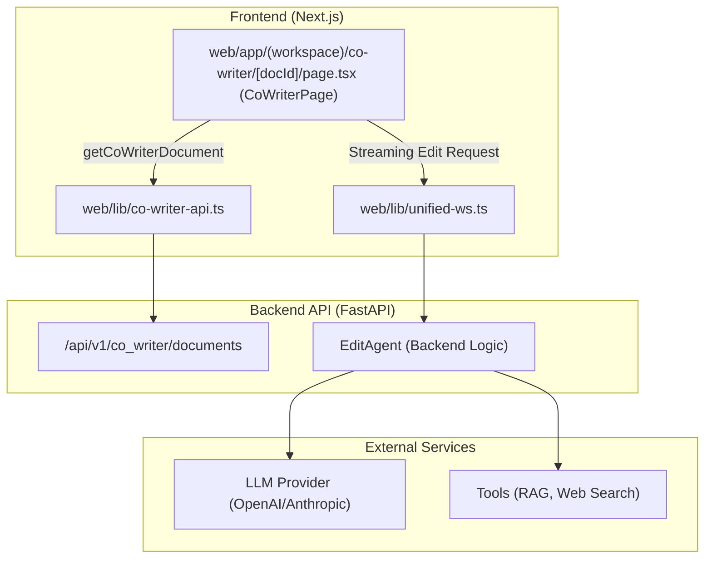
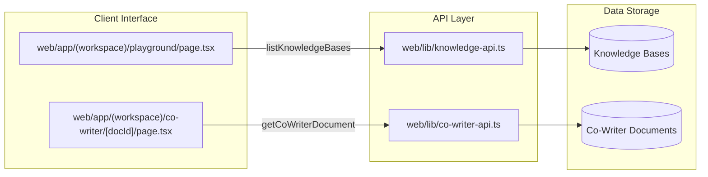

# Idea Generation and Co-Writer

Relevant source files

The following files were used as context for generating this wiki page:

- [web/app/(workspace)/co-writer/[docId]/page.tsx](web/app/(workspace)/co-writer/[docId]/page.tsx)
- [web/app/(workspace)/playground/page.tsx](web/app/(workspace)/playground/page.tsx)
- [web/components/chat/preview/previewers/useTextSource.ts](web/components/chat/preview/previewers/useTextSource.ts)
- [web/components/notebook/SaveToNotebookModal.tsx](web/components/notebook/SaveToNotebookModal.tsx)
- [web/components/sidebar/BookRecent.tsx](web/components/sidebar/BookRecent.tsx)
- [web/lib/co-writer-api.ts](web/lib/co-writer-api.ts)
- [web/lib/knowledge-api.ts](web/lib/knowledge-api.ts)
- [web/lib/notebook-api.ts](web/lib/notebook-api.ts)

## Purpose and Scope

This page documents the automated idea generation workflow and the interactive markdown co-writing system within DeepTutor. These modules support creative knowledge synthesis and content creation through two distinct modes:

- **Idea Generation**: A systematic brainstorming engine that processes knowledge base materials to produce structured learning directions, often integrated into the Quiz Generation and Book Engine pipelines.
- **Co-Writer**: A document-centric interactive editing environment. It features an `EditAgent` capable of multi-tool reasoning (RAG, web search, code execution) to assist users in rewriting, expanding, or refining markdown drafts [web/lib/co-writer-api.ts:41-54]().

---

## Co-Writer Module

### Overview
The Co-Writer provides a sophisticated markdown editing experience. Unlike standard chat interfaces, it is document-aware, allowing users to select specific text segments for AI-assisted transformation [web/app/(workspace)/co-writer/[docId]/page.tsx:206-214](). The frontend implementation in `CoWriterPage` manages complex state including split-pane ratios, scroll synchronization, and local draft autosaving [web/app/(workspace)/co-writer/[docId]/page.tsx:75-80]().

**Core Capabilities:**
- **Interactive Editing**: Supports specific actions like `rewrite`, `shorten`, and `expand` on selected text [web/app/(workspace)/co-writer/[docId]/page.tsx:82-86]().
- **Agentic Pipeline**: Uses a ReAct-style loop allowing the editor to perform web searches or RAG lookups to verify facts during the writing process [web/app/(workspace)/co-writer/[docId]/page.tsx:63-68]().
- **Tool Integration**: Users can toggle specific tools like `rag` and `web` (Web Search) for each edit operation [web/app/(workspace)/co-writer/[docId]/page.tsx:88-91]().

### Frontend Implementation and Data Flow
The `CoWriterPage` component orchestrates the interaction between the editor (Markdown/Textarea) and the backend `EditAgent`. It tracks the `selectedRange` to perform localized edits [web/app/(workspace)/co-writer/[docId]/page.tsx:206-209]().

**Key Functions:**
- `updateCoWriterDocument`: Persists document changes (title and content) to the backend storage [web/lib/co-writer-api.ts:68-84]().
- `handleSelectionEdit`: Triggered when a user requests an AI edit on a text selection. It sends the instruction and context to the backend via a streaming WebSocket or POST request [web/app/(workspace)/co-writer/[docId]/page.tsx:209-214]().
- `SelectionTraceData`: Captures and displays the reasoning process of the AI, including tool calls and results, in a "Trace" panel [web/app/(workspace)/co-writer/[docId]/page.tsx:122-135]().

### Co-Writer System Architecture

Title: Co-Writer Frontend-Backend Interaction

Sources: [web/app/(workspace)/co-writer/[docId]/page.tsx:44-50](), [web/lib/co-writer-api.ts:56-66](), [web/lib/co-writer-api.ts:68-84]()

---

## Idea Generation and Knowledge Integration

### Overview
The Idea Generation workflow facilitates the transition from raw topics to structured candidate directions. In the Playground and Chat interfaces, this is often exposed as the `brainstorm` tool [web/app/(workspace)/playground/page.tsx:59-66]().

### Playground Integration
The `Playground` page allows developers and advanced users to test the ideation and tool-calling capabilities of various agents, including the ones used for co-writing and brainstorming [web/app/(workspace)/playground/page.tsx:1-25]().

**Key Logic:**
- **Tool Mapping**: The UI maps internal tool names like `brainstorm` and `rag` to specific icons and labels [web/app/(workspace)/playground/page.tsx:59-75]().
- **Capability Execution**: Capabilities like `deep_solve` or `deep_research` can be triggered to generate ideas or solve complex problems, with the results being renderable in the Co-Writer [web/app/(workspace)/playground/page.tsx:77-91]().

### Knowledge-Grounded Ideation Flow

Title: Knowledge Base and Tool Integration

Sources: [web/lib/knowledge-api.ts:95-113](), [web/lib/co-writer-api.ts:31-39](), [web/app/(workspace)/playground/page.tsx:36-46]()

---

## Notebook Integration

The Co-Writer and Idea Generation systems integrate with the unified `Notebook` system. Users can save their drafts or generated chat transcripts directly to a notebook for long-term persistence [web/components/notebook/SaveToNotebookModal.tsx:29-36]().

**Save Workflow:**
- **Payload Construction**: The system builds a `NotebookSavePayload` containing the record type (`co_writer`, `research`, `solve`, etc.), the title, and the markdown output [web/components/notebook/SaveToNotebookModal.tsx:29-36]().
- **Selection Mode**: Users can selectively pick which turns (user query + assistant response) to include in the saved record, which is particularly useful for ideation sessions [web/components/notebook/SaveToNotebookModal.tsx:47-57]().
- **Persistence**: Records are stored via the `/api/v1/notebook` endpoints, allowing them to be organized into custom notebooks [web/lib/notebook-api.ts:45-52]().

### Data Models

| Feature | Entity | Description |
| :--- | :--- | :--- |
| **Document Summary** | `CoWriterDocumentSummary` | Metadata for document listing (ID, title, preview) [web/lib/co-writer-api.ts:5-11](). |
| **Document Content** | `CoWriterDocument` | Full document data including the markdown content [web/lib/co-writer-api.ts:13-19](). |
| **Notebook Record** | `NotebookRecordItem` | A saved snapshot of an ideation or writing session [web/lib/notebook-api.ts:29-39](). |
| **Record Types** | `NotebookRecordType` | Enumeration of source modules: `solve`, `question`, `research`, `chat`, `co_writer`, `tutorbot` [web/lib/notebook-api.ts:10-16](). |

Sources: [web/lib/co-writer-api.ts:5-19](), [web/lib/notebook-api.ts:10-16](), [web/components/notebook/SaveToNotebookModal.tsx:21-27]()
