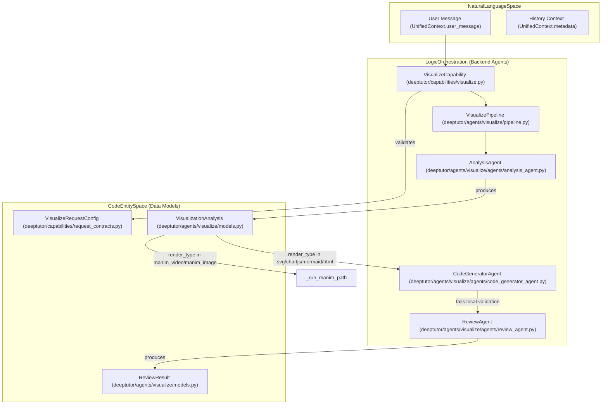
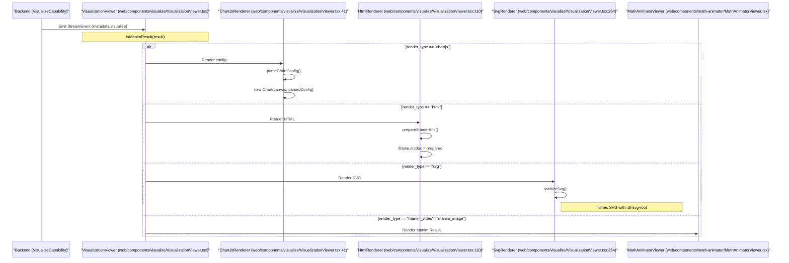

# Visualization Agent

Relevant source files

The following files were used as context for generating this wiki page:

- [deeptutor/agents/visualize/agents/code_generator_agent.py](deeptutor/agents/visualize/agents/code_generator_agent.py)
- [deeptutor/agents/visualize/agents/review_agent.py](deeptutor/agents/visualize/agents/review_agent.py)
- [deeptutor/agents/visualize/models.py](deeptutor/agents/visualize/models.py)
- [deeptutor/agents/visualize/pipeline.py](deeptutor/agents/visualize/pipeline.py)
- [deeptutor/agents/visualize/prompts/en/analysis_agent.yaml](deeptutor/agents/visualize/prompts/en/analysis_agent.yaml)
- [deeptutor/agents/visualize/prompts/en/code_generator_agent.yaml](deeptutor/agents/visualize/prompts/en/code_generator_agent.yaml)
- [deeptutor/agents/visualize/prompts/en/review_agent.yaml](deeptutor/agents/visualize/prompts/en/review_agent.yaml)
- [deeptutor/agents/visualize/prompts/zh/analysis_agent.yaml](deeptutor/agents/visualize/prompts/zh/analysis_agent.yaml)
- [deeptutor/agents/visualize/prompts/zh/code_generator_agent.yaml](deeptutor/agents/visualize/prompts/zh/code_generator_agent.yaml)
- [deeptutor/agents/visualize/prompts/zh/review_agent.yaml](deeptutor/agents/visualize/prompts/zh/review_agent.yaml)
- [deeptutor/agents/visualize/utils.py](deeptutor/agents/visualize/utils.py)
- [deeptutor/book/blocks/figure.py](deeptutor/book/blocks/figure.py)
- [deeptutor/book/blocks/interactive.py](deeptutor/book/blocks/interactive.py)
- [deeptutor/capabilities/prompts/en/visualize.yaml](deeptutor/capabilities/prompts/en/visualize.yaml)
- [deeptutor/capabilities/prompts/zh/visualize.yaml](deeptutor/capabilities/prompts/zh/visualize.yaml)
- [deeptutor/capabilities/visualize.py](deeptutor/capabilities/visualize.py)
- [tests/capabilities/test_answer_now.py](tests/capabilities/test_answer_now.py)
- [tests/core/test_capabilities_runtime.py](tests/core/test_capabilities_runtime.py)
- [web/components/visualize/VisualizationViewer.tsx](web/components/visualize/VisualizationViewer.tsx)
- [web/components/visualize/svg-theme.css](web/components/visualize/svg-theme.css)
- [web/lib/iframe-html.ts](web/lib/iframe-html.ts)

The **Visualization Agent** is a specialized pipeline within DeepTutor designed to transform natural language data descriptions or requests into interactive, high-quality visual representations. It utilizes a multi-stage agentic workflow to analyze requirements, generate code, and perform quality assurance through deterministic local validation and targeted repair.

## Overview

The visualization system supports six primary rendering engines, categorized into text-based graphics and mathematical animations:
1.  **Chart.js**: For quantitative data (bar, line, pie, radar, etc.) [deeptutor/capabilities/visualize.py:5-9]().
2.  **Mermaid.js**: For structured diagrams (flowcharts, sequence diagrams, mindmaps, etc.) [deeptutor/capabilities/visualize.py:5-9]().
3.  **SVG**: For custom illustrations or free-form graphics requiring precise coordinate control and theme awareness [deeptutor/capabilities/visualize.py:5-9]().
4.  **HTML**: For complex, interactive, or multi-library visualizations that require a sandboxed iframe [deeptutor/capabilities/visualize.py:5-9]().
5.  **Manim Video**: High-quality mathematical animations rendered as MP4 via a Manim subprocess [deeptutor/capabilities/visualize.py:47-48]().
6.  **Manim Image**: High-quality mathematical storyboards rendered as static frames [deeptutor/capabilities/visualize.py:47-48]().

## System Architecture

The pipeline follows an "Analyze -> Generate -> Review/Repair" pattern for text-based renders. For mathematical animations, the system branches into a specialized Manim path after the initial analysis stage [deeptutor/capabilities/visualize.py:116-126]().

### Pipeline Data Flow

The following diagram illustrates the transition from a user's Natural Language request to the final Code Entity space, specifically highlighting the Pydantic models used for validation and the bifurcation between standard visualization and Manim rendering.

**Natural Language to Code Entity Mapping**

**Sources:** [deeptutor/capabilities/visualize.py:63-141](), [deeptutor/agents/visualize/pipeline.py:13-41](), [deeptutor/agents/visualize/agents/code_generator_agent.py:14-29](), [deeptutor/capabilities/request_contracts.py:19-23]()

### Component Details

#### 1. AnalysisAgent
The `AnalysisAgent` determines the most appropriate `render_type` and `visual_genre` (e.g., flowchart, structural, illustrative) based on the user's intent [deeptutor/agents/visualize/prompts/en/analysis_agent.yaml:27-44](). It outputs a `VisualizationAnalysis` object containing a high-level description and required visual elements [deeptutor/agents/visualize/models.py:10-25]().

#### 2. CodeGeneratorAgent
The `CodeGeneratorAgent` produces the actual code payload. It uses format-specific rule blocks (e.g., `rules_svg`, `rules_chartjs`) to ensure the output is optimized for the chosen engine [deeptutor/agents/visualize/prompts/en/code_generator_agent.yaml:33-111]().
*   **SVG Theme Awareness**: The agent is instructed to use pre-built CSS classes (e.g., `.c-blue`, `.th`, `.box`) instead of hard-coded colors, allowing the figure to follow the application's light/dark theme automatically [deeptutor/agents/visualize/prompts/en/code_generator_agent.yaml:53-64]().
*   **Robust Extraction**: It isolates the code from LLM prose using `extract_code_block` and performs defensive tag trimming for SVG and HTML root elements [deeptutor/agents/visualize/agents/code_generator_agent.py:87-119]().

#### 3. Deterministic Validation & ReviewAgent
Instead of open-ended LLM review, the system uses a deterministic local check (XML well-formedness for SVG, strict JSON for Chart.js, etc.) [deeptutor/capabilities/visualize.py:148-154]().
*   **Targeted Repair**: If validation fails, the `ReviewAgent` is called with the specific error message to perform a minimal, targeted fix [deeptutor/agents/visualize/agents/review_agent.py:31-44]().
*   **HTML Fallback**: Since HTML documents can be large, they bypass the repair loop; if unrenderable, the system provides a minimal fallback template [deeptutor/capabilities/visualize.py:170-185]().

## Frontend Rendering

The `VisualizationViewer` component handles the safe rendering of generated code and provides interactive features like fullscreen mode and "Open in New Tab" for HTML [web/components/visualize/VisualizationViewer.tsx:1-11]().

### Component Interaction Diagram

**Frontend Rendering Component Map**

**Sources:** [web/components/visualize/VisualizationViewer.tsx:41-108](), [web/components/visualize/VisualizationViewer.tsx:110-185](), [web/components/visualize/VisualizationViewer.tsx:254-285](), [web/lib/visualize-types.ts:10-11]()

### Key Frontend Implementation Details
*   **SVG Sanitization**: The `sanitizeSvg` function parses the raw string as XML and strips potential XSS vectors like `<script>` or event handlers before inlining the SVG into the DOM [web/components/visualize/VisualizationViewer.tsx:195-212]().
*   **Theme Integration**: The `svg-theme.css` file defines the color ramps (e.g., `.c-teal`, `.c-coral`) used by the `CodeGeneratorAgent`. It uses CSS variables to switch between light and dark mode palettes [web/components/visualize/svg-theme.css:108-154]().
*   **Iframe Bridge**: The `HtmlRenderer` listens for messages from the sandboxed iframe, allowing the visualization to trigger new chat prompts via `sendPrompt()` or report its content height [web/components/visualize/VisualizationViewer.tsx:125-144]().

## Data Models

### VisualizationAnalysis
The structured brief produced by the `AnalysisAgent` [deeptutor/agents/visualize/models.py:10-25]().

| Field | Type | Description |
| :--- | :--- | :--- |
| `render_type` | `str` | Discriminator for the engine (svg, chartjs, mermaid, html, etc.). |
| `visual_genre` | `str` | The style of drawing (flowchart, structural, illustrative, etc.). |
| `description` | `str` | High-level goal of the visualization. |
| `chart_type` | `str` | Sub-type (e.g., "bar" for Chart.js or "sequenceDiagram" for Mermaid). |
| `visual_elements` | `list[str]` | Specific components to include in the render. |

### ReviewResult
The output of the targeted repair stage [deeptutor/agents/visualize/models.py:40-46]().

| Field | Type | Description |
| :--- | :--- | :--- |
| `optimized_code` | `str` | The corrected, renderable code block. |
| `changed` | `bool` | Whether the original code was modified. |
| `review_notes` | `str` | Summary of the fix performed by the `ReviewAgent`. |

**Sources:** [deeptutor/agents/visualize/models.py:10-46](), [deeptutor/capabilities/visualize.py:35-45]()
