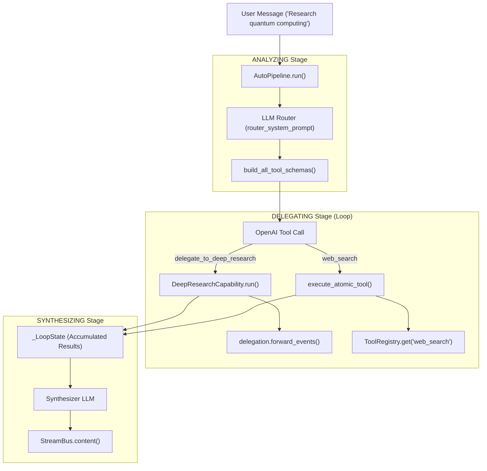
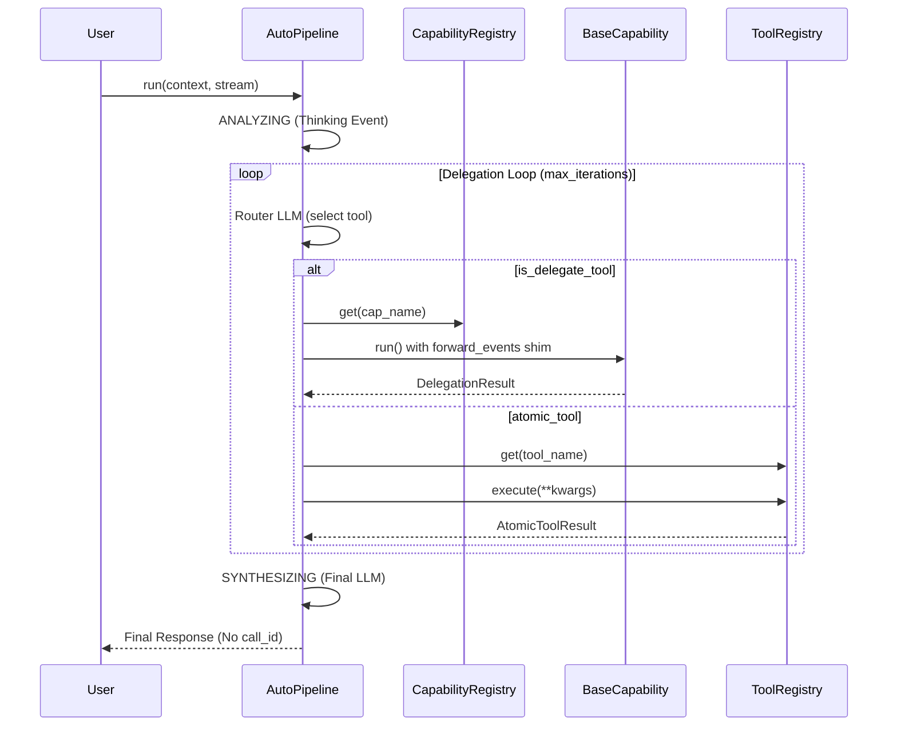

# Auto Mode

Relevant source files

The following files were used as context for generating this wiki page:

- [AGENTS.md](AGENTS.md)
- [SKILL.md](SKILL.md)
- [deeptutor/agents/_shared/tool_composition.py](deeptutor/agents/_shared/tool_composition.py)
- [deeptutor/agents/chat/agent_loop.py](deeptutor/agents/chat/agent_loop.py)
- [deeptutor/agents/chat/prompt_blocks.py](deeptutor/agents/chat/prompt_blocks.py)
- [deeptutor/agents/research/pipeline.py](deeptutor/agents/research/pipeline.py)
- [deeptutor/app/facade.py](deeptutor/app/facade.py)
- [deeptutor/capabilities/_answer_now.py](deeptutor/capabilities/_answer_now.py)
- [deeptutor/capabilities/deep_research.py](deeptutor/capabilities/deep_research.py)
- [deeptutor/capabilities/deep_solve.py](deeptutor/capabilities/deep_solve.py)
- [deeptutor/capabilities/mastery_path.py](deeptutor/capabilities/mastery_path.py)
- [deeptutor/capabilities/math_animator.py](deeptutor/capabilities/math_animator.py)
- [deeptutor/loop_plugins/__init__.py](deeptutor/loop_plugins/__init__.py)
- [deeptutor/loop_plugins/mastery/__init__.py](deeptutor/loop_plugins/mastery/__init__.py)
- [deeptutor/loop_plugins/mastery/plugin.py](deeptutor/loop_plugins/mastery/plugin.py)
- [deeptutor/tools/builtin/__init__.py](deeptutor/tools/builtin/__init__.py)
- [deeptutor/tools/paper_search_tool.py](deeptutor/tools/paper_search_tool.py)
- [tests/capabilities/__init__.py](tests/capabilities/__init__.py)
- [web/lib/unified-ws.ts](web/lib/unified-ws.ts)

The **Auto Mode** (implemented via `AutoPipeline`) is a three-stage agentic router that dynamically orchestrates the system's specialized capabilities. Instead of requiring the user to manually select a specific mode (e.g., "Deep Research" or "Smart Solver"), Auto Mode analyzes the user's intent, delegates the task to the most appropriate sub-capability or atomic tool, and synthesizes a final response. It is exposed as the `auto` capability in the `CapabilityRegistry` [deeptutor/runtime/bootstrap/builtin_capabilities.py:12-18]().

## Overview

Auto Mode operates as a high-level "meta-agent" that manages the lifecycle of a user request through three distinct phases: **ANALYZING**, **DELEGATING**, and **SYNTHESIZING** [deeptutor/agents/auto/auto_pipeline.py:3-21](). It features advanced traffic control, including independent retry budgets, same-capability quotas to prevent infinite loops, and a "fast-path" mechanism for immediate interrupts via `answer_now`.

### Key Components
- **AutoPipeline**: The core orchestrator managing the three-stage lifecycle and loop state via `_LoopState` [deeptutor/agents/auto/auto_pipeline.py:105-132]().
- **Capability Router**: LLM-driven logic that maps natural language intent to `delegate_to_<capability>` tool calls or atomic tool executions [deeptutor/agents/auto/schemas.py:1-14]().
- **Delegation Module**: Handles the sequential dispatch of sub-capabilities and atomic tools like `rag` or `web_search` [deeptutor/agents/auto/delegation.py:1-20]().
- **ForwardEvents Shim**: A mechanism to stream events from sub-capabilities to the main `StreamBus` while ensuring conversation history is not polluted with intermediate "thinking" [deeptutor/agents/auto/auto_pipeline.py:36-43]().

**Sources:** [deeptutor/agents/auto/auto_pipeline.py:3-43](), [deeptutor/agents/auto/schemas.py:1-14]()

---

## The Three-Stage Pipeline

Auto Mode follows a linear progression through these stages, though it may loop up to `max_iterations` during the delegation phase [deeptutor/agents/auto/auto_pipeline.py:7-18]().

### 1. ANALYZING Stage
In this stage, the pipeline performs an initial LLM call (without tools) to acknowledge the user's intent and provide a "thinking" trace. This is streamed as `thinking` events to provide immediate feedback [deeptutor/agents/auto/auto_pipeline.py:5-6]().

### 2. DELEGATING Stage
The router LLM is provided with a combined schema of `delegate_to_<cap>` functions and atomic tools [deeptutor/agents/auto/schemas.py:134-144]().
1. **Tool Selection**: The LLM selects a sub-capability (e.g., `deep_solve`) or an atomic tool (e.g., `web_search`) [deeptutor/agents/auto/delegation.py:57-62]().
2. **Quota Enforcement**: The pipeline tracks `same_cap_calls` and enforces a limit (default: 2) to prevent the router from getting stuck in a single capability [deeptutor/agents/auto/auto_pipeline.py:13-14]().
3. **Execution**: Atomic tools are dispatched via the `ToolRegistry`, while capabilities are invoked with a retry budget (`per_delegation_retries`) [deeptutor/agents/auto/auto_pipeline.py:15-17]().

### 3. SYNTHESIZING Stage
If the delegation loop exits via natural text, that text is emitted. Otherwise, if the loop exhausted its iterations, a final `synthesizer` LLM call produces an answer from the accumulated trace of all tool results and delegation outcomes [deeptutor/agents/auto/auto_pipeline.py:19-21]().

### Data Flow Diagram: Intent to Execution
The following diagram illustrates how natural language is transformed into code-level capability and tool execution.

**Natural Language to Code Entity Space**

**Sources:** [deeptutor/agents/auto/auto_pipeline.py:132-164](), [deeptutor/agents/auto/schemas.py:134-144](), [deeptutor/agents/auto/delegation.py:57-62]()

---

## Advanced Features

### Answer Now Fast-Path
Auto Mode supports the universal "Answer Now" interrupt. If a user triggers an early exit (e.g., via the UI or a specific signal), the pipeline skips the standard stages and invokes `_run_answer_now` [deeptutor/agents/auto/auto_pipeline.py:156-159](). It uses `extract_answer_now_context` to pull the partial execution trace and `format_trace_summary` to provide a "best-effort" synthesis [deeptutor/capabilities/_answer_now.py:58-81]().

### Conversation-History Non-Pollution
To prevent intermediate agent steps from cluttering the chat history:
- **Forwarding**: Sub-capability events flow through `forward_events`, which injects a `call_id` on `content` events [deeptutor/agents/auto/auto_pipeline.py:38-40]().
- **Filtering**: The system's turn runtime uses these `call_id` markers to identify and drop internal assistant content, ensuring only the final synthesis reaches the permanent conversation history [deeptutor/agents/auto/auto_pipeline.py:41-42]().

### Retry Budgets and Quotas
Stability is maintained through distinct retry budgets and limits defined in `AutoRequestConfig` [deeptutor/agents/auto/auto_pipeline.py:25-29]():

| Budget / Limit | Implementation Detail | Default |
| :--- | :--- | :--- |
| **Router LLM Retries** | Retries on transient API errors (e.g., `APIError`, `TimeoutError`). | 3 |
| **Per-Delegation Retries** | Retries if a sub-capability raises an exception or emits an `error` event. | 3 |
| **Same-Capability Quota** | Max successful calls to the same capability per turn (prevents loops). | 2 |
| **Max Iterations** | Total number of tool-calling loops allowed. | 10 |

**Sources:** [deeptutor/agents/auto/auto_pipeline.py:23-34](), [deeptutor/agents/auto/auto_pipeline.py:105-125]()

---

## Execution Logic and Tool Dispatch

The following diagram bridges the high-level `AutoPipeline` logic with the underlying tool and capability registry entities.

**Auto Mode Logic Flow**

**Sources:** [deeptutor/agents/auto/auto_pipeline.py:152-163](), [deeptutor/agents/auto/schemas.py:147-156](), [deeptutor/agents/auto/delegation.py:57-62]()

---

## Capability Delegation Table

Auto Mode builds schemas for all registered capabilities except itself and `chat` [deeptutor/agents/auto/schemas.py:23-26](). The selection is driven by the `CapabilityManifest` of each module.

| Intent | Delegated Capability | Key Tools Exposed |
| :--- | :--- | :--- |
| Multi-step problem solving | `deep_solve` | `rag`, `web_search`, `code_execution`, `reason` [deeptutor/capabilities/deep_solve.py:23-24]() |
| Iterative deep research | `deep_research` | `rag`, `web_search`, `paper_search`, `code_execution` [deeptutor/capabilities/deep_research.py:42]() |
| Question/Quiz generation | `deep_question` | `rag`, `web_search`, `code_execution` [deeptutor/capabilities/deep_question.py:31]() |
| Math animation/Manim | `math_animator` | `render_output` [deeptutor/capabilities/math_animator.py:34]() |
| Mastery Learning | `mastery_path` | `mastery_status`, `mastery_quiz`, `rag` [deeptutor/capabilities/mastery_path.py:65]() |

**Sources:** [deeptutor/capabilities/deep_solve.py:18-26](), [deeptutor/capabilities/deep_research.py:38-45](), [deeptutor/capabilities/math_animator.py:20-39](), [deeptutor/capabilities/mastery_path.py:58-67]()
