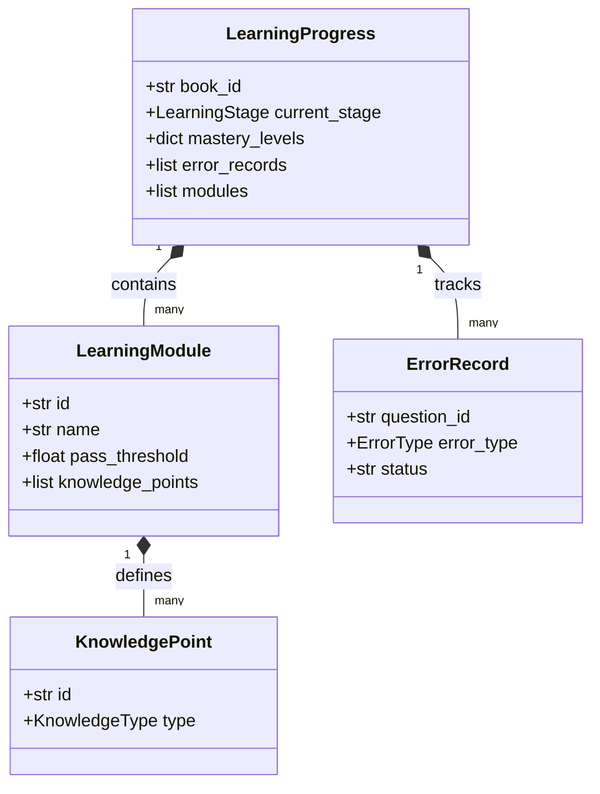
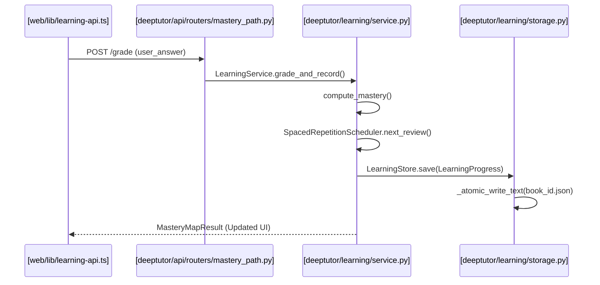

# Mastery Path Learning Engine

<details>
<summary>Relevant source files</summary>

The following files were used as context for generating this wiki page:

- [deeptutor/learning/models.py](deeptutor/learning/models.py)
- [deeptutor/learning/service.py](deeptutor/learning/service.py)
- [deeptutor/learning/tests/test_api_endpoints.py](deeptutor/learning/tests/test_api_endpoints.py)
- [deeptutor/learning/tests/test_guided_mastery_updates.py](deeptutor/learning/tests/test_guided_mastery_updates.py)
- [deeptutor/learning/tests/test_models.py](deeptutor/learning/tests/test_models.py)
- [deeptutor/learning/tests/test_scheduler.py](deeptutor/learning/tests/test_scheduler.py)
- [deeptutor/learning/tests/test_service_replace_merge.py](deeptutor/learning/tests/test_service_replace_merge.py)
- [deeptutor/learning/tests/test_storage.py](deeptutor/learning/tests/test_storage.py)
- [web/app/(workspace)/learning/page.tsx](web/app/(workspace)/learning/page.tsx)
- [web/app/globals.css](web/app/globals.css)
- [web/components/sidebar/SidebarShell.tsx](web/components/sidebar/SidebarShell.tsx)
- [web/components/ui/Tooltip.tsx](web/components/ui/Tooltip.tsx)
- [web/lib/learning-api.ts](web/lib/learning-api.ts)
- [web/locales/en/app.json](web/locales/en/app.json)
- [web/locales/zh/app.json](web/locales/zh/app.json)

</details>


The **Mastery Path Learning Engine** is a comprehensive pedagogical subsystem within DeepTutor designed to move learners from initial exposure to verified mastery. Unlike standard chat-based tutoring, the Mastery Path enforces "hard gates" based on qualitative and quantitative performance, integrated with a spaced repetition scheduler to ensure long-term retention.

The engine manages the lifecycle of a "Path"—a structured set of learning modules and knowledge points—persisting progress in atomic file-based storage.

## Learning Workflow and Stages

The engine operates through a finite state machine defined by the `LearningStage` enum. A typical learning flow progresses from initial diagnosis through teaching, active recall, and periodic review.

```mermaid
graph TD
    subgraph "Mastery Loop"
    [LearningStage.DIAGNOSTIC] -->|"Assessment"| [LearningStage.EXPLAIN]
    [LearningStage.EXPLAIN] -->|"Instruction"| [LearningStage.FEYNMAN_CHECK]
    [LearningStage.FEYNMAN_CHECK] -->|"Qualitative Gate"| [LearningStage.PRACTICE]
    [LearningStage.PRACTICE] -->|"Quantitative Gate"| [LearningStage.ERROR_DIAGNOSIS]
    [LearningStage.ERROR_DIAGNOSIS] -->|"Correction"| [LearningStage.REVIEW]
    [LearningStage.REVIEW] -->|"Spaced Repetition"| [LearningStage.COMPLETED]
    end

    [LearningService.init_modules] --> [LearningStage.DIAGNOSTIC]
    [LearningService.grade_and_record] -.->|"Triggers State Transition"| [LearningStage]
```

*   **Diagnostic**: Initial assessment to determine the learner's starting level for each Knowledge Point (KP) [deeptutor/learning/models.py:66-66]().
*   **Explain & Feynman Check**: The tutor provides conceptual instruction followed by a "Feynman Technique" prompt where the learner must explain the concept in their own words [deeptutor/learning/models.py:67-68]().
*   **Practice & Error Diagnosis**: Targeted exercises to reach the `pass_threshold` (default 0.7) [deeptutor/learning/models.py:95-95](). If errors occur, the engine classifies them into types like `structural`, `deviation`, or `metacognitive` [deeptutor/learning/models.py:36-40]().
*   **Review**: Scheduled re-assessment based on the spaced repetition interval sequence [deeptutor/learning/models.py:71-71]().

**Sources:**
- [deeptutor/learning/models.py:61-77]() (LearningStage Enum)
- [deeptutor/learning/service.py:77-80]() (Stage advancement logic)

## Core Components

The engine is built on three layers: data models, the orchestration service, and the API/Frontend interface.

### 1. Learning Models and Spaced Repetition
This layer defines the data structures for knowledge representation and the mathematical policy for retention. It includes the `LearningProgress` container, which aggregates mastery levels, error records, and the review queue.
For details, see [Learning Models and Spaced Repetition](#4.9.1).

### 2. Learning Service and Grading Pipeline
The `LearningService` acts as the orchestrator. It handles the `grade_and_record` pipeline, which processes user answers, updates mastery estimates using recency-weighted algorithms, and manages the lifecycle of `ErrorRecord` objects (from `active` to `graduated`).
For details, see [Learning Service and Grading Pipeline](#4.9.2).

### 3. API and Frontend Dashboard
The system is exposed via the `mastery_path` REST API. The frontend provides a `MasteryPathPage` dashboard that visualizes the "Mastery Map," showing the status of every module and knowledge point.

**Sources:**
- [deeptutor/learning/service.py:25-27]() (LearningService class)
- [web/app/(workspace)/learning/page.tsx:37-40]() (MasteryPathPage component)

## System Mapping: Code to Concept

The following diagrams bridge the gap between high-level pedagogical concepts and the actual code entities in the repository.

### Data Entity Mapping
This diagram maps how learning concepts are represented as Pydantic models in `deeptutor/learning/models.py`.


**Sources:**
- [deeptutor/learning/models.py:80-214]()

### Execution Pipeline Mapping
This diagram maps the flow of a single answer submission through the service layer to the storage layer.


**Sources:**
- [deeptutor/learning/service.py:161-173]()
- [deeptutor/learning/storage.py:19-35]()
- [web/lib/learning-api.ts:103-111]()

## Key Data Structures

| Entity | Code Symbol | Purpose |
| :--- | :--- | :--- |
| **Path Container** | `LearningProgress` | Root object for all user data for a specific book/topic. |
| **Knowledge Unit** | `KnowledgePoint` | The smallest unit of learning (Concept, Memory, Procedure, or Design). |
| **Grading Record** | `QuizAttempt` | Historical record of a single question-answer interaction. |
| **Persistence** | `LearningStore` | Handles atomic JSON serialization to the local filesystem. |
| **Scheduler** | `RepetitionState` | Tracks the `interval_index` and `next_review_at` for spaced repetition. |

**Sources:**
- [deeptutor/learning/models.py:185-214]()
- [deeptutor/learning/storage.py:13-17]()

## Child Pages
*   **[Learning Models and Spaced Repetition](#4.9.1)**: Detailed look at Pydantic models, `KnowledgeType` behaviors, and the scheduling algorithm.
*   **[Learning Service and Grading Pipeline](#4.9.2)**: Deep dive into the `LearningService` orchestration, the Feynman qualitative gates, and the REST API integration.
