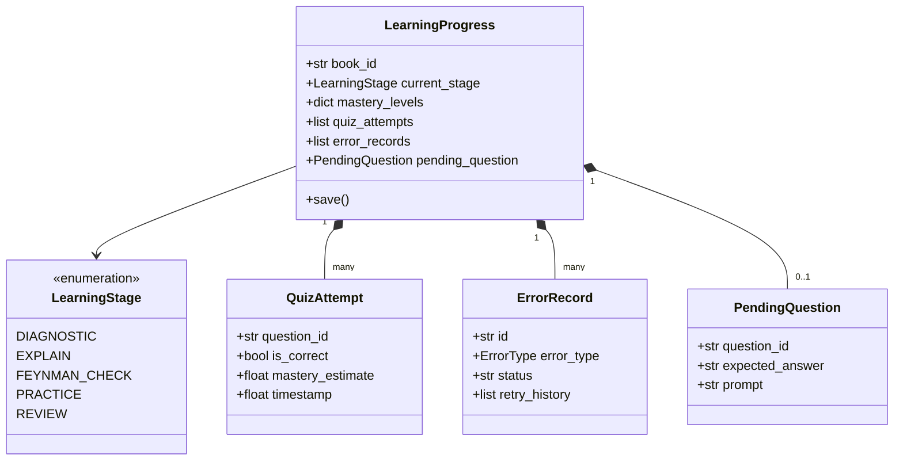
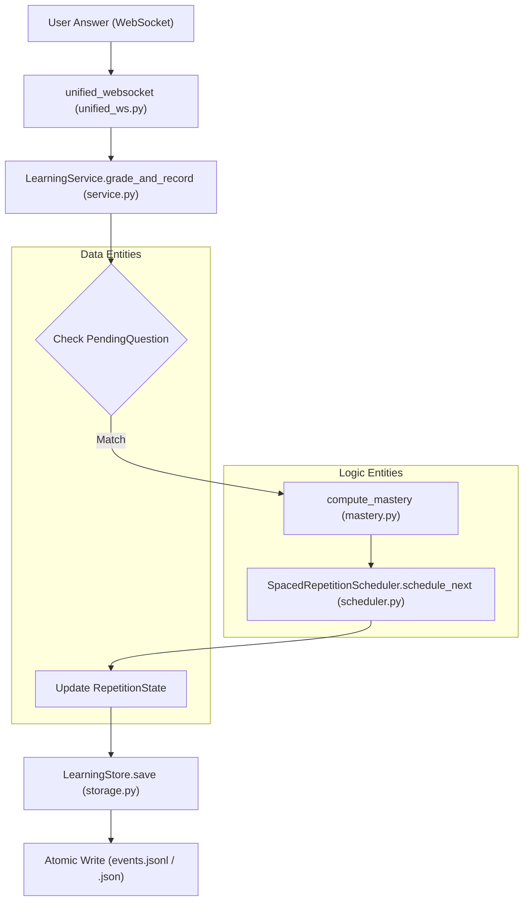

# Learning Models and Spaced Repetition

Relevant source files

The following files were used as context for generating this wiki page:

- [deeptutor/api/routers/unified_ws.py](deeptutor/api/routers/unified_ws.py)
- [deeptutor/core/stream.py](deeptutor/core/stream.py)
- [deeptutor/learning/models.py](deeptutor/learning/models.py)
- [deeptutor/learning/scheduler.py](deeptutor/learning/scheduler.py)
- [deeptutor/learning/storage.py](deeptutor/learning/storage.py)
- [deeptutor/learning/tests/test_api_endpoints.py](deeptutor/learning/tests/test_api_endpoints.py)
- [deeptutor/learning/tests/test_guided_mastery_updates.py](deeptutor/learning/tests/test_guided_mastery_updates.py)
- [deeptutor/learning/tests/test_models.py](deeptutor/learning/tests/test_models.py)
- [deeptutor/learning/tests/test_scheduler.py](deeptutor/learning/tests/test_scheduler.py)
- [deeptutor/learning/tests/test_storage.py](deeptutor/learning/tests/test_storage.py)
- [deeptutor/services/session/pocketbase_store.py](deeptutor/services/session/pocketbase_store.py)
- [deeptutor/services/session/turn_runtime.py](deeptutor/services/session/turn_runtime.py)

The Mastery Path learning engine relies on a structured set of Pydantic models to track learner progress and a specialized scheduler to implement spaced repetition. This system ensures that learning is personalized, evidence-based, and persistent across chat turns.

## Core Data Models

The system uses Pydantic models defined in `deeptutor/learning/models.py` to maintain a type-safe representation of the learner's state.

### LearningProgress and State Enums
The `LearningProgress` class is the root container for a learner's journey through a specific "book" or curriculum [deeptutor/learning/models.py:185-213](). It tracks the current stage of the learning loop using the `LearningStage` enum.

| Enum Value | Description |
| :--- | :--- |
| `DIAGNOSTIC` | Initial assessment of existing knowledge. |
| `EXPLAIN` | Tutor provides instruction or concept introduction. |
| `FEYNMAN_CHECK` | Qualitative assessment where the user explains the concept back. |
| `PRACTICE` | Quantitative assessment via quizzes and problems. |
| `ERROR_DIAGNOSIS` | Deep dive into specific misconceptions or errors. |
| `REVIEW` | Spaced repetition phase for previously learned content. |
| `COMPLETED` | Module mastery achieved. |

**Sources:** [deeptutor/learning/models.py:61-72](), [deeptutor/learning/models.py:185-213]()

### Knowledge and Errors
Content is categorized by `KnowledgeType`, which influences the spaced repetition intervals. Errors are tracked via `ErrorRecord` to facilitate targeted remediation.

*   **KnowledgeType**: `MEMORY`, `CONCEPT`, `PROCEDURE`, `DESIGN` [deeptutor/learning/models.py:24-28]().
*   **ErrorRecord**: Stores the `ErrorType`, AI confirmation, and `retry_history` for specific knowledge points [deeptutor/learning/models.py:129-142]().
*   **PendingQuestion**: A server-side record of an outstanding question. This ensures that the `expected_answer` is stored securely and grading is deterministic, even if the model's context changes between turns [deeptutor/learning/models.py:164-182]().

**Sources:** [deeptutor/learning/models.py:24-46](), [deeptutor/learning/models.py:129-182]()

## Spaced Repetition Scheduler

The `SpacedRepetitionScheduler` manages the timing of review tasks based on the learner's performance and the type of knowledge being acquired.

### Interval Sequences
The system defines `INTERVAL_SEQUENCES` (measured in days) for each `KnowledgeType` [deeptutor/learning/scheduler.py:13-18]().

| Knowledge Type | Sequence (Days) |
| :--- | :--- |
| `MEMORY` | 0, 1, 3, 7, 14, 30, 60 |
| `CONCEPT` | 3, 7, 14, 30 |
| `PROCEDURE` | 3, 7, 14 |
| `DESIGN` | 14, 28 |

**Sources:** [deeptutor/learning/scheduler.py:13-18]()

### Scheduling Logic
The `schedule_next` function updates the `RepetitionState` [deeptutor/learning/scheduler.py:45-70]():
1.  **Correct Answer**: Increments the `interval_index`. If the learner gets two consecutive correct answers, the index skips ahead by 2 to accelerate progression [deeptutor/learning/scheduler.py:54-58]().
2.  **Wrong Answer**: Decrements the `interval_index` (minimum 0) and resets the consecutive correct counter [deeptutor/learning/scheduler.py:59-65]().
3.  **Queue Building**: `build_review_queue` generates `ReviewTask` objects. Tasks associated with active errors are given a priority of `1` to ensure they are addressed first [deeptutor/learning/scheduler.py:78-98]().

**Sources:** [deeptutor/learning/scheduler.py:45-98]()

## Mastery Calculation Policy

Mastery is not a simple percentage of correct answers; it is a recency-weighted calculation with a "low-confidence cap" to prevent lucky guesses from being interpreted as mastery.

### Calculation Rules
The `compute_mastery` function (tested in `test_guided_mastery_updates.py`) applies the following logic:
*   **Attempt Cap**: A single correct answer caps mastery at **0.5**. Two correct answers cap it at **0.8**. Only after 3+ attempts can a score reach **1.0** [deeptutor/learning/tests/test_guided_mastery_updates.py:47-56]().
*   **Recency Weighting**: More recent attempts carry higher weight in the final score [deeptutor/learning/tests/test_guided_mastery_updates.py:63-69]().
*   **Qualitative Gates**: For `CONCEPT` and `DESIGN` types, a quantitative score is insufficient. The `qualitative_mastery` dictionary tracks whether a learner has passed the "Feynman Check" [deeptutor/learning/models.py:195-198]().

**Sources:** [deeptutor/learning/tests/test_guided_mastery_updates.py:47-69](), [deeptutor/learning/models.py:195-198]()

## Storage and Persistence

The `LearningStore` provides atomic, file-based persistence for `LearningProgress` models.

### Atomic Writes
To prevent data corruption during concurrent writes or system crashes, the store uses an atomic write pattern:
1.  Data is written to a temporary file: `[book_id].json.tmp.[uuid]` [deeptutor/learning/storage.py:18-20]().
2.  The temporary file is moved to the final destination using `os.replace` (atomic on POSIX) [deeptutor/learning/storage.py:21]().
3.  A module-level `_cas_lock` (threading.Lock) ensures Compare-And-Swap semantics during the `save` operation [deeptutor/learning/storage.py:13-44]().

### Workspace Integration
The store root defaults to the `learning/` subdirectory within the workspace provided by `get_path_service()` [deeptutor/learning/storage.py:30](). It enforces strict `book_id` validation to prevent path traversal attacks [deeptutor/learning/storage.py:33-36]().

**Sources:** [deeptutor/learning/storage.py:12-44](), [deeptutor/learning/storage.py:30-36]()

## Technical Diagrams

### Learning State and Model Relationships
This diagram illustrates how the `LearningProgress` model aggregates various sub-models to represent the learner's state.

**Sources:** [deeptutor/learning/models.py:61-213]()

### Grading and Spaced Repetition Data Flow
This diagram maps the flow from a user's input to the updated repetition state and storage.

**Sources:** [deeptutor/api/routers/unified_ws.py:45-134](), [deeptutor/learning/service.py:72-150](), [deeptutor/learning/storage.py:38-44](), [deeptutor/learning/scheduler.py:45-70]()
