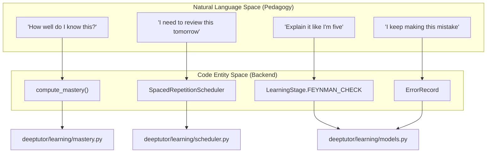
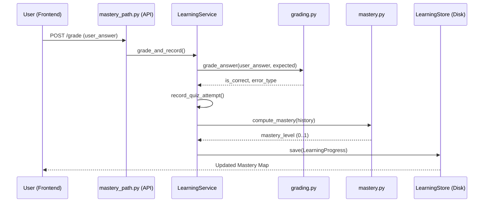

# Learning Service and Grading Pipeline

Relevant source files

The following files were used as context for generating this wiki page:

- [deeptutor/api/routers/mastery_path.py](deeptutor/api/routers/mastery_path.py)
- [deeptutor/book/storage.py](deeptutor/book/storage.py)
- [deeptutor/learning/grading.py](deeptutor/learning/grading.py)
- [deeptutor/learning/models.py](deeptutor/learning/models.py)
- [deeptutor/learning/policy.py](deeptutor/learning/policy.py)
- [deeptutor/learning/service.py](deeptutor/learning/service.py)
- [deeptutor/learning/tests/test_api_endpoints.py](deeptutor/learning/tests/test_api_endpoints.py)
- [deeptutor/learning/tests/test_grading.py](deeptutor/learning/tests/test_grading.py)
- [deeptutor/learning/tests/test_guided_mastery_updates.py](deeptutor/learning/tests/test_guided_mastery_updates.py)
- [deeptutor/learning/tests/test_models.py](deeptutor/learning/tests/test_models.py)
- [deeptutor/learning/tests/test_scheduler.py](deeptutor/learning/tests/test_scheduler.py)
- [deeptutor/learning/tests/test_service_replace_merge.py](deeptutor/learning/tests/test_service_replace_merge.py)
- [deeptutor/learning/tests/test_storage.py](deeptutor/learning/tests/test_storage.py)
- [web/app/(workspace)/learning/page.tsx](web/app/(workspace)/learning/page.tsx)
- [web/app/globals.css](web/app/globals.css)
- [web/components/sidebar/SidebarShell.tsx](web/components/sidebar/SidebarShell.tsx)
- [web/components/ui/Tooltip.tsx](web/components/ui/Tooltip.tsx)
- [web/lib/learning-api.ts](web/lib/learning-api.ts)
- [web/locales/en/app.json](web/locales/en/app.json)
- [web/locales/zh/app.json](web/locales/zh/app.json)

The `LearningService` acts as the central orchestrator for the Mastery Path learning engine. it manages the lifecycle of learning modules, coordinates the grading of user responses, and maintains the `LearningProgress` state. It bridges the gap between raw LLM interactions and the structured pedagogical requirements of mastery-based learning and spaced repetition.

## Learning Service Lifecycle

The `LearningService` manages the persistence and transformation of a learner's progress through `LearningModule` and `KnowledgePoint` entities.

### Module Initialization and Replacement
The service follows "replace semantics" for module updates. When `init_modules` or `replace_modules` is called, the system performs a destructive update to ensure the learning state remains synchronized with the curriculum content.

*   **State Purging**: It identifies and removes "stale" state for Knowledge Points (KPs) that no longer exist in the new module set. This includes clearing `mastery_levels`, `repetition_states`, `error_records`, and `feynman_retries` [deeptutor/learning/service.py:41-70]().
*   **Module Mapping**: It rebuilds the `knowledge_types` map to ensure the correct pedagogical strategy (e.g., Feynman Technique vs. Practice Quiz) is applied to each KP [deeptutor/learning/service.py:73-75]().

### Session Orchestration
The service provides methods to manipulate the active learning session:
*   **`get_or_create`**: Loads existing progress or initializes a new `LearningProgress` object for a specific `book_id` [deeptutor/learning/service.py:29-35]().
*   **`switch_module`**: Points the session to a specific module and resets the stage to `LearningStage.EXPLAIN` [deeptutor/learning/service.py:81-94]().
*   **`advance_stage`**: Transitions the learner through the `LearningStage` enum (DIAGNOSTIC -> EXPLAIN -> FEYNMAN_CHECK -> PRACTICE -> etc.) [deeptutor/learning/service.py:77-79]().

**Sources:** [deeptutor/learning/service.py:25-94](), [deeptutor/learning/models.py:61-77]()

---

## Grading and Recording Pipeline

The `grade_and_record` function is the unified entry point for processing a learner's answer. It encapsulates grading, mastery recomputation, and review scheduling into a single atomic operation.

### Unified Pipeline Flow
The pipeline follows a strict sequence to ensure data integrity:
1.  **Grading**: Calls `grade_answer` to compare the `user_answer` against the `expected_answer` stored in `PendingQuestion` [deeptutor/learning/service.py:186-193]().
2.  **Error Classification**: If incorrect, it uses `classify_error` to determine the `ErrorType` (e.g., `UNDERSTANDING_DEVIATION` or `APPLICATION_ERROR`) [deeptutor/learning/service.py:195-197]().
3.  **Attempt Recording**: Updates the `QuizAttempt` history and manages `ErrorRecord` graduation [deeptutor/learning/service.py:96-149]().
4.  **Mastery Computation**: Triggers `calculate_mastery` which applies recency-weighted policies to update the KP's mastery level [deeptutor/learning/service.py:150-155]().
5.  **Spaced Repetition**: Invokes the `SpacedRepetitionScheduler` to update the `RepetitionState` and rebuild the `review_queue` [deeptutor/learning/service.py:202-205]().
6.  **Persistence**: Saves the updated `LearningProgress` via `LearningStore` [deeptutor/learning/service.py:207]().

### Qualitative Gates (Feynman Technique)
For `CONCEPT` or `DESIGN` knowledge types, the system uses "qualitative gates" [deeptutor/learning/models.py:195-198]().
*   **`feynman_check`**: The tutor assesses the learner's explanation.
*   **`qualitative_mastery`**: A boolean map in `LearningProgress` that must be `True` for the learner to bypass certain pedagogical stages, regardless of quantitative quiz scores [deeptutor/learning/models.py:198]().

### Error Graduation
When a learner correctly answers a question that was previously associated with an `ErrorRecord`, the service "graduates" that record.
*   **`active` / `retrying`**: Statuses for unresolved errors [deeptutor/learning/service.py:135]().
*   **`graduated`**: Set when a `RetryAttempt` is successful, moving the error out of the active diagnosis loop [deeptutor/learning/service.py:144]().

**Sources:** [deeptutor/learning/service.py:96-208](), [deeptutor/learning/models.py:129-143](), [deeptutor/learning/models.py:164-183]()

---

## Architecture: Natural Language to Code Mapping

This diagram bridges the gap between the pedagogical concepts (Natural Language Space) and the backend implementation (Code Entity Space).

### Pedagogical to System Mapping

**Sources:** [deeptutor/learning/mastery.py:9](), [deeptutor/learning/models.py:61-71](), [deeptutor/learning/models.py:129-143]()

### Grading Pipeline Data Flow

**Sources:** [deeptutor/learning/service.py:161-208](), [deeptutor/api/routers/mastery_path.py:10](), [deeptutor/learning/storage.py:19]()

---

## REST API and Frontend Integration

The Mastery Path is exposed via the `mastery_path` router and consumed by the `MasteryPathPage` component.

### Mastery Path Endpoints
The backend provides several key endpoints for the learning lifecycle:
*   `GET /api/v1/learning/progress`: Lists all active learning paths for the user [web/lib/learning-api.ts:129]().
*   `POST /api/v1/learning/progress/{id}/init-modules`: Sets up the curriculum for a specific path [web/lib/learning-api.ts:47]().
*   `GET /api/v1/learning/progress/{id}/map`: Returns a "gate-accurate" snapshot of mastery, used to render the dashboard [web/lib/learning-api.ts:107]().
*   `POST /api/v1/learning/progress/{id}/redo`: Resets progress while keeping the module structure [web/lib/learning-api.ts:145]().

### Frontend: MasteryPathPage
The `MasteryPathPage` serves as the persistent dashboard for the learner's journey.
*   **`fetchMasteryMap`**: Retrieves the status of every module and KP, categorized as `new`, `learning`, or `mastered` [web/app/(workspace)/learning/page.tsx:76-89]().
*   **`MapView`**: A component that renders the hierarchy of modules and knowledge points, providing visual feedback on progress percentages and review counts [web/app/(workspace)/learning/page.tsx:204-210]().
*   **`learning-api.ts`**: The client-side wrapper using `apiFetch` to interact with the FastAPI backend [web/lib/learning-api.ts:1-188]().

### Data Structures (TypeScript)
| Interface | Purpose |
| :--- | :--- |
| `ProgressDetail` | Detailed state of a specific book/path including mastery levels [web/lib/learning-api.ts:30-37](). |
| `MasteryMap` | Aggregated counts of mastered vs. learning KPs [web/lib/learning-api.ts:80-85](). |
| `NextStep` | The recommended next action (e.g., "Review", "Learn New") [web/lib/learning-api.ts:87-95](). |

**Sources:** [web/lib/learning-api.ts:1-188](), [web/app/(workspace)/learning/page.tsx:37-210](), [deeptutor/api/routers/mastery_path.py:10]()
